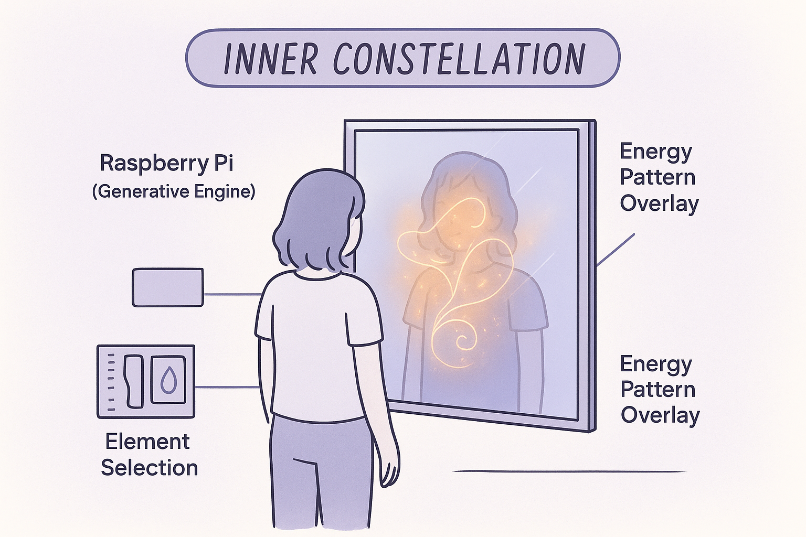
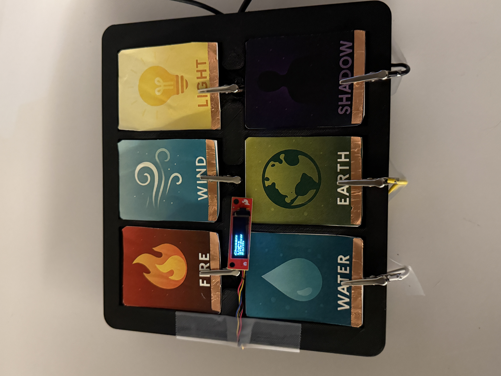
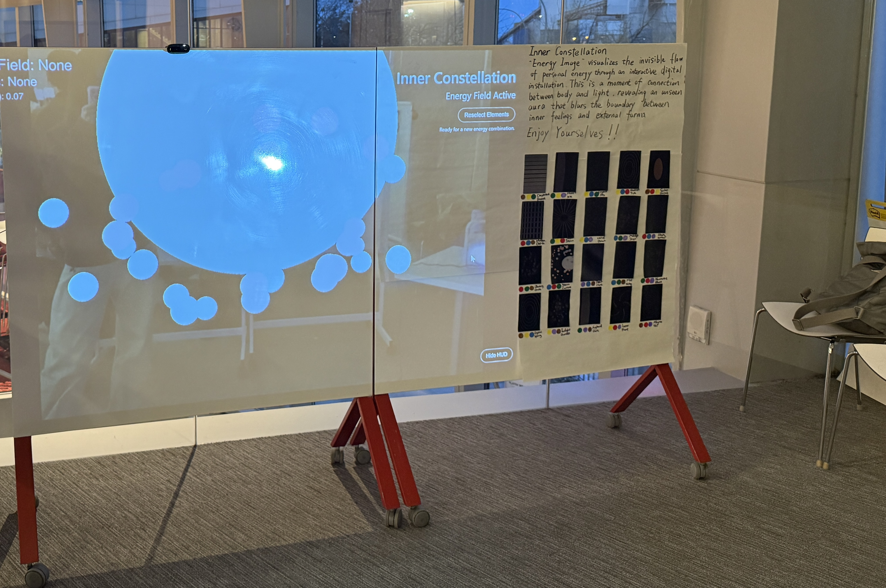
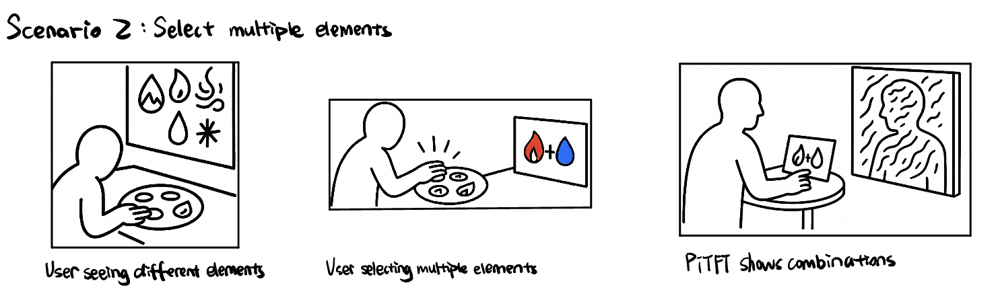
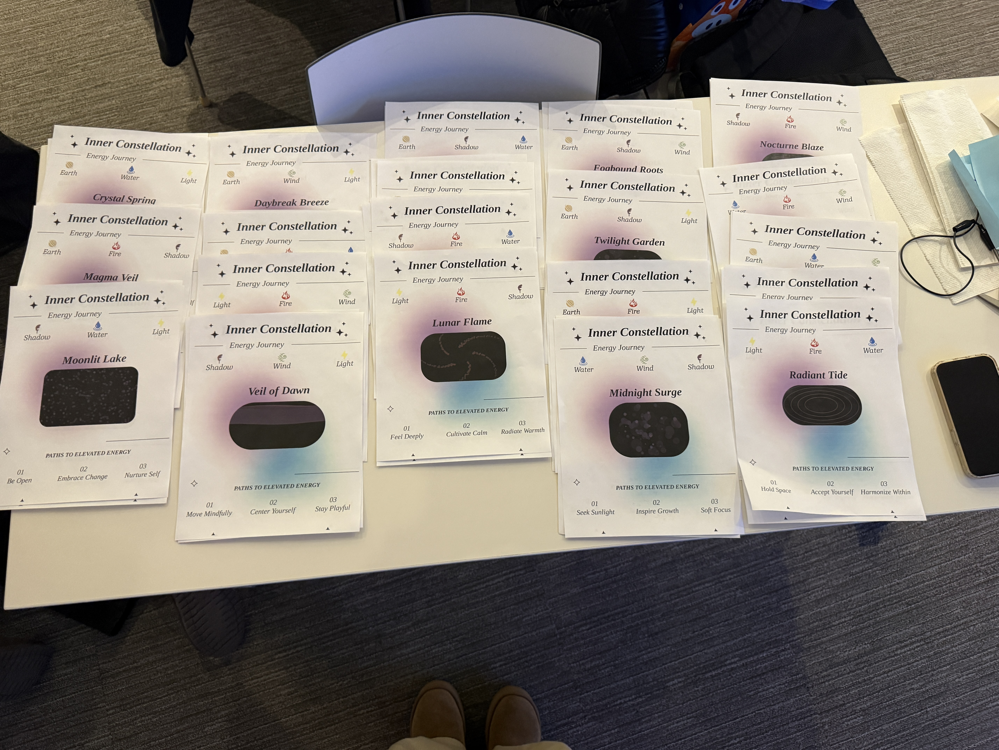
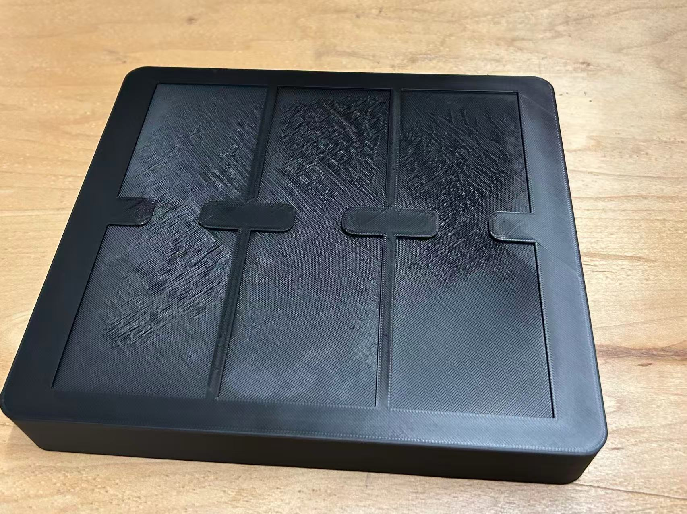
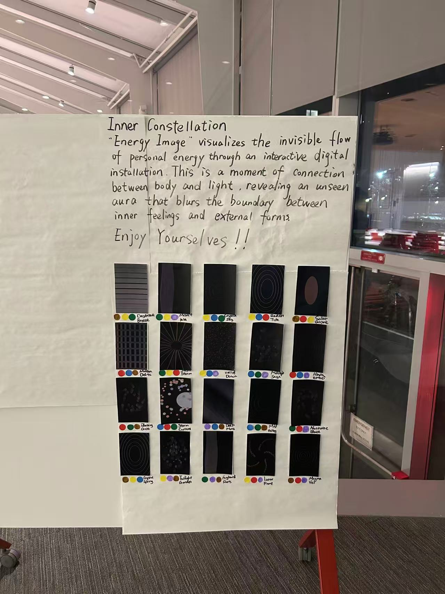

# Final Project

[Project Plan](#project-plan) 

[Functioning Project](#functioning-project) 

[Documentation of Design Process](#documentation-of-design-process) 

[Archive of All Code and Design Patterns](#archive-of-all-code-and-design-patterns) 

[Video Demo](#video-demo) 

[Reflections on Process](#reflections-on-process) 

[Group Work Distribution](#group-work-distribution) 

## Project Plan
Joy Sun(js888), Huiying Zhan (hz764), Hester Li(ql382)

### Project Motivation  
Technology has been changing our lives in a tremendous way. AI brought infinite capacity to our work and study setting, and relentless yet useless productivity is growing out of control. Promoting endless growth like that of cancer cells, capitalism refutes death, which means it also refutes life on the other hand. Human beings have been alienated into tools of labor, and their true attributes have been weakened. In a more dramatic way, our society is permeated with death drive. 

With the aim of bringing vitality back to our lives, our project serves as a trigger for people to reflect on their true forms of life. Six elements are symbols of the origins of the world, and the self-chosen element combinations refers to the person’s inner self, alter ego, in responding to the representatives of nature. This connection between inner power and visual patterns creates a dialogue between the self and the digital realm. Each interaction becomes a moment of connection between body and light, revealing an unseen aura that blurs the boundary between inner feeling and external form.

### Big Idea
Inner Constellation is an interactive art installation that visualizes a person’s inner energy as a living constellation made of light, color, and motion. It invites people to reflect on their emotions through simple, intuitive interactions.

When a participant begins, they choose one of six symbolic elements — Fire 🔥, Water 💧, Wind ❄️, Earth 🌍, Light 💡, or Shadow 🧍‍♀️🧍‍♂️ — each representing a different emotional tone or personality energy. This choice is made by tapping an NFC card or selecting on screen. The system, powered by a Raspberry Pi, then generates a real-time animation that moves and transforms based on that element’s characteristics — for example, Fire glows and flickers, Water flows smoothly, Wind drifts and spins, Earth pulses steadily, Light radiates softly, and Shadow creates shifting patterns.

A computer screen displays the animation blended with a live camera feed of the user, allowing them to see both their reflection and their personalized constellation at the same time. As they move their hands or adjust their posture, gesture and touch sensors detect these actions and feed them back into the system. The constellation reacts instantly — expanding, contracting, or changing colors — as if breathing together with the user.

Through these visual and sensory responses, Inner Constellation transforms abstract emotions into tangible experiences. It connects technology and self-awareness in a poetic way, turning each participant’s reflection on the screen into a unique portrait of their energy and mood in that moment.   

### Timeline
| **Milestone** | **Date** | **Notes / Details** |
|:--|:--:|:--|
| **Concept Lock & Story Development** | Nov 10–11 | Finalize core interaction and six energy elements. Write story concept and plan MVP scope. |
| **Visual MVP** | Nov 15 | Design an interactive energy circle that expands or contracts with hand gestures. |
| **Input Integration** | Nov 20 | Add gesture detection for circle control. Test responsiveness and stability. |
| **Projection Interaction** | Nov 22 | Project visualization on a large screen. Enable full-screen gesture control and adjust brightness. |
| **Parameter Tuning & Visual Polish** | Nov 25 | Refine color, motion, and gesture sensitivity. Add an “Energy Fortune” line and save-image feature. |
| **Functional Check-off** | Dec 1 | Demonstrate full flow: gesture → real-time motion → image save. Record performance notes. |
| **User Testing** | Dec 5 | Test with non-team users. Gather feedback on usability, aesthetics, and response. |
| **Final Presentation Prep** | Dec 6 | Prepare short demo video and slides. Present motivation, technical design, and evolution. |
| **Final Write-up & Repository Submission** | Dec 8 | Complete README, diagrams, and documentation. Upload final materials. |

### Parts Needed
**The Device**
- 1× Raspberry Pi 4 Board  
- 1× 32GB MicroSD Card w/ Card Reader  
- 1× Computer Display / Monitor  
- 1× USB Camera (for live reflection feed)  
- 1× NFC Reader + NFC Cards (for element selection)  
- 1× Gesture or Touch Sensor (e.g., APDS-9960 or Capacitive Pad)  
- 1× HDMI Cable  
- 1× USB Powered Speaker *(optional, for ambient sound)*  
- 1× Power Supply for Raspberry Pi (5V 3A recommended)  
- 1× Dupont Wire Set *(for sensor connections)*  

**For Exhibition Setup (optional)**
- 1× Projector *(for large-scale projection display)*  
- 1× Tripod or Mounting Stand  
- 1× External Light Diffuser or Frame *(for aesthetic setup)*

### Fallback Plan

If any hardware or sensor components fail, the system can still demonstrate the core experience through simplified input and display modes.

- **Gesture Sensor Fails:**  
  Use keyboard or mouse input to manually trigger expansion/contraction of the energy circle.

- **NFC Reader Malfunction:**  
  Replace NFC element selection with on-screen buttons for choosing Fire, Water, Wind, Earth, Light, or Shadow.

- **Camera Not Working:**  
  Run the visualization without live reflection mode — display only the animated energy field on screen.

- **Projector Unavailable:**  
  Switch to a standard monitor or laptop display for demonstration.

- **Performance or Frame Rate Issues:**  
  Lower the resolution or particle density in the animation to maintain smooth real-time rendering.

- **Sound Output Problem:**  
  Disable audio feedback and rely on visual responses only.

*These fallback modes ensure the installation remains functional and visually expressive, even if some hardware components are unavailable.*

## Functioning Project

The following images show the fully functioning version of the **Inner Constellation** interaction system.  
All hardware components—including the Raspberry Pi, MPR121 touch sensor, OLED display, USB camera, and six elemental touch cards—are wired together to create a seamless interactive experience.

### 1. Wiring Setup (Live Hardware Layout)

The first image shows the complete hardware arrangement during operation.  
Each elemental card (Fire, Water, Wind, Earth, Light, Shadow) is connected to an MPR121 input via alligator clips.  
Touching any card triggers a capacitive reading, which is then displayed on the OLED and sent to the animation engine.

  

### 2. Element Selection Panel (Mounted Version)

This second image shows the final mounted version of the element-selection board.  
All six cards are neatly arranged in a 3D-printed frame, with copper foil pads at the bottom serving as capacitive touch surfaces.  
The OLED display sits in the center to show real-time feedback of the selected element.

  

Together, these components complete the functioning prototype, allowing users to physically select elements and influence the interactive constellation visualisation.

### 3. Overall Setup (Final Exhibition Display)
The final installation brings all hardware, visuals, and interaction components together into a cohesive exhibition setup.  
The projected animation reacts in real time to user-selected elements and their gestures, while the element panel sits nearby for intuitive touch-based input.  
This setup was used during the final showcase, allowing visitors to explore their own “Inner Constellation” through physical interaction and responsive visual feedback.

  

## Documentation of Design Process
### Verplank Diagram

### Storyboards

#### Scenario 1

#### Scenario 2

#### Scenario 3

### Wiring Diagram & Physical Setup
The wiring diagram below shows the full physical setup of our **Inner Constellation** prototype. A Raspberry Pi connects to the MPR121 capacitive touch breakout, an OLED display, a USB camera, and six element cards (Fire, Water, Wind, Earth, Light, Shadow). Each card is wired to one MPR121 input so that touching the copper pads on the cards selects an element, which is then visualized on the OLED and sent to the animation engine.

Key components:

1. **MPR121 capacitive touch sensor** – reads touch input from the six element cards.
2. **OLED display** – shows the currently selected element icon/state.
3. **USB camera** – detects user presence and movement for interaction.
4. **Element cards** – Fire, Water, Wind, Earth, Light, Shadow; each card is connected via alligator clips to the MPR121.
5. **Raspberry Pi** – runs the main loop, reads sensor data, and communicates with the visualisation on the main screen.

## Archive of All Code and Design Patterns
All related code are in: [animation](./final%20project/animation/) and [sensors](./final%20project/sensors/)

### Sensor Layer Overview

**Camera — Motion & Background Feed**

The camera module continuously captures frames, computes motion energy by comparing consecutive grayscale images, and produces a softly blended background silhouette that contributes to the final animation.  
Its interface is simple: `get_frame()` returns either a processed frame or `None` when unavailable.

**OLED / TFT Display — Minimal Physical Feedback**

The OLED display provides lightweight physical feedback by showing the currently selected element as well as the user's three-element profile.  
If the device is not detected, the system automatically falls back to a dummy display mode to maintain pipeline stability.

**MPR121 Touch Sensor — Element Selection**

The MPR121 maps individual copper pads to six elemental identities—Fire, Water, Wind, Earth, Light, and Shadow.  
Touch events are debounced for stability, and the input pipeline supports a three-step profile selection sequence used to generate a personalized spectrum.

  

### Animation Layer Overview

**Overall Architecture**

The animation engine renders at 60 FPS and integrates several input sources: time-based updates, motion-driven scaling, camera-derived features (motion level, body centroid, size estimation), and the user’s multi-element profile.  
The system contains fourteen visual pattern modes, all implemented as modular pattern functions.

**Core Logic**

**1. Profile and Element System**  
When a user completes the three-element sequence, the engine enters spectrum mode with blended palettes.  
Single-element touches produce a fallback mode with a simplified color theme.  
`get_spectrum_style()` returns base colors, background tones, preferred pattern type (such as galaxy, vortex, or pillar), and parameter presets such as orb speed or halo scale.

**2. Camera-Derived Features**  
The engine extracts motion intensity, approximate distance (size level), and a motion centroid representing horizontal and vertical body position.  
These signals modulate animation behavior: motion affects breathing and expansion; horizontal position influences warmth vs. coolness in the color temperature; size level adjusts pillar width, orb radius, and other scale-sensitive effects.  
A softly composited camera overlay (approximately 60% alpha) contributes to the ambient texture.

**3. Energy Model**  
A derived energy value governs parameters such as pillar height, halo radius, orb traversal speed, bloom strength, vortex depth, and grid brightness.  
This single energy model allows different visual modes to respond consistently to user movement.

**Visual Pattern System**  
All patterns adapt automatically to the selected color spectrum, the user's motion energy, and the inferred distance from the camera.  
This keeps visual output coherent across modes.

### Web Server Layer

`server.py` coordinates two parallel systems:

**Flask Web Server**  
Serves the front-end interface (`index.html`), streams animation frames via MJPEG (`/frame`), and exposes simple control endpoints such as reset and UI toggles.

**Pygame Animation Loop**  
Runs in the main thread (required by SDL), receives continuous sensor updates, renders all animation frames, and shares the latest frame with Flask through thread-safe shared memory.  

Both processes remain synchronized through a `frame_lock`, ensuring stable frame delivery even under high interaction load.

### Tech Demo (Functional Checkoff) 
This early demo shows the initial end-to-end functionality of our sensing pipeline. In this stage, the user selects an element by touching a specific position on the MPR121 sensor. The OLED screen displays the chosen element, and corresponding energy spots appear in the camera window to indicate the system’s recognition of that selection.

**Tech Demo Video:**  
[Watch the Demo](https://youtu.be/seF8rziH3oU)

At this point, the system successfully connected touch input, OLED feedback, and camera-based visualization. Following this checkoff, we refined the energy spots and overall pattern animations—making them more dynamic, visually expressive, and directly responsive to gesture movements. We also implemented multi-element combinations to generate richer and more personalized energy patterns. These features were completed in the next development cycle and integrated into the final full-function version of the installation.

## Video Demo
Below are three demo videos, each highlighting a different interaction feature:

### 1. Motion-Responsive Pattern Movement  
[Watch Video](https://youtu.be/BQ_63Se5rKE)  
Shows how the visual patterns follow body movement with large motion amplitude.

### 2. Color Temperature Shift (Left ↔ Right)  
[Watch Video](https://youtu.be/R7gsMZxLD9I)  
Demonstrates horizontal movement: right → warmer tones, left → cooler tones.

### 3. Depth-Based Scaling (Forward ↔ Backward)  
[Watch Video](https://youtu.be/6VBaitVTaA0)  
Shows how stepping forward reduces pattern scale and stepping backward enlarges it.

## User Testing

To understand how visitors interacted with *Inner Constellation*, we conducted several rounds of user testing in the actual exhibition environment. These tests helped us evaluate gesture responsiveness, distance sensing, element selection flow, and overall clarity of the experience. Through observing participants, we refined motion thresholds, improved the card selection feedback, and adjusted projection brightness to ensure patterns remained visible.

Below are four user testing recordings, each capturing different aspects of real user interaction:

- **[User Testing 1](https://youtu.be/hkju2jcZStg)**  
- **[User Testing 2](https://youtu.be/3vFiwFm4fbo)**  
- **[User Testing 3](https://youtu.be/uWHozAXnjfg)**  
- **[User Testing 4](https://youtu.be/76HgVA5d4e8)**  
From the tests, we learned several key insights:
- Users intuitively experimented with body movement, but needed clearer feedback about how distance influenced scale.  
- Horizontal motion was well understood, especially once the color-temperature shift became visually distinct.  
- Some users tried touching multiple cards at once, which helped us refine the touch debouncing and selection logic.  
- The projection brightness and contrast needed tuning so that patterns remained visible even when users stood close to the screen.  

These findings helped us refine gesture sensitivity, adjust projection parameters, and streamline the element-selection flow before the final presentation.

## Reflections on Process
### Joy’s Reflection
Designing the visual identity of Inner Constellation became the core of my work. I spent countless hours experimenting with how color temperature, particle behavior, and motion density could shape emotion. Small visual shifts often changed the entire tone of an element.

I built and tested many prototypes in Python, Pygame, Processing, and p5.py, studying how patterns responded to motion and blended in real time. Balancing visual richness with performance was tough, I often had to redesign animations to keep them fluid without losing depth.

Collaborating with the sensing system also influenced every decision. The sensors weren’t just inputs, they defined how visuals moved and breathed with the user. Through that process, I realized how inseparable visual design and system behavior are in interactive work.

This project taught me to see code as a creative medium, one that can express emotion as much as it executes logic.

### Hester’s Reflection
My work mainly focused on developing and stabilizing the sensing logic. Getting gesture signals, distance estimation, and touch inputs to behave reliably took a lot of tuning, otherwise the interaction felt noisy or accidental rather than intentional. Through repeated testing, I realized sensor-based interaction is shaped just as much by environment and user behavior as by code. Lighting, distance, and even how someone moves can completely change the system’s response.

As I designed the interaction flow, I also started thinking about how to make the experience more playful and meaningful for the user. That’s when I began exploring the MPR121 touch-sensing feature: instead of asking people to click on a laptop, what if we created physical “element cards” they could touch? It felt more immersive and aligned better with the idea of an interactive ritual rather than a simple UI selection.

I also replaced VNC with a web interface because the animation delay over VNC made the interaction feel disconnected. Running everything through a website made responses faster and created a smoother experience overall.

This whole process taught me that interaction vocabularies don’t appear all at once, they evolve through trial, error, and constant adjustment. And the more I iterated, the more I learned to design not just for functional correctness, but for curiosity, playfulness, and the small moments that make an interface feel alive.

### Sandy’s Reflection
My contribution focused on the parts of the project that connected the technical system to the final audience experience. In addition to preparing the README, demo video, user testing notes, and overall documentation, I took responsibility for much of the physical setup and exhibition logistics. I handled the full projector setup process—mounting and aligning the projector, calibrating projection size, adjusting brightness and contrast, and testing visibility in different ambient lighting conditions. I also arranged the physical interaction area, organized cable routing, positioned the Raspberry Pi and sensor board, and made sure the element cards were presented clearly to guide user behavior.

I produced several physical components as well, including designing and assembling the 3D-printed card box and preparing the Energy Cards used during testing and exhibition. I tested the card layout, ensured the MPR121 connections stayed stable, and refined the spacing so users intuitively knew where to touch.

User testing was another substantial part of my work. I filmed each interaction session and documented consistent patterns in how users approached the installation. These observations directly informed several adjustments, including clarifying the standing area, refining the projection distance for better visibility, and improving the way instructions were communicated to first-time participants.

Across these responsibilities, my work bridged the technical system with the physical environment and the people interacting with it. I learned how much the success of an installation depends not only on code and visuals, but also on careful setup, environmental tuning, and clear communication with users.

## Group Work Distribution
### Joy
Joy focused on developing the interactive animation system and dynamic visual behavior of the installation. She implemented real-time energy field patterns that respond to user movement and camera input, designing and optimizing the animation engine with Python and Pygame. She collaborated on defining each elemental visual identity and ensured smooth, expressive transitions between energy states to maintain both aesthetic coherence and technical performance.

**Deliverables:**
- `animation_engine.py`
- `set_profile.py`
- UI and Interaction Code (sensor and camera integration)
- Element Visual Style Sheets
- Final Exhibition Poster

### Hester
Hester was responsible for the interaction logic, sensing pipeline, and website build. Her work involved selecting and integrating the elemental sensors (including gesture, proximity, and touch-based inputs), designing how these signals translate into dynamic visual transitions, and ensuring that interactions felt intentional rather than noisy. She also built the web-based display system that replaced VNC, allowing the animation to run with lower latency and a smoother user experience.

**Deliverables:**
- sensors design
- `server.py`
- Energy Element Cards (×6)

### Sandy
Sandy managed logistics, documentation, and user-facing presentation. She coordinated equipment (projector, backdrop, and decorative materials), prepared the mood board and final visual layout, conducted user testing (facilitation, observation, and interviews), and collected all required images and materials for the README. She also recorded and edited the final demo video and compiled the full project README.  

**Deliverables:**
- `README.md`
- User testing notes and documentation
- Demo video
- 3D printed card box
- Energy card design
