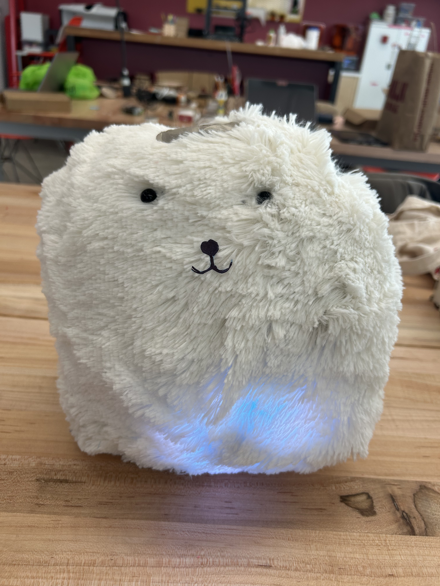
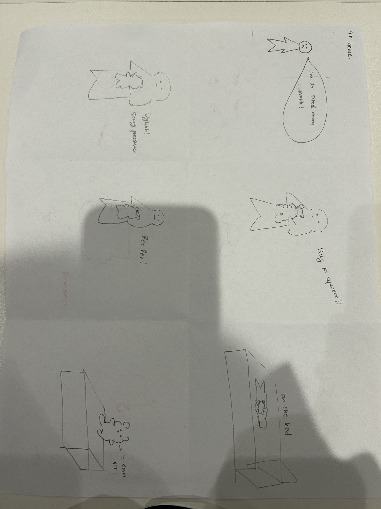
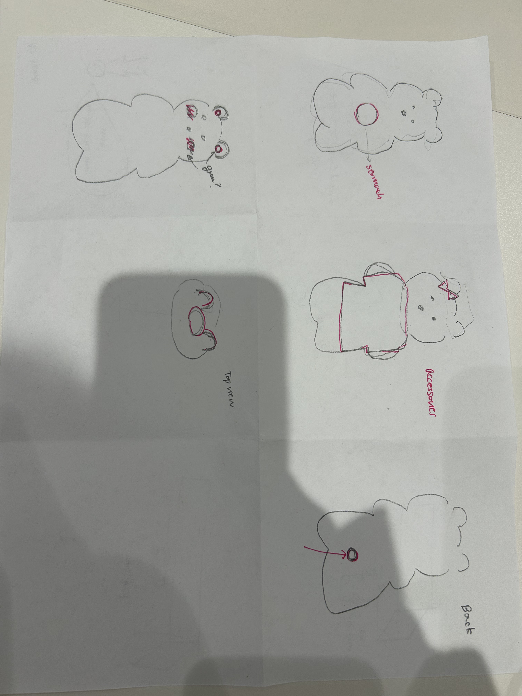
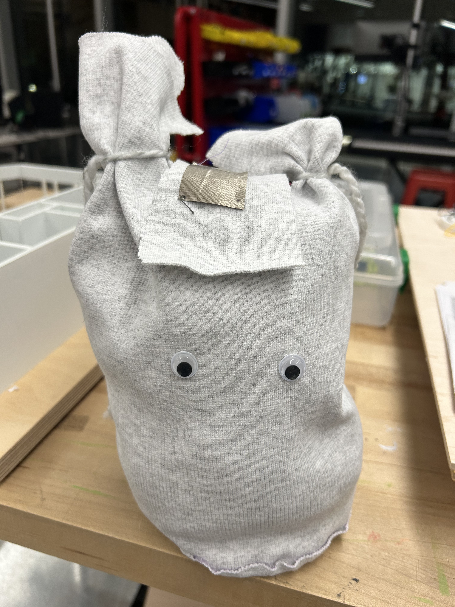
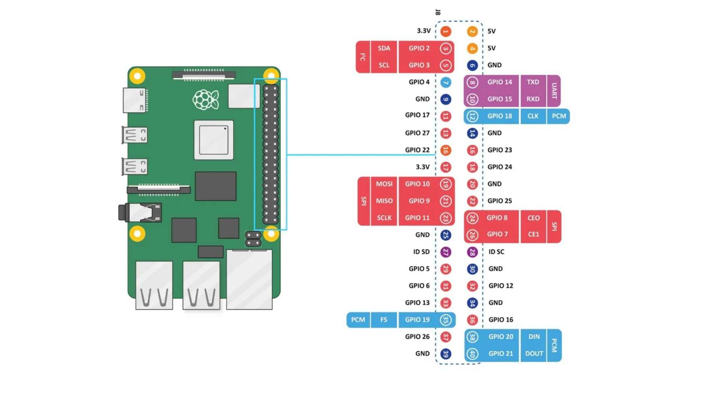
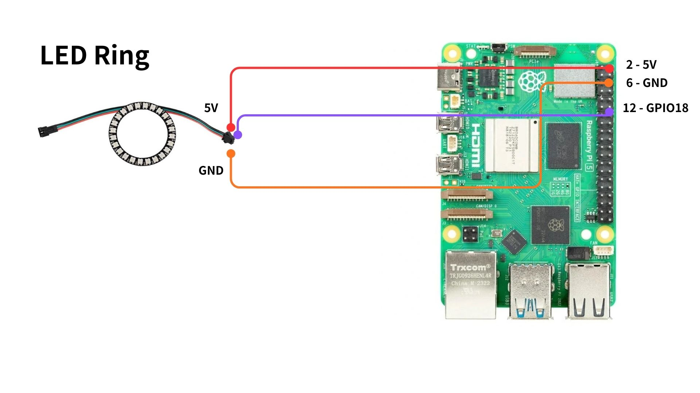
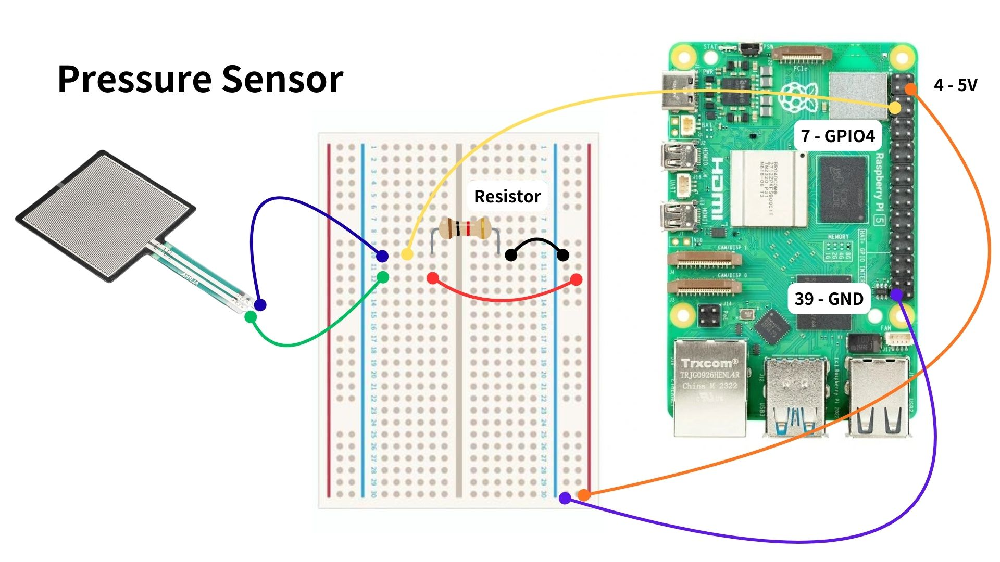
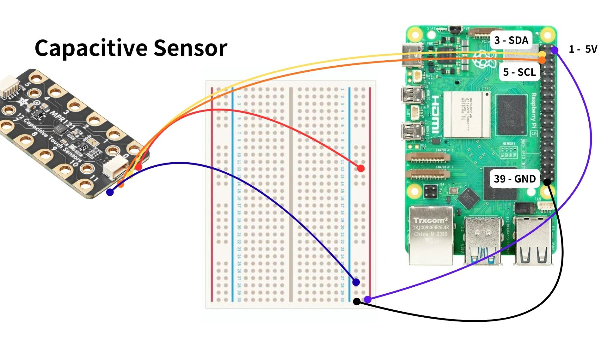
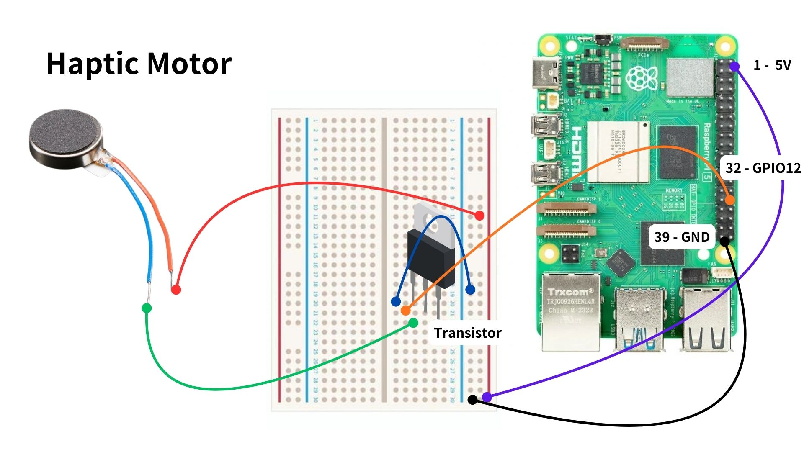

<!-- Put all of this information on your project Github, and submit the link to the Github.

1. Project plan: Big idea, timeline, parts needed, fall-back plan. (Can be same as previous turn-in, but updated if you changed your plan)

2. Functioning project: The finished project should be a device, system, interface, etc. that people can interact with.

3. Documentation of design process

4. Archive of all code, design patterns, etc. used in the final design. (As with labs, the standard should be that the documentation would allow you to recreate your project if you woke up with amnesia.)

5. Video of someone using your project -->

# Project Plan: 

## Big Idea: 
A soothing plushie that replaces harmful stims (e.g., head banging) with comforting light, sound, and touch feedback to support emotional regulation.
- Input: When/where/how the user touches the plush
- Output: Soothing lights pattern, haptic feedback, and/or voice  
We will test and update the input/output based on the user feedbacks

## Materials we need
- Raspberry Pi 5
- Woven Conductive Fabric - 20cm square
- Stainless Thin Conductive Thread - 2 ply - 23 meter/76 ft
- Adafruit DRV2605L Haptic Motor Controller - STEMMA QT / Qwiic
- Vibrating Mini Motor Disc
- 1N4001 power diode or a level converter chip 74AHCT125 (USB microphone & Mini speaker (Logitech))

## Testing  plan
- Functional Testing 
    - Haptic Response
    - LED lightin
    - Microphone Input & Response 
- Usability Testing with two people
    - Ease-of-use
    - Feedback preference
    - Emotional Effectiveness

## Fallback Plan
For all types of feedback, we can conduct a Wizard-of-Oz study to control when and how the feedback is delivered. For example, for haptic feedback, the wizard can manually trigger the vibration when the user touches the plushie
Choose 1 type of feedback to focus on
- haptics fail - add small manual massager
- color change problems- use  reversible sequin fabric
- audio issues - hard code some soothing phrases for responses


# Functioning project

**MewoPow**

A soothing smart plushie that provides comforting light, sound, and haptic feedback to support emotional regulation.




- **LED lights** – Calming light patterns
- **Haptic feedback** – Gentle vibrations
- **Audio responses** – Meows and purring sounds

### Interaction Design

| Interaction | Location | Detection | Response |
|-------------|----------|-----------|----------|
| **Petting** | Head (conductive fabric) | Capacitive touch sensor | 8-sec purring mode: looping purr sound + slow pastel color transitions (purple → lavender → pink → peach) + gentle vibration |
| **Patting** | Back (conductive fabric) | Capacitive touch sensor | 7-sec purring mode: meow sound + orange flash + pastel color transitions + gentle vibration |
| **Quick Tap** | Body (pressure sensor) | Press < 0.3 sec | Short meow + sparkle LED effect + burst vibration |
| **Squeeze** | Body (pressure sensor) | Press 0.3–1 sec | Meow + yellow chase LED pattern + vibration |
| **Long Hug** | Body (pressure sensor) | Press > 1 sec | Toggles **breathing mode** (4-7-8 pattern): blue↔white LEDs + rhythmic vibration to guide calm breathing |

#### Breathing Mode (4-7-8 Pattern)

When activated by a long hug, the plushie guides the user through a calming breathing exercise:

- **Inhale (4 counts):** LEDs gradually brighten, vibration increases
- **Hold (7 counts):** Full brightness with gentle pulse
- **Exhale (8 counts):** LEDs slowly dim, vibration decreases

#### Hardware We used 

| Component | Purpose |
|-----------|---------|
| Raspberry Pi 5 | Main controller |
| Woven Conductive Fabric (20cm²) | Touch-sensitive surface |
| Stainless Conductive Thread (2-ply, 23m) | Connecting fabric to sensors |
| MPR121 Capacitive Touch Sensor | Detecting light touch/petting |
| Pressure Sensor | Detecting hugs/squeezes |
| Vibrating Mini Motor Disc | Haptic feedback |
| NeoPixel LED Ring | Visual feedback |
| Mini Speaker | Audio output (meows, purring) |
| 1N4001 Power Diode | Circuit protection |

[Demo video](https://drive.google.com/file/d/1ILqqUDU1AAwQOzUwiy2DEs0eBlaDfm7g/view?usp=drive_link)

# Documentatoin of Process

## 0. Our first ideation 

We created storyboards envisioning how users would interact with the plushie at home—hugging, petting, or simply looking at it for comfort.



We explored different areas to incorporate lighting: belly, clothing, tail, and cheeks.



## 1. Test with Haptic Motor and Touch System 

We tested haptic motors and touch sensors. 

### Haptic Motor 

We tested the vibration motor using the [haptic test script](test/test_inhale.py), initially with the Adafruit DRV2605L haptic motor controller.

[Test Haptic Motor](https://drive.google.com/file/d/1jeg4uBKiy9n-tyOyDO9NiWyAg44exAlF/view?usp=drive_link)

### Conductive Fabric + Capacitive Sensor 

We created a simple prototype plushie with conductive fabric on top, connected via conductive thread to a capacitive touch sensor.



[Touch sensor test code](test/touch-sensor-test.py)

[Test Touch Sensor](https://drive.google.com/file/d/1ToM1HJ9TXLMcaa0mjYVwpd-h35VXzcin/view?usp=drive_link)

## 2. Ask for Feedback on our First Plushy 

As we finished prototyping the intial version of the plushy, we asked 2 Cornell Tech students, Nana's sister, and her husband to give us the feedback on the size and sensors we were thinking to use. 

Some intial feedbacks we got:
- They liked the haptic motor but they thoght it was too strong and not very steady
- They liked the size of the plushy but could be bigger but not smaller. It's a good size to hug 
- One of them wants a bit more heavy. It's too light
- Everyone thought it's a bit too little of the inteactoin that there is no sound or other things to give us feedback. They want a bit more inteaction. 

## 3. Add Additional Inputs + Outputs

Given the feedback, we decided to add more sensros as well as output forms. 

### Pressure Sensor

We tested with the [pressure sensor test code](test/pressure-test2.py).

[Test Pressure Sensor](https://drive.google.com/file/d/1hq4O5mBmDS_iIKmoONX1ANE9k0dyZU5d/view?usp=drive_link)

### Led Ring 

We tested with the [led ring](test/led_test.py)
For LED, we learned to run the led ring, it has to be connected with GPIO12. 

### Speaker 

For speaker, we just tested with 
```bash 
aplay lookdave/wav
```

## Test with All Sensors at the Same Time

After each of them is working successfully seaparetely, we tested with multiple sensors at the same time. 

At this time, we encountered the issues.

Firstly, we encountered the issue of hapric motor controller not compatiblly working with teh capacitive sensor. 
Since both haptic motor controller and capacitive sensor use i2c, when we tried to run both at the same time, we got error of 0x5A not found. 

To encounter this issue, we decided not to use the haptic motor controller but  connects haptic motor with rasberry pi through the breadboard. 

Also, we tried to use the Qwiic SHIM; however, althoug we solder them together, the soldering was very difficult given the small region to solder, we ended up not suing the Qwiic. 

[Test All Sensors](https://drive.google.com/file/d/1V0iHdGeFqw7xdqrPQZ9Vq-6pxtXVIfxY/view?usp=drive_link)

## Make the Outer Look

We increased the overall size to accommodate components and improve comfort based on user feedback.

## Final Code for Interaction 

[Final Code](master.py)

```mermaid
flowchart TD
    A[User Touch / Pressure Input] --> B{Input Sensors};
    B --> C1[MPR121 Touch Sensor];
    B --> C2[FSR Pressure Sensor];
    C2 --> D2{Detect Press Type\nTap / Squeeze / Hug};
    C1 --> D1[Touch Event\n(pad 5 or 11)];
    D1 --> E[Interaction Logic];
    D2 --> E;
    E --> F1[LED Effects\n(breathing, sparkle, chase)];
    E --> F2[Sound System\npygame];
    E --> F3[Vibration Motor\nPWM];
    F1 --> G[Final Output];
    F2 --> G;
    F3 --> G;
    G[Lights + Sound + Vibration];
```

## Some feedbacks from Demo Day 


# Final Code/Setup 

## Code 

### How to run
```bash
source .venv/bin/activate
pip install -r requirements.txt
python master.py
```

If the code does not work or give an error, please try to run below: 

```bash 
cd test

# Test led 
python led_test.py 

# Test speaker 
aplay lookdave.wav 

#Test pressure sensor 
python pressure-test2.py 

#Test haptic motor 
python test_inhale.py 

#Test capactive sensor
python touch-sensor-test.py

#if this does not work, then ru 
sudo i2cdetect -y 1

#This should show 0x5A. If this does not print 0x5A, double check the hardware setup. 
```

## Hardware setup 












# Video