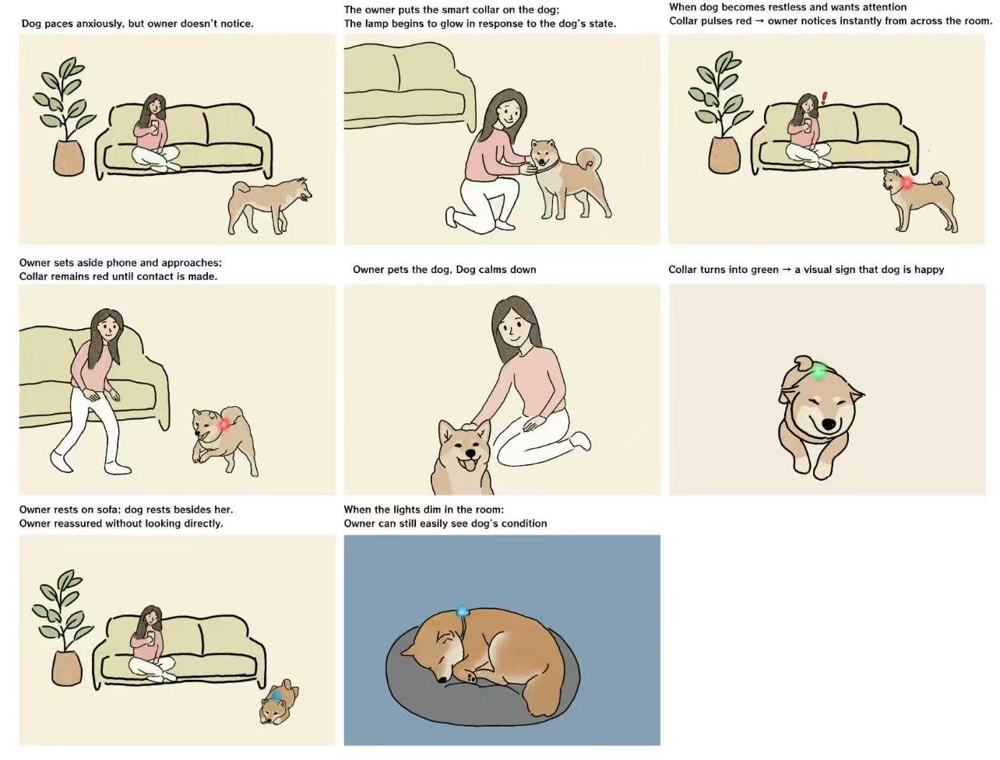
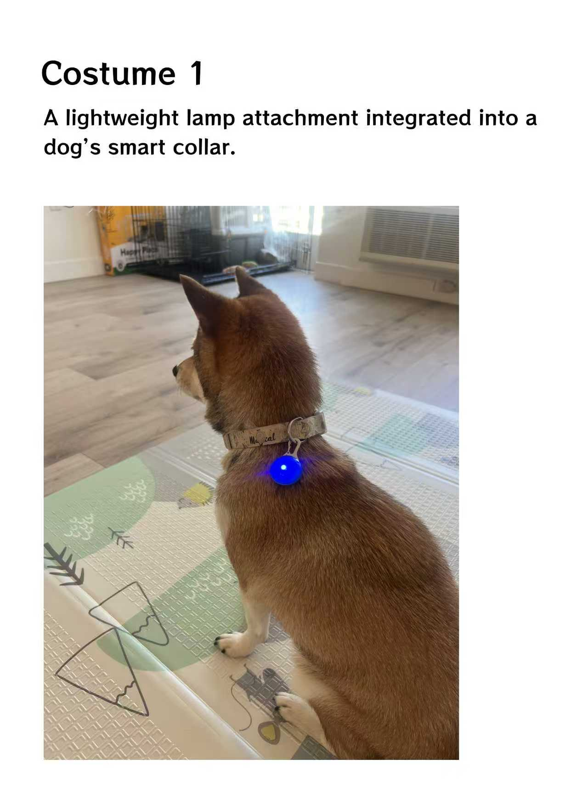
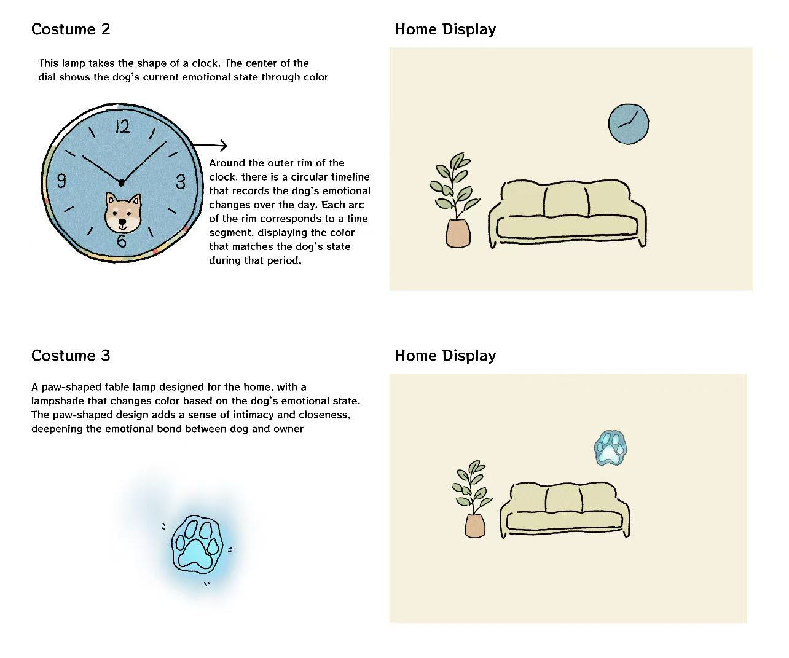
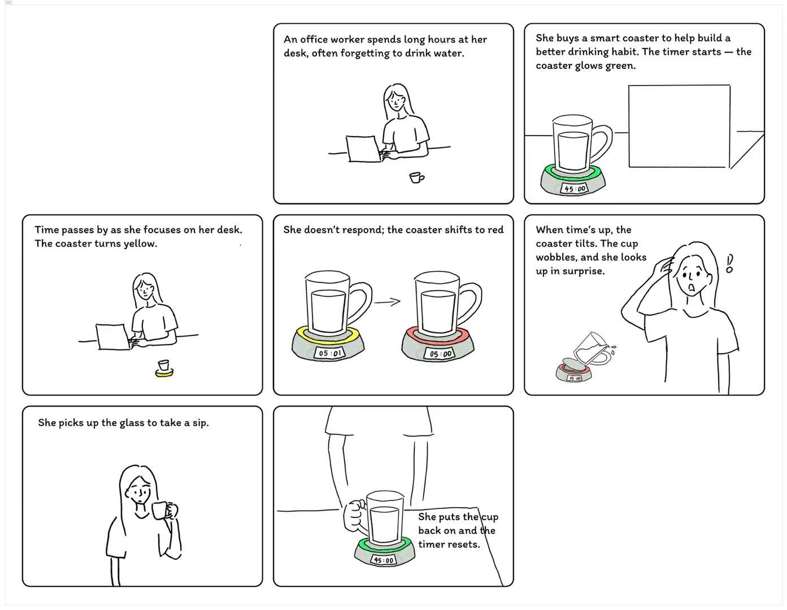
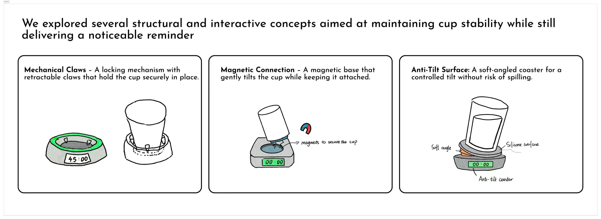
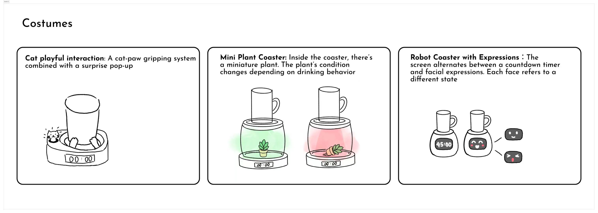

# Tinkerbell Light: Smart Pet Mood Lamp

## Name: Maggie Liang(ml2927) Xueer Zhang(xz946) Xinwei Xie(xx2185)

## Part A. Plan

### Topic
Our design for the "Tinkerbell Light" is a smart pet lamp. The lamp features an LED light and sensors that monitor the pet's activity and heart rate, changing the light color according to the pet’s mood.

### Setting
The interaction takes place in the living room in the evening, with the owner present.

### Players
- Pet Dog
- Pet Owner  
- The Pet Mood Lamp (the “Tinkerbell light”)

### Activity
- The pet is in different states (calm, restless, asleep).
- The sensor light responds with lighting changes:
  - Blue → Rest
  - Green → Normal  
  - Yellow → Exciting
  - Red → Anxiety
- The owner interprets the lamp’s colors and decides how to react (e.g., feed, play, or leave the pet to rest).

### Goals
- The pet wants to express needs (comfort, food, attention).
- The owner wants to understand the pet without guesswork.
- The lamp acts as a “translator” between them using only light.

### Storyboard

### Feedback Summary
We received feedback from another group suggesting we clarify how the pet's mood is monitored. After research, we found that similar to how an Apple Watch monitors blood pressure and heart rate, we can implement a collar for the pet to wear to track these metrics.

## Part B. Act Out the Interaction

We physically acted out the planned interaction, pretending the device performed the scripted functions.

### Did anything seem better on paper than when acted out?
Yes. On paper, mapping the dog’s emotional states directly to light colors (e.g., red = anxious, blue = calm) seemed straightforward. However, during the acted-out scenario, we realized the dog’s behavior is unpredictable and cannot be perfectly controlled to match the storyboard.

### Did new ideas emerge during the acting?
We discovered that adding auditory alerts could further help remind the owner about the pet’s current state.

## Part C. Prototype the Device

We used a smartphone as a stand-in for the device, with its browser acting as a “light” and a remote control interface to change the light color.

### Feedback on the Tinkerbelle Tool
We successfully built the system and set up remote control. One piece of feedback is that Tinkerbelle does not support entering color codes directly, which makes re-selecting the same color on the palette difficult unless using the default provided colors.

## Part D. Wizard the Device

We set up a wizarding system allowing remote control of the device while one team member acted with it. Zoom was used to record videos, and we pinned the relevant video feed to capture the scene.

### Setup the Device
*[Setup the Device](https://www.youtube.com/watch?v=D4cC2wBMVeg)*

### First Recording Attempts
*[First Attempt](https://www.youtube.com/shorts/a3TpJAGhahQ)*

We used the device to interact with a cat, using two color signals: blue for "rest" and yellow for "feeding."

### Updated Interaction After Paper Prototyping
See Section F for the video.
After refining the storyboard, we applied the interaction to a dog with 4 colors.
- The sensor light responds with lighting changes:
  - Blue → Rest
  - Green → Normal  
  - Yellow → Exciting
  - Red → Anxiety

## Part E. Costume the Device

We developed three conceptual costumes to use the phone as the device, considering the environment and usability.

### Sketches

### Design Considerations
- **Dog’s comfort**: Lights should be soft, not harsh or strobing, to avoid frightening or stressing the dog.
- **Light transitions**: Should be gradual (fade-in/fade-out) for a calming effect.
- **Environmental factors**: The device should be safe from overheating and water exposure, especially in a living room setting.
- **Visibility**: Colors should be bright enough to be noticeable but not overwhelming.

## Part F. Record

### Updated Interaction After Paper Prototyping
*[Updated Attempt](https://youtu.be/2MFH3JHRcug)*

# Staging Interaction, Part 2 

This describes the second week's work for this lab activity.

## Prep (to be done before Lab on Wednesday)

You will be assigned three partners from other groups. Go to their github pages, view their videos, and provide them with reactions, suggestions & feedback: explain to them what you saw happening in their video. Guess the scene and the goals of the character. Ask them about anything that wasn’t clear. 

\*\***Summarize feedback from your partners here.**\*\*

The feedback is overall positive, praising the creative concept and appealing costume design of the pet-monitoring collar. One suggestion for improvement is to add sound alerts to complement the visual color changes, making notifications more noticeable and accessible, especially when the owner is busy or in another room. Another point raised is a concern about the collar’s fit, emphasizing the need to balance accurate mood tracking with the pet’s comfort and safety.
## Make it your own

Do last week’s assignment again, but this time: 
1) It doesn’t have to (just) use light, 
2) You can use any modality (e.g., vibration, sound) to prototype the behaviors! Again, be creative! Feel free to fork and modify the tinkerbell code! 
3) We will be grading with an emphasis on creativity. 

\*\***Document everything here. (Particularly, we would like to see the storyboard and video, although photos of the prototype are also great.)**\*\*

# Water Clock Coaster

## Name: Maggie Liang(ml2927) Xueer Zhang(xz946) Xinwei Xie(xx2185)

## Part A. Plan

\*\***Describe your setting, players, activity and goals here.**\*\*

_Setting:_ Where is this interaction happening? (e.g., a jungle, the kitchen) When is it happening?

The interaction takes place in two main settings:
Office Desk – Afternoon, when the user is focused on work and often forgets to drink water.
Home Dining Table or Play Area – During the day, for children who need encouragement to drink water regularly.

_Players:_ Who is involved in the interaction? Who else is there? If you reflect on the design of current day interactive devices like the Amazon Alexa, it’s clear they didn’t take into account people who had roommates, or the presence of children. Think through all the people who are in the setting.

- Office worker or student who tends to forget to drink water.
- Children who are reluctant to drink water.
- Parents/Caregivers: They may supervise and respond to children’s hydration habits.

_Activity:_ What is happening between the actors?

The user places a water cup on the coaster.
The coaster tracks time using a 45-minute drinking cycle the timer counting down:

- 45–21 min: Coaster rim glows soft green (normal state).
- 20–06 min: Gradual transition to yellow breathing light, gently reminding the user.
- 05–02 min: Light turns solid red, signaling urgency.
- Last 1min: Red light flashes and emits a short “beep beep beep” sound.

If no weight change is detected by the end of the 45-minute cycle, the coaster mechanically flips, spilling the water as a strong consequence.
When the user drinks and replaces the cup during any time between time cycles, the timer resets.

_Goals:_ What are the goals of each player? (e.g., jumping to a tree, opening the fridge).

Stay hydrated throughout the day without constant conscious effort.
Build a sustainable hydration habit through gentle reminders.
Parents want to motivate children to drink more water.

Storyboards are a tool for visually exploring a users interaction with a device. They are a fast and cheap method to understand user flow, and iterate on a design before attempting to build on it. Take some time to read through this explanation of [storyboarding in UX design](https://www.smashingmagazine.com/2017/10/storyboarding-ux-design/). Sketch seven storyboards of the interactions you are planning. **It does not need to be perfect**, but must get across the behavior of the interactive device and the other characters in the scene.

\*\***Include pictures of your storyboards here**\*\*

Present your ideas to the other people in your breakout room (or in small groups). You can just get feedback from one another or you can work together on the other parts of the lab.

\*\***Summarize feedback you got here.**\*\*

* We get feedback on people like the combination of gentle reminders and a fun but firm consequence (flipping the cup) to encourage regular water intake.
* They felt the light-based progression was clear and intuitive, especially the gradual green → yellow → red transition.
* But also the flipping mechanism might be too aggressive or messy, especially in office settings. Safety was raised as a potential issue if hot drinks like tea or coffee are used.

## Part B. Act out the Interaction

Try physically acting out the interaction you planned. For now, you can just pretend the device is doing the things you’ve scripted for it.

\*\***Are there things that seemed better on paper than acted out?**\*\*

Yes, when we acted out the interaction, the most notable issue was the flipping mechanism. While it sounded fun and motivating in theory, acting it out showed that spilling water could create a huge mess, especially on desks with laptops, papers, or other electronics. It also raised safety concerns if the cup contained hot drinks like tea or coffee, making the feature disruptive rather than helpful.

\*\***Are there new ideas that occur to you or your collaborator that come up from the acting?**\*\*

New ideas could be that we decided to integrate a magnetic attachment system into the coaster design, along with a compatible accessory for the user’s cup. This way, the cup and coaster could stay securely connected, preventing spills. Instead of completely flipping the cup, the coaster itself would tilt slightly when the timer runs out.

## Part C. Prototype the device

You will be using your smartphone as a stand-in for the device you are prototyping. You will use the browser of your smart phone to act as a “light” and use a remote control interface to remotely change the light on that device.

Code for the "Tinkerbelle" tool, and instructions for setting up the server and your phone are [here](https://github.com/IRL-CT/tinkerbelle).

We invented this tool for this lab!

If you run into technical issues with this tool, you can also use a light switch, dimmer, etc. that you can can manually or remotely control.

\*\***Give us feedback on Tinkerbelle.**\*\*

We smoothly built up the system and set up a remote control. One feedback would be that Tinkerbelle doesn’t support entering color codes, so re-selecting the same color on the palette is a problem unless you use the default color given.

## Part D. Wizard the device

Take a little time to set up the wizarding set-up that allows for someone to remotely control the device while someone acts with it. Hint: You can use Zoom to record videos, and you can pin someone’s video feed if that is the scene which you want to record.

\*\***Include your first attempts at recording the set-up video here.**\*\*
*[Updated Attempt]()*

Now, change the goal within the same setting, and update the interaction with the paper prototype.

\*\***Show the follow-up work here.**\*\*

## Part E. Costume the device

Only now should you start worrying about what the device should look like. Develop three costumes so that you can use your phone as this device.

Think about the setting of the device: is the environment a place where the device could overheat? Is water a danger? Does it need to have bright colors in an emergency setting?

\*\***Include sketches of what your devices might look like here.**\*\*

\*\***What concerns or opportunitities are influencing the way you've designed the device to look?**\*\*

The main concerns in designing the coaster’s look are water safety, heat resistance, and clear lighting. Since it will often be near water, the materials must be waterproof and durable, and it must handle hot drinks without warping. The lights need to be bright enough to show the green–yellow–red cycle, but soft on the eyes.

And we are thinking of adding a customization function: users could select different alert methods, such as lights and sounds for office settings or a playful tilting motion for children. Finally, we imagined that the system could be enhanced with a connected app.

## Part F. Record

\*\***Take a video of your prototyped interaction.**\*\*
*[Updated Attempt]()*
