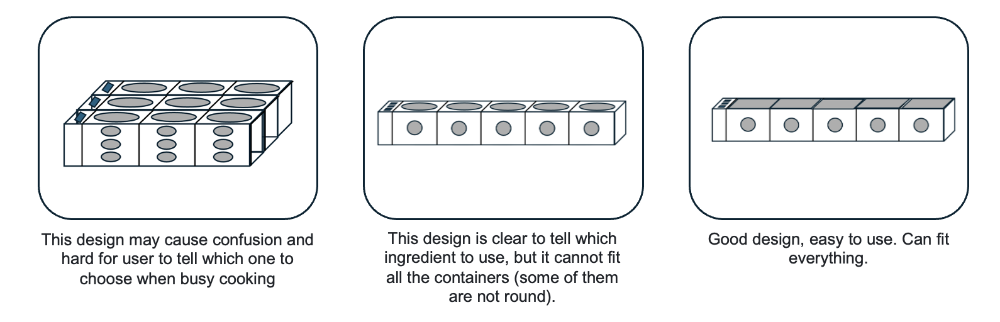
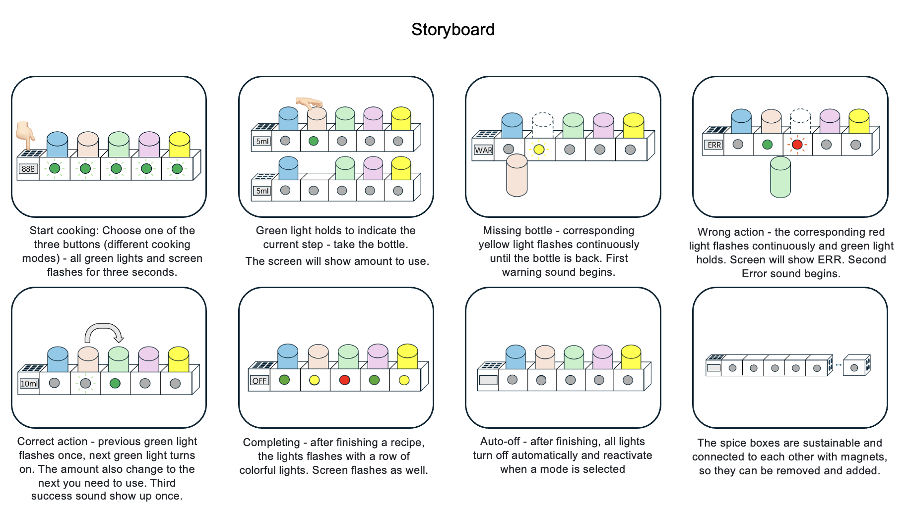
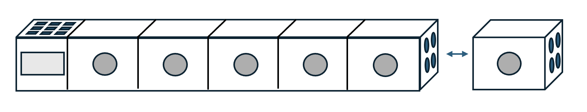

# Staging Interaction

\*\***Collaborator: Yoyo Wang - hw867**\*\*

### The Report

## Lab Overview
For this assignment, you are going to:

A) [Plan](#part-1a-plan) 

B) [Act out the interaction](#part-1b-act-out-the-interaction) 

C) [Prototype the device](#part-1c-prototype-the-device)

D) [Wizard the device](#part-1d-wizard-the-device) 

E) [Costume the device](#part-e-costume-the-device)

F) [Record the interaction](#part-f-record)

## Part 1A. Plan 

\*\***Describe your setting, players, activity and goals here.**\*\*

_Setting:_ Kitchen

_Players:_ The person who is cooking

_Activity:_ Before cooking, choose the mode you would like to cook on the left side of the box. As the cooking process progresses, the green light illuminate in sequence to indicate the current step. The lights guide the chef through the recipe, with the next step indicated by a green light. The bottles represent different condiments (can be in various containers). If a bottle is not returned after use, the yellow light flashes as a warning. Picking the wrong bottle causes the red light to flash. Each time a bottle is correctly picked up and returned, the green light flashes once. Completing all steps triggers all the lights to flash with a colorful lights. In the end, it turned off automatically.

_Goals:_ Help chefs avoid missing or forgetting steps by visualizing cooking progress through interactive lights. Provide immediate feedback on actions to ensure accuracy and proper sequencing.

\*\***Include pictures of your storyboards here**\*\*

\*\***Summarize feedback you got here.**\*\*

We shared our idea with TA and received positive comments from him.

Also we got some feedback from classmates:

"As a beginner in the kitchen, I often find myself scrambling because I can’t remember the order to add seasonings. Sometimes I even finish cooking a dish only to realize I forgot the sugar or salt. Following recipes from a book never really works for me. This visual lighting system feels like it could really save struggling new cooks like myself — allowing us to focus more on heat control and how the ingredients are actually cooking."  ———— **Dean Xu**

## Part 1B. Act out the Interaction

\*\***Are there things that seemed better on paper than acted out?**\*\*

Since Tinkerbelle doesn't have multiple lights, we imitated the flashing lights using different background colors on the phone. However, it was difficult to create a flashing effect.

\*\***Are there new ideas that occur to you or your collaborator that come up from the acting?**\*\*

Sound effect: Acting out the sequence made us consider adding subtle auditory signals (chimes) in addition to lights, to provide multi-sensory feedback for the chef.

## Part 1C. Prototype the device

\*\***Give us feedback on Tinkerbelle.**\*\*

Tinkerbelle is a really good software for one light, but it cannot make different lights in different parts of the screen (Partition display). As we do not have five phones to do this lab, we choose slides instead to display the effects.

## Part 1D. Wizard the device

\*\***Include your first attempts at recording the set-up video here.**\*\*

Here is the first attempt demo video!

https://drive.google.com/file/d/1KwxyvKm84TkSXPgvwc1sGI5fmFVVE7L6/view?usp=sharing

\*\***Show the follow-up work here.**\*\*

We initially used a mobile phone as the display device for the slides to immitate the lights. The slides also include virtual bottles on the phone, which moved alongside the real-world bottle. However, we found this unclear due to the small screen size of the phone, and the movement of the virtual and real bottles together would cause confusions. Therefore, we used a laptop as the display device, deleting the virtual bottles and interact directly with the real bottles. This approach was very clear and achieved all the desired effects.

## Part E. Costume the device

\*\***Include sketches of what your devices might look like here.**\*\*

\*\***What concerns or opportunitities are influencing the way you've designed the device to look?**\*\*

Our design prioritizes convenience and provides clear instructions, helping people know exactly what condiments to use while cooking without having to constantly check their phones. Because kitchens are prone to greasy stains, they need to be easily accessible for cleaning. A stationary device would be inconvenient to move, so it's made of washable, waterproof material, and it can be wiped with a damp towel.

## Part F. Record

\*\***Take a video of your prototyped interaction.**\*\*

Here is the demo video of my interaction!

https://drive.google.com/file/d/1lDDAwDMCFRYFSha0AIaA3D5vYPw4H2aj/view?usp=sharing

\*\***Please indicate who you collaborated with on this Lab.**\*\*

Yoyo Wang

# Staging Interaction, Part 2 

This describes the second week's work for this lab activity.

## Prep (to be done before Lab on Wednesday)

\*\***Summarize feedback from your partners here.**\*\*

Our system has received widespread acclaim from our colleagues, especially those who don't cook, who find it extremely useful. However, it's less appealing to those who know how to cook. Of course, we have many suggestions for improvement. The first is to add sound. Our second part allows for methods other than lighting. Our colleagues think that sound would be a good way to alert them when a bottle is not put back or when the wrong bottle is taken. Secondly, we need to consider scalability. We need to think about how to add more spice boxes. The idea we've come up with is to use magnetic boxes that can be connected one after another, making it scalable and sustainable. Thirdly, we need to consider the amount of seasoning. Our colleagues think that seasoning is also very important when cooking. A small digital display below each light showing the amount is also very important. This would effectively solve all the problems associated with using seasonings. It would fully meet their needs. We will also incorporate all of these ideas in the second part, making our product a practical, easy-to-use, and truly excellent product that addresses all the pain points of novice cooks.

\*\***Document everything here. (Particularly, we would like to see the storyboard and video, although photos of the prototype are also great.)**\*\*

A) [Plan](#part-2a-plan) 

B) [Act out the interaction](#part-2b-act-out-the-interaction) 

C) [Costume the device](#part-2c-costume-the-device)

D) [Record the interaction](#part-2d-record)

## Part 2A. Plan 

\*\***Describe your setting, players, activity and goals here.**\*\*

_Setting:_ Kitchen

_Players:_ The person who is cooking

_Activity:_ Before cooking, choose the mode you would like to cook on the left side of the box. As the cooking process progresses, the green light illuminate in sequence to indicate the current step. The lights guide the chef through the recipe, with the next step indicated by a green light and required quantity would present on the screen. The bottles represent different condiments (can be in various containers). If a bottle is not returned after use, the yellow light flashes as a warning with a sound effct. Picking the wrong bottle causes the red light to flash and corresponding sound effct. Each time a bottle is correctly picked up and returned, the green light flashes once. Completing all steps triggers all the lights to flash with a colorful lights. In the end, it turned off automatically. Additionally, the boxes are stackable, and the plan is to use magnetic technology to make the boxes sustainable and expandable.

_Goals:_ Help chefs avoid missing or forgetting steps by visualizing cooking progress through interactive lights with more specific instructions. Provide immediate feedback on actions to ensure accuracy and proper sequencing.

\*\***Include pictures of your storyboards here**\*\*

\*\***Summarize feedback you got here.**\*\*

This version is a clear improvement over the last one—now with lights, sound, and digital displays, I know exactly how much seasoning to add. It feels more intuitive and removes the uncertainty from before. --Dean Xu

This version is definitely an improvement, especially with the digital display showing how much to add. But there’s still an issue—it tells me the amount, yet I’m not always sure when to add it, and sometimes seasonings aren’t added all at once but later in the process. --Richard Li

## Part 2B. Act out the Interaction

\*\***Are there things that seemed better on paper than acted out?**\*\*

This time, we used a projector along with a cupboard cut to the needed shape. It made the scenes more vivid and interactive when acted out.

\*\***Are there new ideas that occur to you or your collaborator that come up from the acting?**\*\*

It would be better to have a measurement on the quantity we used for the condiments. However, it is would require more advanced techniques to know how much we used during cooking.

## Part 2C. Costume the device

\*\***Include sketches of what your devices might look like here.**\*\*

\*\***What concerns or opportunitities are influencing the way you've designed the device to look?**\*\*

The new design features changeable condiment containers that are connected with magnets, allowing them to be easily added or removed. This makes the design more sustainable.

## Part 2D. Record

\*\***Take a video of your prototyped interaction.**\*\*

Here is the new demo video with the improved prototype!

https://drive.google.com/file/d/1aso9p4zn8DSsxiVJ8srne_fkNjhhoKXU/view?usp=sharing
