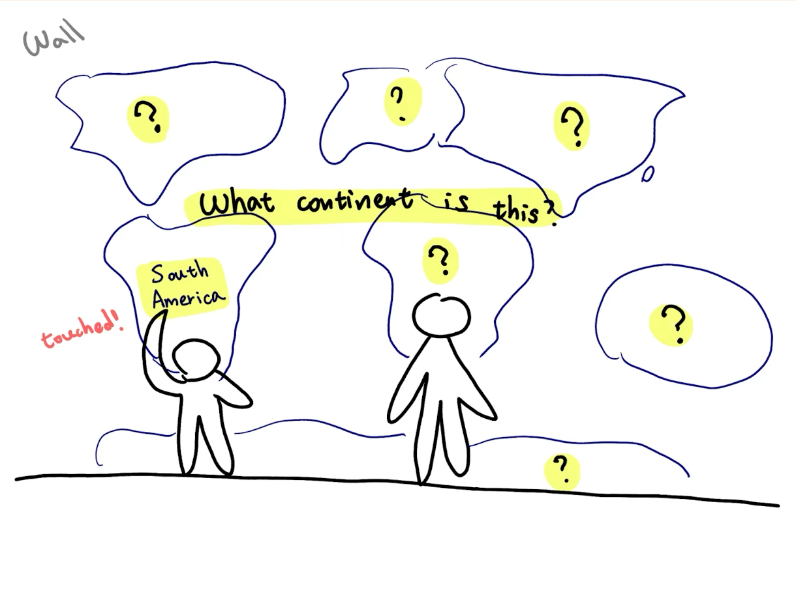

# Staging Interaction

**Huiying Zhan, Qinrui Li, Jiayi Sun**

In the original stage production of Peter Pan, Tinker Bell was represented by a darting light created by a small handheld mirror off-stage, reflecting a little circle of light from a powerful lamp. Tinkerbell communicates her presence through this light to the other characters. See more info [here](https://en.wikipedia.org/wiki/Tinker_Bell). 

There is no actor that plays Tinkerbell--her existence in the play comes from the interactions that the other characters have with her.

For lab this week, we draw on this and other inspirations from theatre to stage interactions with a device where the main mode of display/output for the interactive device you are designing is lighting. You will plot the interaction with a storyboard, and use your computer and a smartphone to experiment with what the interactions will look and feel like. 

_Make sure you read all the instructions and understand the whole of the laboratory activity before starting!_

## Prep

### To start the semester, you will need:
1. Read about Git [here](https://git-scm.com/book/en/v2/Getting-Started-What-is-Git%3F).
2. Set up your own Github "Lab Hub" repository by forking the [Interactive-Lab-Hub repository](https://github.com/FAR-Lab/Interactive-Lab-Hub). To get lab updates, simply [use GitHub's "Sync fork" button when new content is available](https://docs.github.com/en/pull-requests/collaborating-with-pull-requests/working-with-forks/syncing-a-fork).

3. Set up the README.md for your Hub repository (for instance, so that it has your name and points to your own Lab 1). You can [learn how to organize and format your README.md here](https://docs.github.com/en/get-started/writing-on-github/getting-started-with-writing-and-formatting-on-github/basic-writing-and-formatting-syntax). Make sure to include links to your submissions so they are easy to find.

### For this lab, you will need:
1. Paper
2. Markers/ Pens
3. Scissors
4. Smart Phone -- The main required feature is that the phone needs to have a browser and display a webpage.
5. Computer -- We will use your computer to host a webpage which also features controls.
6. Found objects and materials -- You will have to costume your phone so that it looks like some other devices. These materials can include doll clothes, a paper lantern, a bottle, human clothes, a pillow case, etc. Be creative!

### Deliverables for this lab are: 
1. 7 Storyboards
1. 3 Sketches/photos of costumed devices
1. Any reflections you have on the process
1. Video sketch of 3 prototyped interactions
1. Submit the items above in the lab1 folder of your class [Github page], either as links or uploaded files. Each group member should post their own copy of the work to their own Lab Hub, even if some of the work is the same from each person in the group.

### The Report
This README.md page in your own repository should be edited to include the work you have done (the deliverables mentioned above). Following the format below, you can delete everything but the headers and the sections between the **stars**. Write the answers to the questions under the starred sentences. Include any material that explains what you did in this lab hub folder, and link it in your README.md for the lab.

## Lab Overview
For this assignment, you are going to:

A) [Plan](#part-a-plan) 

B) [Act out the interaction](#part-b-act-out-the-interaction) 

C) [Prototype the device](#part-c-prototype-the-device)

D) [Wizard the device](#part-d-wizard-the-device) 

E) [Costume the device](#part-e-costume-the-device)

F) [Record the interaction](#part-f-record)

Labs are due on Mondays. Make sure this page is linked to on your main class hub page.

## Part A. Plan 

\*\***Describe your setting, players, activity and goals here.**\*\*

- **Setting:**  
A royal hall at night. The story has three short scenes: the maid with fruit, the queen with wine, and the general with a sword. Each scene reveals a motive and a plan to kill the King, with light effects used to build the mood and drive the drama.

- **Players:**  
  - The King: the main target of all three plots.  
  - The Maid: a servant who wants revenge for her family.  
  - The Queen: once loved the King, now hates him after betrayal.  
  - The General: once a loyal soldier, now a rebel.
 
- **Activity:**  
  1. *The Maid’s Poisoned Fruit* — At the banquet, the maid brings a glowing fruit bowl. The King reaches for the fruit, the light turns red, but he pulls back. The glow fades.  
  2. *The Queen’s Poisoned Wine* — The Queen raises a cup of glowing purple wine. She offers it to the King, his hand moves close, the light turns red, but he refuses to drink. The glow fades.
  3. *The Rebel’s Blade* — The general walks forward and takes his sword. The sword glows white, then red. He draws it, the King dies, and his crown falls.

- **Goals:**  
  - Maid: to poison the King and take revenge.  
  - Queen: to kill the King with poisoned wine.  
  - General: to strike the King down with his sword.  
  - King: to survive these threats and keep his rule.  

\*\***Include pictures of your storyboards here**\*\*

Here is the storyboard for our interaction design:

&nbsp;

Present your ideas to the other people in your breakout room (or in small groups). You can just get feedback from one another or you can work together on the other parts of the lab.

\*\***Summarize feedback you got here.**\*\*

## Part B. Act out the Interaction

\*\***Are there things that seemed better on paper than acted out?**\*\*  
Yes. On paper, the glowing light effects (green, purple, white, red) looked very clear and dramatic. But when acting them out, it was harder to present the glow and control the timing of the color changes smoothly. Also, the emotional reactions of the King and the Queen felt stronger in the drawings than in the short performance, because it was hard to act them out.

\*\***Are there new ideas that occur to you or your collaborator that come up from the acting?**\*\*  
We realized that by adjusting the intensity of the lighting, we could highlight the interaction between the characters and the objects, and that adding background sound would make the video more vivid.

## Part C. Prototype the device

You will be using your smartphone as a stand-in for the device you are prototyping. You will use the browser of your smart phone to act as a “light” and use a remote control interface to remotely change the light on that device. 

Code for the "Tinkerbelle" tool, and instructions for setting up the server and your phone are [here](https://github.com/IRL-CT/tinkerbelle).

We invented this tool for this lab! 

If you run into technical issues with this tool, you can also use a light switch, dimmer, etc. that you can can manually or remotely control.

\*\***Give us feedback on Tinkerbelle.**\*\*
This tool was quite easy to set up. Once we learned how to control the lighting, we use it flexibly. It was also very convenient, since it worked well with the phone and could be controlled from the computer. The phone screen changed colors instantly, which enhanced the performance effect.

## Part D. Wizard the device
Take a little time to set up the wizarding set-up that allows for someone to remotely control the device while someone acts with it. Hint: You can use Zoom to record videos, and you can pin someone’s video feed if that is the scene which you want to record. 

\*\***Include your first attempts at recording the set-up video here.**\*\*  
In our first recording attempt, we prepared to manually control the lighting transitions. In the first two assassination scenes, where the King survives, we used a slow color shift in the lights to suggest rising tension before fading back to normal. In the final scene, to emphasize the success of the assassination, we highlighted the sword with a bright white glow followed by a rapid shift to red flashing light, underscoring the dramatic climax of the King’s death.

In the first try-out scene, where the Maid offers the poisoned fruit bowl to the King, the glow was controlled from the laptop and shifted in real time on the phone screen. At first, the bowl glowed green, but as the King reached out his hand, it turned red—showing that if he ate it, he would be poisoned. However, because of his suspicion, he pulled back, and the red glow faded away. **放尝试第一幕zoom录屏+手机灯光变化**

Now, change the goal within the same setting, and update the interaction with the paper prototype. 

\*\***Show the follow-up work here.**\*\*

## Part E. Costume the device

Only now should you start worrying about what the device should look like. Develop three costumes so that you can use your phone as this device.

Think about the setting of the device: is the environment a place where the device could overheat? Is water a danger? Does it need to have bright colors in an emergency setting?

\*\***Include sketches of what your devices might look like here.**\*\*

\*\***What concerns or opportunitities are influencing the way you've designed the device to look?**\*\*  
Our design comes from the storyline. We wanted to disguise the device as different weapons: a fruit bowl, a knife, and a cup of wine. We drew these objects, cut them out, and placed them over the phone screen. With Tinkerbelle’s lighting, the phone could show different effects—for example, green light for the fruit bowl, purple light for the wine, and white light for the knife. When each object turned into a weapon to kill the King, the light changed to red.

## Part F. Record

\*\***Take a video of your prototyped interaction.**\*\*

\*\***Please indicate who you collaborated with on this Lab.**\*\*
Be generous in acknowledging their contributions! And also recognizing any other influences (e.g. from YouTube, Github, Twitter) that informed your design. 
I (Huiying Zhan) collaborated with Qinrui Li and Jiayi Sun. I first proposed the storyline, while Jiayi took the lead in refining and writing the script. Qinrui and I mainly worked on drawing the storyboards. All three of us contributed to making the props. During filming, Jiayi served as the main videographer and editor, Qinrui controlled the lighting, and I arranged the actors’ movements and blocking. We worked together smoothly, and each of us made essential contributions to the group. The project would not have been complete without any one of us. We were very satisfied with the final outcome. We would also like to thank GitHub resources, the Tinkerbelle tool, and the iPhone recording software for their support.

# Staging Interaction, Part 2 

This describes the second week's work for this lab activity.

## Prep (to be done before Lab on Wednesday)

You will be assigned three partners from other groups. Go to their github pages, view their videos, and provide them with reactions, suggestions & feedback: explain to them what you saw happening in their video. Guess the scene and the goals of the character. Ask them about anything that wasn’t clear. 

\*\***Summarize feedback from your partners here.**\*\*

## Make it your own

Do last week’s assignment again, but this time: 
1) It doesn’t have to (just) use light, 
2) You can use any modality (e.g., vibration, sound) to prototype the behaviors! Again, be creative! Feel free to fork and modify the tinkerbell code! 
3) We will be grading with an emphasis on creativity. 

\*\***Document everything here. (Particularly, we would like to see the storyboard and video, although photos of the prototype are also great.)**\*\*

---

## My Lab 1 Work

### Storyboard

### Prototype Photos

### Demo Video
[Watch the demo video here](https://youtu.be/xxxxxxx)

### Reflection
In this lab, we experimented with ...

