# Staging Interaction

**Lianne Bisch(lb8-54)**

## Lab Overview
For this assignment, you are going to:

A) [Plan](#part-a-plan)

B) [Act out the interaction](#part-b-act-out-the-interaction)

C) [Prototype the device](#part-c-prototype-the-device)

D) [Wizard the device](#part-d-wizard-the-device)

E) [Costume the device](#part-e-costume-the-device)

F) [Record the interaction](#part-f-record)

## Part A. Plan

\*\***Describe your setting, players, activity and goals here.**\*\*

**1 - Temp Raise Detector**

_Setting:_ Inside a home where an elderly person lives.

_Players:_ The elderly resident. Other people living in the same home. Friends or family members who are authorized to receive notifications.

_Activity:_ When the device detects that the room temperature is becoming dangerously high, it alerts the players through a lighting signal.
- The elderly resident can turn on the AC themselves.
- If they don’t notice, others in the household or notified family members can step in to ensure the AC is turned on

_Goals:_ Elderly people sometimes do not realize when the environment has become uncomfortably hot, which can lead to heat stroke indoors. The goal of the device is to use lighting as a clear alert to prompt someone—either the resident or others—to take action and cool the room.

**2 - Loudness Detector**

_Setting:_ A library or any room where people are expected to remain quiet. A loudness detector device is placed on each table.

_Players:_
- Individuals or groups sitting at the tables
- Other people present in the quiet space
- Individuals who will set the color for the loudness.

_Activity:_ The device monitors sound levels at each table.
- If the noise level exceeds a set threshold, the device alerts the group by changing its light (e.g., glowing red or pulsing).
- When the group lowers their voices, the light returns to a calm state by dimming.

_Goals:_ To gently remind people to keep their voices down, helping maintain a quiet environment for everyone in the space.

**3 - Cry Analyzer**

_Setting:_ At home, or in public places such as a subway station or restaurant, essentially anywhere babies may be present.

_Players:_
- Baby (or multiple babies)
- Parents
- Other caregivers (nannies, grandparents, relatives, etc.)

_Activity:_ The device continuously listens for baby cries.
- When a baby starts crying, the device analyzes the sound to infer the likely reason (e.g., hunger, discomfort, tiredness, needs a diaper change).
- If there are multiple babies, the device differentiates which baby is crying and signals accordingly (e.g., through distinct light colors or patterns).
- Caregivers notice the light and respond to the baby’s needs.

_Goals:_ Babies cry for different reasons, and it is not always easy for caregivers to immediately recognize the cause. The goal of the Cry Analyzer is to provide a clear, light-based signal to caregivers, helping them quickly understand which baby is crying and why, so they can respond appropriately.

**4 - MoodLight**

_Setting:_ Inside the homes of our characters, including our main character, friends and family.
 
_Players:_
- Individuals who want to communicate their moods.
- Individuals who will set the color to indicate their feelings.

_Activity:_ When the user wants to share their mood with another they can add their friends/family member and alert them of their mood via light signal. Prompting the receiver to reach out.
- When person is having a mental health crisis
- When a person receives good news and wants to share their joy

_Goals:_ Some may want to share how they are feeling with others during a mental health episode, positive occasion or celebration. To provide a clear, light-based signal to the receiver so they understand what the sender is feeling and if they need help.

**5 - Air Quality Detector**

_Players:_
- Individuals or groups at home.
- Other people present a space.

_Activity:_ The device monitors air quality in a room.

- If the air quality exceeds a set threshold, the device alerts the room by changing its light (e.g., changing glow from green to orange or red plus possible pulsing).
- This can prompt someone in the room to turn on a fan or open the windows/doors.

_Goals:_ People sometimes do not realize when the environment's air quality has dropped. The goal of the device is to use lighting as a clear alert to prompt someone—either the resident or others—to take action and get good air flowing in the room.

\*\***Include a picture of your storyboard here**\*\*

Temperature Raise Detector Storyboards 1 - 2

Storyboard 1

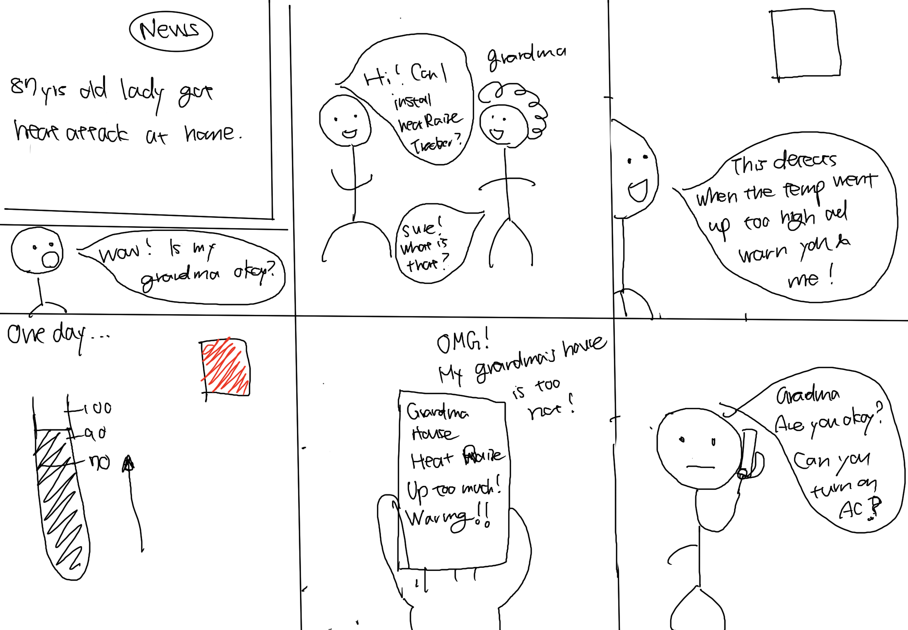

Storyboard 2

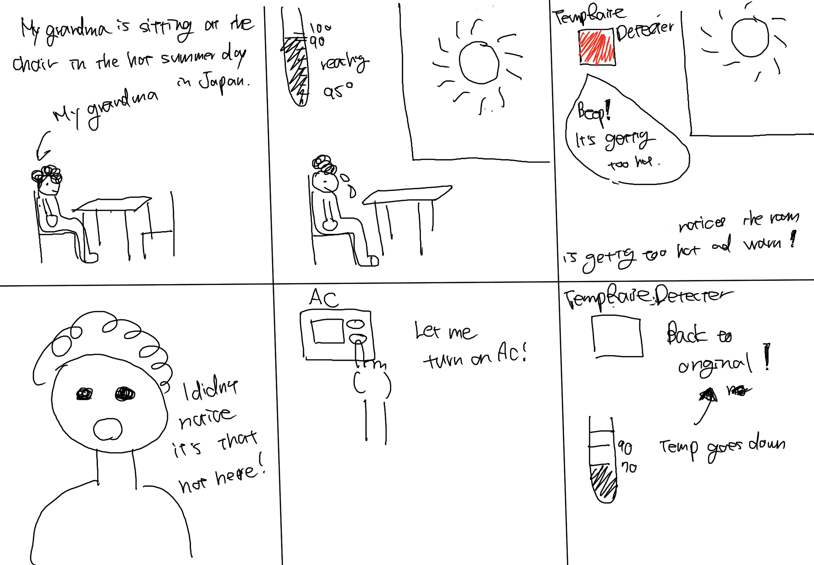

Loudness Detector Storyboards 3

Storyboard 3

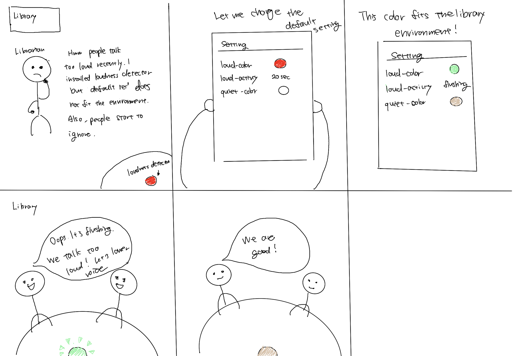

Cry Analyzer Storyboards 4 - 6

Storyboard 4

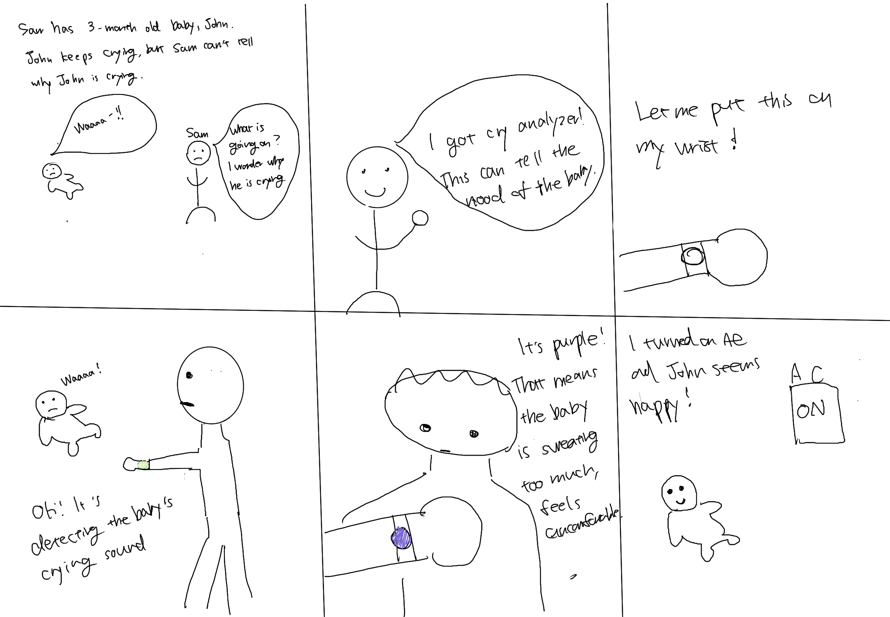

Storyboard 5

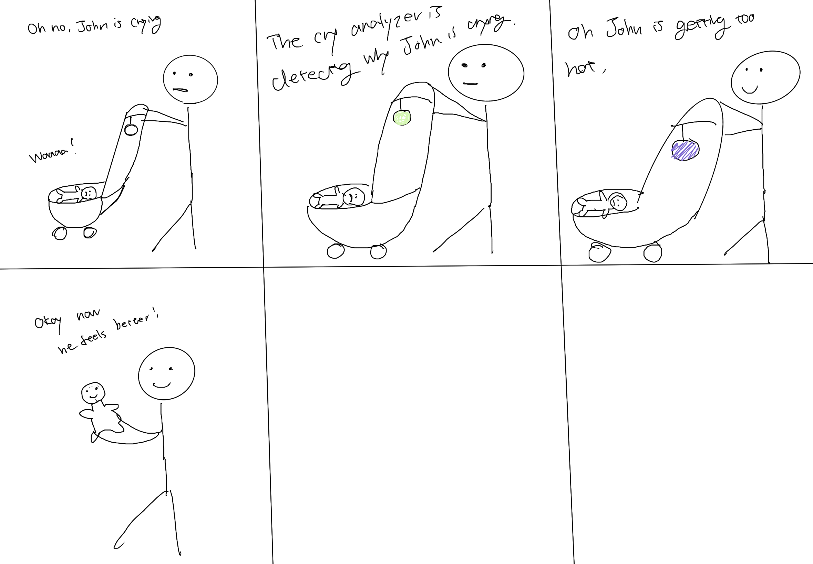

Storyboard 6

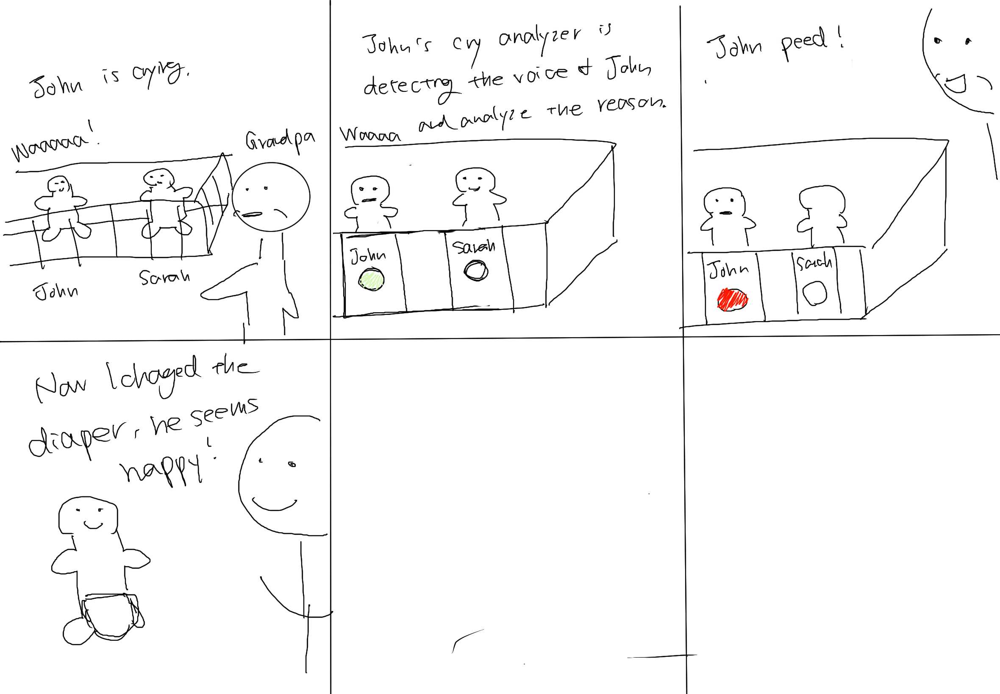

Moodlight Storyboards 7 - 10

Storyboard 7

.jpg)
.jpg)

Storyboard 8

.jpg)

Storyboard 9

.jpg)

Storyboard 10

.jpg)

AirQuality Detector Storyboards 11 - 15

Storyboard 11

.jpg)
.jpg)

Storyboard 12

.jpg)
.jpg)

Storyboard 13

.jpg)

Storyboard 14

.jpg)

Storyboard 15

.jpg)

\*\***Summarize feedback you got here.**\*\*

Temperature Rise Detector: The goals and the activity of the temp rise detector was clear. They think it's good idea especially after the grandma not noticing the temp raise. However, they are a bit worried about what if the grandma is not noticing when the light is turning. Also, they are worried whether the detector can tell if any action is taken or not.

Loudness Detector: They think the scenarios are relatable. It’s easy to imagine this at a library or café. They like how it's in the every table so that the users can notice the loudness very easily. Also, they like the idea that the users can customize the setting. They are concerned about how to prevent people from ignoring the light.

Cry Analyzer: They like that you showed multiple contexts, and they think the color-coded signals make it easy to know why the baby is crying.
They wonder how it behaves when the two babies are crying at once. Are they going to show the same color for the same reason? Also, they were worried about depending on the number of reasons, it requires a lot of memorization for caregivers.

Moodlight:  They like the multiple contexts, and they think the color-coded signals make it easy to know how one should react when notified of a mood change. It helps when one self isolates due to mental illness and can make one feel less alone. The gradients of color are fun and can encourage people to put specific words and colors to their feelings.

AirQuality Detector: They like how the airquality drop can be caused by multiple sources external or internal to the home. It is good to show a gradient of colors to indicate if the air quality is poor but not a danger and can help others monitor the air quality in the home. The notification to others helps if the monitor's alert is ignored or not seen by someone in the home.

## Part B. Act out the Interaction

\*\***Are there things that seemed better on paper than acted out?**\*\*

Yes. We thought on the paper, it seems fine to have something on the wrist while holding the baby. However, When I try to hold the baby, I do not want to have anything that can harm the baby, so something on the wrist might not be a good idea. It may be better to have the cry analyzer on the table or hang it on the side of the baby’s bed. Or the cry analyzer must be made of a soft material, such as silicon. 

\*\***Are there new ideas that occur to you or your collaborator that come up from the acting?**\*\*

Color might not be enough to clearly understand what the baby needs. Users are required to remember all the associated colors. We realize we need an app that displays the details of why the baby is crying. We decided we only have hungry, tired, wet diapers, and others. 

Additionally, we realized that when the baby is crying, we do not want the light to be very bright, as this can wake the baby up more. We want the light to be dim when the surroundings is dim. 
 
When holding the baby, I do not want it going off constantly if the baby is inconsolable; I may want a feature that indicates the notification was seen and is being addressed. If a baby is crying for a reason that can be addressed, such as trying to sleep, the parent might want to “snooze” the alert to see if, in x minutes, the baby is still restless.

As we discussed, we realized this would be particularly helpful for individuals with hearing disabilities. 

In summary: 
Cry analyzer 
- Detects only 4 types of cries (hungry, tired, wet diapers, and others), and details of others will be shown in the app
    - Analyzing the baby’s cry: Green 
    - Hungry: Red 
    - Tired/Sleepy: Yellow
    - Wet diapers: Brown
    - Others: Purple
- Users can customize the four types of cries depending on the baby’s reasons for crying
- Dim when the surroundings are dark 
- Snooze after x min 
- Soft material / place it on the desk, or hang it on the crib’s side

## Part C. Prototype the device

\*\***Give us feedback on Tinkerbelle.**\*\*

When going onto the computer http, the instructions say to use http://[yourWiFiIPv4address]:5000, however sometimes the computer controller also needs to be on 5001 for it to work. I wish the names of the buttons were clearer, Jane Wren is not obvious as to if it would be the controller or recipient of the colors.

## Part D. Wizard the device

\*\***Include your first attempts at recording the set-up video here.**\*\*

Setup-video: https://drive.google.com/file/d/1BUSWfqz2VD0qCs84mbK93GCGri7xPBRh/view?usp=sharing
=======
Now, change the goal within the same setting, and update the interaction with the paper prototype. 

\*\***Show the follow-up work here.**\*\*

Follow-up work: We created a low-light environment so the illuminated color display would appear dimmer and be gentler on the eyes. This feature was to address its use in dark settings such as a nursery, where a baby is being put to sleep or when a more soothing atmosphere is desired.

https://drive.google.com/file/d/1WwWBHpumsBCVKSpRs7hg7XYgLydaZ-CJ/view?usp=drive_link

## Part E. Costume the device

\*\***Include sketches of what your devices might look like here.**\*\*

Sketch of the device hanging on the side of the crib.
<!-- 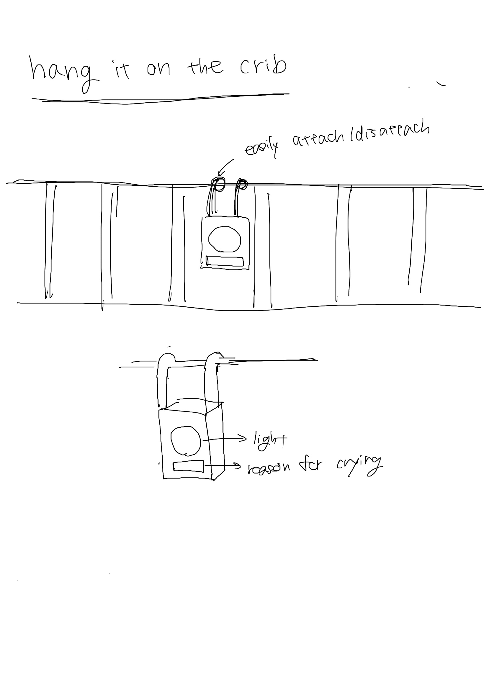 -->

Sketch of generic hanging option with fun star feature.
<!--  -->
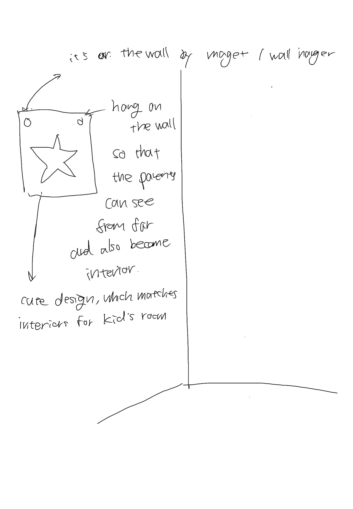

Sketch of the lantern. 
<!-- 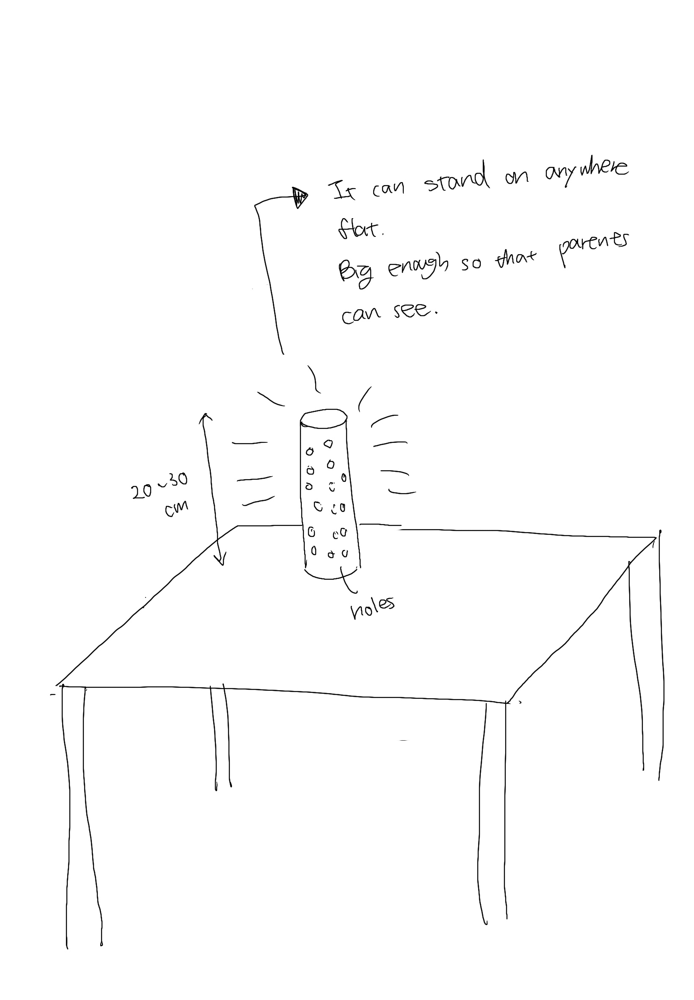 -->

\*\***What concerns or opportunities are influencing the way you've designed the device to look?**\*\*

Concerns: 
We initially considered creating something that is both soft/waterproof. However, as we designed it, we realized that this object should not be inside the crib because babies can touch or swallow it. 

Opportunities: 
We see the opportunity that this cry analyzer can be used without activating, since the parents need to hold their babies. 
We came up with the idea of hanging it on the wall, which allows it to blend in with the interior and also requires no flat space, which is usually occupied with a lot of baby goods, and is also easily seen. 
We assigned 4 core baby needs and assigned colors to them: hungry: red, tired: yellow, wet: brown, other: purple, so it is easy to memorize what colors go with what and can customize using other.

## Part F. Record

\*\***Take a video of your prototyped interaction.**\*\*

Magnet: Video showing that the user can view the cry analyzer without touching or activating it. 

[Magnet Video](https://drive.google.com/file/d/1hlJucOaVfujiwFWftl7v4ZgzT7LQfZO9/view?usp=drive_link)

Hanging on the crib: Video where we show the user in a nursery with a crying baby who is sleepy. After putting the baby down we snooze the alert to check if the baby is still upset and cannot sleep.

[Hanging on the crib](https://drive.google.com/file/d/1Bn0LlyHdjucIiakMaQpu3dUFg0rRDkjJ/view?usp=drive_link)

Standing: Video showing the user sees different reasons for the baby’s crying and reacts accordingly.

[Standing Light](https://drive.google.com/file/d/1lsBRgRaPEYRrHnbDJ3XSroS79S4enMek/view?usp=drive_link)

\*\***Please indicate who you collaborated with on this Lab.**\*\*

Collaborators: Nana Takada (nt388) and Lienne Bisch (lb854).
We met up and discussed the whole process of this homework, and enjoyed how our idea evolved by imagining the situation with babies. 

We did not use any other resources. 

# Staging Interaction, Part 2

This describes the second week's work for this lab activity.

## Prep (to be done before Lab on Wednesday)

You will be assigned three partners from other groups. Go to their github pages, view their videos, and provide them with reactions, suggestions & feedback: explain to them what you saw happening in their video. Guess the scene and the goals of the character. Ask them about anything that wasn’t clear.

\*\***Summarize feedback from your partners here.**\*\*

- One of the partners raised the conrner the design raises about how we determine the baby’s condition in the first place. She/he said the light feels more like a supporting aid rather than the central feature. We will address this by adding one more story board explaining the cry analyzer will listen to the baby's voice, AI will analyze, then the result will be reflected in the light. 

## Make it your own

Do last week’s assignment again, but this time:
1) It doesn’t have to (just) use light,
2) You can use any modality (e.g., vibration, sound) to prototype the behaviors! Again, be creative! Feel free to fork and modify the tinkerbell code!
3) We will be grading with an emphasis on creativity.

\*\***Document everything here. (Particularly, we would like to see the storyboard and video, although photos of the prototype are also great.)**\*\*

## Lab Overview
For this assignment, you are going to:

A) [Plan](#part-a-plan)

B) [Act out the interaction](#part-b-act-out-the-interaction)

C) [Prototype the device](#part-c-prototype-the-device)

D) [Wizard the device](#part-d-wizard-the-device)

E) [Costume the device](#part-e-costume-the-device)

F) [Record the interaction](#part-f-record)

## Part A. Plan

\*\***Describe your setting, players, activity and goals here.**\*\*

**Cry Analyzer**
_Setting:_ At home or any public space where the baby is present.

Baby is usually...
- In the crib.
- In the stroller.
- In the parent's arms.
- In carseat
- In playpen

Caregivers are usually at...
- Next to the baby 
- Different room 

_Players:_
- Baby (or multiple babies)
- Caregivers
    - parents
    - nannies
    - grandparents
    - people with hearing impairment. 

_Activity:_ The device continuously listens for baby cries.
- When a baby starts crying, the device analyzes the sound to infer the likely reason. 
    - Analyzing the baby’s cry: Green 
    - Hungry: Red 
    - Tired/Sleepy: Yellow
    - Wet diapers: Brown
    - Others: Purple
- Different light intensities for serverity of cry or length of cry, so if the signal is ignored the light intensifies.
- If there are multiple babies, the device differentiates which baby is crying. Each baby is assigned for the different shape. 
- Caregivers notice the light and respond to the baby’s needs.
- Feedback as to better tune the system so if cry is incorrectly interpreted, regarding wise or if a babies cry is attributed to the wrong child.

_Goals:_ Babies cry for different reasons, and it is not always easy for caregivers to immediately recognize the cause. The goal of the Cry Analyzer is to provide a clear, light-based signal to caregivers, helping them quickly understand which baby is crying and why, so they can respond appropriately.

**Music Light & Vibration Follower**
_Setting:_ concert, musical performance, jam session, any setting where one would want to better feel music

_Players:_ those who are hearing impared or want a more immersive musical experience

_Activity:_ The device can listen to music and use colors, light intensity and vibrations to follow different parts of the music.
    - The vibrations can signify the general rhythm of the music 
    - The light intensity can signify if there is a crescendo or decrescendo.
    - The color can reflect the mood of the song
    - User can customize what they want each feature to follow, for example if one wants to follow the guitarist's notes versus the overall rhythm using the vibrations.
    
_Goals:_
    Deaf and the hearing impaired will still attend musical performances and be able to feel immersed in the music. Provide better music experience to those who have hearing impairment. 

\*\***Include a picture of your storyboard here**\*\*

Storyboard 1: 
- Expalin how this works. 

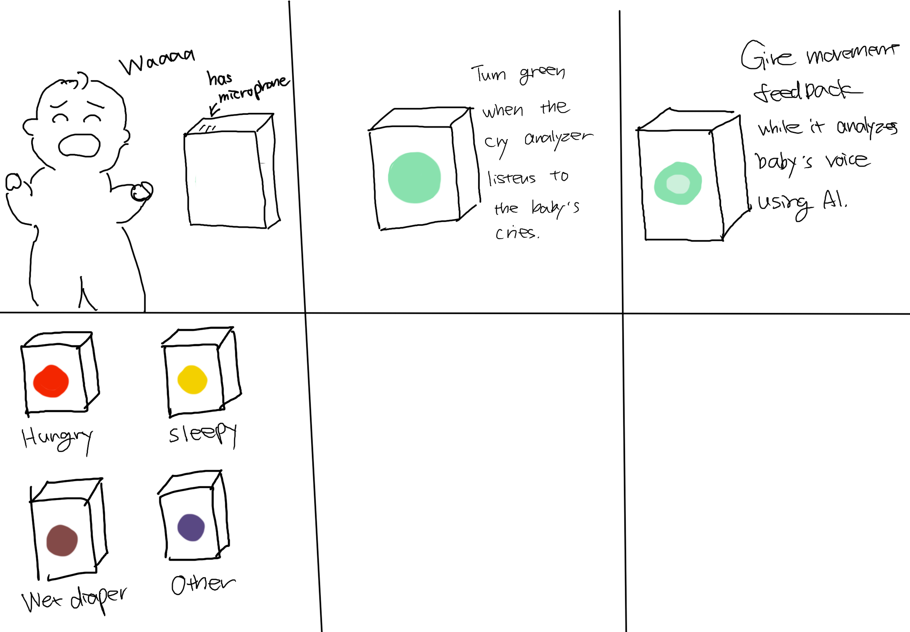

Storyboard 2: 
- wristband adding vibration as crying continues to indicate severity.

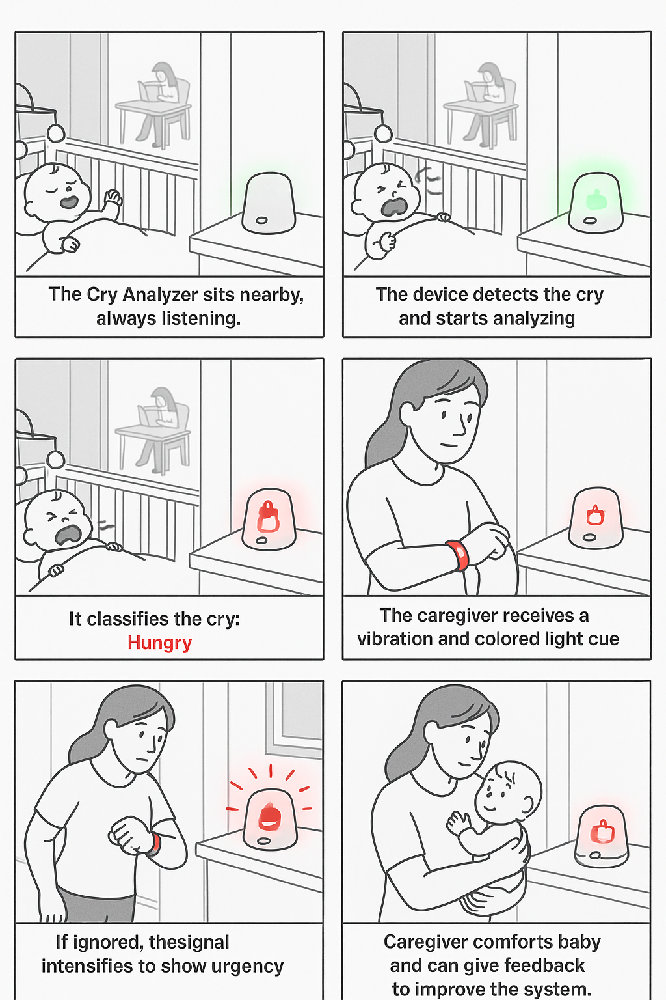

Storyboard 3:
- The caregiver has hearing impairement. She can get the vibration first for the baby crying.

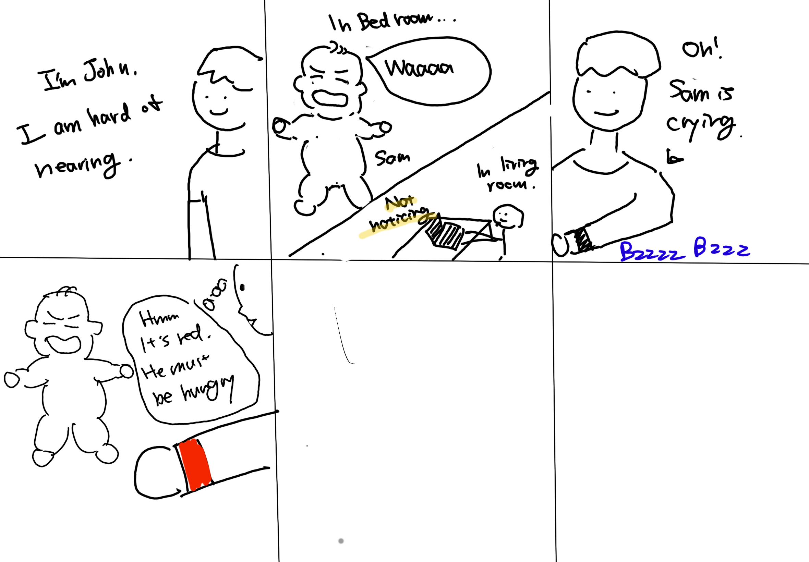

Storyboard 4:
- Nanny/caretaker is ignoring baby's needs so the alert also goes to the parent's wristband after a certain amount of time or repeated crying of the same issue back to back

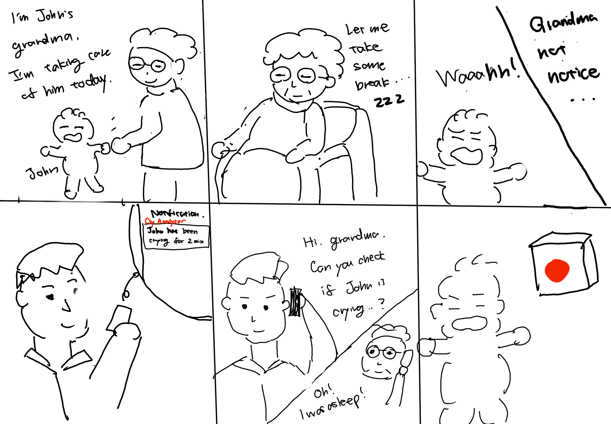

Storyboad 5: 
- Multiple-babies - now the user can see the different shapes for different baby 

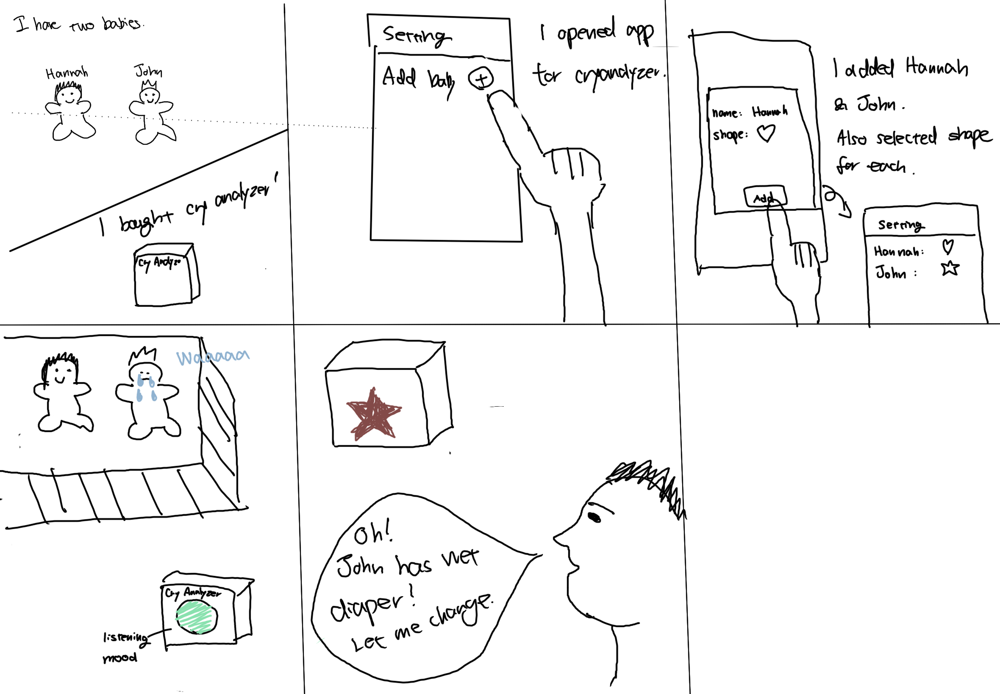

Storyboard 6:
- Baby's cry is misinterpreted by the device attributing a cry to the wrong need and the caregiver gives feedback to the device in order to recalibrate it.
<!--  -->

Storyboard 7: 
- Someone who lives somewhere loud, so the device goes off for other sounds. the user needs to recalibrate the system to only alert to baby crying vs emergency vehicles going by or loud neighbors.

<!--  -->

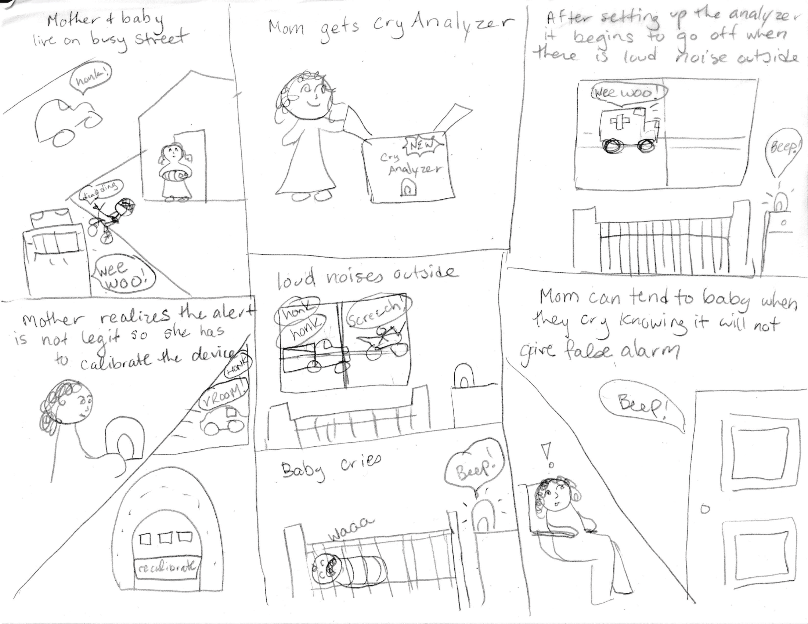
<!-- [View the PDF](storyboard_2/recalibrate-baby.pdf) -->

<!--  -->

Storyboard 8: 
- Concert goer who is hearing impaired. As the music changes rhythm and tone their wearable changes color, intensity and vibrations. This allows them to dance to the beat and participate more fully in the concert. 
<!-- 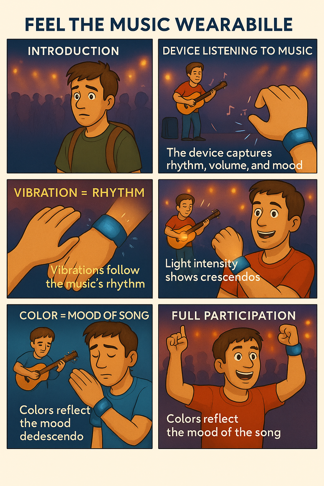 -->

Storyboard 9:
- Person is attending a jazz concert which is known for use of improvisation. The wearbale helps the user understand the added riffs and sections as the players  improvise and change the song.
    <!-- 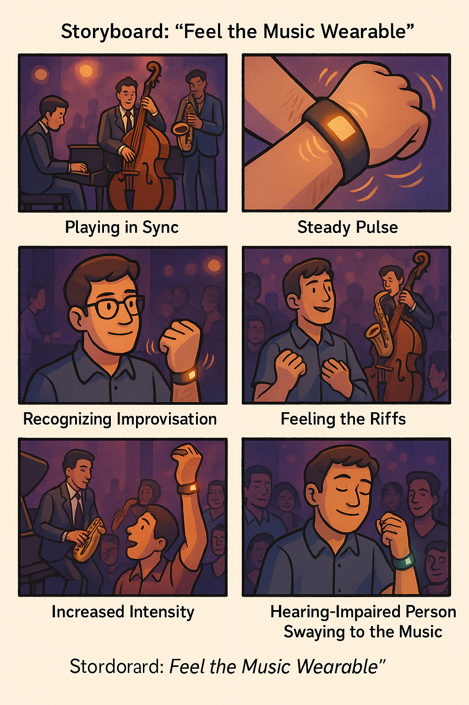 -->

\*\***Summarize feedback you got here.**\*\*

Feedback:

Cry Analyzer: 
Most of the feedback are positive. We now incorporate more variety conditions such as multile kids and incoporate accessibiliy. However, we got some questions: 

- How strong should the vibrations be? How often should they intesify if the crying does not stop?
- **What if multiple babies are crying for different reasons at once? How many babies can it listen for at once?**
- Would notifying the parents if a child does not get attended to cause conflict amongst caregivers?
    
## Part B. Act out the Interaction

\*\***Are there things that seemed better on paper than acted out?**\*\*

In the multiple-kids condition, we encountered many of the issues that others pointed out. For example, when multiple babies cry at the same time for different reasons, this creates challenges for both the lantern form and the wristband form of the cry analyzer.

We also realized that if several babies begin crying at once, caregivers can easily become overwhelmed. In such moments, they may not have the time or mental bandwidth to check the cry analyzer or recall which shape or color corresponds to which meaning.

\*\***Are there new ideas that occur to you or your collaborator that come up from the acting?**\*\*

In the multiple-kids situation, ideally, when several babies cry at once, the cry analyzer would keep listening, differentiate between each baby’s cries, analyze them, and display the reasons in one of two ways:
- Rotating View: The display cycles through each baby’s cry reason, updating every few seconds (e.g., every three seconds).
- Split View: The display is divided into sections, with each section dedicated to one child. For example, the top row could show John, the second row Smith, and the third row Bob. 

With the split view, caregivers can see all the information at once without waiting for the rotation, reducing confusion and helping them respond more quickly.

Alternatively, instead of one device for all the babies, each child could be paired with their own cry analyzer. In that case, the baby’s voice would need to be registered during setup. However, the main concern with this approach is that it would significantly increase the cost.

For accessibility we could also sync patterns of vibration to the 4 categories for those who may be color blind or visually impaired.

## Part C. Prototype the device

\*\***Give us feedback on Tinkerbelle.**\*\*

When going onto the computer http, the instructions say to use http://[yourWiFiIPv4address]:5000, however sometimes the computer controller also needs to be on 5001 for it to work. I wish the names of the buttons were clearer, Jane Wren is not obvious as to if it would be the controller or recipient of the colors.

## Part D. Wizard the device

\*\***Include your first attempts at recording the set-up video here.**\*\*

\*\***Show the follow-up work here.**\*\*

## Part E. Costume the device

\*\***Include sketches of what your devices might look like here.**\*\*
Sketch of wall hanging option. 
<!--  -->
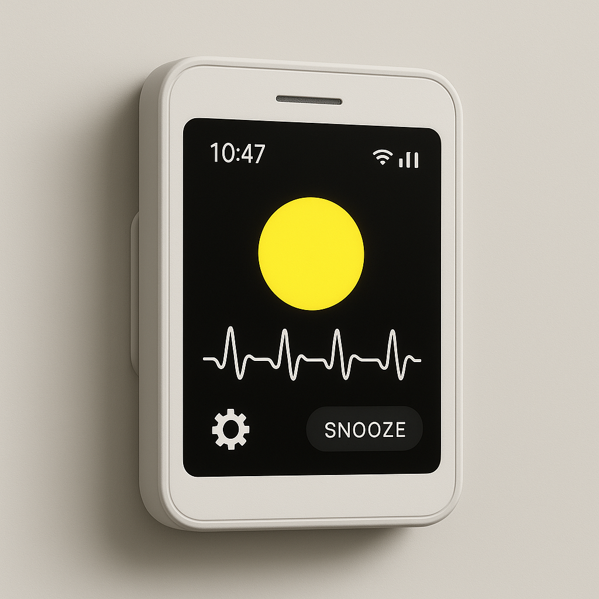

Sketch of multiple kids - different shape for each kid. 

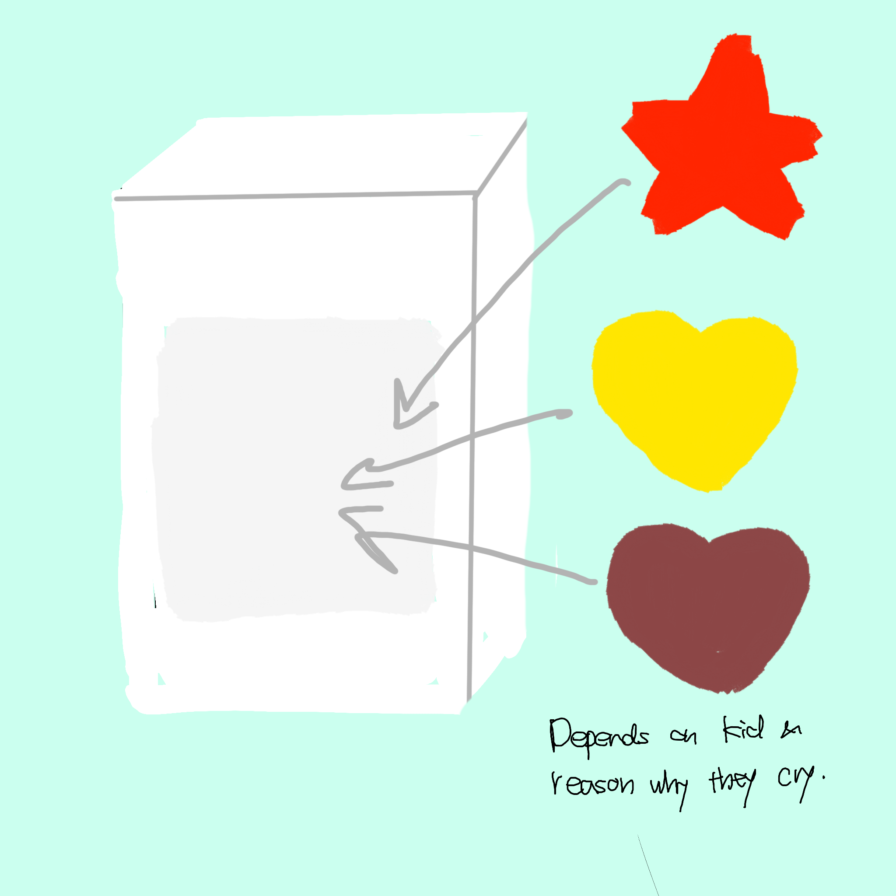

Sketch of multiple kids - split view

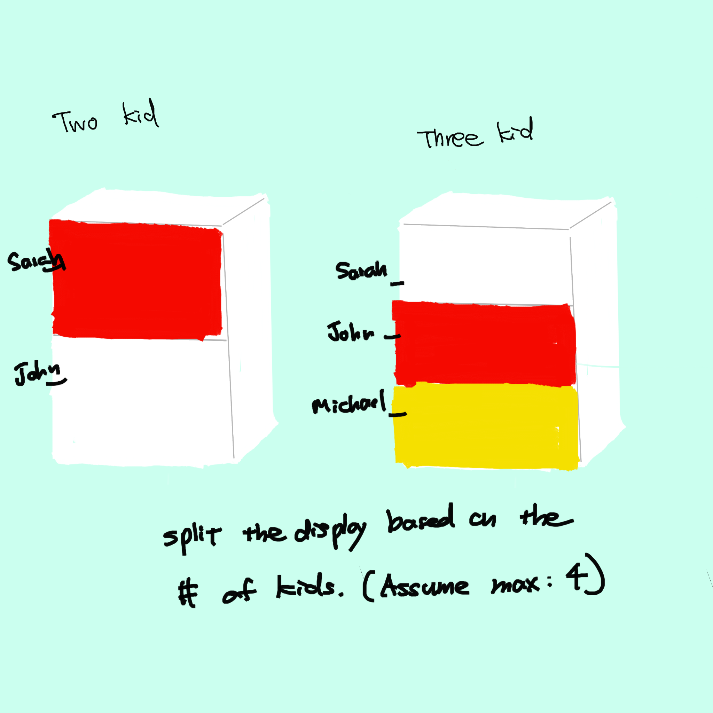

\*\***What concerns or opportunities are influencing the way you've designed the device to look?**\*\*

- A touch screen can provide feedback, snooze functionality, or recalibration of sound sensitivity.
- The multiple-kids situation is especially challenging. Our focus is on preventing parents from feeling overwhelmed by ensuring the display is:
    - Easy to see at a glance
    - Clear and differentiated between children
    - cSimple enough to reduce confusion under stress

## Part F. Record

\*\***Take a video of your prototyped interaction.**\*\*

Video of caregiver in another room getting visual and vibration alert

Video of caregiver ignoring baby's cries & parent getting alerted

Interactions-video:
- https://drive.google.com/file/d/1kNg_qinPC_SFI4WTneqEbf6UDAvUuw8e/view?usp=sharing
- https://drive.google.com/file/d/1RL4WNPt1M98K0zVZOQuKLDW64TBDG322/view?usp=drive_link

\*\***Please indicate who you collaborated with on this Lab.**\*\*

Collaborators: Nana Takada (nt388) and Lienne Bisch (lb854).
We met up and discussed the whole process of this homework, and enjoyed how our idea evolved by imagining the situation with babies. 

Utilized ChatGPT for storyboard creation: 

Prompt 1: Can you please draw a storyboard with these parameters in mind: Concert goer who is hearing impaired. As the music changes rhythm and tone their wearable changes color, intensity and vibrations. This allows them to dance to the beat and participate more fully in the concert.

Prompt 2: Can you make another storyboard 6 panels minimum with the same item but this environment: Person is attending a jazz concert which is known for use of improvisation. The wearbale helps the user understand the added riffs and sections as the players improvise and change the song.

Prompt 3: Can you create scenario for "wristband adding vibration as crying continues to indicate severity.", and can you please draw a storyboard with these parameters in mind: 

ChatGPT for prototype sketch
Prompt 1:
can you make a prototype image of something similar to a baby monitor with a touch screen that can hang on a wall and with a magnetic back or case for hands free use. The screen can show a shape lit in either yellow or red and have pulse waves shown below that in a pattern. as well as a "snooze" option and settings on a corner.