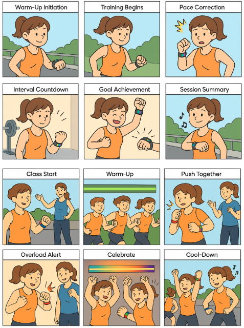
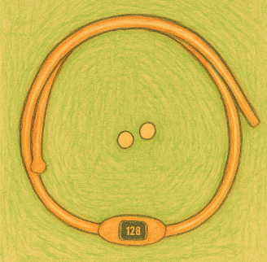
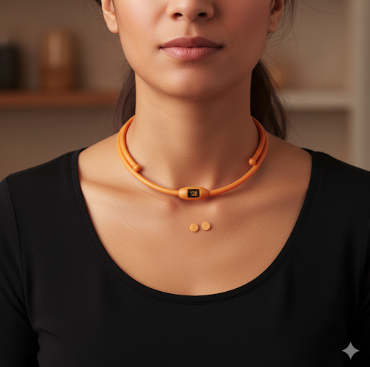

# Staging Interaction

**Kyle Li, Angela Bi, Alex Gravereaux, Leen Huang, Elaine Li**

In the original stage production of Peter Pan, Tinker Bell was represented by a darting light created by a small handheld mirror off-stage, reflecting a little circle of light from a powerful lamp. Tinkerbell communicates her presence through this light to the other characters. See more info [here](https://en.wikipedia.org/wiki/Tinker_Bell). 

There is no actor that plays Tinkerbell--her existence in the play comes from the interactions that the other characters have with her.

For lab this week, we draw on this and other inspirations from theatre to stage interactions with a device where the main mode of display/output for the interactive device you are designing is lighting. You will plot the interaction with a storyboard, and use your computer and a smartphone to experiment with what the interactions will look and feel like. 

_Make sure you read all the instructions and understand the whole of the laboratory activity before starting!_

## Prep

### To start the semester, you will need:
1. Read about Git [here](https://git-scm.com/book/en/v2/Getting-Started-What-is-Git%3F).
2. Set up your own Github "Lab Hub" repository by forking the [Interactive-Lab-Hub repository](https://github.com/FAR-Lab/Interactive-Lab-Hub). To get lab updates, simply [use GitHub's "Sync fork" button when new content is available](https://docs.github.com/en/pull-requests/collaborating-with-pull-requests/working-with-forks/syncing-a-fork).

3. Set up the README.md for your Hub repository (for instance, so that it has your name and points to your own Lab 1). You can [learn how to organize and format your README.md here](https://docs.github.com/en/get-started/writing-on-github/getting-started-with-writing-and-formatting-on-github/basic-writing-and-formatting-syntax). Make sure to include links to your submissions so they are easy to find.

### For this lab, you will need:
1. Paper
2. Markers/ Pens
3. Scissors
4. Smart Phone -- The main required feature is that the phone needs to have a browser and display a webpage.
5. Computer -- We will use your computer to host a webpage which also features controls.
6. Found objects and materials -- You will have to costume your phone so that it looks like some other devices. These materials can include doll clothes, a paper lantern, a bottle, human clothes, a pillow case, etc. Be creative!

### Deliverables for this lab are: 
1. 7 Storyboards
1. 3 Sketches/photos of costumed devices
1. Any reflections you have on the process
1. Video sketch of 3 prototyped interactions
1. Submit the items above in the lab1 folder of your class [Github page], either as links or uploaded files. Each group member should post their own copy of the work to their own Lab Hub, even if some of the work is the same from each person in the group.

### The Report
This README.md page in your own repository should be edited to include the work you have done (the deliverables mentioned above). Following the format below, you can delete everything but the headers and the sections between the **stars**. Write the answers to the questions under the starred sentences. Include any material that explains what you did in this lab hub folder, and link it in your README.md for the lab.

## Lab Overview
For this assignment, you are going to:

A) [Plan](#part-a-plan) 

B) [Act out the interaction](#part-b-act-out-the-interaction) 

C) [Prototype the device](#part-c-prototype-the-device)

D) [Wizard the device](#part-d-wizard-the-device) 

E) [Costume the device](#part-e-costume-the-device)

F) [Record the interaction](#part-f-record)

Labs are due on Mondays. Make sure this page is linked to on your main class hub page.

## Part A. Plan 

To stage an interaction with your interactive device, think about:

_Setting:_ Where is this interaction happening? (e.g., a jungle, the kitchen) When is it happening?

_Players:_ Who is involved in the interaction? Who else is there? If you reflect on the design of current day interactive devices like the Amazon Alexa, it’s clear they didn’t take into account people who had roommates, or the presence of children. Think through all the people who are in the setting.

_Activity:_ What is happening between the actors?

_Goals:_ What are the goals of each player? (e.g., jumping to a tree, opening the fridge). 

The interactive device can be anything *except* a computer, a tablet computer or a smart phone, but the main way it interacts needs to be using light.

\*\***Describe your setting, players, activity and goals here.**\*\*

**Setting**
The setting is at home, in the living room. It's anytime during the day, it could be day time when I am working.

**Players**
There is one primary player involved in the interaction who is wearing this "smart eyeguard". There could be more than one person in the living room, it could be my roommate or friends hanging out there as well.

**Activitiy**
The primary player is interacting with the "smart eyeguard" when the eyeguard detects screens in its field. The notification light changes whenever the primary player is too close to a screen.

While others without this wearable device may not directly interacting with it, they may also be participating in this activity by looking at the notification light and reminds the pimrary player of safe screen distance when the primary player is too focused on the work.

**Goal**
The goals of primary player is to be more concious of safe screen distance when working/studying/entertaining in front of screens. The focus here is to maintain better eye care/health, as well as achieving better work-life balance. The goal for secondary players is to support primary player in keeping up with their posture and screen distance.

Storyboards are a tool for visually exploring a users interaction with a device. They are a fast and cheap method to understand user flow, and iterate on a design before attempting to build on it. Take some time to read through this explanation of [storyboarding in UX design](https://www.smashingmagazine.com/2017/10/storyboarding-ux-design/). Sketch seven storyboards of the interactions you are planning. **It does not need to be perfect**, but must get across the behavior of the interactive device and the other characters in the scene. 

\*\***Include pictures of your storyboards here**\*\*

Present your ideas to the other people in your breakout room (or in small groups). You can just get feedback from one another or you can work together on the other parts of the lab.

\*\***Summarize feedback you got here.**\*\*
1. zoom in on one or two personas so that the prototype don't get too complicated too fast
2. flesh out the persona so it's not just "anybody who's working", the usecase can be applied universally but finding a persona can add more to our storyline and prototyping
3. understand accessibility, what does it mean for people with light sensitivity or color blindness to use this device, etc

## Part B. Act out the Interaction

Try physically acting out the interaction you planned. For now, you can just pretend the device is doing the things you’ve scripted for it. 

\*\***Are there things that seemed better on paper than acted out?**\*\*

\*\***Are there new ideas that occur to you or your collaborator that come up from the acting?**\*\*

## Part C. Prototype the device

You will be using your smartphone as a stand-in for the device you are prototyping. You will use the browser of your smart phone to act as a “light” and use a remote control interface to remotely change the light on that device. 

Code for the "Tinkerbelle" tool, and instructions for setting up the server and your phone are [here](https://github.com/IRL-CT/tinkerbelle).

We invented this tool for this lab! 

If you run into technical issues with this tool, you can also use a light switch, dimmer, etc. that you can can manually or remotely control.

\*\***Give us feedback on Tinkerbelle.**\*\*
For controller it should be port 5001 and not 5000. 

## Part D. Wizard the device
Take a little time to set up the wizarding set-up that allows for someone to remotely control the device while someone acts with it. Hint: You can use Zoom to record videos, and you can pin someone’s video feed if that is the scene which you want to record. 

\*\***Include your first attempts at recording the set-up video here.**\*\*

Goal: When user is working extremely close to the screen, user needs to be reminded and interrupted. This means red light will keep on unless user adjusts the pose.
[Setup Video - Prototype #1](https://youtube.com/shorts/h3eZ_ZJQwZ0?feature=share)

Now, change the goal within the same setting, and update the interaction with the paper prototype. 

\*\***Show the follow-up work here.**\*\*

Goal: When the user is looking at a screen in a non ideal distance, however not extremely dangerous, user needs to be reminded with a flash of orange light.

[Setup Video - Prototype #2](https://youtu.be/7NIxbgCaVXc)

## Part E. Costume the device

Only now should you start worrying about what the device should look like. Develop three costumes so that you can use your phone as this device.

Think about the setting of the device: is the environment a place where the device could overheat? Is water a danger? Does it need to have bright colors in an emergency setting?

\*\***Include sketches of what your devices might look like here.**\*\*

My thought on this device - it is a wearbale device. It should be: 
1. lightweight
2. somewhat waterproof
3. compatible with the prescription lenses
4. chargable or battery powered - so the frame has to be somewhat thick enough and sturdy enough to hold microelectronics

I came up with three different style of devices:

Smart Glasses type
The screen is built into the frame.

Clip on type
This type can be clipped onto a regular glass.

USB type
This type needs to be plugged into the screen/device when user is actively working.

\*\***What concerns or opportunitities are influencing the way you've designed the device to look?**\*\*

Opportunities: 
1. Some devices like iPhone already have a safe screen distance/eye care notification feature. 
2. Meta's Ray Ban glasses are smart glasses that can do much more than just lighting. This proves that these devices are definitely achievable and are somewhat tested and accepted by users.

Some concerns include: 
1. Where the light notification should be placed - this is a tricky question because if we place the light too close to the eye, we may end up harming the users. 
2. How to adjust lighting based on individual sensitivity to light? This is a tradeoff between universal application and accessibility.

## Part F. Record

\*\***Take a video of your prototyped interaction.**\*\*

1. [Interactive Prototype - Glasses](https://youtu.be/Q_AB_Nn7LpI)
2. [Interactive Prototype - Clip On](https://youtu.be/nOppyAEX1wo)
3. [Interactive Prototype - USB](https://youtu.be/ywBN6FlimgQ)

\*\***Please indicate who you collaborated with on this Lab.**\*\*
Be generous in acknowledging their contributions! And also recognizing any other influences (e.g. from YouTube, Github, Twitter) that informed your design. 

I want to acknowledge my friend Victoria who is not participating in this course. She is exposed to 10+hr of screen time during the day and has turned on the safe screen distance feature on her iPhone, which I drew the inspiration for this project from.

# Staging Interaction, Part 2 

This describes the second week's work for this lab activity.

## Prep (to be done before Lab on Wednesday)

You will be assigned three partners from other groups. Go to their github pages, view their videos, and provide them with reactions, suggestions & feedback: explain to them what you saw happening in their video. Guess the scene and the goals of the character. Ask them about anything that wasn’t clear. 

\*\***Summarize feedback from your partners here.**\*\*

The feedback from my partners are mostly positive with minor improvements on visual communication and documenting my design process. 

## Make it your own

Do last week’s assignment again, but this time: 
1) It doesn’t have to (just) use light, 
2) You can use any modality (e.g., vibration, sound) to prototype the behaviors! Again, be creative! Feel free to fork and modify the tinkerbell code! 
3) We will be grading with an emphasis on creativity. 

\*\***Document everything here. (Particularly, we would like to see the storyboard and video, although photos of the prototype are also great.)**\*\*

### My lab report: 
**I have switched teams based on interest and decided to pursue a different project idea with the new group. I have enteretained the idea of enhancing my smart glass project from lab1a but ultimately decided it was impossibile to complete since the lab1a I submitted was largely developed by myself. I have contributed independently to ideation of lab1b of this new project, which I will highlight in my submission below.**

## Part A. Plan

To stage an interaction with your interactive device, think about:

_Setting:_ Where is this interaction happening? (e.g., a jungle, the kitchen) When is it happening?

_Players:_ Who is involved in the interaction? Who else is there? If you reflect on the design of current day interactive devices like the Amazon Alexa, it’s clear they didn’t take into account people who had roommates, or the presence of children. Think through all the people who are in the setting.

_Activity:_ What is happening between the actors?

_Goals:_ What are the goals of each player? (e.g., jumping to a tree, opening the fridge). 

The interactive device can be anything *except* a computer, a tablet computer or a smart phone, but the main way it interacts needs to be using light.

\*\***Describe your setting, players, activity and goals here.**\*\*

Given our previous design, we update the device to have **2 modes**.

## Mode 1: Individual Mode
*The device is a personalized trainer mode with a guided AI plan (AI builds a plan based on history, goals, and preferences)*

**Setting:** The interaction takes place during a workout session, whether at home, in a gym/fitness studio, or any environment the user chooses.

**Players:** The primary player is the exerciser, who is the person actively training with the device. Depending on where the user is at, there could be secondary players; for example, roommates or partners who share the same living space, children who may be present and interact with the device unintentionally, or fellow gym-goers if the workout takes place in a public setting.

**Activity:** The user will begin a workout session, and the device will monitor the performance and physiological metrics, including heart rate and skin temperature. The device will also provide a countdown to inform the user about the time remaining for each exercise or rest period, while simultaneously delivering motivational feedback through vibration, sound, or a color progress bar to keep them engaged.

**Goal:** The device's primary goal is to support the user in completing workouts effectively by leveraging AI to deliver real-time guidance, track progress, improve performance, and sustain motivation through multimodal feedback.

## Mode 2: Group Mode

**Setting:** The interaction will occur in a group workout session, such as a workout class, bootcamp, or small training group, where multiple participants train simultaneously in a shared environment. This could be in a gym studio, outdoor park, or even a virtual group session.

**Players:** The players are the exercisers participating in the workout class. In group mode, the instructor can monitor the device signals to track each participant's state throughout the session.

**Activity:** Participants engage in a structured workout routine led by an instructor or guided by shared device cues. The device provides visual and auditory feedback, such as lights indicating progress, heart rate zones, or alerts when intensity drops. Lights may also signal the instructor when individuals struggle (ex: turning red if performance metrics fall below the threshold). Group features include setting shared or paired goals, competing in small teams, or earning collective achievements. Real-time stats such as heart rate, cadence, and calories burned may be displayed or shared within the group to foster motivation and accountability.

**Goal:** The device's primary goal in group mode is to enhance the social and motivational aspects of training. By providing collective progress indicators and encouraging friendly competition, it strengthens team bonding and keeps participants engaged. It also assists instructors by flagging safety or performance issues, ensuring participants stay in safe zones. Ultimately, the device aims to make workouts more interactive, collaborative, and emotionally rewarding, inspiring participants to push further while maintaining a fun, social atmosphere.

---

Storyboards are a tool for visually exploring a user's interaction with a device. They are a fast and cheap method to understand user flow, and iterate on a design before attempting to build on it. Take some time to read through this explanation of [storyboarding in UX design](https://www.smashingmagazine.com/2017/10/storyboarding-ux-design/). Sketch seven storyboards of the interactions you are planning. **It does not need to be perfect**, but must get across the behavior of the interactive device and the other characters in the scene. 

\*\***Include pictures of your storyboards here**\*\*

\*\***Summarize feedback you got here.**\*\*

## Part B. Act out the Interaction

Try physically acting out the interaction you planned. For now, you can just pretend the device is doing the things you’ve scripted for it. 

\*\***Are there things that seemed better on paper than acted out?**\*\*

#### Contributed by Le-En Huang ####

We initially ideated around a “couples” feature within the group mode. While it is an interesting offering, after acting it out, we realized this is not much different from a normal group mode. We then decided to focus solely on a group workout scenario rather than developing more around the couples workout idea
During the brainstorming stage, we discussed the possibility to use this device for groups doing workout sessions to compete with each other. The vision was to use lighting or other haptic feedback to signify the start of a mini-competition, keep score, and give rewards. However that may be deviating from the original purpose of this device and is a bit more complicated than we expected. Thus this idea was dropped.

\*\***Are there new ideas that occur to you or your collaborator that come up from the acting?**\*\*
#### Contributed by Le-En Huang ####

We realized there might be some workout/exercises that require equipment or hand movement that could interfere with a wearable device on the wrist. To deal with this issue, we explore a new idea to costume our device as a necklace or an earring.

Pros and cons of each:
#### Earrings
##### Pro
- Super agile/lightweight
- Easier to hear instructions/sound feedback in a group setting or outdoor environment
##### Con
- Not everyone has piercings
- Hard to design with comfort
- Easy to lose
- Screen size is extremely tiny for light feedback

#### Necklace
###### Pro
- Easy to put on - accessibility
- Easy to hear instructions/sound feedback in a group setting or outdoor environment
- Easy to spot a vibration/haptic feedback
- Easy to see other’s light/feedback in a group setting
###### Con
- Needs to be adjustable for fitting
- Screen may be slightly smaller than a watch solution

## Part E. Costume the device

Only now should you start worrying about what the device should look like. Develop three costumes so that you can use your phone as this device.

Think about the setting of the device: is the environment a place where the device could overheat? Is water a danger? Does it need to have bright colors in an emergency setting?

\*\***Include sketches of what your devices might look like here.**\*\*

#### Contributed by Le-En Huang ####

After evaluating the tradeoff we decided to go with a necklace as a wearable device.

(generated by ChatGPT)

\*\***What concerns or opportunities are influencing the way you've designed the device to look?**\*\*

#### Opportunities
The main opportunity we envisioned when designing the device was to enhance the overall workout experience. By prioritizing simplicity and convenience, the device allows users to set up easily and integrate the device seamlessly into their routines. In group mode, the device can also inform the instructors about each participant's status, enabling them to monitor progress and identify when someone needs additional support. Through combining visual, auditory, and haptic cues, the device can adapt individual user preferences and make the experience more engaging. We were hoping that by using multimodality, the accessibility of the device can also be improved, ensuring users with different abilities or preference can engage effectively. In addition, we took multimodality as an opportunity to motivate the users through reinforcing feedback across multiple channels.

##### Concerns
First, a major concern is data privacy and security issues. Users may raise concern about health and performance data being stored and analyzed by AI. Secondly, as the device is multimodal, some users may find the cues overwhelming or distracting. In a shared or public environment, the cues could be disruptive to others nearby. Last but not least, accessibility barriers may still arise, since not all users respond well to certain feedback modes (e.g. color-blind users with color progress bar, or users with hearing impairment). 

## Part F. Record

\*\***Take videos of your prototyped interaction.**\*\*

Scenario:
- Individual mode: [IDD_Lab1_Part2_Individual.mp4](https://drive.google.com/file/d/1K1aw3PNWgM-OJL79RjlGofNr_xIh1wm5/view?usp=sharing)
- Group mode: [IDD_Lab1_Part2_Group.mp4](https://drive.google.com/file/d/1ozwTyPeyrAnQL-ItFWSgo7sV5inEX97l/view?usp=drive_link)

\*\***Please indicate who you collaborated with on this Lab.**\*\*
Charlotte Lin (hl2575), Jessica Hsiao (dh779), Zoe Tseng (yzt2), Irene Wu(yw2785), Le-En Huang (lh764)