# Staging Interaction

\*\*Jully Li, Sirui Wang, Amy Chen\*\*

## Lab Overview
A) [Plan](#part-a-plan) 

B) [Act out the interaction](#part-b-act-out-the-interaction) 

C) [Prototype the device](#part-c-prototype-the-device)

D) [Wizard the device](#part-d-wizard-the-device) 

E) [Costume the device](#part-e-costume-the-device)

F) [Record the interaction](#part-f-record)

Labs are due on Mondays. Make sure this page is linked to on your main class hub page.

## Part A. Plan 

\*\***Describe your setting, players, activity and goals here.**\*\*

\*\***Include pictures of your storyboards here**\*\*

### Scenario 1: Illuminated clothing
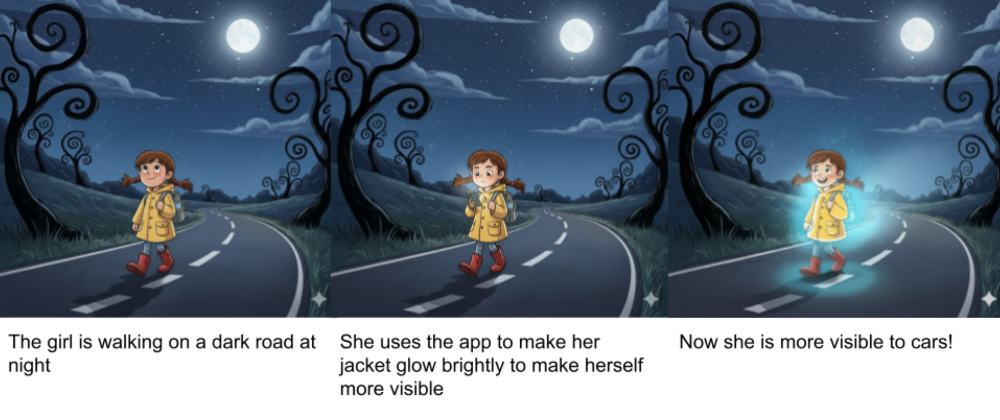
_(Images generated by Gemini 2.5 flash)_

**Setting:** The primary setting would be outdoors at night for the greatest effect. That being said the clothes should also function in different light and weather conditions where they could be worn. 

**Players:** The primary player would be the user wearing the light up clothes, with secondary players being the people around them who can see the clothes. 

**Activity:** 
1) The user finds herself in a low light environment.
2) The user then uses the app to make her jacket glow, choosing the light blue color. 
3) The user’s jacket then begins to glow. 

**Goals:** 
- <ins>Primary User ’s Goal</ins>: Make themselves more noticeable in a low-light environment.
- <ins>Surrounding Individuals’ Goal</ins>: To safely navigate the low-light environment and notice the primary user in order to safely avoid them. 

### Scenario 2: Alter bottle color
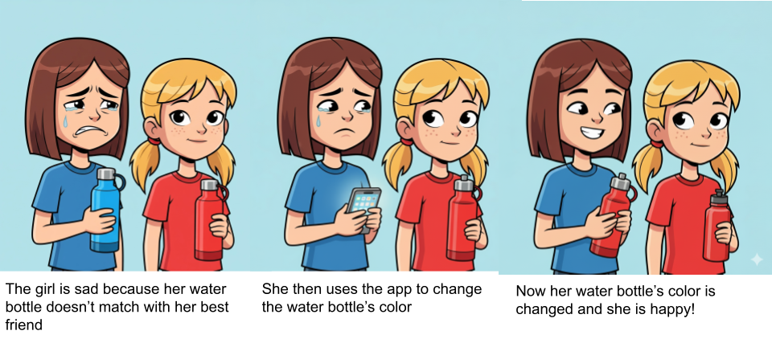
_(Images generated by Gemini 2.5 flash)_

**Setting:** The setting would be anywhere, indoor or outdoor, users take their bottles. Common settings could be: offices, sports practices, and classrooms. 

**Players:** The primary player would be the owner of the water bottle with secondary players being those around the user. It’s important to make sure that these secondary players are not bothered by the water bottle. 

**Activity:** 
1) The user notices her friend’s water bottle and wants to match. 
2) The user then uses the app to make her water bottle change colors. 
3) The user’s water bottle now matches her friend’s water bottle. 

**Goals:** 
- <ins>Primary User ’s Goal</ins>: Stay on trend and have matching water bottles with their friends. 
- <ins>Surrounding Individuals’ Goal</ins>: Remain undisturbed by the water bottle. 

### Scenario 3: The water bottle flashes to remind the users to drink water
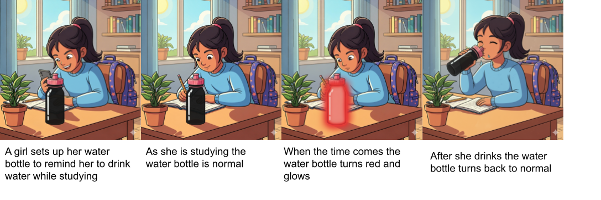
_(Images generated by Gemini 2.5 flash)_

**Setting:** The setting would be anywhere, indoor or outdoor, users take their bottles. Common settings could be: offices, classrooms, and libraries. 

**Players:** The primary player would be the owner of the water bottle with secondary players being those around the user. It’s important to make sure that these secondary players are not bothered by the water bottle flashing. 

**Activity:** 
1) The user sets up a schedule to remind her to drink water.
2) While the user is studying the water bottle stays normal and out of the way. 
3) When the time comes, the water bottle glows red, getting the user’s attention. 
4) As the user drinks, her water bottle returns its normal state. 

**Goals:** 
- <ins>Primary User ’s Goal</ins>: Get reminders to stay hydrated during long, focused periods of time. 
- <ins>Surrounding Individuals’ Goal</ins>: Remain undisturbed by the water bottle.

### Scenario 4: Detect water temperature
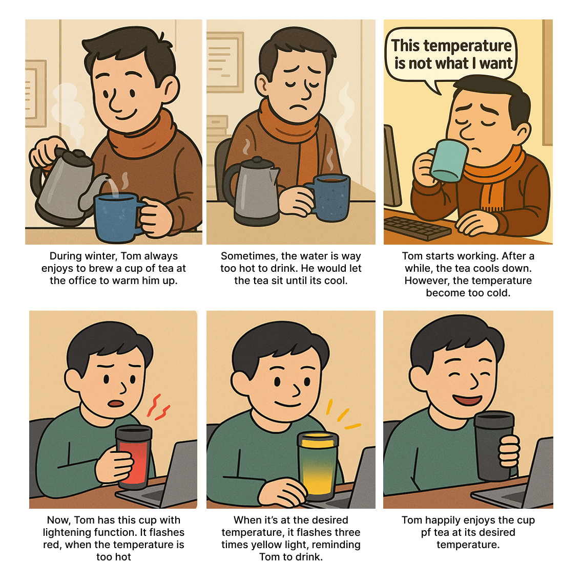
_(Images are generated by ChatGPT-5)_

**Setting:** The kitchen could be the main setting, where users complete the initial action of pouring water into the tea cup. Subsequent drinking behaviors could then take place in any setting where users carry the bottle. The interaction takes place when users monitor the water temperature to ensure it is within their desired range.

**Players:** The primary user is an individual seeking to brew tea at their preferred temperature. Given the portability of the tea cup and its potential use in diverse environments, such as offices setting in the storyboard, it is important to consider contextual factors in which nearby individuals may be affected by the device’s flashing indicator. In the storyboard, these individuals could be coworkers.

**Activity:** 
1) The primary user pours boiling water into his tea cup.
2) The tea cup flashes red to indicate the water is too hot to drink.
3) Set the tea cup aside.
4) The tea cup flashes yellow three times when the tea reaches the perfect temperature.
5) The user drinks his tea at the right warmth.

**Goals:** 
- <ins>Primary User ’s Goal</ins>: Enjoy a perfectly warm cup of tea without constant guessing or burning their mouth.
- <ins>Surrounding Individuals’ Goal</ins>: To remain undisturbed by the interaction; the bottle’s design uses silent, light-based indicators that are clear for the user yet non-intrusive for others.

### Scenario 5: Detect water contaminants
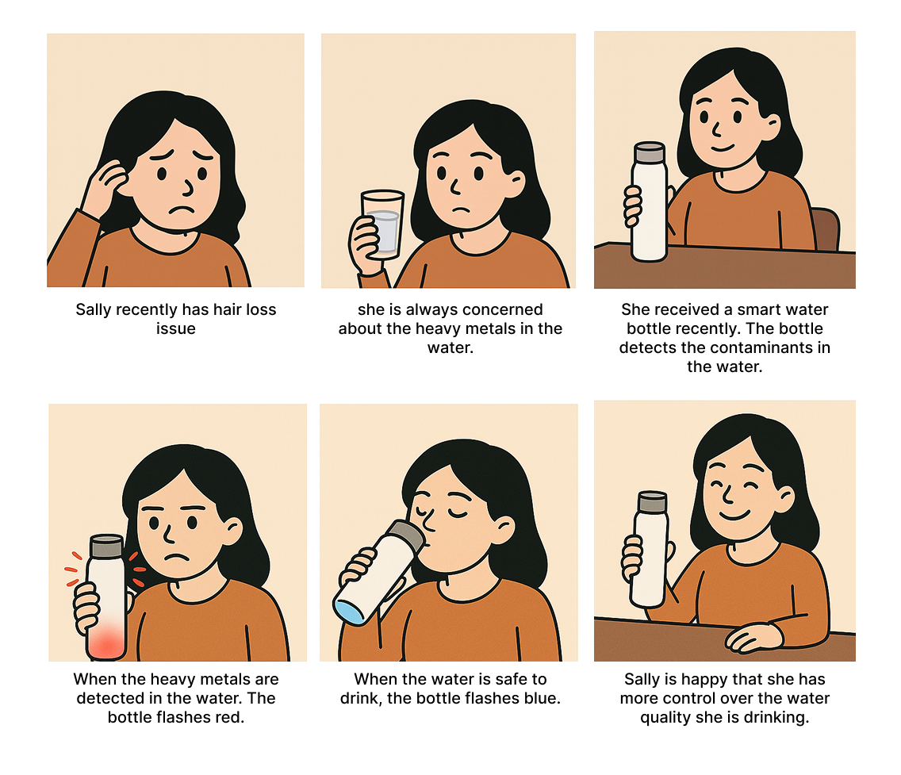
_(Images are generated by ChatGPT-5)_

**Setting:** The primary setting is the kitchen, where the user first fills the smart water bottle with tap water. The interaction continues as she moves between locations, such as their dining area or living room, while drinking throughout the day. The key interaction moments happen when the bottle’s flashing lights communicate the safety of the water.

**Players:** Primary player is an individual actively seeking control over the quality of her drinking water. Surrounding individuals could be the secondary players in the settings, such as housemates, family members, or guests may see the bottle’s flashing indicators. This creates a need for clear, universally understood signals without being overly disruptive.

**Activity:** 
1) The user fills the smart water bottle with tap water.
2) The bottle flashes red to indicate high levels of heavy metals or other contaminants.
3) The user pauses and considers alternatives (e.g., using a filter, boiled or bottled water).
4) After replacing the water with a safe source, the bottle flashes blue to indicate it’s safe to drink.
5) The user drinks confidently, reassured about the water quality.

**Goals:** 
- <ins>Primary User ’s Goal</ins>: Gain peace of mind and control over water quality, reducing anxiety around contaminants potentially linked to their health concerns.
- <ins>Surrounding Individuals’ Goal</ins>: Understand the bottle’s light signals at a glance and avoid unnecessary alarm; the system should be intuitive yet discreet.

### Scenario 6: Detect liquid type
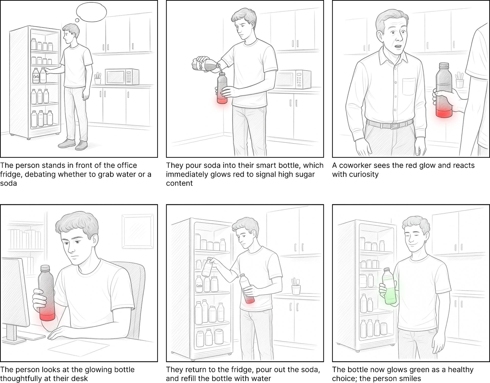
_(Images are generated by Runway Flash 2.5)_

**Setting:** This interaction takes place in everyday environments where drink choices are casually made. For instance, it could be an office breakroom during a long workday.

**Players:** The primary player is the person using the smart bottle; this could be a working adult, student, or fitness person. Secondary players include nearby people like coworkers, family members, or peers who may notice the bottle’s glowing feedback. These surrounding players can have a subtle influence on the primary user through social presence.

**Activity:** The user pours a drink into the smart bottle. Based on the nutritional quality (such as water, soda, or sugary juice) the bottle emits a corresponding light: green for healthy, red for less healthy options. The light acts as immediate, non-verbal feedback. Sometimes the bottle may flash to prompt the user to reconsider. This leads to a small moment of reflection, and possibly a choice to swap for a healthier option.

**Goals:** The user’s goal is to build awareness around what they’re drinking, make healthier choices, and reduce sugar intake.

### Scenario 7: Amount in the bottle
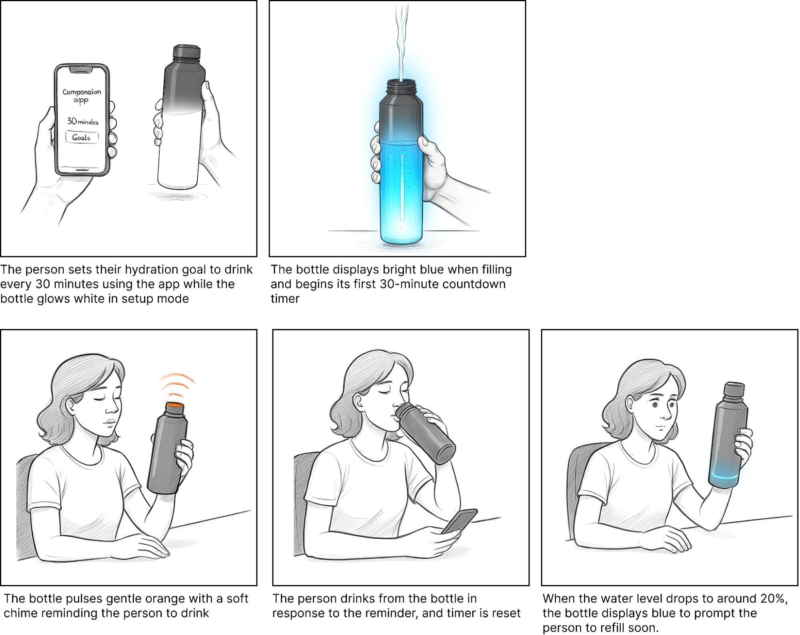
_(Images are generated by Runway Flash 2.5)_

**Setting:** This interaction occurs in everyday environments where hydration habits matter most (such as an office workspace, home desk, or gym) and consistent water intake is necessary.

**Players:** The primary player is the person using the smart hydration bottle.

**Activity:** The user sets up their hydration goals through a companion app, then uses the bottle throughout their day. The bottle actively tracks water levels and time intervals, providing gentle orange pulsing reminders when it's time to drink. When the user responds by drinking, the bottle resets its timer and updates the water level display. If reminders are ignored, the visual cues become more persistent. When water runs low, additional lights encourage refilling. This creates a continuous feedback loop that builds consistent hydration habits through positive reinforcement.

**Goals:** The user's goal is to establish regular drinking habits, maintain optimal hydration levels throughout the day.

\*\***Summarize feedback you got here.**\*\*

**Scenario 1:** “This design greatly contributes to creating a safer driving environment in low-light conditions, and it reminds me of the reflective safety vests typically worn by firefighters..” 

**Scenario 2:** “Need to think about the energy use and how to keep the bottle lit all the time.”

**Scenario 3:** “Great Idea! Probably need to think about how users can set up/customize the reminder.” 

**Scenario 4:** “I like that it shows the problem and directly shows how the product solves it! “

**Scenario 5:** “Very clear indications and very realistic scenario!”

**Scenario 6:**
- “It’s nice how you took into consideration how coworkers may react to the water bottle.”
- “What if users don’t pour the soda into a cup? A lot of people just drink straight from the can…” 

**Scenario 7:**
- “The bright blue filling looks really nice and I like the design with the soft orange. “
- “This has the same idea as Scenario 3. Maybe, we can combine these two together.”

## Part B. Act out the Interaction

Out of all the storyboards, we selected Scenario 4 (Temperature Detection), Scenario 6 (Liquid Type Detection), and Scenario 7 (Volume Detection) to act out and prototype.

\*\***Are there things that seemed better on paper than acted out?**\*\*

\*\***Are there new ideas that occur to you or your collaborator that come up from the acting?**\*\*

**Device #1: Temperature detection**

When we acted out Scenario 4 (detecting temperature), we assumed users would wait nearby for the signal, but acting it out revealed that users naturally walk away and return later, so the feedback needs to be persistent. Instead of single flashing out, a slow “cooling animation” (e.g., slow color transition from red to blue) could help users feel progress and trust the system

**Device #2: Amount in the bottle**

When we acted out Scenario 7 (amount in bottle), we assumed the soft chime would be needed to properly alert the user. However, we realized that the flashing orange should be sufficient. Similarly, we realized that the entire bottle glowing to visualize the water level in the bottle was slightly overkill. Instead the new transition from blue to white would be sufficient and allow us to consolidate the glowing portion of the bottle to a smaller area. 

**Device #3: Type of liquid**

As we acted out Scenario 6 (type of liquid), as we acted it out we realized that there was no need for the glowing indication to be persistent. The initial glowing red or green would be enough to alert the user and have them think twice about their drink choice. Continued glowing after this initial choice may irritate the user or cause them to draw additional unnecessary attention, leading to us to cause the glowing to eventually fade off. 

## Part C. Prototype the device

\*\***Give us feedback on Tinkerbelle.**\*\*

- A small delay between the laptop and phone, but others all work well!

## Part D. Wizard the device
Take a little time to set up the wizarding set-up that allows for someone to remotely control the device while someone acts with it. Hint: You can use Zoom to record videos, and you can pin someone’s video feed if that is the scene which you want to record. 

\*\***Include your first attempts at recording the set-up video here.**\*\*

This was our first attempt at setting up Tinkerbelle in class: https://youtu.be/k2fl0RyPIjQ

\*\***Show the follow-up work here.**\*\*

Setup Tinkerbelle on Apple Watch SE for smaller Display
- Send the URL link via SNS: 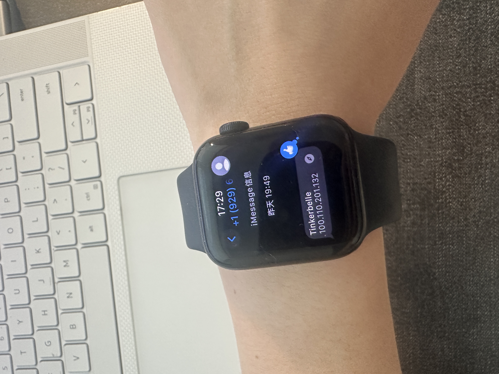
- Open in the browser: 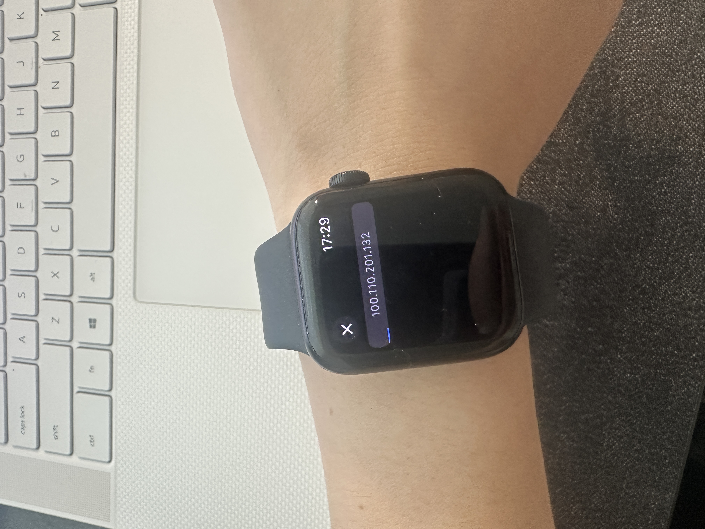

Finding ways to wizard under constume

## Part E. Costume the device

\*\***Include sketches of what your devices might look like here.**\*\*

**Device 1: Temperature detection Bottle**
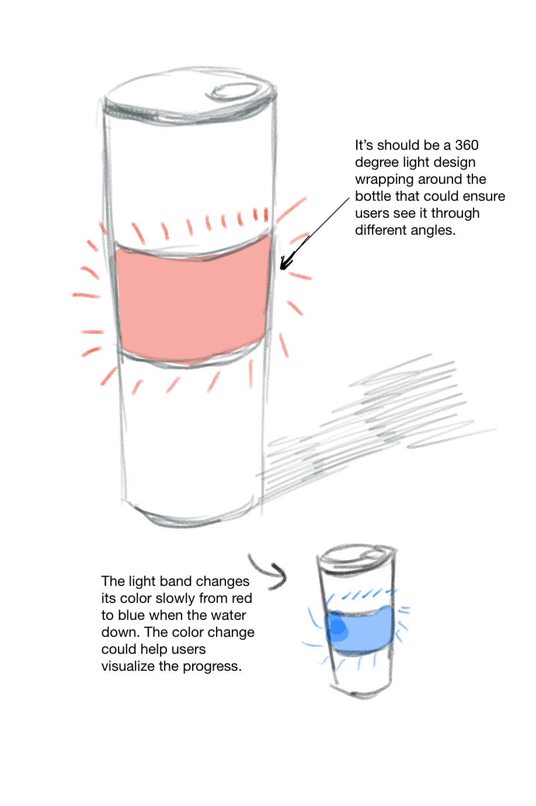

**Device 2: Amount Detection Bottle**
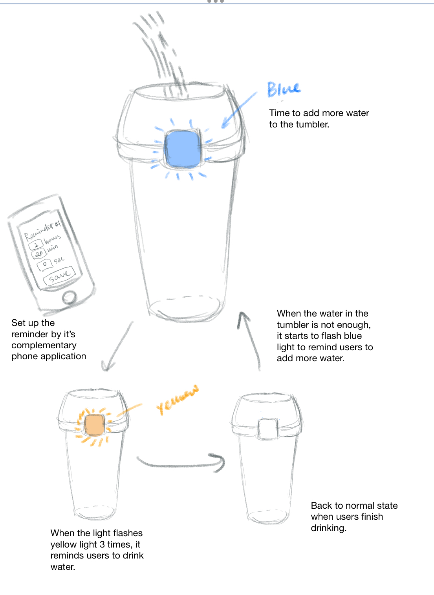

**Device 3: Bottle detects type of liquid**
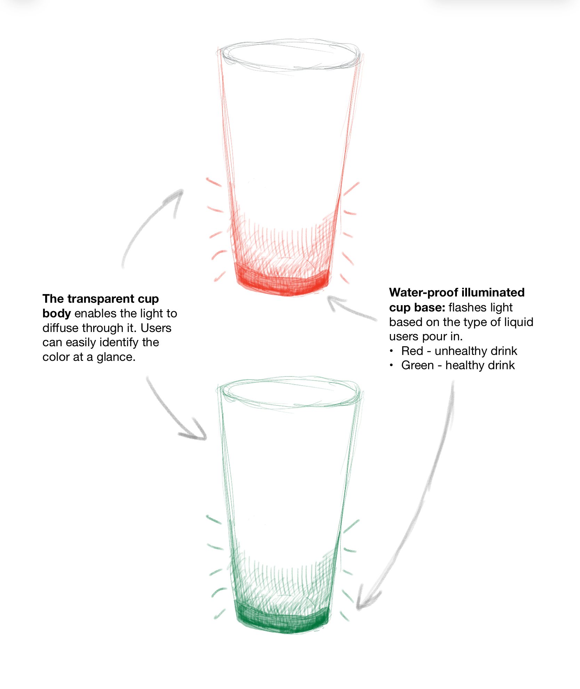

\*\***What concerns or opportunitities are influencing the way you've designed the device to look?**\*\*

**Device #1: Tea cup detects temperature**

Because the cup interacts with boiling water, clear and intuitive visual cues are essential. We chose a bold, easily distinguishable color palette (red for “too hot,” green/blue for “safe”) to ensure users can quickly gauge temperature, even at a glance.
At the same time, we saw an opportunity to make the light cues work passively, so users don’t have to hover nearby. This informed choices like persistent indicators and potential sound/phone notifications
In addition, we need to consider safety concerns such as potential water spills near the light source. To prevent damage, the lighting component should be fully waterproof.

**Device #2: Amount in the bottle**

For non-intrusive notifications, we consolidated the glowing part of the water bottle to a small square near the top of the bottle, allowing the water bottle to be used in public places such as libraries, classrooms, and offices. 
A simple color palette of white, blue, and orange is used so users can easily recognize and respond to the signals. In addition orange is easily connected to alerts and warnings, catching users’ attention to the fact they should take a drink. 
As it is a water bottle, the lighting component should be water proof. The glowing part should be scratch and shatter resistant as water bottles often get manhandled and dropped. 

**Device #3: Type of liquid**

We chose simple, intuitive colors for healthy and unhealthy liquids. Red is used for unhealthy liquids indicating that the user may want to pause and think about their drink choice. Green is used for healthy liquids allowing users to go ahead and be confident in their drink choice. 
We make a large portion of the water bottle light up to better facilitate a social element to the notifications that may push the user or those around them to make a different drink choice. 
The lighting component should be fully waterproof. By putting it in the bottom, it allows us to better protect and seal the lighting component from damage. 

## Part F. Record

\*\***Take a video of your prototyped interaction.**\*\*

**Device 1:** https://youtube.com/shorts/qB83ggXfV4w?feature=share

**Device 2:** https://youtube.com/shorts/ElU2wwy-GhY?feature=share

**Device 3:** https://youtube.com/shorts/VocA4ZCp-8Q?feature=share

\*\***Please indicate who you collaborated with on this Lab.**\*\*

Our whole group brainstormed together to create all the storyboards. I made all the sketches based on our ideas afterwards.
For the setup, wizard, and prototyping phases, Sirui and I filmed the videos, and Amy
narrated them. This was truly a collaborative effort from everyone on the team!

# Staging Interaction, Part 2 

This describes the second week's work for this lab activity.

## Prep (to be done before Lab on Wednesday)

You will be assigned three partners from other groups. Go to their github pages, view their videos, and provide them with reactions, suggestions & feedback: explain to them what you saw happening in their video. Guess the scene and the goals of the character. Ask them about anything that wasn’t clear. 

\*\***Summarize feedback from your partners here.**\*\*

**Exploration of design space/Novelty of Concept:** These ideas are useful for people's health. For example, in scenario 3, the device would notify people to drink water, which is useful for people who are very busy on their work. Apart from that, they also came up with ideas that the device can detect the water temperature, which can prevent people from getting scalded. These ideas are creative and useful for ppl.

**Technical execution:** Good technical execution! If it can perform more scenario, it would be better, such as changing to other colors.

**Communication of idea/documentation of process:** The document conveyed clear ideas and prototypes, and it is easy to read and understand. Good job! 

Really liked the idea of changing color for bottles containing water with hard metals or salts. Definitely could be useful in a place like NYC :)

**Tested with user:** They provided a lot of feedbacks from other students. Also, they reflected their ideas and elaborated their opportunities and concerns very well.

## Make it your own
\*\***Document everything here. (Particularly, we would like to see the storyboard and video, although photos of the prototype are also great.)**\*\*

### Design Exploration

After Part 1 and gathering feedback from other groups, we wanted to expand and contextualize the scenarios where the bottle would be most useful. Fitness stood out as a natural setting, since people often carry and use water bottles during workouts. We further narrowed down and chose **yoga** as a key scenario, framing the question:  

> **How might we integrate the bottle into the yoga and meditation routine to enhance the user experience?**

From this, we developed the idea of a **smart mat × bottle combination**, where the bottle could be embedded directly into the yoga mat.  

#### Settings  
The initial setting can be anywhere the user carries the bottle. The bottle reminds the user to begin their yoga routine, leading to the next interaction in a home or fitness center practice area, during the user’s regular yoga and meditation sessions. It could take place both in moments of quiet focus and in situations where external interruptions (like phone timers or workout ads) might normally break the flow.  

#### Players  
- **Primary Player:** The individual who needs to be reminded to practice yoga and meditation, seeking focus and relaxation.  
- **Secondary Players (not directly involved):** Potential bystanders such as housemates, family members, or fellow gym members who may notice the mat’s glowing light.  

#### Activity  
The user is reminded to start their workout session when the bottle begins to glow. They carry the bottle, unroll the smart yoga mat, insert the bottle into the mat, and play music and guidance. The mat glows softly in tune with the rhythm and mood, provides gentle instructional prompts, and ends the session with a calm countdown sound, followed by a soft vibration, allowing the user to remain fully immersed in their flow.  

#### Goal  
- To be reminded of their workout routine.  
- To achieve uninterrupted focus and flow during yoga and meditation, enhancing both physical practice and mental relaxation.  
- To create a supportive, calming, and intuitive environment that reduces reliance on disruptive external devices.  

We then brainstormed **three scenarios** that extended the bottle’s original lighting function while adding **vibration** and **sound** features to enrich the interaction.  

### Storyboards
#### Scenario 1: Remind people of their daily fitness routine  

  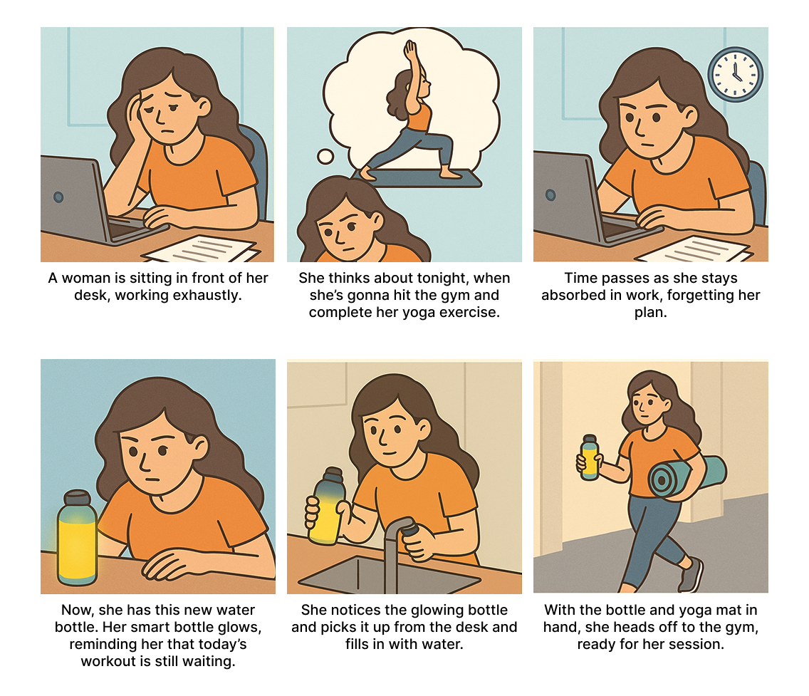

  

(Generated by ChatGPT-5)

#### Scenario 2: Glow with the music rhythm  

  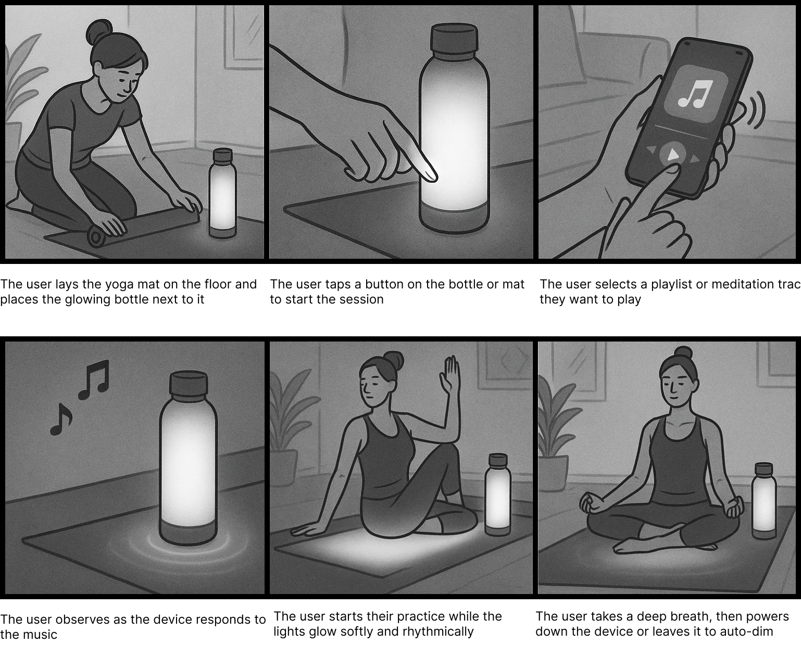

  

(Generated by ChatGPT-5)

#### Scenario 3: Count down with vibration to end the yoga session  

  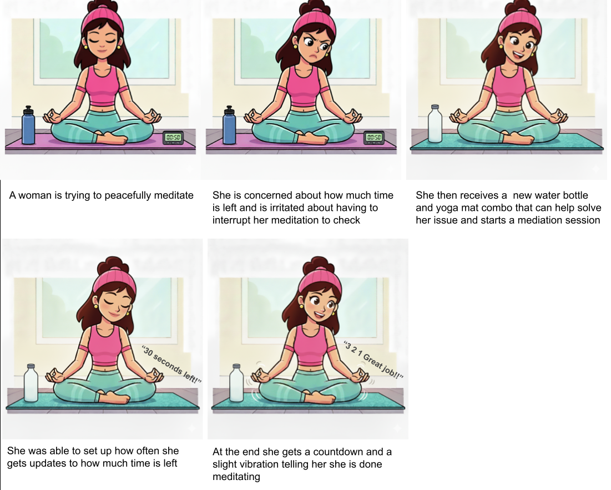

  

(Generated by Gemini 2.5 flash)

### Wizard the device

We modified the Tinkerbelle code to realize the audio-reactive feature. We used Web Audio API to perform real-time frequency analysis and map to the background color. For technical implementation, we reference this project https://github.com/hvianna/audioMotion-analyzer and the Web Audio API documentation.

Here is our revised code (replaced with the original index.html file): https://github.com/siruiii/Interactive-Lab-Hub/blob/Fall2025/Lab%201/index.html

We tested our code with the song **"Like Jennie" -- Jennie Kim**. See Video: [https://youtube.com/shorts/QXdqfbwx3e8?feature=share](https://youtube.com/shorts/OwFWqQ4Drp0)

### Costume the device

**Bottle Costume**

  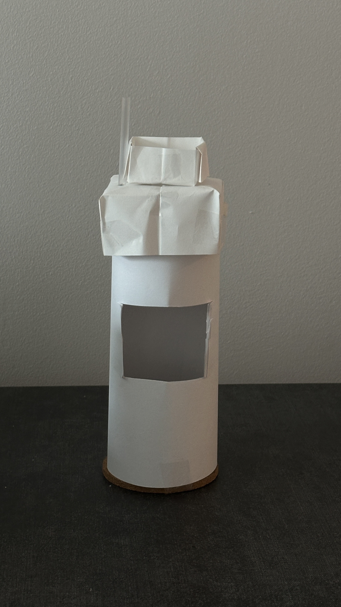
  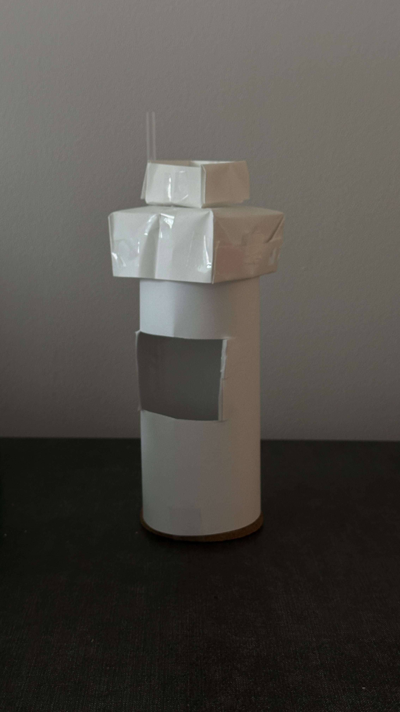

Here is our sketch of the **Smart Mat x Bottle**

  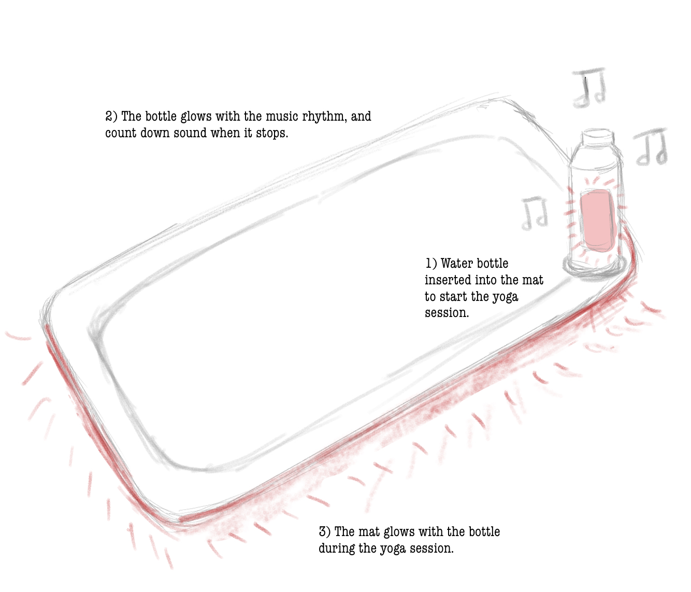

  

In the first part of the lab, we focused on the **water bottle** itself. Since bottles are objects users already carry everywhere, we kept its form familiar with only subtle enhancements. A **glowing light ring** was chosen as the main signal, which should be ambient and noticeable without being disruptive.  

When considering workout contexts, **yoga** stood out for its emphasis on focus and uninterrupted flow. This inspired us to explore how the bottle could interact with the yoga environment, which evolved into the idea of **embedding it into a yoga mat**.  

We then refined the mat to act as an **active interface**:  
- Glowing in tune with music 🎶  
- Providing gentle vibration prompts ✨  
- Concluding each session with a calm countdown sound from the bottle ⏱️  

### Record -- Videos of Prototyped Interaction
Prototyped interaction of the Smart Mat × Bottle:
https://youtu.be/y5ejHxZTvZc
- Actress: Jully Li
- Director: Sirui Wang
- Narrative: Amy Chen
  
This whole lab was a true team effort in bringing everything together!
