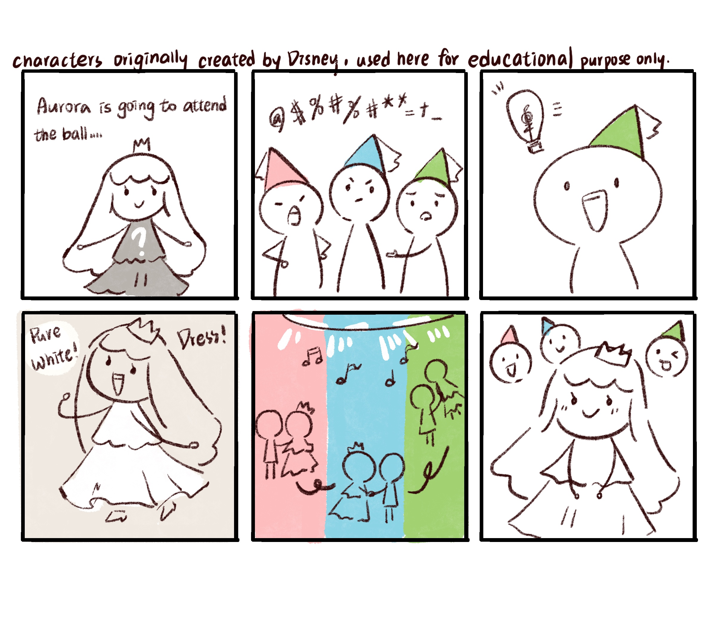
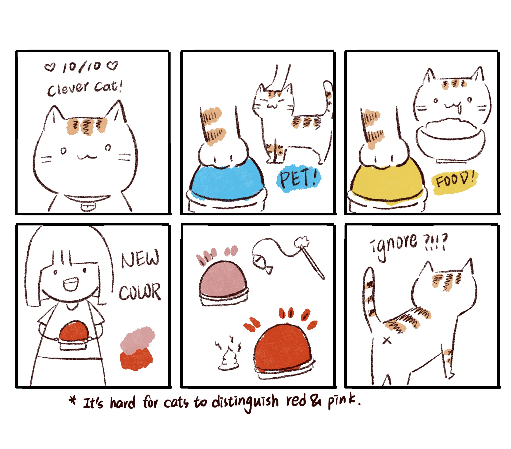
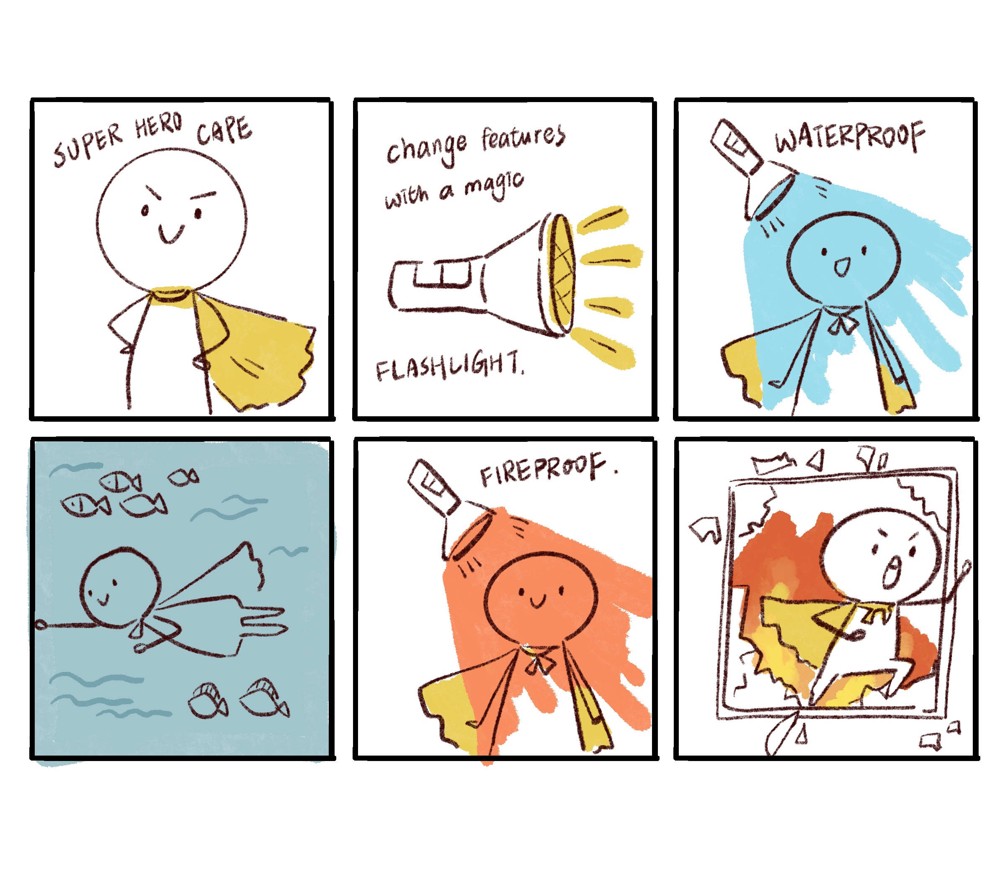
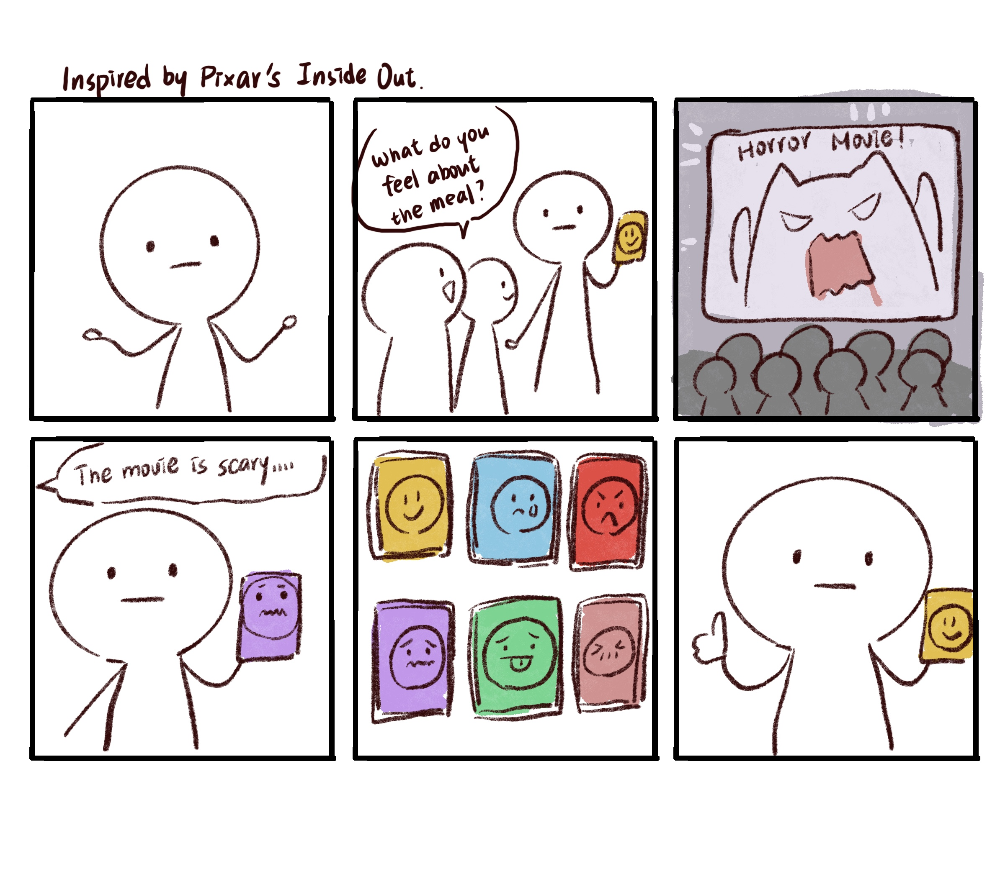
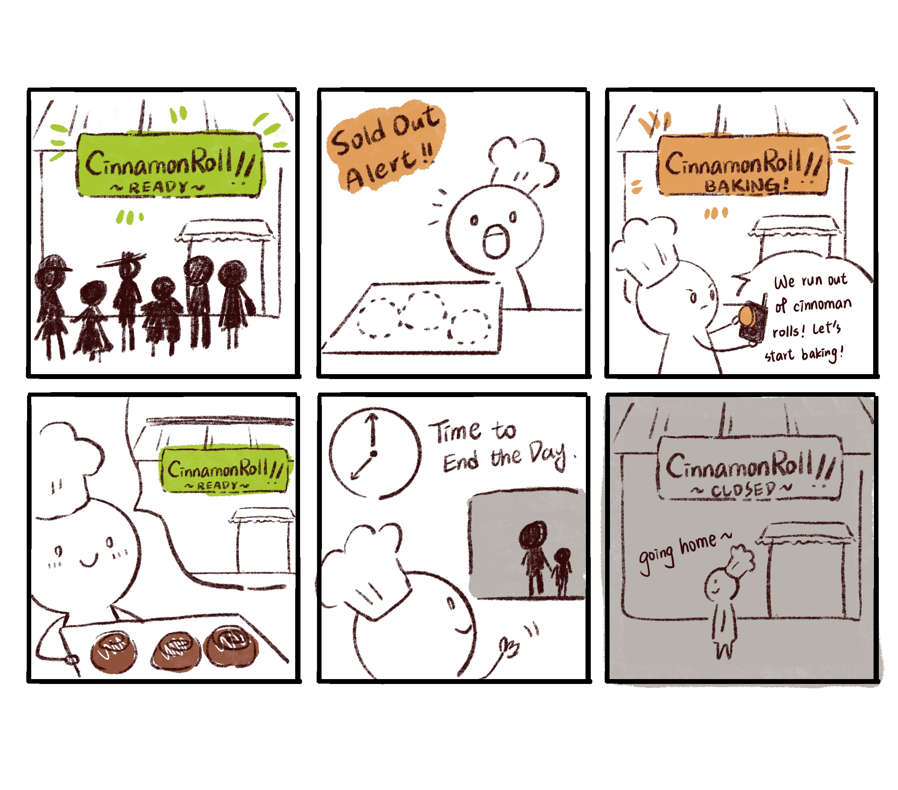
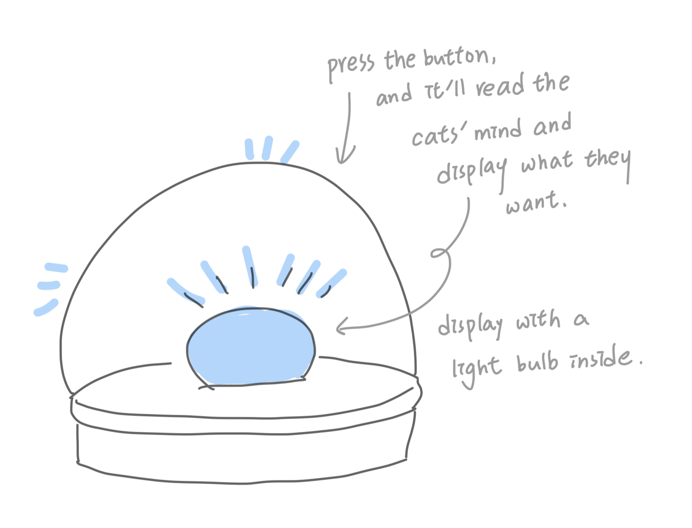
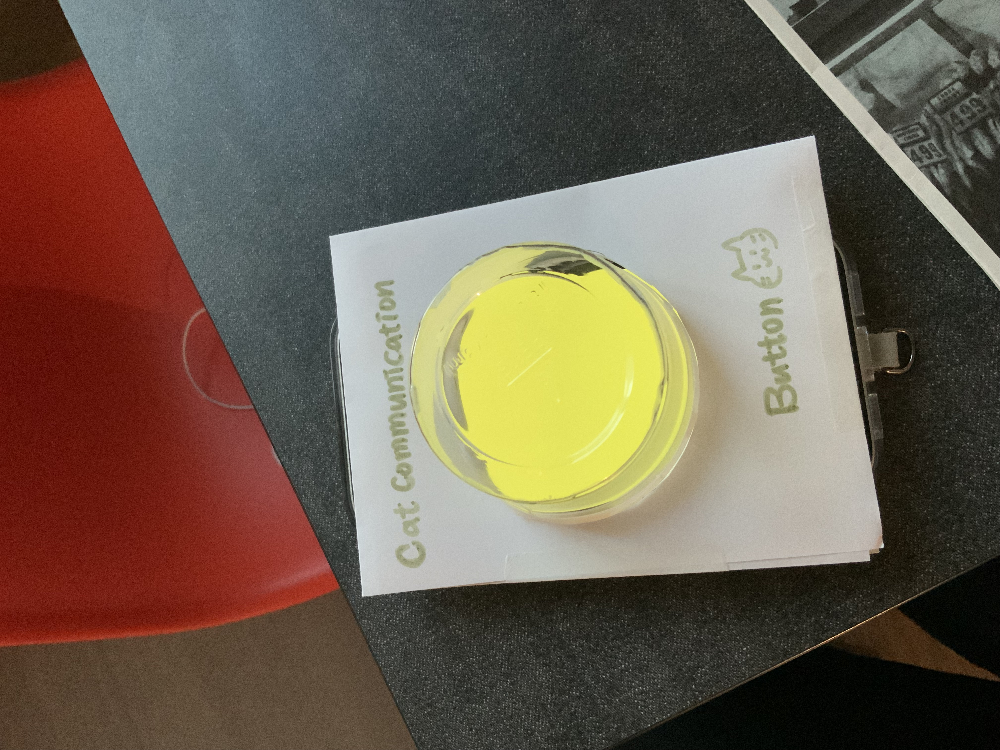
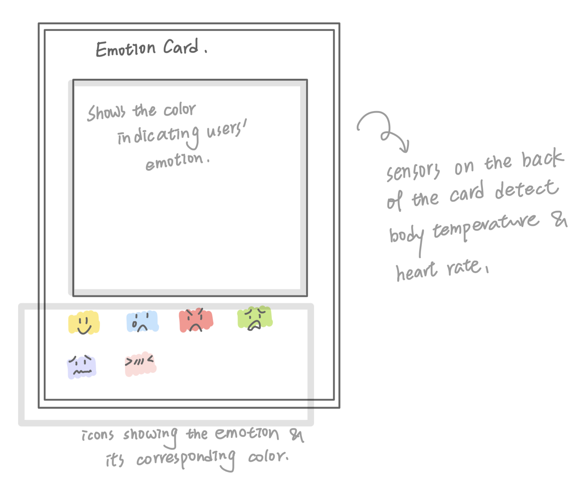
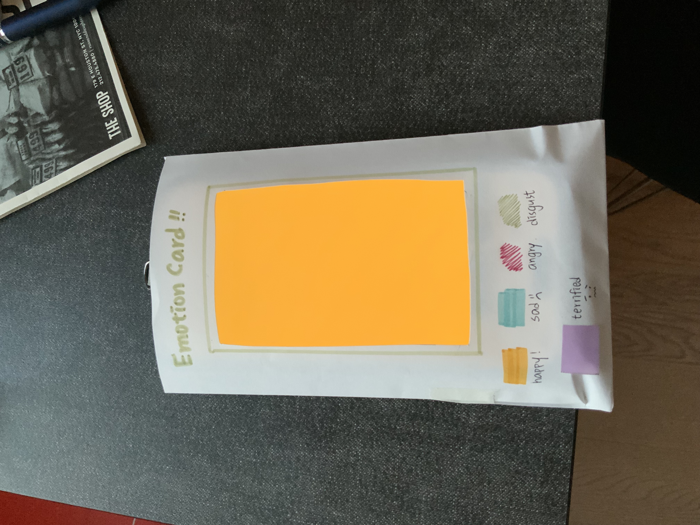

# Staging Interaction

\*\***COLLABORATOR: [Amanda Lu](https://github.com/amandazlu/Interactive-Lab-Hub/blob/Fall2025/Lab%201/README.md), [Miriam Alex](https://github.com/miriam-alex/Interactive-Lab-Hub/tree/Fall2025/Lab%201), [Shreya Kethi Reddy](https://github.com/littleredpolkadot/Interactive-Lab-Hub/tree/Fall2025/Lab%201), Ying Yu Chen (Me)**\*\*
```!
We spread our ideas across everyone’s repositories, so don't forget to check them out :)
```
<details>
<summary>Click to toggle contents of Lab1 Description</summary>
    
# Staging Interaction

In the original stage production of Peter Pan, Tinker Bell was represented by a darting light created by a small handheld mirror off-stage, reflecting a little circle of light from a powerful lamp. Tinkerbell communicates her presence through this light to the other characters. See more info [here](https://en.wikipedia.org/wiki/Tinker_Bell). 

There is no actor that plays Tinkerbell--her existence in the play comes from the interactions that the other characters have with her.

For lab this week, we draw on this and other inspirations from theatre to stage interactions with a device where the main mode of display/output for the interactive device you are designing is lighting. You will plot the interaction with a storyboard, and use your computer and a smartphone to experiment with what the interactions will look and feel like. 

_Make sure you read all the instructions and understand the whole of the laboratory activity before starting!_
    
## Prep

### To start the semester, you will need:
1. Read about Git [here](https://git-scm.com/book/en/v2/Getting-Started-What-is-Git%3F).
2. Set up your own Github "Lab Hub" repository by forking the [Interactive-Lab-Hub repository](https://github.com/FAR-Lab/Interactive-Lab-Hub). To get lab updates, simply [use GitHub's "Sync fork" button when new content is available](https://docs.github.com/en/pull-requests/collaborating-with-pull-requests/working-with-forks/syncing-a-fork).

3. Set up the README.md for your Hub repository (for instance, so that it has your name and points to your own Lab 1). You can [learn how to organize and format your README.md here](https://docs.github.com/en/get-started/writing-on-github/getting-started-with-writing-and-formatting-on-github/basic-writing-and-formatting-syntax). Make sure to include links to your submissions so they are easy to find.
    

### For this lab, you will need:
1. Paper
2. Markers/ Pens
3. Scissors
4. Smart Phone -- The main required feature is that the phone needs to have a browser and display a webpage.
5. Computer -- We will use your computer to host a webpage which also features controls.
6. Found objects and materials -- You will have to costume your phone so that it looks like some other devices. These materials can include doll clothes, a paper lantern, a bottle, human clothes, a pillow case, etc. Be creative!

### Deliverables for this lab are: 
1. 7 Storyboards
1. 3 Sketches/photos of costumed devices
1. Any reflections you have on the process
1. Video sketch of 3 prototyped interactions
1. Submit the items above in the lab1 folder of your class [Github page], either as links or uploaded files. Each group member should post their own copy of the work to their own Lab Hub, even if some of the work is the same from each person in the group.

### The Report
This README.md page in your own repository should be edited to include the work you have done (the deliverables mentioned above). Following the format below, you can delete everything but the headers and the sections between the **stars**. Write the answers to the questions under the starred sentences. Include any material that explains what you did in this lab hub folder, and link it in your README.md for the lab.
    
</details>


## Lab Overview
For this assignment, we are going to:

A) [Plan](#part-a-plan) 

B) [Act out the interaction](#part-b-act-out-the-interaction) 

C) [Prototype the device](#part-c-prototype-the-device)

D) [Wizard the device](#part-d-wizard-the-device) 

E) [Costume the device](#part-e-costume-the-device)

F) [Record the interaction](#part-f-record)

Labs are due on Mondays (Sep 1st, 2025).

## Part A. Plan 
<details>
<summary>Click to toggle contents of `Instructions for Part A`</summary>

#### Setting, Players, Activity and Goals
To stage an interaction with your interactive device, think about:

_Setting:_ Where is this interaction happening? (e.g., a jungle, the kitchen) When is it happening?

_Players:_ Who is involved in the interaction? Who else is there? If you reflect on the design of current day interactive devices like the Amazon Alexa, it’s clear they didn’t take into account people who had roommates, or the presence of children. Think through all the people who are in the setting.

_Activity:_ What is happening between the actors?

_Goals:_ What are the goals of each player? (e.g., jumping to a tree, opening the fridge). 

The interactive device can be anything *except* a computer, a tablet computer or a smart phone, but the main way it interacts needs to be using light.

#### Storyboards
Storyboards are a tool for visually exploring a users interaction with a device. They are a fast and cheap method to understand user flow, and iterate on a design before attempting to build on it. Take some time to read through this explanation of [storyboarding in UX design](https://www.smashingmagazine.com/2017/10/storyboarding-ux-design/). Sketch seven storyboards of the interactions you are planning. **It does not need to be perfect**, but must get across the behavior of the interactive device and the other characters in the scene. 

#### Feedback
Present your ideas to the other people in your breakout room (or in small groups). You can just get feedback from one another or you can work together on the other parts of the lab.
    
</details>


\*\***Describe your setting, players, activity and goals here.**\*\*


 
### Devive #1: RhythmDiscoball
**Setting:**
A dance party or social gathering where lighting plays a key role in boosting the mood.

**Players:**
Dancers, spectators, DJ / music controller

**Activity:**
As the music plays and dancers move, RhythmDiscoball shifts its light colors and patterns to match the atmosphere.

**Goals:**
* **Dancers:** Allow their movements to influence and amplify the surrounding atmosphere.
* **Spectators:** Enhance their audio-visual experience by immersing them in vibrant, responsive colors.
* **DJ / Music Controller:** Amaze the crowd by having the music visualized through dynamic lighting.


### Device #2: CatCommunicationButton
**Setting:**
Inside a household shared by cats and humans. The device becomes useful whenever humans try to understand their pets’ needs.

**Players:**
Humans and cats living in the house

**Activity:**
Humans can set specific colors to represent different cat needs, such as food, play, or going outside. When cats press the button, it detects what they want and lights up in the corresponding color to show their request. Similarly, humans can press the button to display a color, signaling their intention to the cats (as long as the cats can recognize the color.

**Goals:**
* **Humans:** Understand what their cats want and respond.
* **Cats:** Command their humans to take action and fulfill their needs.
### Device #3: AdaptFlashlight
**Setting:**
Anywhere people may want to adapt their clothes to the environment, such as making them waterproof at the beach or fire-resistant during an emergency.

**Players:**
Users who operate the flashlight and people whose clothes are illuminated by the flashlight

**Activity:**
By shining the AdaptFlashlight on clothing, users can instantly alter its properties—for example, turning ordinary fabric into waterproof or fireproof material.

**Goals:**
* **Humans:** Adapt their clothing to different situations without needing to bring extra outfits.
### Device #4: EmotionCard
**Setting:**
Used anytime and anywhere when someone wants to express their feelings but finds it difficult to do so.

**Players:**
The person carrying the card, their friends/ family, and anyone who sees the card

**Activity:**
The EmotionCard detects signals such as body temperature and pulse, then visualizes the user’s current emotional state through colors or light patterns on the card.

**Goals:**
* **The person carrying the card:** Gain awareness and understanding of their current emotions.
* **Whoever sees the card:** Understand the user’s emotional state and respond appropriately.
### Device #5: GlowBoard
**Setting:**
A shop (mainly those that require preparation in between, such as bakeries).

**Players:**
Shop owner, customers (inside or outside the shop), pedestrians (passersby), delivery workers

**Activity:** The shop owner communicates the current supply status to customers through the GlowBoard. When customers wish to make a purchase, they can easily check the GlowBoard to see whether the items are available.

**Goals:**
* **Shop owner:** Ensure smooth operation by managing supply and demand, preparing products in time, and keeping customers informed.
* **Customers:** Can easily know the availability of items and purchase them at the right time.
* **Pedestrians:** Notice availability signals and decide whether to stop and buy.
* **Delivery workers:** Pick up the ordered items efficiently once they are ready.


---
### Storyboards
\*\***Include pictures of your storyboards here**\*\*

```diff!
Check out the storyboards from other members in our team —we’ve created 20 exciting scenarios in total!
```
Storyboards by [Amanda Lu](https://github.com/amandazlu/Interactive-Lab-Hub/blob/Fall2025/Lab%201/README.md), [Miriam Alex](https://github.com/miriam-alex/Interactive-Lab-Hub/tree/Fall2025/Lab%201), [Shreya Kethi Reddy](https://github.com/littleredpolkadot/Interactive-Lab-Hub/tree/Fall2025/Lab%201)
 
 
 
#### Device #1: RhythmDiscoball

Aurora is attending the ball, but the fairies can’t decide on a color for her dress. One fairy suggests using music, so with the RhythmDiscoball, her white dress reflects changing lights that match the rhythm, creating a lively atmosphere.

#### Device #2: CatCommunicationButton

Orange is a clever 10/10 cat who understands color signals—blue means “pet me,” yellow means “food.” But when the human introduced red and pink, Orange ignored the button, since cats can’t tell colors in the orange-red range.
#### Device #3: AdaptFlashlight

With AdaptFlashlight, the hero creates a cape that changes color to unlock new powers—blue for waterproof, orange for fireproof—turning it into the ultimate superhero outfit.

#### Device #4: EmotionCard

Orange is a poker-faced person who struggles to show feelings. With the EmotionCard, Orange can finally express emotions—showing happiness after a meal, or fear during a horror movie. In the end, Orange feels delighted to share true emotions with friends and family.

#### Device #5: GlowBoard

The shop owner updates the GlowBoard to indicate when cinnamon rolls are ready, sold out (being baked), so customers know their status until the shop closes for the day.

---
### Feedback
\*\***Summarize feedback you got here.**\*\*

#### Devive #2: CatCommunicationButton
1. Consider limiting the light signals to colors that are cat-friendly and easy for them to distinguish.
2. Cats might not always respond—how can you ensure they actually understand the signals?
3. Since cats often ignore commands, how would this device be different from normal interactions?


#### Device #3: AdaptFlashlight
1. Clarify how exactly the flashlight works to change clothing properties.
2. Would it be an issue (or even a violation) to alter someone else’s clothing without permission?

#### Device #5: GlowBoard
1. Maybe the GlowBoard could use gradient colors to show the estimated waiting time, making it more informative.
2. It doesn’t seem very different from a normal screen—how is it unique?

## Part B. Act out the Interaction

Try physically acting out the interaction you planned. For now, you can just pretend the device is doing the things you’ve scripted for it. 


\*\***Are there things that seemed better on paper than acted out?**\*\*

```diff!
We only chose the following three scenarios we liked for this part.
```
* **RhythmDiscoball:** We only considered the main performer on paper, but in reality, there could be many people on the dance floor with different movements. Whose movements should the device take as the reference?
* **CatCommunicationButton:** It is difficult to get the cats’ attention. (Some of our team members have experience with cats.)
* **EmotionCard:** If emotions change too quickly, it feels a bit awkward, because the screen may keep flashing as the emotions switch.


\*\***Are there new ideas that occur to you or your collaborator that come up from the acting?**\*\*

* **RhythmDiscoball:** Maybe the device could detect the “average rhythm” of the dance floor instead of focusing on a single performer.
* **CatCommunicationButton:** It might help to combine sound or light cues to attract the cat’s attention.
* **EmotionCard:** We can add a gradual color transition, so that emotional changes appear smoother.


## Part C. Prototype the device

You will be using your smartphone as a stand-in for the device you are prototyping. You will use the browser of your smart phone to act as a “light” and use a remote control interface to remotely change the light on that device. 

Code for the "Tinkerbelle" tool, and instructions for setting up the server and your phone are [here](https://github.com/IRL-CT/tinkerbelle).

We invented this tool for this lab! 

If you run into technical issues with this tool, you can also use a light switch, dimmer, etc. that you can can manually or remotely control.

\*\***Give us feedback on Tinkerbelle.**\*\*
1. **The setup process was straightforward and well-documented.** I cloned the repository, installed the requirements with conda, and was able to run the program without errors.
2. **The port 5000 part confused me a little.** In the README, it says to navigate to port 5000, but nothing showed up, and I couldn’t find anything related to port 5000 in the Python file. So, I ended up using port 5001 for my setup.
3. **The audio function is really cool!** I tested several languages; some worked successfully (e.g., hola, konnichiwa), while others did not (e.g., こんにちは in Japanese, 你好 in Chinese). Additionally, a few audio outputs sounded unnatural—for example, the English greeting hello did not produce a very natural-sounding result. 


## Part D. Wizard the device
Take a little time to set up the wizarding set-up that allows for someone to remotely control the device while someone acts with it. Hint: You can use Zoom to record videos, and you can pin someone’s video feed if that is the scene which you want to record. 

\*\***Include your first attempts at recording the set-up video here.**\*\*

Click the image to watch the video.
[](https://youtube.com/shorts/NcSGCuUPavk)

Now, hange the goal within the same setting, and update the interaction with the paper prototype. 

\*\***Show the follow-up work here.**\*\*
* **CatCommunicationButton:** The new goal is to attract the cat to use it. We added ideas such as flashing lights and a speaker that plays sounds to draw the cat’s attention.
* **EmotionCard:** The new goal is to make it more portable. One idea is to design it so the card can be folded, making it easier to carry around.

## Part E. Costume the device

Only now should you start worrying about what the device should look like. Develop three costumes so that you can use your phone as this device.

Think about the setting of the device: is the environment a place where the device could overheat? Is water a danger? Does it need to have bright colors in an emergency setting?

\*\***Include sketches of what your devices might look like here.**\*\*

```diff!
We prototyped two device (CatCommunicationButton and EmotionCard) for Part E (Costume) and Part F (Video).
```

Sketch and Craft Photo for **CatCommunicationButton**
<p align="center">
  
  
</p>

Sketch and Craft Photo for **EmotionCard**
<p align="center">
  
  
</p>

\*\***What concerns or opportunitities are influencing the way you've designed the device to look?**\*\*
* **CatCommunicationButton:** Since it is designed for cats, I want to make sure the button is not too heavy and has no sharp edges, to avoid the risk of injury.
* **EmotionCard:** The device should be lightweight and easy to hold. I also added icons to clarify meanings, since people may interpret colors differently.

## Part F. Record

\*\***Take a video of your prototyped interaction.**\*\* 

**CatCommunicationButton**. Click the image to watch the video. 

[](https://youtu.be/Yz6D_rGv1BY)

**EmotionCard**. Click the image to watch the video. 

[](https://youtube.com/shorts/sItv0txJx-8)

\*\***Please indicate who you collaborated with on this Lab.**\*\*

Collaboratig with **Amanda Lu, Miriam Alex, Shreya Kethi Reddy**. (Thank you for shooting  the video with me Amanda! 🥳)
See collaborators' video here: [Amanda Lu](https://github.com/amandazlu/Interactive-Lab-Hub/blob/Fall2025/Lab%201/README.md), [Miriam Alex](https://github.com/miriam-alex/Interactive-Lab-Hub/tree/Fall2025/Lab%201), [Shreya Kethi Reddy](https://github.com/littleredpolkadot/Interactive-Lab-Hub/tree/Fall2025/Lab%201)

```diff!
+ Don't forget to check out other members' videos and sketches on their GitHub.
```

**Reference:**
* Inside Out from Pixar https://youtu.be/yRUAzGQ3nSY?si=St1nhFPVe1W5lKVL
* Sleeping Beauty from Disney https://en.wikipedia.org/wiki/Sleeping_Beauty_(1959_film)
* Video played in the EmotionCard prototype: Race Highlights | 2025 Dutch Grand Prix from Formula 1  https://youtu.be/JIRqdeNl2cU?si=ddGKKBNaZbe-qGr0


# Staging Interaction, Part 2 

This describes the second week's work for this lab activity.


## Prep (to be done before Lab on Wednesday)

You will be assigned three partners from other groups. Go to their github pages, view their videos, and provide them with reactions, suggestions & feedback: explain to them what you saw happening in their video. Guess the scene and the goals of the character. Ask them about anything that wasn’t clear. 

\*\***Summarize feedback from your partners here.**\*\*

## Make it your own

Do last week’s assignment again, but this time: 
1) It doesn’t have to (just) use light, 
2) You can use any modality (e.g., vibration, sound) to prototype the behaviors! Again, be creative! Feel free to fork and modify the tinkerbell code! 
3) We will be grading with an emphasis on creativity. 

\*\***Document everything here. (Particularly, we would like to see the storyboard and video, although photos of the prototype are also great.)**\*\*
