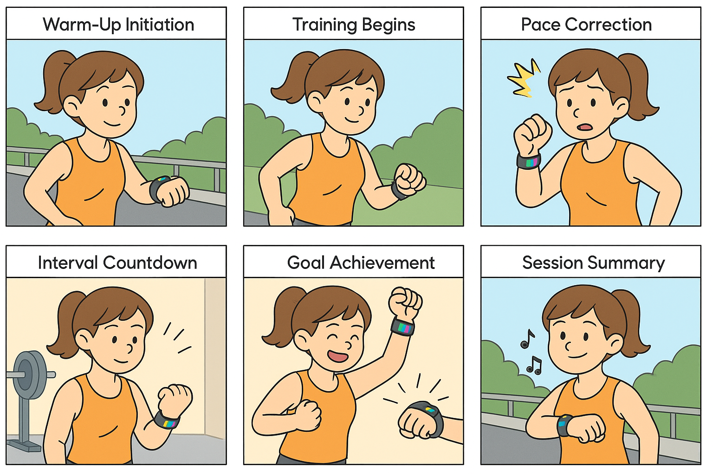
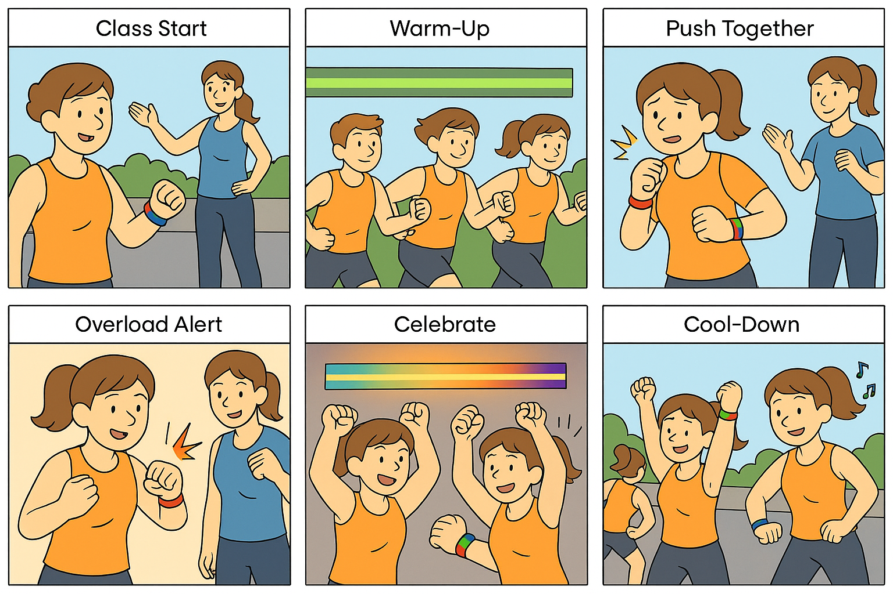

# Staging Interaction

\*\***NAME OF COLLABORATOR HERE**\*\*

**Charlotte Lin (hl2575), Jessica Hsiao (dh779), Zoe Tseng (yzt2), Irene Wu(yw2785)**

In the original stage production of Peter Pan, Tinker Bell was represented by a darting light created by a small handheld mirror off-stage, reflecting a little circle of light from a powerful lamp. Tinkerbell communicates her presence through this light to the other characters. See more info [here](https://en.wikipedia.org/wiki/Tinker_Bell). 

There is no actor that plays Tinkerbell--her existence in the play comes from the interactions that the other characters have with her.

For lab this week, we draw on this and other inspirations from theatre to stage interactions with a device where the main mode of display/output for the interactive device you are designing is lighting. You will plot the interaction with a storyboard, and use your computer and a smartphone to experiment with what the interactions will look and feel like. 

_Make sure you read all the instructions and understand the whole of the laboratory activity before starting!_

## Prep

### To start the semester, you will need:
1. Read about Git [here](https://git-scm.com/book/en/v2/Getting-Started-What-is-Git%3F).
2. Set up your own Github "Lab Hub" repository by forking the [Interactive-Lab-Hub repository](https://github.com/FAR-Lab/Interactive-Lab-Hub). To get lab updates, simply [use GitHub's "Sync fork" button when new content is available](https://docs.github.com/en/pull-requests/collaborating-with-pull-requests/working-with-forks/syncing-a-fork).

3. Set up the README.md for your Hub repository (for instance, so that it has your name and points to your own Lab 1). You can [learn how to organize and format your README.md here](https://docs.github.com/en/get-started/writing-on-github/getting-started-with-writing-and-formatting-on-github/basic-writing-and-formatting-syntax). Make sure to include links to your submissions so they are easy to find.

### For this lab, you will need:
1. Paper
2. Markers/ Pens
3. Scissors
4. Smart Phone -- The main required feature is that the phone needs to have a browser and display a webpage.
5. Computer -- We will use your computer to host a webpage which also features controls.
6. Found objects and materials -- You will have to costume your phone so that it looks like some other devices. These materials can include doll clothes, a paper lantern, a bottle, human clothes, a pillow case, etc. Be creative!

### Deliverables for this lab are: 
1. 7 Storyboards
1. 3 Sketches/photos of costumed devices
1. Any reflections you have on the process
1. Video sketch of 3 prototyped interactions
1. Submit the items above in the lab1 folder of your class [Github page], either as links or uploaded files. Each group member should post their own copy of the work to their own Lab Hub, even if some of the work is the same from each person in the group.

### The Report
This README.md page in your own repository should be edited to include the work you have done (the deliverables mentioned above). Following the format below, you can delete everything but the headers and the sections between the **stars**. Write the answers to the questions under the starred sentences. Include any material that explains what you did in this lab hub folder, and link it in your README.md for the lab.

## Lab Overview
For this assignment, you are going to:

A) [Plan](#part-a-plan) 

B) [Act out the interaction](#part-b-act-out-the-interaction) 

C) [Prototype the device](#part-c-prototype-the-device)

D) [Wizard the device](#part-d-wizard-the-device) 

E) [Costume the device](#part-e-costume-the-device)

F) [Record the interaction](#part-f-record)

Labs are due on Mondays. Make sure this page is linked to on your main class hub page.

## Part A. Plan 

To stage an interaction with your interactive device, think about:

_Setting:_ Where is this interaction happening? (e.g., a jungle, the kitchen) When is it happening?

_Players:_ Who is involved in the interaction? Who else is there? If you reflect on the design of current day interactive devices like the Amazon Alexa, it’s clear they didn’t take into account people who had roommates, or the presence of children. Think through all the people who are in the setting.

_Activity:_ What is happening between the actors?

_Goals:_ What are the goals of each player? (e.g., jumping to a tree, opening the fridge). 

The interactive device can be anything *except* a computer, a tablet computer or a smart phone, but the main way it interacts needs to be using light.

\*\***Describe your setting, players, activity and goals here.**\*\*

Imagine you are working out at some places, such as the gym, riverside, and so on. You may want to know the stage of your heart rate to guide your next move. For example, when your heart rate reaches its peak level, it’s time to take a break to avoid potential harm. This is where the device comes in. It allows people to monitor their heart rate while exercising and stay informed about their physical condition.

The device would have 5 different light colors based on stages of heart rate, as in the following table.

The following table is the 5 stages provided by the American College of Sports Medicine. 

| Intensity Zone | %HRmax | %HRR   |
|----------------|--------|--------|
| Very Light     | <57%   | <30%   |
| Light          | 57–63% | 30–39% |
| Moderate       | 64–76% | 40–59% |
| Vigorous       | 77–95% | 60–89% |
| Maximal        | 96–100%| 90–100%|

- **HRmax (Maximum Heart Rate):** The maximum number of heartbeats per minute during exercise.  
  - Typically calculated as: `220 – age`  
- **HRR (Heart Rate Reserve):** The difference between maximum heart rate and resting heart rate.  
  - *Resting heart rate* = heartbeats per minute while at rest.
 
In this scenario, we use %HRmax to categorize each stage of working out. As the following table indicates, different colors are assigned to different Intensity Zones. These colors can easily notify people on their interactive devices. We align the color schema with the intuitive perception of intensity, where white denotes a neutral baseline, blue represents a sense of calm, green conveys a balanced state, yellow suggests higher activity, and red signifies maximum intensity.

| Intensity Zone | %HRmax   | Color  |
|----------------|----------|--------|
| Very Light     | <57%     | ⚪ White |
| Light          | 57–63%   | 🔵 Blue  |
| Moderate       | 64–76%   | 🟢 Green |
| Vigorous       | 77–95%   | 🟡 Yellow|
| Maximal        | 96–100%  | 🔴 Red   |

**Goal:** This device is designed to help users monitor their heart rate during physical activity, so they can exercise safely, optimize performance, and prevent potential health risks.

\*\***Include pictures of your storyboards here**\*\*

\*\***Summarize feedback you got here.**\*\*

A classmate mentioned that the device is practical and particularly useful given that people value their health management nowadays. Another classmate suggests that we could also detect the blood oxygen level, which is another important indicator in exercise, to provide more information, allowing the device to analyze the exercise level of the user more accurately.

## Part B. Act out the Interaction

Try physically acting out the interaction you planned. For now, you can just pretend the device is doing the things you’ve scripted for it. 

\*\***Are there things that seemed better on paper than acted out?**\*\*

- In the planning stage, we expected users to raise their hands to check the light while running, which seems to be intuitive and easy to perform because it is similar to the act of checking the time on a watch.
- In practice, we found two problems with using a device that emits light. The first one is that the runner would not know when to check the device; as a result, they have to check it regularly. The other problem is that when the user is running, raising their hands to check the light requires extra effort, which distracts them from focusing on running.

\*\***Are there new ideas that occur to you or your collaborator that come up from the acting?**\*\*
- One solution we came up with is that we could use vibration instead of light, making it effortless for the user to receive feedback from the device. With this type of notification, users can receive information passively rather than actively checking their status.
- We noticed that placement really matters. Wearing the device on the wrist works fine when you’re not moving much, but during more intense activities like running or cycling, it’s harder to check quickly. An armband or chest strap with a front-facing light could work better for runners since the light would stay in their line of sight and be easier to notice without extra effort.

## Part C. Prototype the device

You will be using your smartphone as a stand-in for the device you are prototyping. You will use the browser of your smart phone to act as a “light” and use a remote control interface to remotely change the light on that device. 

Code for the "Tinkerbelle" tool, and instructions for setting up the server and your phone are [here](https://github.com/IRL-CT/tinkerbelle).

We invented this tool for this lab! 

If you run into technical issues with this tool, you can also use a light switch, dimmer, etc. that you can can manually or remotely control.

\*\***Give us feedback on Tinkerbelle.**\*\*

- The installation process was quite smooth overall, and the instructions were very clear to follow. Although we did run into some version compatibility issues during setup, the documentation provided helpful solutions, so we were able to resolve them quickly.

## Part D. Wizard the device
Take a little time to set up the wizarding set-up that allows for someone to remotely control the device while someone acts with it. Hint: You can use Zoom to record videos, and you can pin someone’s video feed if that is the scene which you want to record. 

\*\***Include your first attempts at recording the set-up video here.**\*\*

The video is on Google Drive: [Lab 1](https://drive.google.com/drive/folders/1-UZNWlaaXBWAfdHco78UJXUNBQaKrdvQ?usp=drive_link)

Now, change the goal within the same setting, and update the interaction with the paper prototype. 

- Change of goals: Timer 

\*\***Show the follow-up work here.**\*\*

- Written response first (if have time -> pictures)
- Another goal is to use the device as a customizable training timer. The athlete wearing the device can program how long each training session or segment should take. Each color corresponds to a specific session, for example, warm-up, high intensity intervals or rest periods. Based on these settings, the device will use the lights to inform the transitions of sessions in real time. By allowing the user to stay focused on the performance without needing to check an external timer, the device can ensure a more immersive and efficient experience for the user. 

## Part E. Costume the device

Only now should you start worrying about what the device should look like. Develop three costumes so that you can use your phone as this device.

Think about the setting of the device: is the environment a place where the device could overheat? Is water a danger? Does it need to have bright colors in an emergency setting?

\*\***Include sketches of what your devices might look like here.**\*\*

For each design, three images are presented: the left image illustrates the prototype being worn by a user, the middle image displays the physical prototype itself, and the right image depicts the envisioned ideal appearance of the device, which is generated by ChatGPT.

- Design 1: put on the wrist as a bracelet

  
  
  

- Design 2: put on the waist as a belt

  
  
  

- Design 3: put on an index finger as a ring

  
  
  

\*\***What concerns or opportunitities are influencing the way you've designed the device to look?**\*\*

- The design is primarily shaped by several key concerns, including visibility, stability, comfort, device size, potential interference with the athlete's motion, sweat resistance, and the accuracy of data collected. Addressing these challenges is essential to ensure the device performs reliably during intense physical activity. 
- At the same time, the device also presents valuable opportunities including providing real time feedback, offering customizable user experience, enhancing motion through visual cues, and enabling integration with other devices to support broader training goals. 

## Part F. Record

\*\***Take a video of your prototyped interaction.**\*\*

For each design, three videos are presented:
- The first one shows someone wearing the device on their wrist. Videos are on Google Drive: [Lab 1](https://drive.google.com/drive/folders/1-UZNWlaaXBWAfdHco78UJXUNBQaKrdvQ?usp=drive_link)
- The second one shows someone wearing the device on the waist. Videos are on Google Drive: [Lab 1](https://drive.google.com/drive/folders/1-UZNWlaaXBWAfdHco78UJXUNBQaKrdvQ?usp=drive_link)
- The second one shows someone wearing the device on their finger. Videos are on Google Drive: [Lab 1](https://drive.google.com/drive/folders/1-UZNWlaaXBWAfdHco78UJXUNBQaKrdvQ?usp=drive_link)

\*\***Please indicate who you collaborated with on this Lab.**\*\*
Be generous in acknowledging their contributions! And also recognizing any other influences (e.g. from YouTube, Github, Twitter) that informed your design. 

# Staging Interaction, Part 2 

This describes the second week's work for this lab activity.

## Prep (to be done before Lab on Wednesday)

You will be assigned three partners from other groups. Go to their github pages, view their videos, and provide them with reactions, suggestions & feedback: explain to them what you saw happening in their video. Guess the scene and the goals of the character. Ask them about anything that wasn’t clear. 

\*\***Summarize feedback from your partners here.**\*\*

## Make it your own

Do last week’s assignment again, but this time: 
1) It doesn’t have to (just) use light, 
2) You can use any modality (e.g., vibration, sound) to prototype the behaviors! Again, be creative! Feel free to fork and modify the tinkerbell code! 
3) We will be grading with an emphasis on creativity. 

\*\***Document everything here. (Particularly, we would like to see the storyboard and video, although photos of the prototype are also great.)**\*\*

## Interactive Fitness Device - Part A: Plan

When staging an interaction with the device, consider:

- **Setting:** Where and when is the interaction happening? (e.g., home, gym, outdoor park)
- **Players:** Who is involved in the interaction? Consider all people in the setting, including roommates, children, or fellow participants.
- **Activity:** What is happening between the actors?
- **Goals:** What are the objectives of each player? (e.g., complete a workout, achieve personal bests)

## Modes

### 1. Individual Mode

**Description:** A personalized trainer mode where AI builds a workout plan based on the user’s history, goals, and preferences.

- **Setting:** Any workout environment chosen by the user (home, gym, studio, or outdoor space).  
- **Players:** Primarily the exerciser, with potential secondary players (roommates, partners, children, or other nearby people).  
- **Activity:**  
  - User begins a workout session.  
  - Device monitors performance and physiological metrics (heart rate, skin temperature).  
  - Provides countdowns, motivational feedback via vibration, sound, or color-coded progress bars.  
- **Goal:** Support the user in completing workouts effectively, track progress, improve performance, and sustain motivation through multimodal feedback.

### 2. Group Mode

**Description:** A collaborative mode designed for multiple participants in shared workouts, enhancing social engagement and motivation.

- **Setting:** Group workout sessions such as classes, bootcamps, or virtual sessions in gyms, parks, or studios.  
- **Players:** All exercisers participating, with the instructor monitoring device signals for group performance and safety.  
- **Activity:**  
  - Participants follow a structured workout routine guided by shared device cues.  
  - Device provides visual and auditory feedback (lights indicating progress, heart rate zones, intensity alerts).  
  - Lights notify instructors if participants struggle (e.g., red light for metrics below thresholds).  
  - Supports shared/paired goals, team competitions, or collective achievements.  
  - Real-time stats (heart rate, cadence, calories burned) can be displayed or shared.  
- **Goal:**  
  - Enhance social and motivational aspects of workouts.  
  - Encourage friendly competition, team bonding, and engagement.  
  - Assist instructors in monitoring safety and performance.  
  - Make workouts interactive, collaborative, and emotionally rewarding.

---

\*\***Include pictures of your storyboards here**\*\*

## Part B: Act Out the Interaction 

Try physically acting out the interaction you planned. For now, you can just pretend the device is doing the things you’ve scripted for it. 

---

\*\***Are there things that seemed better on paper than acted out?**\*\*

We initially ideated around a “couples” feature within the group mode. While it is an interesting offering, after acting it out, we realized this is not much different from a normal group mode. We then decided to focus solely on a group workout scenario rather than developing more around the couples workout idea.

During the brainstorming stage, we discussed the possibility to use this device for groups doing workout sessions to compete with each other. The vision was to use lighting or other haptic feedback to signify the start of a mini-competition, keep score, and give rewards. However that may be deviating from the original purpose of this device and is a bit more complicated than we expected. Thus this idea was dropped.

\*\***Are there new ideas that occur to you or your collaborator that come up from the acting?**\*\*

We realized there might be some workout/exercises that require equipment or hand movement that could interfere with a wearable device on the wrist. To deal with this issue, we explore a new idea to costume our device as a necklace or an earring.

**Pros and cons of each:**

**Earrings**  
**Pro**  
- Super agile/lightweight  
- Easier to hear instructions/sound feedback in a group setting or outdoor environment  

**Con**  
- Not everyone has piercings  
- Hard to design with comfort  
- Easy to lose  
- Screen size is extremely tiny for light feedback  

**Necklace**  
**Pro**  
- Easy to put on - accessibility  
- Easy to hear instructions/sound feedback in a group setting or outdoor environment  
- Easy to spot a vibration/haptic feedback  
- Easy to see other’s light/feedback in a group setting  

**Con**  
- Needs to be adjustable for fitting  
- Screen may be slightly smaller than a watch solution

## Part E. Costume the Device

Only now should you start worrying about what the device should look like. Develop three costumes so that you can use your phone as this device.

Think about the setting of the device: is the environment a place where the device could overheat? Is water a danger? Does it need to have bright colors in an emergency setting?

\*\***Include sketches of what your devices might look like here.**\*\*

After evaluating the tradeoff we decided to go with a necklace as a wearable device.

