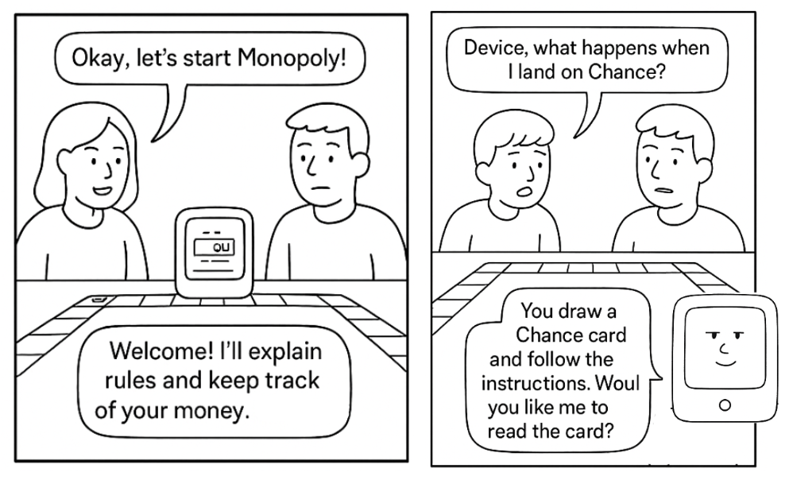
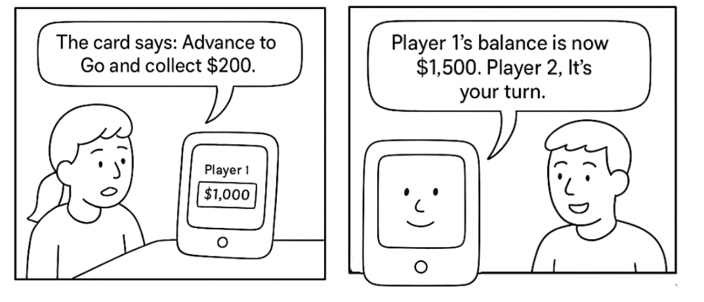
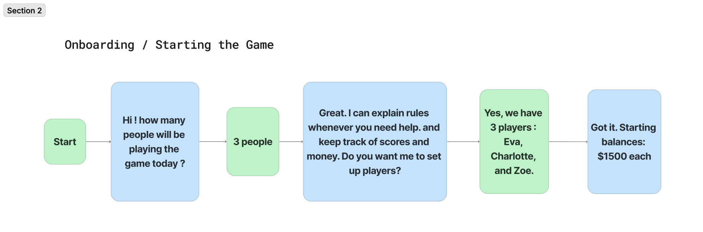
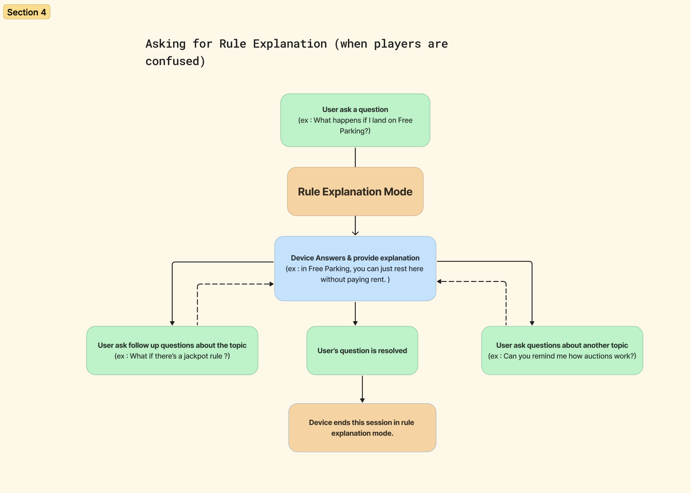
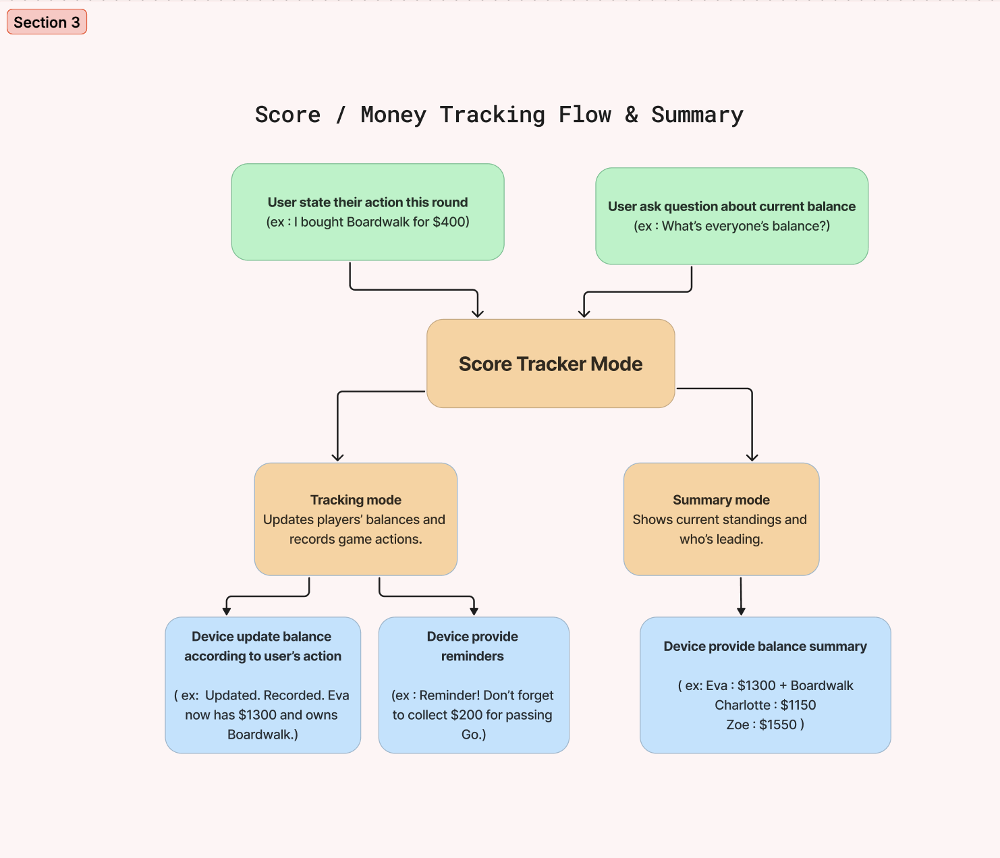
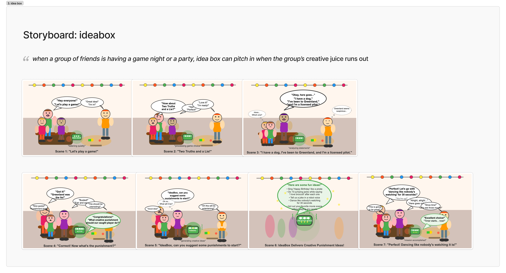
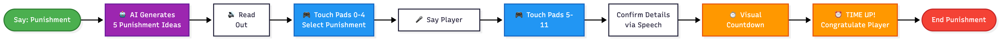
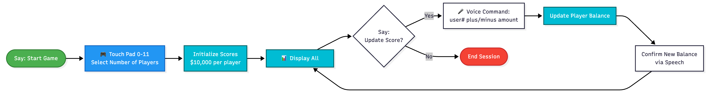
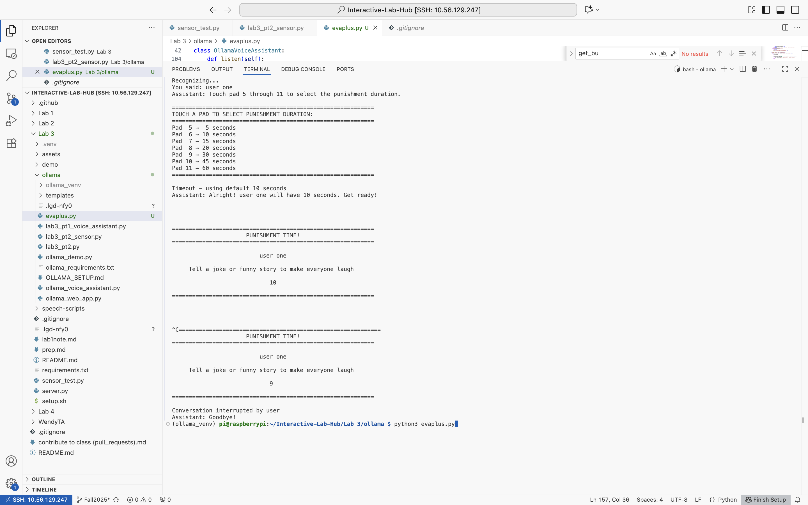

# Chatterboxes
**Charlotte Lin (hl2575), Zoe Tseng (yzt2), Le-En Huang (lh764)**
**Use of AI for this lab: Claude Sonnet4 for image creation and debugging instructions for the code.**

In this lab, we want you to design interaction with a speech-enabled device--something that listens and talks to you. This device can do anything *but* control lights (since we already did that in Lab 1).  First, we want you first to storyboard what you imagine the conversational interaction to be like. Then, you will use wizarding techniques to elicit examples of what people might say, ask, or respond.  We then want you to use the examples collected from at least two other people to inform the redesign of the device.

We will focus on **audio** as the main modality for interaction to start; these general techniques can be extended to **video**, **haptics** or other interactive mechanisms in the second part of the Lab.


### Text to Speech 

\*\***Write your own shell file to use your favorite of these TTS engines to have your Pi greet you by name.**\*\*
(This shell file should be saved to your own repo for this lab.)

Run the following command to try this out - 
```
(.venv) pi@raspberrypi:~/Interactive-Lab-Hub/Lab 3/speech-scripts $ ./greeting.sh 
```


### Speech to Text

\*\***Write your own shell file that verbally asks for a numerical based input (such as a phone number, zipcode, number of pets, etc) and records the answer the respondent provides.**\*\*

Run the following command to try this out - 
```
(.venv) pi@raspberrypi:~/Interactive-Lab-Hub/Lab 3/speech-scripts $ ./inquiry.sh 
```

### 🤖 NEW: AI-Powered Conversations with Ollama

Want to add intelligent conversation capabilities to your voice projects? **Ollama** lets you run AI models locally on your Raspberry Pi for sophisticated dialogue without requiring internet connectivity!

\*\***Try creating a simple voice interaction that combines speech recognition, Ollama processing, and text-to-speech output. Document what you built and how users responded to it.**\*\*

#### Idea Box
I created a working prototype for Idea Box, an interactive voice assistant that uses AI to provide creative suggestions for ongoing party games.
It collects user input and guides users with creative suggestions that could make the party games more fun!

#### Features 
- Game Identification: Asks what game you're playing
- Punishment Suggestions: AI generates creative, fun consequences for losing teams
- Creative Enhancement: Provides themes, rule variations, and other game improvements
- Audio-Optimized: All AI responses designed for natural speech output
- Fallback Mode: Works without microphone using text simulation

#### How to run
Restart ollama so that the AI response would not time out.
```
(venv) pi@raspberrypi:~/Interactive-Lab-Hub/Lab 3 $ sudo systemctl restart ollama
(venv) pi@raspberrypi:~/Interactive-Lab-Hub/Lab 3 $ ./run_party_game_assistant.sh 
```

Delete `/audio` files to save memory.

#### Video Demo
- [link](https://youtu.be/cbnLyy9lcVg)

#### User feedback
Zoe thinks the flow is straightforward, and she likes the humourous and lighthearted tone!
She thinks the device could encourage more specific input from user so the turnaround time is not super long.

### Storyboard

Storyboard and/or use a Verplank diagram to design a speech-enabled device. (Stuck? Make a device that talks for dogs. If that is too stupid, find an application that is better than that.) 

We got together to brainstorm on potential ideas. We really like the theme of game night and party game in general, so we decide to branch off here and explore different variants. We have three branches in total.

####  Warewolves/Game Host Bot @Charlotte (@hl2575)

####  Explanation Bot @Zoe (@yzt2)

\*\***Post your storyboard and diagram here.**\*\*
- 



Write out what you imagine the dialogue to be. Use cards, post-its, or whatever method helps you develop alternatives or group responses. 

\*\***Please describe and document your process.**\*\*

- I designed the conversation workflow by breaking down how players naturally interact with both the game and each other. The first thought in designing the device and its conversation flow was to make sure the device can be like an assistant that feels like part of the table. Instead of letting the users feel that the device is a rulebook or just a scorekeeper, I tried to design the conversation in a way that it can flow based on the interactions with the users (mainly the speech input from user) while keeping the game engaging. 

- The flow begins with `Onboarding`, where the device sets up players and starting balances. During gameplay, players can enter the `Rule Explanation` flow whenever they are confused. This is mainly to help the players continue the game more smoothly without consulting manuals. The `Score & Money Tracking Flow` manages updates of balances and transactions so players don’t have to track them manually. In this mode, there is also the `Game Summary` feature which the device provides quick overviews of the current standings, making it easy to see who is leading. 

- In each of the flow chart below, **green box represents the user, blue box represent the device, and the orange box indicate the settings / features of the device.**

- `Onboarding / Starting the Game`: The device sets up the game by identifying the players, initializing balances, and preparing to assist during play.


- `Asking for Rule Explanation`: Players ask the device about unclear rules, and it provides quick, accurate clarifications.


- `Score Tracking & Game Summary` : The device records in-game actions (like passing Go, paying rent, or buying properties) and updates players’ balances. In the summary mode, the device provides a snapshot of the current game state, showing balances, property ownership, and who is leading.


- Here's the link to Figma (which I used to create the flow chart) : [Link to figma board](https://www.figma.com/board/QSjo9tSrzV6DxOiC4RmsFJ/IDD-lab3_pt1_flow?node-id=0-1&t=BxyXoOAZD8CCBanm-1)

####  IdeaBox @Eva (@lh764)

\*\***Post your storyboard and diagram here.**\*\*




Write out what you imagine the dialogue to be. Use cards, post-its, or whatever method helps you develop alternatives or group responses. 

\*\***Please describe and document your process.**\*\*

I first used a user journey map to frame how I want my user journey to look like for a game night.
In the journey map, I used the following as the 4 aspects that I am designing for.
- users
- emotions
- dialogue
- goals


I then selected two scenarios that I want to create an interactive script for:
- creative facilitating mode
- ice breaker mode

[link to script](https://docs.google.com/document/d/1b2uQgRdphgMJYWD2WIDDTRGQw4Y3QLTUAXepUIx83Fg/edit?usp=sharing)


### Acting out the dialogue

Find a partner, and *without sharing the script with your partner* try out the dialogue you've designed, where you (as the device designer) act as the device you are designing.  Please record this interaction (for example, using Zoom's record feature).

\*\***Describe if the dialogue seemed different than what you imagined when it was acted out, and how.**\*\*

[Warewolves](https://youtu.be/oKx95uURB4s)

[Ideabox](https://youtu.be/8xRIaNbEIwg)

[Rules Explanation Bot](https://drive.google.com/file/d/10ByKoQw41XVuMDyUWIKn8qw_uJNr9zi4/view?usp=drive_link)

#### Notes And Observations
Eva feedback - the script worked really well in some part's of the warewolf game, but it seemed a bit out of place during some parts of gameplay in warewolf. For example, there is a component when a killer decides on killing a player. How can the killer tell our device to record killing someone out loud? That's against the premise of the game. Finding a game that would need voice assistance may be hard.

Charlotte feedback - game explanations and rules machine may come really handy in some games when we need props, like Monopoly, but don't have any. For example, we sometimes can't find the "fake cash" to play Monopoly when we're out camping, and may be valuable to develop a feature like that to explain rules and keep counts of everyone's cash.

Zoe - AI performs well in some areas, notably the creative dialogue and open ended questions. However when developing the script, it's very hard to get AI to answer something that humans know the correct answer to. We should consider leveraging the strengths of AI and avoid exposing weaknesses of AI in our system.


# Lab 3 Part 2

For Part 2, you will redesign the interaction with the speech-enabled device using the data collected, as well as feedback from part 1.

### User Interaction Flow Chart

### 🎮 Game Moderator Device – Voice Assistant (Raspberry Pi + Ollama + MPR121)

Our device functions as a **voice-controlled game moderator** designed to make group games like Werewolf or Monopoly more interactive and engaging. It uses speech recognition, text-to-speech, and a touch sensor interface (MPR121) to communicate naturally with players. We originally planned three main features—IdeaBox, Werewolves, and Rules Explain—but for this prototype, we implemented two: IdeaBox and Rules Explain.

- 💡 The IdeaBox feature uses AI (through the Ollama model) to generate fun, creative punishment or activity ideas that players can select by touching specific pads on the MPR121 sensor. 

<p float="left">
  
</p>




- 📘 The Rules Explain feature allows players to ask questions about the game’s rules, and provides score keeping feature for players. Assistant responds with AI-generated explanations through voice output. 

<p float="left">
  
</p>




### Running the script

1. download dependencies and follow all instructions in `Ollama_setup.md`

```
pip install -r requirements.txt
pip install requests speechrecognition pyaudio flask flask-socketio
```

2. enable I2C and install MPR121 Library

```
pip install adafruit-circuitpython-mpr121
```
3. running the script

```
python party_game_assistant.py
```

### Demo

**video example**  `Start Game` -> ` Enter number of players` -> `update score` ->  `User# plus / minus amount` : 
- After the user start the game with voice control, user can touch the pad to indicate how many players there are for this game
- Commands like “update score” trigger a short interaction flow, where the system waits for the next instruction (player + amount).
- https://drive.google.com/file/d/1G3Y2ljqYQE7NIuNFt3YNdnzj_blnpvc8/view?usp=drive_link

**video example**  `Punishment ` -> ` Punishment Type Selection` -> ` Punishment User Selection` -> `Punishment Duration Selection` -> `Run Punishment Countdown`  :
- Users ask the device (assistant) for punishment ideas, touch sensor to select pushishment types, touch sensor to select punishment duration
- https://drive.google.com/file/d/1GnMq-7LttGka26wA3vRnvQHRhy9rxtnM/view?usp=drive_link

**video example**  `Game help / instructions` :
- Users ask the device (assistant) questions about the game's rule, device output AI-generated response
- https://drive.google.com/file/d/1Ej2u_rBWTT5JamR8uJ0Miz2fz1tgFu0Z/view?usp=drive_link


---

### Command Reference Table

| Command / Action              | Input Type                          | System Action                                                              | Example Response Spoken by Assistant                                         |   |   |
| ----------------------------- | ----------------------------------- | -------------------------------------------------------------------------- | ---------------------------------------------------------------------------- | - | - |
| Start Game                    | Voice                               | Initializes a new game session, ask user to input number of users          | Please touch a pad to indicate the number of players                         |   |   |
| Entern Number of Players             | Sensor (touch pad for player count) | Process the user's input through the touch pad                             | Game started! User1, User2, User3 all begin with $10000. Let the game begin! |   |   |
| Update Score                  | Voice                               | Activates score update mode (assistant waits for a player name and amount) | Ready to update. Please say which user and how much.                         |   |   |
| User# plus / minus amount     | Voice                               | Parses command, updates that player’s score locally                        | Understood. User1 received $300. Their new balance is $10300.                |   |   |
| Show Scores                   | Voice                               | Displays current player balances                                           | Current scores are: User1: $10300, User2: $9700, User3: $10000               |   |   |
| Exit / Stop Game              | Voice                               | Ends or pauses the current session                                         | Goodbye! Have a great day!                                                   |   |   |
| Punishment                    | Voice                               | Generates 5 AI-powered punishment suggestions                              | Option 1. Do a 30 second victory dance for the winning team.                 |   |   |
| Punishment Type Selection     | Sensor (touch pad 0–4)              | Select one of the AI-generated punishments                                 | You selected option 2: Tell a joke to make everyone laugh                    |   |   |
| Punishment User Selection | Voice                               | Listen to user input to select the user who recieve punishment                 | no specific response, but assistant will say "touch a pad to select punishment duration" to proceed with duration selection
| Punishment Duration Selection | Sensor (touch pad 5–11)             | Select duration of punishment                                              | Duration set to 15 seconds                                                   |   |   |
| Run Punishment Countdown      | System                              | Displays countdown for selected player and punishment                      | Time up! Great job Player2!                                                  |   |   |
| Game Help / Instructions      | Voice                               | Input sent to Ollama for conversational explanation                        | This rule means ...                                                          |   |   |


### Touch Sensor Notes  Table
| Action                        | User Action                                                          | Notes / Mapping                                                                            |
| ----------------------------- | -------------------------------------------------------------------- | ------------------------------------------------------------------------------------------ |
| Initialize Number of Players        | Touch a pad 1–11 to indicate number of players                       | Pad 2 = 2 player, Pad 3 = 3 players...                              |
| Punishment Type Selection     | Touch pad 0–4 to select one of the 5 AI-generated punishment options | Pad 0 = Option 1, Pad 1 = Option 2, Pad 2 = Option 3, … Pad 4 = Option 5                   |
| Punishment Duration Selection | Touch pad 5–11 to select duration in seconds                         | Pad 5 = 5s, Pad 6 = 10s, Pad 7 = 15s, Pad 8 = 20s, Pad 9 = 30s, Pad 10 = 45s, Pad 11 = 60s |


### System Documentation
### 1. Architecture

#### a. Input Layer
- Captures user input via two mechanisms:
  1. **Microphone**
     - Uses `speech_recognition` library.
     - Converts audio into text using Google Speech Recognition (cloud-based).
     - Handles:
       - Ambient noise calibration.
       - Timeouts for listening.
       - Speech recognition errors.
  2. **MPR121 Touch Sensor**
     - Detects touch on capacitive pads via `adafruit-circuitpython-mpr121`.
     - Used for:
       - Selecting number of players (pad 0–11).
       - Selecting punishment type (pad 0–4).
       - Selecting punishment duration (pad 5–11).
     - Debouncing implemented to prevent multiple accidental triggers.

#### b. Processing Layer
- Core class: `OllamaVoiceAssistant`.
- Responsibilities:
  - **Score Management**
    - Maintains player scores in `self.player_scores`.
    - Score updates are local only; Ollama is not used for calculations.
    - Detects and parses score commands using regex (`parse_score_command`).
    - Manages game state flags:
      1. `score_initialized`: Has the game started?
      2. `waiting_for_score_update`: Is the assistant waiting for a score update?
  - **Punishment Management**
    - Retrieves AI-generated punishment suggestions from Ollama (`get_punishment_suggestions`).
    - Handles selection via touch sensor (`wait_for_touch_punishment`, `wait_for_touch_duration`).
    - Runs punishment countdown and displays it with audio feedback (`display_punishment_countdown`).
  - **Conversation Management**
    - Routes general user queries to Ollama (`query_ollama`) for conversational responses.
    - Manages greetings, help, and non-score-related questions.
    - Optional system prompt to set assistant persona.

#### c. Output Layer
- Provides user feedback via:
  1. **Text-to-Speech (TTS)**
     - Uses `espeak` to read out:
       - Player score updates.
       - Punishment instructions and countdown.
       - General AI-generated responses (greetings, help, rules explanations).
  2. **Console / Terminal**
     - Prints debug information and user feedback.
     - Displays:
       - Player scores.
       - Punishment options and countdown.
       - Touch sensor feedback for selection of options and durations.



### User Testing Feedback

#### User 1: Irene
- "The touch sensor for selecting punishment duration was super intuitive - way better than trying to say numbers out loud when everyone's talking."
- "AI came up with actually funny punishments instead of the same boring stuff we always do."
- "I accidentally touched two pads at once when selecting a punishment and it picked the wrong one. A confirmation step would be nice."

**Suggestions:**
- Add background music during AI thinking time
- Visual feedback on the screen showing which pad was touched

#### User 2: Jessica

- "The separate modes (score tracking vs punishment) made it really clear what I was doing."
- "The visual countdown display was good "
- "When background noise was high (we had music playing), the mic picked up song lyrics and tried to process them as commands."

**Suggestions:**
- Print or display the pad mapping on screen during selection
- Add a physical button for "start listening" to avoid false triggers

---

**What worked well about the system and what didn't?**
- 1. Initially, I tried to have the assistant keep track of players’ names (e.g., Charlotte, Eva, and Zoe). However, after several trials, I realized that the speech-to-text recognition often failed to correctly capture the names. To fix this issue, I replaced the names with generic identifiers such as “user 1,” “user 2,” and “user 3.” This change improved accuracy, as the speech recognizer could more reliably detect which user’s score needed to be updated.

<details>
  <summary> Click to expand the conversation details (between the user and the device) </summary>
(before, with player's actual name) for example : 
  
```bash
Assistant: Hello! I'm your Monopoly game assistant. How can I help you today?
Listening...
Recognizing...
You said: start game
Assistant: Game started! eva, charlotte, zoe all begin with $10000. Let the game begin!
Listening...
Recognizing...
You said: what is 500 --> Here, what the test user actually said was "Charlotte plus 500"
Assistant: Sorry, I still didn't catch the player and amount. Please state it like 'Eva plus 300' or 'Charlotte minus 500'.
```

(after, remove the use of player's name) for example : 
```bash
Assistant: Hello! I'm your Monopoly game assistant. How can I help you today?
Listening...
Recognizing...
You said: start game
Assistant: Game started! user1, user2, user3 all begin with $10000. Let the game begin!
Listening...
Recognizing...
You said: update scores
Assistant: Ready to update. Please say which user and how much. For example, 'user one plus 300'.
Listening...
Recognizing...
You said: user 2 + 500
DEBUG parsed: ('user2', '500', 'add')
Assistant: Understood. User2 received $500. Their new balance is $10500. Scores are updated!
Listening...
```
</details>

- 2. Originally, when a user said phrases like “Eva plus 300,” the speech recognizer transcribed it as “Eva + 300.” However, the initial regex patterns did not account for symbols like “+,” so the command wasn’t parsed correctly. To fix this, the regex was updated to include additional patterns and symbols (e.g., “+” and “plus”), allowing the assistant to correctly recognize and process score updates. 

<details>
  <summary> Click to expand the conversation details (between the user and the device) </summary>
for example : 
  
```bash
Assistant: Hello! I'm your Monopoly game assistant. How can I help you today?
Listening...
Recognizing...
You said: start game
Assistant: Game started! eva, charlotte, zoe all begin with $10000. Let the game begin!
Listening...
Recognizing...
You said: Eva + 500 --> the original regex pattern cannot capture the "+" and thus system cannot update the score accordingly
Thinking...
Assistant: Sorry, the response took too long. Please try again.
```
</details>

- 3. In the original design, the players do not have to say “Update scores” to trigger the score update feature. When testing this with other users, I noticed two main issues: first, users often spoke in natural but unpredictable ways that the system struggled to parse correctly; second, without an explicit “update” trigger, the assistant sometimes confused score updates with unrelated speech, reducing accuracy and disrupting the game flow.

---

**What worked well about the controller and what didn't?**

#### Strengths
Our system provides rich, interactive features that is aligned with our design vision of a party game assistant.

- We offer practical solutions like providing rule explanations and score keeping help so the users can focus more on the game
- Creative solutions like coming up with funny, light-hearted punishments can keep the game moving when the group is running out of ideas or when the friend group is relatively new. This greatly reduces the bottleneck of party games and enhance the fun part of it.
- Accessibility & Availability - with the addition of the touch sensor, now there is a way to interact with the device when the enviornment noise level is high. This accounts for true game-playing scenarios when the background is usually noisy.

#### Weaknesses
Due to the time and resource constraints, there are a couple things that we wish to improve on: 

- Pursuing the "warewolves" or a immersive storytelling role of the device
  - especially with the addition of the sensor, warewolves might be a good candidate for this device because there's a component where killer has to assasinate a player, we feel this could be done through the MPR121 sensor perfectly!!
- Flow and sound of the conversation design and dialogue
  - at one point we've thought of recording an "intro" sound effect or a "cash register" sound effect to be more immersive and offers a true excitement for our users
  - this should be relatively easy to add, we just decided to use those time to flesh out the script and implement the technical solutions better

**What lessons can you take away from the WoZ interactions for designing a more autonomous version of the system?**

- Users expect faster AI response times
  - this is apparent and we tried multiple models
  - this can be somewhat mitigated by offering cues like "thinking of something right now", either through audio output, or on console, to signal the conversation hasn't ended
- Touch sensor needs confirmation feedback
  - In a tradeoff for longer user flow, user might want to have a "back out" or "cancel" option offered when the wrong number of players is selected

---

**How could you use your system to create a dataset of interaction? What other sensing modalities would make sense to capture?**

#### Interaction dataset creation
- Log all touch inputs with timestamps (pad number, selection type, response time), voice commands with transcription confidence scores, AI-generated punishments with selection rates, and session metadata (game duration, number of players, punishment frequency).
- This dataset will allow researchers and game desginers/developers to understand how people behave in gameplay scenarios in different sizes of groups. With the collection of user survey we can even explore how people behave and make decisions when they are in social in-groups vs strangers.
- The punishment selection and data can be studied in various scenarios, particularly with psych/sociology or behavrioral econ contexts:
  - How do people choose punishments among those presented to them?
  - How long does it take for people to decide on punishments for others?
  - When AI suggests potentially problematic options, do people still opt for those? Or do they try to come up with something everyone is comfortable with?

#### Additional sensing modalities

- Camera
  - to study pose for each player when punishments are completed (did the player actually dance for 30 seconds?) 
  - can capture facial expressions for automatic difficulty calibration or for future recommendations
- Microphone
  - to identify individual players by voice, track laughter intensity as an engagement metric, and detect frustration for game pacing adjustments.
- Pressure sensors integrated into game pieces or the board itself to automatically detect player positions and trigger location-based events without manual input.