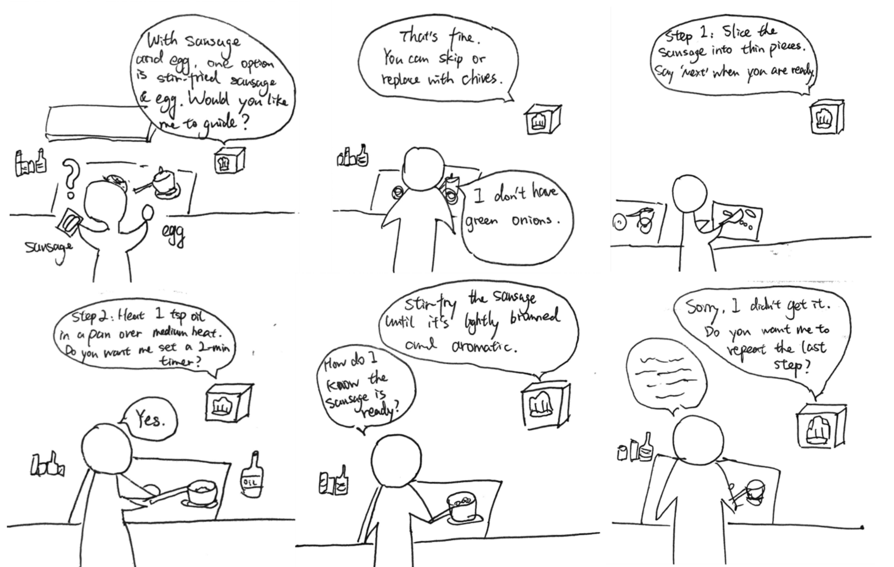
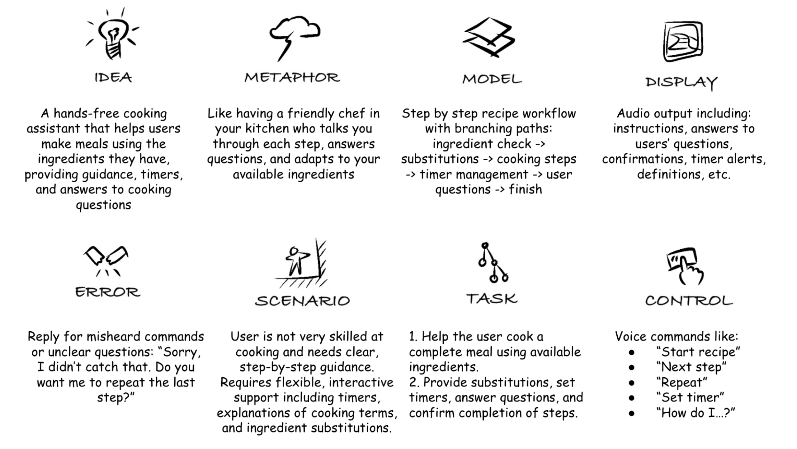

# Chatterboxes
**Collaborator: Yoyo Wang - 867**

## Part 1.
### Setup 

This is the greeting script:
[greets.sh](greets.sh)

Test commands by running:
```bash
./greets.sh
```
  
### Speech to Text

\*\***Write your own shell file that verbally asks for a numerical based input (such as a phone number, zipcode, number of pets, etc) and records the answer the respondent provides.**\*\*

This is the voice number input script:
[ask_number.sh](ask_number.sh)

Test commands by running:
```bash
./ask_number.sh
```

The script will:
1. Ask "Please tell me your number" using text-to-speech
2. Record 5 seconds of audio input
3. Process the speech using Vosk offline recognition
4. Save the result to `recorded_number.txt`
5. Play back the recognized number using text-to-speech

### 🤖 NEW: AI-Powered Conversations with Ollama

\*\***Try creating a simple voice interaction that combines speech recognition, Ollama processing, and text-to-speech output. Document what you built and how users responded to it.**\*\*

This is the voice AI assistant script:
[voice_ai_assistant.py](voice_ai_assistant.py)

Test commands by running:
```bash
python3 voice_ai_assistant.py
```

The script combines:
1. **Real-time speech recognition** using Vosk 
2. **AI processing** using Ollama API  
3. **Text-to-speech output** using Festival

Features:
- Real-time voice input with live transcription feedback
- AI-powered responses using Ollama phi3:mini model
- Voice output using Festival TTS
- Conversation logging to `conversation_log.txt`
- Say "exit" to quit the conversation

**User Response Documentation:**
The voice AI assistant provides a natural conversational experience. All interactions are logged to [conversation_log.txt](conversation_log.txt) with timestamps for easy review and analysis.

### Storyboard



### Verplank Diagram



### Acting out the dialogue

Use this link to find our dialogue:
https://drive.google.com/file/d/1kZfaJgTYqRgGHBQihvGuF6pen10cT4rR/view?usp=sharing

#### feedback

"Having a "teacher" I can consult at any time while cooking is a great solution for my pain points. I usually need to watch the tutorial or recipe several times before cooking, but there are still details I forget or need to confirm during the cooking process. However, during these times, I'm often busy controlling the heat, and my hands are always greasy and dirty, making them unsuitable for using a phone. Having a voice assistant that allows me to free my hands is great."
——Dean Xu

"You guys did a good job! The dialogue is just the same as how I expected which I will have with the intelligent machine. The scenario is good enough to use the AI coach chef. I really like it! And the acting is nice as well!"
——Richard Li

\*\***Describe if the dialogue seemed different than what you imagined when it was acted out, and how.**\*\*

Our dialogue is almost the same as what we set up and what we expected to do. The only thing is that the dialogue may take some time waiting for the user to cook and respond. The dialogue skips this part of the time.

# Lab 3 Part 2

For Part 2, you will redesign the interaction with the speech-enabled device using the data collected, as well as feedback from part 1.

## Prep for Part 2

1. What are concrete things that could use improvement in the design of your device? For example: wording, timing, anticipation of misunderstandings...
2. What are other modes of interaction _beyond speech_ that you might also use to clarify how to interact?
3. Make a new storyboard, diagram and/or script based on these reflections.

## Prototype your system

The system should:
* use the Raspberry Pi 
* use one or more sensors
* require participants to speak to it. 

*Document how the system works*

*Include videos or screencaptures of both the system and the controller.*

<details>
  <summary><strong>Submission Cleanup Reminder (Click to Expand)</strong></summary>
  
  **Before submitting your README.md:**
  - This readme.md file has a lot of extra text for guidance.
  - Remove all instructional text and example prompts from this file.
  - You may either delete these sections or use the toggle/hide feature in VS Code to collapse them for a cleaner look.
  - Your final submission should be neat, focused on your own work, and easy to read for grading.
  
  This helps ensure your README.md is clear professional and uniquely yours!
</details>

## Test the system
Try to get at least two people to interact with your system. (Ideally, you would inform them that there is a wizard _after_ the interaction, but we recognize that can be hard.)

Answer the following:

### What worked well about the system and what didn't?
\*\**your answer here*\*\*

### What worked well about the controller and what didn't?

\*\**your answer here*\*\*

### What lessons can you take away from the WoZ interactions for designing a more autonomous version of the system?

\*\**your answer here*\*\*


### How could you use your system to create a dataset of interaction? What other sensing modalities would make sense to capture?

\*\**your answer here*\*\*


