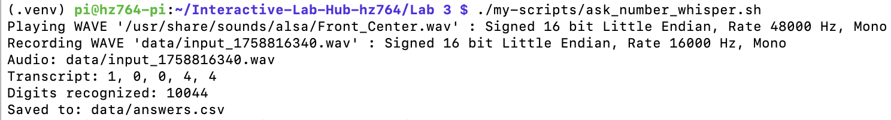
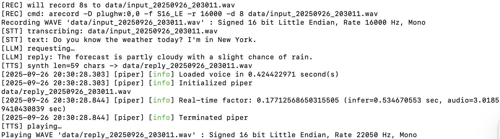
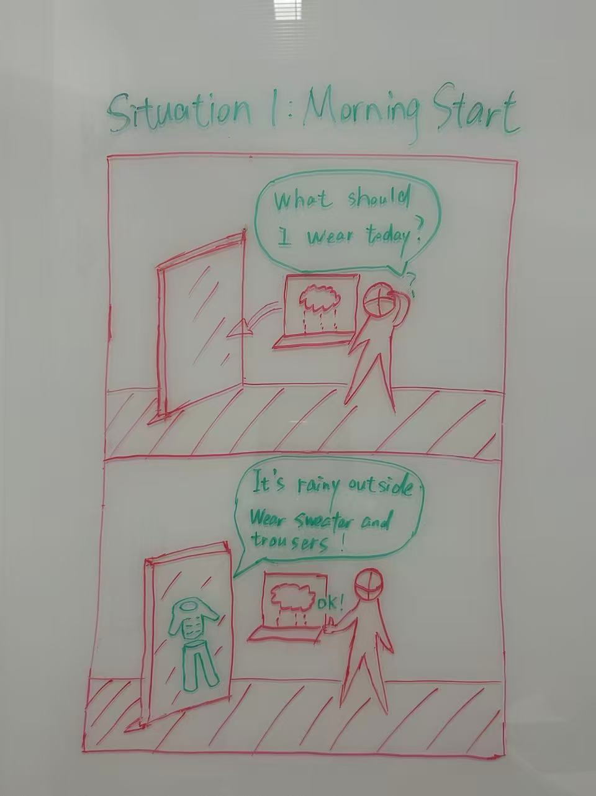
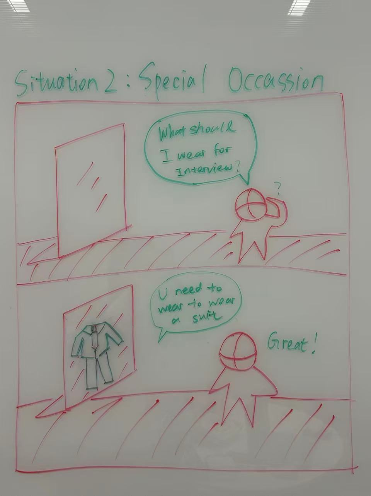
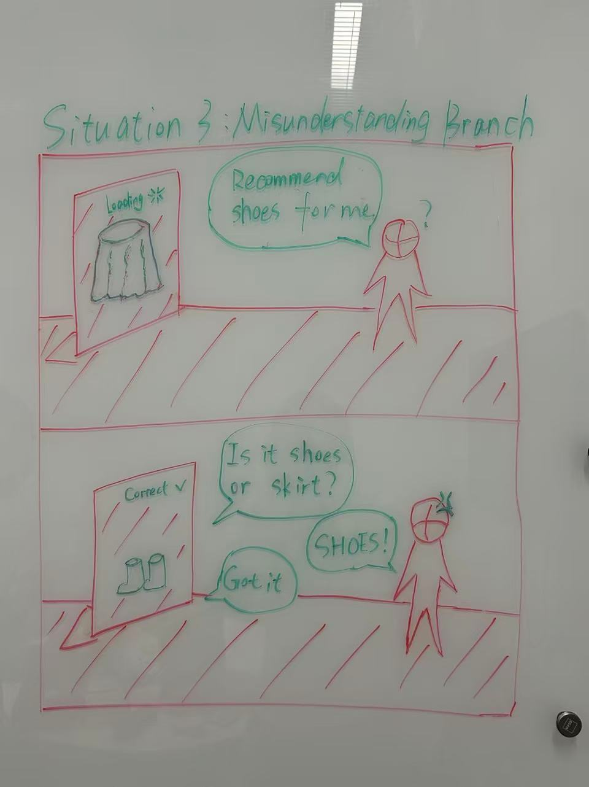

# Chatterboxes
**Huiying Zhan (hz764) and Joy Sun (Jiayi Sun)**
## Part 1.
### Text to Speech 
\*\***Write your own shell file to use your favorite of these TTS engines to have your Pi greet you by name.**\*\*
(This shell file should be saved to your own repo for this lab.)

<mark>See my implementation here: [greet_me.sh](./my-scripts/greet_me.sh)</mark>

<mark>See my generated audio file here: [welcome.wav](./my-scripts/welcome.wav)</mark>
  
### Speech to Text
***Write your own shell file that verbally asks for a numerical based input (such as a phone number, zipcode, number of pets, etc) and records the answer the respondent provides.***   
<mark>See my custom Whisper-based number input script here: [ask_number_whisper.sh](./my-scripts/ask_number_whisper.sh)</mark>   

#### Example Run
Here is a screenshot of the script running on my Pi, showing the audio file created, the transcript, and the recognized digits:

### 🤖 NEW: AI-Powered Conversations with Ollama

Want to add intelligent conversation capabilities to your voice projects? **Ollama** lets you run AI models locally on your Raspberry Pi for sophisticated dialogue without requiring internet connectivity!

#### Quick Start with Ollama
\*\***Try creating a simple voice interaction that combines speech recognition, Ollama processing, and text-to-speech output. Document what you built and how users responded to it.**\*\*
- **My code is located at:**  
  [`Lab 3/my-scripts/voice_interaction.py`](./my-scripts/voice_interaction.py)

- **Screenshots:**  
  *Program execution (record → STT → LLM → TTS):*  
    

### What I built
I implemented a simple pipeline that connects **speech recognition → Ollama LLM processing → text-to-speech output**:

1. **Recording & STT (Speech-to-Text):**  
   The system records 8 seconds of audio through `arecord` and transcribes it using Whisper.

2. **LLM processing with Ollama:**  
   The recognized text is sent to an Ollama model, which generates a natural language reply.

3. **TTS (Text-to-Speech):**  
   The reply is synthesized into speech using Piper TTS and played back through the speaker.

This creates a conversational loop where the Pi listens, processes, and speaks back.

### How users responded
- **Test dialogue:**  
  - User asked: *“Do you know the weather today? I’m in New York.”*  
  - System replied: *“The forecast is partly cloudy with a slight chance of rain.”*  

- **Feedback:**  
  - Users found the interaction smooth and natural — they were impressed that the Pi could listen and reply with a synthesized voice.  
  - Some noted the short recording window (8s) limited longer questions, but for quick queries the pipeline worked effectively.  
  - Overall, the demonstration showed how a lightweight Pi setup can support **real-time conversational AI**.

### Storyboard
\*\***Post your storyboard and diagram here.**\*\*

### Verplank diagram
We designed a **Smart Mirror Outfit Assistant** that recommends daily outfits based on **weather, temperature, and special occasions**. The interaction is through **voice input** and **speech + visual overlay** output.

1. **Morning Start**  
  

2. **Special Occasion**  
  

3. **Misunderstanding Branch**  
  

Write out what you imagine the dialogue to be. Use cards, post-its, or whatever method helps you develop alternatives or group responses.   

\*\***Please describe and document your process.**\*\*
## 🌳 Dialogue Tree: Smart Mirror Outfit Assistant
### Panel 1 – Morning Start (Weather-based Recommendation)

**User**: "Mirror, what should I wear today?"  
→ *System checks today’s weather*

#### If Rainy 🌧️
- **System**: "It’s rainy today. I recommend wearing a raincoat and waterproof shoes."  
- **User**: "Should I also bring an umbrella?"  
- **System**: "Yes, carrying an umbrella will keep you dry."

#### If Snowy ❄️
- **System**: "It’s snowing today. I suggest a down jacket, warm boots, and gloves."  
- **User**: "Can I wear sneakers instead?"  
- **System**: "Sneakers may get wet in the snow. Boots would be safer."

#### If Sunny & Hot ☀️
- **System**: "It’s sunny and warm, around 28 degrees. I recommend a T-shirt and shorts."  
- **User**: "Do I need sunglasses?"  
- **System**: "Yes, sunglasses will help protect your eyes from the bright sun."

#### If Cold but Clear 🌤️
- **System**: "It’s 12 degrees but clear. I suggest wearing long pants and a jacket."

---

### Panel 2 – Special Occasion (Context-based Recommendation)

**User**: "I have a job interview today."  
→ *System applies formal attire rules*

- **System**: "For a formal occasion, I recommend a dark suit with a white shirt. That will look more professional."  
- **User**: "Should I wear a tie?"  
  - If **Yes** → "A simple dark tie will make your outfit more polished."  
  - If **No** → "That’s fine, but with a tie you’ll look more formal."  

- **User**: "Can you show me how it looks?"  
- **System**: *[Overlay suit + tie on reflection]*

#### Alternative Occasions
- **If Dinner Date** → "A smart-casual outfit would be good, like a blazer with chinos."  
- **If Sports Event** → "Casual wear is fine — maybe a hoodie and sneakers."

---

### Panel 3 – Misunderstanding Branch (Error Handling)

**User**: "Recommend a pair of shoes."  
→ *ASR Misheard* → "Recommend a skirt."  

- **System (clarification strategy)**: "Did you mean skirt or shoes?"  
- **User**: "Shoes."  
- **System**: "Great. Do you want formal shoes or casual shoes?"  
  - If **Formal** → "Black leather shoes would match your suit perfectly."  
  - If **Casual** → "White sneakers would go well with a casual outfit."

### Acting out the dialogue

Find a partner, and *without sharing the script with your partner* try out the dialogue you've designed, where you (as the device designer) act as the device you are designing.  Please record this interaction (for example, using Zoom's record feature).

### 🎧 Dialogue Audio Recording
You can listen to the acted-out dialogue here:  
[Dialogue performing.m4a](./Dialogue%20performing.m4a)   

\*\***Describe if the dialogue seemed different than what you imagined when it was acted out, and how.**\*\*
### Reflection: Differences Between Imagined and Real Dialogue

When we acted out the dialogue, it turned out to be quite different from the imagined dialogue tree.

#### Structured vs. Natural Flow
- **Imagined version**: Highly structured, with predefined conditions (rainy, snowy, sunny, cold).  
  - User asked short, direct questions like *“Should I also bring an umbrella?”* or *“Do I need sunglasses?”*.  
  - The flow assumed clear, logical branches.  

- **Real version**: User spoke more naturally and unpredictably.  
  - Example: *“Today I would like to go out. What kind of suit would you recommend?”*  
  - This shifted the topic toward **activity-based clothing** rather than just weather.  
  - System (played by partner) adapted by asking about the **occasion**, leading to discussions about **sportswear, tennis skirts, and even color preferences**.

#### Personalization and Context
- Real dialogue introduced **unexpected context and personalization**.  
  - Example: detecting closet inventory (*“blue and pink skirts”*) and giving **tailored recommendations**.  
- This personalization was **not considered** in the original dialogue flow.

#### Key Insights
- **Imagined script**: Useful as a starting point to structure logic.  
- **Real interaction**: Showed that actual users bring in:  
  - Personal preferences  
  - Casual, varied language  
  - Follow-up questions beyond the rigid tree  

**Conclusion**: The acting-out exercise highlighted the importance of **flexibility, personalization, and error-handling** in real system design, beyond what a fixed dialogue tree can capture.

# Lab 3 Part 2

For Part 2, you will redesign the interaction with the speech-enabled device using the data collected, as well as feedback from part 1.

## Prototype your system
### <mark>1.New Story Board</mark>
#### Situation 1: Choose the Type

#### Situation 2: Choose the Outfit

### <mark>2.Document how the system works</mark>
### System Documentation 1: Wizard of oz
#### 1.Overview

This project is an interactive demo that runs on a Raspberry Pi and connects a SparkFun Qwiic Joystick to a web interface. The system streams joystick data to a browser in real time and allows the user to convert typed text into spoken audio on the Pi. The implementation uses a lightweight Flask web server with Socket.IO for bi-directional messaging, and espeak for local text-to-speech output.

#### 2.What we achieved

- Provide a clean, low-latency demo of hardware → web interaction.

- Replace an accelerometer-based input with a Qwiic Joystick as the primary interaction device.

- Keep audio output stable and deterministic (avoid flaky real-time microphone streaming).

#### 3.How it works
This prototype demonstrates an interactive dialogue system between a user and a smart mirror, implemented on a Raspberry Pi.

The interaction is simulated through a hardware joystick and a web interface:

- The joystick acts as the user’s physical input device, representing gestures or presence in front of the mirror.
When the joystick is moved or pressed, its real-time position data are captured by the Raspberry Pi and transmitted to the browser via a lightweight Flask + Socket.IO server.
This simulates how the mirror might sense or respond to a user’s movements or actions.

- The web interface represents the mirror’s intelligence and speech output.
The browser allows text input, which mimics what the mirror would “say” in response to the user.
When a line of text is entered, it is sent to the Raspberry Pi through a WebSocket connection.
The Pi immediately converts the text into speech using the built-in text-to-speech engine (espeak), producing an audible reply through the speaker — just as a smart mirror might talk back to the user.

**Through this setup, the system forms a closed interaction loop:**

1.User gesture or presence → sensed by the joystick and visualized on the web page.

2.Mirror response → simulated by typed text, spoken aloud by the Raspberry Pi.

This prototype effectively recreates a two-way conversational experience between a user and an intelligent mirror, without relying on heavy machine-learning or cloud components. It provides a simple, tangible framework to explore timing, responsiveness, and interaction design in human-mirror communication.

### System Documentation 2: Outfit Recommendation Assistant

#### 1. Overview
This project is an interactive outfit recommendation system implemented on a Raspberry Pi using a SparkFun Qwiic Joystick as the primary input device. The system runs locally and provides real-time voice feedback to guide users through outfit themes and style options. Each joystick movement or press triggers context-aware spoken responses generated through Piper text-to-speech. The prototype simulates a “smart mirror” that can not only recommend outfits but also engage in short, spoken dialogues with the user through a secondary voice interaction script. The goal is to explore embodied interaction and conversational timing in tangible, voice-driven interfaces.

#### 2. What We Achieved
- Created a fully functional **joystick-based voice interface** that allows users to browse outfit themes (Sports, Social, Color, Interview, Daily) and listen to style options without a screen.  
- Implemented **robust motion recognition** and threshold calibration for smooth, low-latency navigation on the Raspberry Pi.  
- Integrated **text-to-speech (Piper → aplay fallback to Espeak)** for consistent and clear local audio playback.  
- Added **voice Q&A mode** triggered by joystick press or mid-hold gesture, enabling interactive question–answer conversations powered by `voice_interaction_router.py`.  

#### 3. How It Works
The system establishes a continuous interaction loop between the user’s physical gestures and the Raspberry Pi’s audio responses:

- **Hardware Input (Joystick):**  
  The SparkFun Qwiic Joystick provides horizontal, vertical, and button data over I²C. At startup, the script samples joystick values to determine the neutral center and automatically sets sensitivity thresholds. Moving the joystick **up or down** changes the outfit theme, while **left or right** cycles through the available options within that theme. Each action immediately triggers a voice message in the format:  
  `recommend type: <Theme>. Option <Index>. <Sentence>`

- **Speech Output (TTS):**  
  When a new theme or option is selected, the system converts the corresponding text from `outfits.py` into audio using Piper TTS, then plays it through ALSA (`aplay`). If Piper fails, Espeak automatically handles fallback playback to maintain responsiveness.

- **Voice Interaction:**  
  Pressing the joystick (or holding it steady at center for 1.2s, if button readout fails) launches `voice_interaction_router.py`. This script processes user speech or text queries, determines relevant outfit logic from `outfits.py`, and returns a spoken reply. The exchange mimics natural dialogue—like asking a mirror, “What should I wear for sports?”—and receiving a contextual spoken answer.

**Overall Flow:**
1. User performs a joystick gesture → Raspberry Pi detects motion and determines action type.  
2. Corresponding text prompt is selected from `outfits.py`.  
3. Text is synthesized into speech via Piper and played aloud.  
4. Optional voice Q&A extends the dialogue, forming a closed feedback loop between physical input and auditory output.

This architecture enables a fully local, screenless, and conversational prototype—illustrating how a tangible interface can blend physical gestures with responsive, expressive voice output to create a personalized interactive mirror experience.

### <mark>3.Include videos or screencaptures of both the system and the controller.</mark>

[Watch the Mirror Interaction video here](https://youtu.be/myvbhKIoJT8)

[Watch the User Conversation video here](https://youtu.be/t43ZWVyX4Zk)

## Test the system

### What worked well about the system and what didn't?
The system successfully guided both participants through theme and outfit selection with clear audio feedback. The voice output was natural and the “recommend type” prefix helped them understand the context of each option. The participants found the up/down and left/right navigation intuitive once they heard the first few lines. However, there was occasional delay in audio playback, especially when Piper was generating longer sentences. One participant also noticed that quick joystick movements were sometimes ignored, suggesting that the input thresholds could be more responsive.

### What worked well about the controller and what didn't?
The Qwiic Joystick offered smooth analog control and provided a clear sense of directionality for switching between options. The physical form made it easy for users to remember which axis changed themes versus options. The press-to-speak action worked well for triggering the voice Q&A mode, but some users pressed too briefly, leading to missed triggers due to hardware debounce. The fallback “hold in the middle” interaction helped prevent deadlocks, but users didn’t always realize it was an intentional feature.

### What lessons can you take away from the WoZ interactions for designing a more autonomous version of the system?
From the Wizard-of-Oz sessions, it became clear that the system benefits from short, conversational feedback to keep users engaged. Participants tended to wait for confirmation after each action, implying that a fully autonomous version should generate quick acknowledgments such as “Got it” or “Switching to Social theme.” It also showed that adaptive timing—pausing slightly after playback before accepting new input—would make interactions feel smoother. A more autonomous version could combine user intent prediction (based on repeated joystick patterns) with contextual language responses for a more human-like experience.

### How could you use your system to create a dataset of interaction? What other sensing modalities would make sense to capture?
The system could log joystick positions, button states, timestamps, and recognized speech transcripts to create a dataset of multimodal interactions. Each session could store pairs of physical input sequences and spoken responses, enabling supervised learning of user intent patterns. Adding a small microphone array could capture tone and hesitation, while a camera could record facial expressions or gaze direction to analyze engagement. These additional sensing modalities would allow future models to learn richer mappings between gesture, voice, and emotional state, supporting more adaptive and autonomous dialogue behavior.
