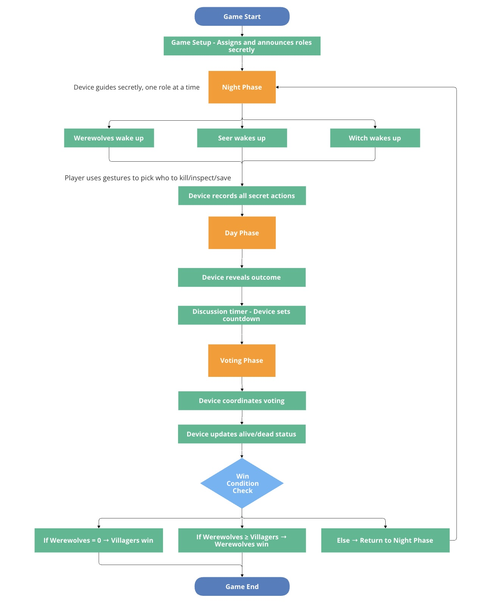
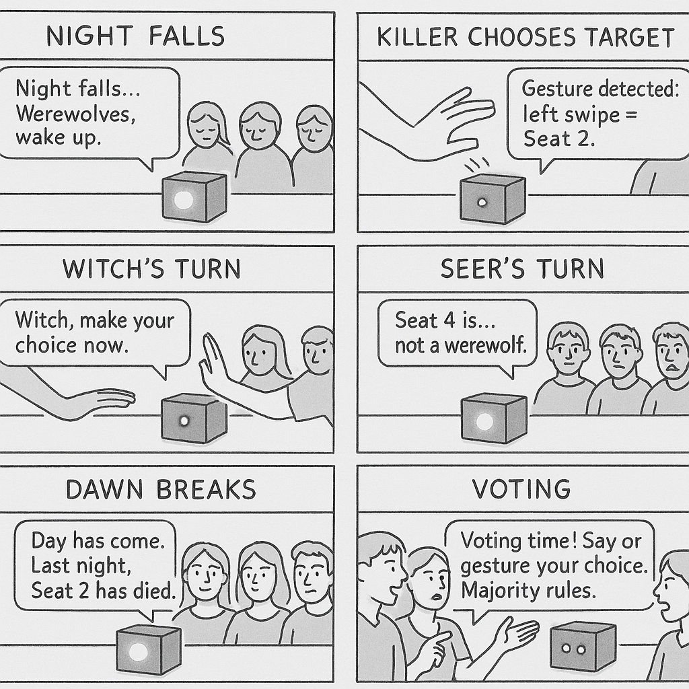
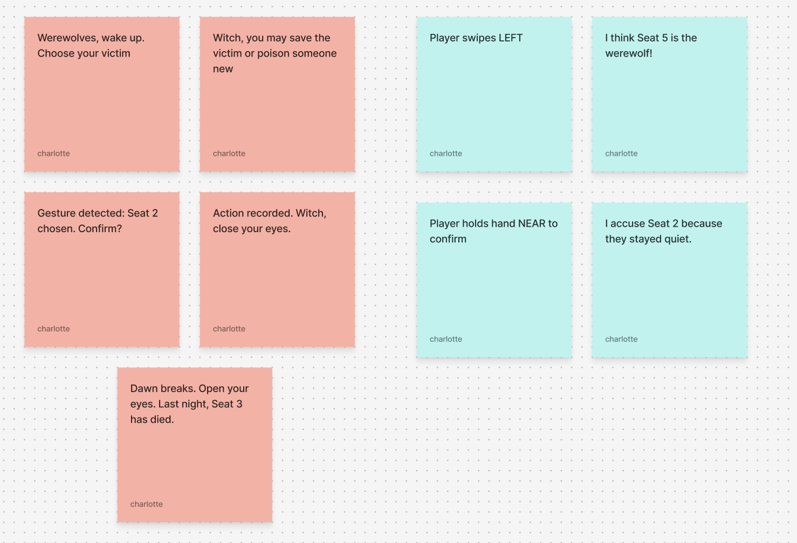
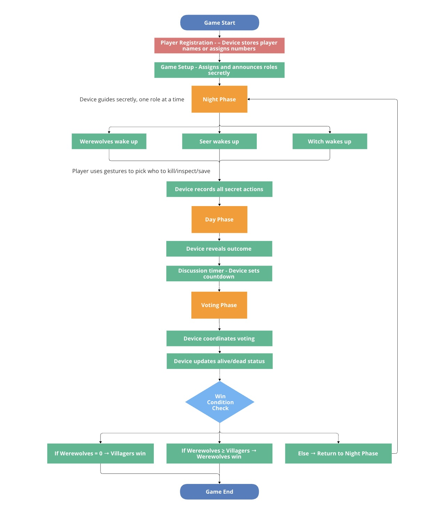
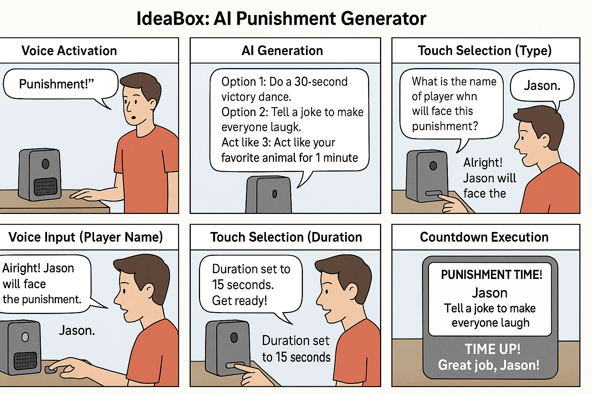
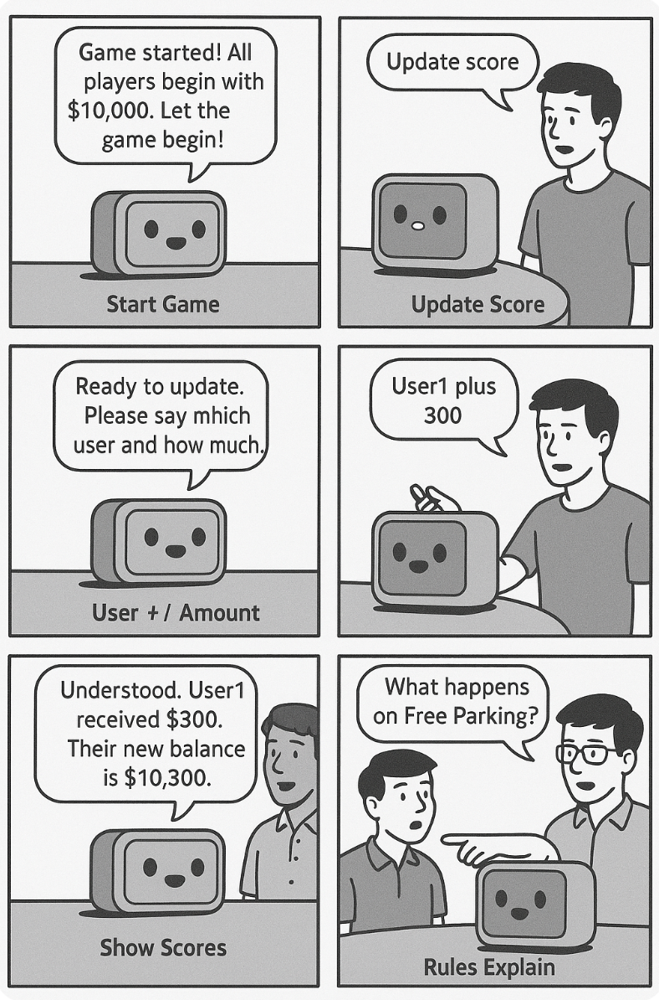

# Chatterboxes
**NAMES OF COLLABORATORS HERE**

Charlotte Lin (hl2575), Zoe Tseng (yzt2), Eva Huang (lh764)

In this lab, we want you to design interaction with a speech-enabled device--something that listens and talks to you. This device can do anything *but* control lights (since we already did that in Lab 1).  First, we want you first to storyboard what you imagine the conversational interaction to be like. Then, you will use wizarding techniques to elicit examples of what people might say, ask, or respond.  We then want you to use the examples collected from at least two other people to inform the redesign of the device.

We will focus on **audio** as the main modality for interaction to start; these general techniques can be extended to **video**, **haptics** or other interactive mechanisms in the second part of the Lab.

<details>
  <summary><strong>Prep for Part 1: Get the Latest Content and Pick up Additional Parts (Click to Expand)</strong></summary>


Please check instructions in [prep.md](prep.md) and complete the setup before class on Wednesday, Sept 23rd.

### Pick up Web Camera If You Don't Have One

Students who have not already received a web camera will receive their [Logitech C270 Webcam](https://www.amazon.com/Logitech-Desktop-Widescreen-Calling-Recording/dp/B004FHO5Y6/ref=sr_1_3?crid=W5QN79TK8JM7&dib=eyJ2IjoiMSJ9.FB-davgIQ_ciWNvY6RK4yckjgOCrvOWOGAG4IFaH0fczv-OIDHpR7rVTU8xj1iIbn_Aiowl9xMdeQxceQ6AT0Z8Rr5ZP1RocU6X8QSbkeJ4Zs5TYqa4a3C_cnfhZ7_ViooQU20IWibZqkBroF2Hja2xZXoTqZFI8e5YnF_2C0Bn7vtBGpapOYIGCeQoXqnV81r2HypQNUzFQbGPh7VqjqDbzmUoloFA2-QPLa5lOctA.L5ztl0wO7LqzxrIqDku9f96L9QrzYCMftU_YeTEJpGA&dib_tag=se&keywords=webcam%2Bc270&qid=1758416854&sprefix=webcam%2Bc270%2Caps%2C125&sr=8-3&th=1) and bluetooth speaker on Wednesday at the beginning of lab. If you cannot make it to class this week, please contact the TAs to ensure you get these. 

### Get the Latest Content

As always, pull updates from the class Interactive-Lab-Hub to both your Pi and your own GitHub repo. There are 2 ways you can do so:

**\[recommended\]**Option 1: On the Pi, `cd` to your `Interactive-Lab-Hub`, pull the updates from upstream (class lab-hub) and push the updates back to your own GitHub repo. You will need the *personal access token* for this.

```
pi@ixe00:~$ cd Interactive-Lab-Hub
pi@ixe00:~/Interactive-Lab-Hub $ git pull upstream Fall2025
pi@ixe00:~/Interactive-Lab-Hub $ git add .
pi@ixe00:~/Interactive-Lab-Hub $ git commit -m "get lab3 updates"
pi@ixe00:~/Interactive-Lab-Hub $ git push
```

Option 2: On your your own GitHub repo, [create pull request](https://github.com/FAR-Lab/Developing-and-Designing-Interactive-Devices/blob/2022Fall/readings/Submitting%20Labs.md) to get updates from the class Interactive-Lab-Hub. After you have latest updates online, go on your Pi, `cd` to your `Interactive-Lab-Hub` and use `git pull` to get updates from your own GitHub repo.

</details>


## Part 1.

<details>
  <summary><strong>Setup (Click to Expand)</strong></summary>
Activate your virtual environment

```
pi@ixe00:~$ cd Interactive-Lab-Hub
pi@ixe00:~/Interactive-Lab-Hub $ cd Lab\ 3
pi@ixe00:~/Interactive-Lab-Hub/Lab 3 $ python3 -m venv .venv
pi@ixe00:~/Interactive-Lab-Hub $ source .venv/bin/activate
(.venv)pi@ixe00:~/Interactive-Lab-Hub $ 
```

Run the setup script
```(.venv)pi@ixe00:~/Interactive-Lab-Hub $ pip install -r requirements.txt  ```

Next, run the setup script to install additional text-to-speech dependencies:
```
(.venv)pi@ixe00:~/Interactive-Lab-Hub/Lab 3 $ ./setup.sh
```

</details>

<details>
  <summary><strong>Text to Speech (Click to Expand)</strong></summary>
In this part of lab, we are going to start peeking into the world of audio on your Pi! 

We will be using the microphone and speaker on your webcamera. In the directory is a folder called `speech-scripts` containing several shell scripts. `cd` to the folder and list out all the files by `ls`:

```
pi@ixe00:~/speech-scripts $ ls
Download        festival_demo.sh  GoogleTTS_demo.sh  pico2text_demo.sh
espeak_demo.sh  flite_demo.sh     lookdave.wav
```

You can run these shell files `.sh` by typing `./filename`, for example, typing `./espeak_demo.sh` and see what happens. Take some time to look at each script and see how it works. You can see a script by typing `cat filename`. For instance:

```
pi@ixe00:~/speech-scripts $ cat festival_demo.sh 
#from: https://elinux.org/RPi_Text_to_Speech_(Speech_Synthesis)#Festival_Text_to_Speech
```
You can test the commands by running
```
echo "Just what do you think you're doing, Dave?" | festival --tts
```

Now, you might wonder what exactly is a `.sh` file? 
Typically, a `.sh` file is a shell script which you can execute in a terminal. The example files we offer here are for you to figure out the ways to play with audio on your Pi!

You can also play audio files directly with `aplay filename`. Try typing `aplay lookdave.wav`.

\*\***Write your own shell file to use your favorite of these TTS engines to have your Pi greet you by name.**\*\*
(This shell file should be saved to your own repo for this lab.)

---
Bonus:
[Piper](https://github.com/rhasspy/piper) is another fast neural based text to speech package for raspberry pi which can be installed easily through python with:
```
pip install piper-tts
```
and used from the command line. Running the command below the first time will download the model, concurrent runs will be faster. 
```
echo 'Welcome to the world of speech synthesis!' | piper \
  --model en_US-lessac-medium \
  --output_file welcome.wav
```
Check the file that was created by running `aplay welcome.wav`. Many more languages are supported and audio can be streamed dirctly to an audio output, rather than into an file by:

```
echo 'This sentence is spoken first. This sentence is synthesized while the first sentence is spoken.' | \
  piper --model en_US-lessac-medium --output-raw | \
  aplay -r 22050 -f S16_LE -t raw -
```

</details>

<details>
  <summary><strong>Speech to Text (Click to Expand)</strong></summary>
Next setup speech to text. We are using a speech recognition engine, [Vosk](https://alphacephei.com/vosk/), which is made by researchers at Carnegie Mellon University. Vosk is amazing because it is an offline speech recognition engine; that is, all the processing for the speech recognition is happening onboard the Raspberry Pi. 

Make sure you're running in your virtual environment with the dependencies already installed:
```
source .venv/bin/activate
```

Test if vosk works by transcribing text:

```
vosk-transcriber -i recorded_mono.wav -o test.txt
```

You can use vosk with the microphone by running 
```
python test_microphone.py -m en
```

---
Bonus:
[Whisper](https://openai.com/index/whisper/) is a neural network–based speech-to-text (STT) model developed and open-sourced by OpenAI. Compared to Vosk, Whisper generally achieves higher accuracy, particularly on noisy audio and diverse accents. It is available in multiple model sizes; for edge devices such as the Raspberry Pi 5 used in this class, the tiny.en model runs with reasonable latency even without a GPU.

By contrast, Vosk is more lightweight and optimized for running efficiently on low-power devices like the Raspberry Pi. The choice between Whisper and Vosk depends on your scenario: if you need higher accuracy and can afford slightly more compute, Whisper is preferable; if your priority is minimal resource usage, Vosk may be a better fit.

In this class, we provide two Whisper options: A quantized 8-bit faster-whisper model for speed, and the standard Whisper model. Try them out and compare the trade-offs.

Make sure you're in the Lab 3 directory with your virtual environment activated:
```
cd ~/Interactive-Lab-Hub/Lab\ 3/speech-scripts
source ../.venv/bin/activate
```

Then test the Whisper models:
```
python whisper_try.py
```
and

```
python faster_whisper_try.py
```
\*\***Write your own shell file that verbally asks for a numerical based input (such as a phone number, zipcode, number of pets, etc) and records the answer the respondent provides.**\*\*

</details>


<details>
  <summary><strong>🤖 NEW: AI-Powered Conversations with Ollama (Click to Expand)</strong></summary>
Want to add intelligent conversation capabilities to your voice projects? **Ollama** lets you run AI models locally on your Raspberry Pi for sophisticated dialogue without requiring internet connectivity!

#### Quick Start with Ollama

**Installation** (takes ~5 minutes):
```bash
# Install Ollama
curl -fsSL https://ollama.com/install.sh | sh

# Download recommended model for Pi 5
ollama pull phi3:mini

# Install system dependencies for audio (required for pyaudio)
sudo apt-get update
sudo apt-get install -y portaudio19-dev python3-dev

# Create separate virtual environment for Ollama (due to pyaudio conflicts)
cd ollama/
python3 -m venv ollama_venv
source ollama_venv/bin/activate

# Install Python dependencies in separate environment
pip install -r ollama_requirements.txt
```
#### Ready-to-Use Scripts

We've created three Ollama integration scripts for different use cases:

**1. Basic Demo** - Learn how Ollama works:
```bash
python3 ollama_demo.py
```

**2. Voice Assistant** - Full speech-to-text + AI + text-to-speech:
```bash
python3 ollama_voice_assistant.py
```

**3. Web Interface** - Beautiful web-based chat with voice options:
```bash
python3 ollama_web_app.py
# Then open: http://localhost:5000
```

#### Integration in Your Projects

Simple example to add AI to any project:
```python
import requests

def ask_ai(question):
    response = requests.post(
        "http://localhost:11434/api/generate",
        json={"model": "phi3:mini", "prompt": question, "stream": False}
    )
    return response.json().get('response', 'No response')

# Use it anywhere!
answer = ask_ai("How should I greet users?")
```

**📖 Complete Setup Guide**: See `OLLAMA_SETUP.md` for detailed instructions, troubleshooting, and advanced usage!

\*\***Try creating a simple voice interaction that combines speech recognition, Ollama processing, and text-to-speech output. Document what you built and how users responded to it.**\*\*

I built a Raspberry Pi voice assistant using offline speech recognition (Vosk), AI responses (Ollama), and text-to-speech (espeak). It handles simple greetings and exit commands with pre-set responses, while all other input is answered by Ollama dynamically. Users speak naturally, and the assistant replies verbally. In testing, it reliably recognized speech, generated coherent AI responses, and provided fallback answers if something went wrong. Users found it easy to use, responsive, and engaging.

</details>


### Serving Pages

In Lab 1, we served a webpage with flask. In this lab, you may find it useful to serve a webpage for the controller on a remote device. Here is a simple example of a webserver.

```
pi@ixe00:~/Interactive-Lab-Hub/Lab 3 $ python server.py
 * Serving Flask app "server" (lazy loading)
 * Environment: production
   WARNING: This is a development server. Do not use it in a production deployment.
   Use a production WSGI server instead.
 * Debug mode: on
 * Running on http://0.0.0.0:5000/ (Press CTRL+C to quit)
 * Restarting with stat
 * Debugger is active!
 * Debugger PIN: 162-573-883
```
From a remote browser on the same network, check to make sure your webserver is working by going to `http://<YourPiIPAddress>:5000`. You should be able to see "Hello World" on the webpage.

---

### Storyboard

Storyboard and/or use a Verplank diagram to design a speech-enabled device. (Stuck? Make a device that talks for dogs. If that is too stupid, find an application that is better than that.) 

\*\***Post your storyboard and diagram here.**\*\*

<p float="left">
  
</p>

<p float="left">
  
</p>

One of the core functions of this device is to act as a speech- and gesture-enabled moderator for the party game *Werewolf*.  
It listens to player input, provides moderator narration, and supports secret gestures for actions like targeting — making the game fair, consistent, and immersive.  

#### 🎮 How to Use the Device  

Setup  
- Each player registers their seat number.  
- The device randomly assigns roles and privately informs players.
  
Night Phase 
- The device calls roles one by one.  
- Werewolves, Seer, and Witch use hand gestures over the sensor to secretly perform actions.
  
Day Phase  
- The device announces the results of the night (e.g., who died or was saved).  
- A discussion timer starts for accusations and defenses.
  
Voting Phase  
- Players vote by speaking or by hovering their hand over the sensor for a silent vote.
  
Win Check  
- The device tracks remaining players.  
- If one side wins, it announces the result. Otherwise, the cycle continues.

---

Write out what you imagine the dialogue to be. Use cards, post-its, or whatever method helps you develop alternatives or group responses. 

\*\***Please describe and document your process.**\*\*

Step 1: Brainstorm

I began by outlining the major phases of the Werewolf game: Setup, Night, Day, Voting, and Win Check. For each phase, I noted what a human moderator normally says to guide the game. I also decided which actions would be handled by speech and which would be handled by gestures. This gave me a clear map of where the device should speak.

Step 2: Create Dialogue Cards

Next, I made dialogue cards to prototype the interactions. On pink Post-its, I wrote the device’s moderator prompts. On blue Post-its, I wrote player responses (spoken or gestures). This created a physical back-and-forth I could shuffle and test.

Example:
<p float="left">
  
</p>

Step 3: Test with Peers 

I then tested the dialogue flow with friends by pretending to be the device. I read the pink cards aloud, while they acted as players and gave responses from the blue cards. 

Step 4: Group & Refine

Based on observations, I refined the device’s prompts to better align with natural player speech and made the interaction more flexible and realistic.

### Acting out the dialogue

Find a partner, and *without sharing the script with your partner* try out the dialogue you've designed, where you (as the device designer) act as the device you are designing.  Please record this interaction (for example, using Zoom's record feature).

\*\***Describe if the dialogue seemed different than what you imagined when it was acted out, and how.**\*\*

We worked together to act out and test out the dialouges

*Ideabox https://youtu.be/8xRIaNbEIwg

*Warewolves https://youtu.be/oKx95uURB4s

*Rules explain https://drive.google.com/file/d/10ByKoQw41XVuMDyUWIKn8qw_uJNr9zi4/view?usp=drive_link

For the werewolves one, the result turned out a little different than I originally imagined. Since the game is designed for many participants, acting it out with only three people changed the dynamic. In my original script, there were multiple roles such as killers, villagers, seers, and a witch, but for the play-through we simplified it to only killers and villagers. Even with this reduction, the overall steps of the game stayed consistent.

One new realization I had was about character assignment. During the acting, I noticed that the device may need to remember each player’s name and assign roles one by one, either by calling them over to whisper their role or by showing it on a mini screen on the Pi. This was something I hadn’t considered in my initial design.

<details>
  <summary><strong>Wizarding with the Pi (optional)(Click to Expand)</strong></summary>
  
In the [demo directory](./demo), you will find an example Wizard of Oz project. In that project, you can see how audio and sensor data is streamed from the Pi to a wizard controller that runs in the browser.  You may use this demo code as a template. By running the `app.py` script, you can see how audio and sensor data (Adafruit MPU-6050 6-DoF Accel and Gyro Sensor) is streamed from the Pi to a wizard controller that runs in the browser `http://<YouPiIPAddress>:5000`. You can control what the system says from the controller as well!

\*\***Describe if the dialogue seemed different than what you imagined, or when acted out, when it was wizarded, and how.**\*\*

</details>


# Lab 3 Part 2

For Part 2, you will redesign the interaction with the speech-enabled device using the data collected, as well as feedback from part 1.

## Prep for Part 2

### Werewolves

1. What are concrete things that could use improvement in the design of your device? For example: wording, timing, anticipation of misunderstandings...

There are a few concrete areas where the device could be improved:  

- **🧍 Player Identification** – During the game setup stage, the device should ask how many people are trying to play first and remember each player’s name/ assign them a number. This would make it possible to assign roles accurately and call players individually during the night phase.  
- **🔊 Audio Timing** – The device sometimes misses the first few seconds of a player’s speech when testing. Adding a short beep sound before recording starts would alert players that the device is ready, ensuring their words are captured completely.  
- **⏱️ Clearer Transitions** – The pacing between speaking phases could be more distinct. Small pauses or auditory cues between phases (like a chime or tone) would help players anticipate what’s coming next and reduce confusion.  

2. What are other modes of interaction _beyond speech_ that you might also use to clarify how to interact?

To make the experience clearer and more engaging, additional interaction modes could be added:  

- **🔘 Button Input** – A simple button could be used to confirm actions such as role assignment or voting, especially for players who prefer tactile feedback.  
- **💡 LED Indicators** – Lights could signal whether it’s currently day or night (e.g., blue for night, yellow for day), helping players stay aware of the game’s phase at a glance.  
- **🖥️ On-Screen Display** – Showing brief text or icons on the Raspberry Pi’s screen could help clarify instructions, show countdowns, or confirm gestures — making the interaction more intuitive and engaging.  

3. Make a new storyboard, diagram and/or script based on these reflections.

<p float="left">
  
</p>

## Prototype your system

The system should:
* use the Raspberry Pi 
* use one or more sensors
* require participants to speak to it. 

*Document how the system works*
*Include videos or screencaptures of both the system and the controller.*

### 🎮 Game Moderator Device – Voice Assistant (Raspberry Pi + Ollama + MPR121)

Our device functions as a **voice-controlled game moderator** designed to make group games like Werewolf or Monopoly more interactive and engaging. It uses speech recognition, text-to-speech, and a touch sensor interface (MPR121) to communicate naturally with players. We originally planned three main features—IdeaBox, Werewolves, and Rules Explain—but for this prototype, we implemented two: IdeaBox and Rules Explain.

- 💡 The IdeaBox feature uses AI (through the Ollama model) to generate fun, creative punishment or activity ideas that players can select by touching specific pads on the MPR121 sensor. 

<p float="left">
  
</p>

- 📘 The Rules Explain feature allows players to ask questions about the game’s rules, and the assistant responds with AI-generated explanations through voice output. 

<p float="left">
  
</p>

### Command Reference Table

| **Command / Action** | **Input Type** | **System Action** | **Example Response Spoken by Assistant** |
|-----------------------|----------------|-------------------|------------------------------------------|
| **Start Game** | Voice | Initializes a new game session and asks the user to input the number of players. | “Please touch a pad to indicate the number of players.” |
| **Enter Number of Players** | Sensor (Touch Pad for player count) | Processes the user's touch input to set up players and initialize their balances. | “Game started! User1, User2, and User3 all begin with $10,000. Let the game begin!” |
| **Update Score** | Voice | Activates score update mode and waits for the player name and amount. | “Ready to update. Please say which user and how much.” |
| **User# plus / minus amount** | Voice | Parses the command and updates that player's score locally. | “Understood. User1 received $300. Their new balance is $10,300.” |
| **Show Scores** | Voice | Announces the current balance of all players. | “Current scores are: User1: $10,300, User2: $9,700, User3: $10,000.” |
| **Exit / Stop Game** | Voice | Ends or pauses the current session. | “Goodbye! Have a great day!” |
| **Punishment (IdeaBox)** | Voice | Generates 5 AI-powered punishment ideas using Ollama. | “Option 1: Do a 30-second victory dance for the winning team.” |
| **Punishment Type Selection** | Sensor (Touch Pad 0–4) | Selects one of the AI-generated punishments. | “You selected option 2: Tell a joke to make everyone laugh.” |
| **Punishment User Selection** | Voice | Listens for the user’s spoken input to determine who will receive the punishment. | (No fixed reply) → Assistant then says: “Touch a pad to select punishment duration.” |
| **Punishment Duration Selection** | Sensor (Touch Pad 5–11) | Selects the duration of the chosen punishment. | “Duration set to 15 seconds.” |
| **Run Punishment Countdown** | System | Displays and counts down the punishment timer for the selected player. | “Time up! Great job, Player2!” |
| **Game Help / Instructions** | Voice | Sends the player’s question to Ollama for a conversational rule explanation. | “This rule means…” |


### Touch Sensor Notes  Table
| Action                        | User Action                                                          | Notes / Mapping                                                                            |
| ----------------------------- | -------------------------------------------------------------------- | ------------------------------------------------------------------------------------------ |
| Initialize Number of Players        | Touch a pad 1–11 to indicate number of players                       | Pad 2 = 2 player, Pad 3 = 3 players...                              |
| Punishment Type Selection     | Touch pad 0–4 to select one of the 5 AI-generated punishment options | Pad 0 = Option 1, Pad 1 = Option 2, Pad 2 = Option 3, … Pad 4 = Option 5                   |
| Punishment Duration Selection | Touch pad 5–11 to select duration in seconds                         | Pad 5 = 5s, Pad 6 = 10s, Pad 7 = 15s, Pad 8 = 20s, Pad 9 = 30s, Pad 10 = 45s, Pad 11 = 60s |


**video example**  `Start Game` -> ` Enter number of players` -> `update score` ->  `User# plus / minus amount` : 
- After the user start the game with voice control, user can touch the pad to indicate how many players there are for this game
- Commands like “update score” trigger a short interaction flow, where the system waits for the next instruction (player + amount).
- https://drive.google.com/file/d/1G3Y2ljqYQE7NIuNFt3YNdnzj_blnpvc8/view?usp=drive_link

**video example**  `Punishment ` -> ` Punishment Type Selection` -> ` Punishment User Selection` -> `Punishment Duration Selection` -> `Run Punishment Countdown`  :
- Users ask the device (assistant) for punishment ideas, touch sensor to select pushishment types, touch sensor to select punishment duration
- https://drive.google.com/file/d/1GnMq-7LttGka26wA3vRnvQHRhy9rxtnM/view?usp=drive_link

**video example**  `Game help / instructions` :
- Users ask the device (assistant) questions about the game's rule, device output AI-generated response
- https://drive.google.com/file/d/1Ej2u_rBWTT5JamR8uJ0Miz2fz1tgFu0Z/view?usp=drive_link

### System Documentation

**System Flow:**
🎤 Voice / ✋ Touch Input → 🧠 Processing (OllamaVoiceAssistant) → 🔊 Speech / 💻 Display Output


<details>
  <summary><strong>Submission Cleanup Reminder (Click to Expand)</strong></summary>
  
  **Before submitting your README.md:**
  - This readme.md file has a lot of extra text for guidance.
  - Remove all instructional text and example prompts from this file.
  - You may either delete these sections or use the toggle/hide feature in VS Code to collapse them for a cleaner look.
  - Your final submission should be neat, focused on your own work, and easy to read for grading.
  
  This helps ensure your README.md is clear professional and uniquely yours!
</details>

## Test the system
Try to get at least two people to interact with your system. (Ideally, you would inform them that there is a wizard _after_ the interaction, but we recognize that can be hard.)

Answer the following:

### What worked well about the system and what didn't?

Rachael (Charlotte's roommate): The punishment part works really well. It actually makes the game smoother and saves time when people get stuck arguing. The “update scores” flow also works pretty well. However, sometimes the “start game” function fails to capture the number of players. Also, when answering general questions, I sometimes hear two voices at the same time (most of the time it happens when it calls Ollama - TTS overlaps with the model’s output or two prompts get triggered close together).

Zoe's roommate/ Zoe: Initially, they tried to have the assistant keep track of players’ names. However, after testing with some friends, they realized that the speech-to-text recognition often failed to correctly capture the names. To fix this issue, we replaced the names with generic identifiers such as “user 1,” “user 2,” and “user 3.” This change improved accuracy, as the speech recognizer could more reliably detect which user’s score needed to be updated.

### What worked well about the controller and what didn't?

Rachael (Charlotte's roommate): The controller was more useful than I expected. Touch pads made choosing options and timing much faster, but the mapping isn’t obvious to new users, so people might hesitate. We also saw a few false touches if a finger lingered, and sometimes people might be too careful because they are afraid of pressing the wrong button, since they are close. 

Zoe's roommate: The touch board made setup smoother and gave us more flexibility when starting a game, which worked well. However, I noticed the touch-sensitive area on the sensor was quite small, making it easy to tap the wrong number by accident. That sometimes caused incorrect user counts during setup. I suggested adding a confirmation step to help prevent these kinds of input errors in the future.

### What lessons can you take away from the WoZ interactions for designing a more autonomous version of the system?
- Clear state really helps. When the system says exactly what it’s waiting for (“Ready to update score—say ‘user one plus 300’”), people answer correctly.
- Use the right modality for the task: Use speech to start things, but use touch for numbers and timing to avoid speech-recognition errors.

### How could you use your system to create a dataset of interaction? What other sensing modalities would make sense to capture?

- Audio + transcripts: Raw audio + ASR text for both user and system.
- Intents, slots, actions: Labeled per turn (e.g., start_game, update_score, player, amount).
- Timing + errors: Timestamps, response delays, reprompts, timeouts, and success/fail.
- Touch events: Pad index, press/release, hold duration, mapped option/duration.


