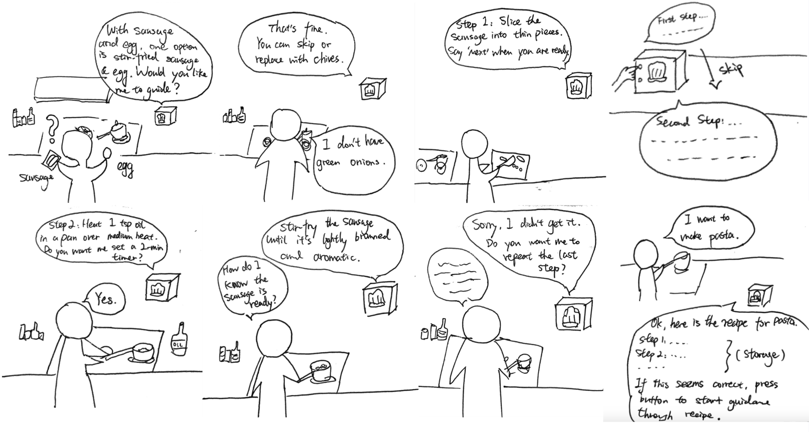

# Chatterboxes
**Joy Sun (Jiayi Sun) and Sandy Zhan (Huiying Zhan)**

## Part 1.
### Text to Speech 

In this part of lab, we are going to start peeking into the world of audio on your Pi! 

\*\***Write your own shell file to use your favorite of these TTS engines to have your Pi greet you by name.**\*\*
(This shell file should be saved to your own repo for this lab.)  

<mark>See my implementation here: [greet_joy.sh](./speech-scripts/greet_joy.sh)</mark>

---
### Speech to Text

\*\***Write your own shell file that verbally asks for a numerical based input (such as a phone number, zipcode, number of pets, etc) and records the answer the respondent provides.**\*\*  

<mark>See my number speech detection script here: [ask_number.sh](./speech-scripts/ask_number.sh)</mark>

### Picture 1: Number Speech Record

### 🤖 NEW: AI-Powered Conversations with Ollama

\*\***Try creating a simple voice interaction that combines speech recognition, Ollama processing, and text-to-speech output. Document what you built and how users responded to it.**\*\*  

### Picture 2: Interactive Speech

## <mark>My System Components</mark>

### 1. Speech Recognition
- We use the Python [`speech_recognition`](https://pypi.org/project/SpeechRecognition/) library to capture audio from a microphone.
- The system supports selecting a preferred microphone (e.g., Logitech C270 HD Webcam) automatically, with fallback to the default device if the preferred one is unavailable.
- Listening mechanism configuration:
  - Listen for a maximum of **15 seconds** per input.
  - Automatically stop listening if the user is silent for **2 seconds**.
- This allows quick capture of short user queries while avoiding long idle recordings.

### 2. Ollama AI Processing
- Captured speech is converted to text via **Google Speech Recognition**.
- The text is sent as a prompt to the Ollama model (`phi3:mini`) via its REST API.
- Query timeout is **3 minutes** to allow for complex responses, with progress messages shown to the user.
- Ollama generates a textual response based on the user’s input.

### 3. Text-to-Speech (TTS) Output
- Response text is converted into speech using **espeak**.
- Special character handling:
  - Characters like `–` or `—` are replaced or removed to prevent TTS errors.
- Speech playback is fully completed before the next listening session begins, preventing the microphone from capturing the assistant’s own voice.

### 4. Concurrency and Flow Control
- Blocking calls are used for espeak, ensuring each TTS playback completes before listening starts again.
- Prevents overlapping input/output, ensuring only the user’s voice is recognized.

## <mark>User Experience and Feedback</mark>
- Users can speak naturally in English and receive almost immediate responses.
- Responses are read aloud in a clear voice, creating a conversational feel.
- Long or complex queries are handled gracefully, with a 3-minute timeout for AI responses.
- Special character handling ensures TTS errors do not interrupt the interaction.
- Users found the system intuitive, with quick response times and smooth audio feedback.

## <mark>Conclusion</mark>
This project demonstrates a fully functional voice interaction loop combining:

- **Speech recognition**  
- **AI processing via Ollama**  
- **Text-to-speech output**  

The system effectively handles microphone selection, ambient noise calibration, Unicode-safe TTS, and sequential listening/speaking, resulting in a responsive and user-friendly voice assistant prototype.

### Storyboard
\*\***Post your storyboard and diagram here.**\*\*

### <mark>Verplank diagram</mark>
We designed a **Smart Mirror Outfit Assistant** that recommends daily outfits based on **weather, temperature, and special occasions**. The interaction is through **voice input** and **speech + visual overlay** output.

1. **Morning Start**  
  

2. **Special Occasion**  
  

3. **Misunderstanding Branch**  
  

\*\***Please describe and document your process.**\*\*
## <mark>🌳 Dialogue Tree: Smart Mirror Outfit Assistant</mark>
### Panel 1 – Morning Start (Weather-based Recommendation)

**User**: "Mirror, what should I wear today?"  
→ *System checks today’s weather*

#### If Rainy 🌧️
- **System**: "It’s rainy today. I recommend wearing a raincoat and waterproof shoes."  
- **User**: "Should I also bring an umbrella?"  
- **System**: "Yes, carrying an umbrella will keep you dry."

#### If Snowy ❄️
- **System**: "It’s snowing today. I suggest a down jacket, warm boots, and gloves."  
- **User**: "Can I wear sneakers instead?"  
- **System**: "Sneakers may get wet in the snow. Boots would be safer."

#### If Sunny & Hot ☀️
- **System**: "It’s sunny and warm, around 28 degrees. I recommend a T-shirt and shorts."  
- **User**: "Do I need sunglasses?"  
- **System**: "Yes, sunglasses will help protect your eyes from the bright sun."

#### If Cold but Clear 🌤️
- **System**: "It’s 12 degrees but clear. I suggest wearing long pants and a jacket."

---

### Panel 2 – Special Occasion (Context-based Recommendation)

**User**: "I have a job interview today."  
→ *System applies formal attire rules*

- **System**: "For a formal occasion, I recommend a dark suit with a white shirt. That will look more professional."  
- **User**: "Should I wear a tie?"  
  - If **Yes** → "A simple dark tie will make your outfit more polished."  
  - If **No** → "That’s fine, but with a tie you’ll look more formal."  

- **User**: "Can you show me how it looks?"  
- **System**: *[Overlay suit + tie on reflection]*

#### Alternative Occasions
- **If Dinner Date** → "A smart-casual outfit would be good, like a blazer with chinos."  
- **If Sports Event** → "Casual wear is fine — maybe a hoodie and sneakers."

---

### Panel 3 – Misunderstanding Branch (Error Handling)

**User**: "Recommend a pair of shoes."  
→ *ASR Misheard* → "Recommend a skirt."  

- **System (clarification strategy)**: "Did you mean skirt or shoes?"  
- **User**: "Shoes."  
- **System**: "Great. Do you want formal shoes or casual shoes?"  
  - If **Formal** → "Black leather shoes would match your suit perfectly."  
  - If **Casual** → "White sneakers would go well with a casual outfit."
  

### Acting out the dialogue

### <mark>🎧 Dialogue Audio Recording</mark>
You can listen to the acted-out dialogue here:  
[Dialogue performing.m4a](./Dialogue%20performing.m4a)   

\*\***Describe if the dialogue seemed different than what you imagined when it was acted out, and how.**\*\*
### <mark>Reflection: Differences Between Imagined and Real Dialogue</mark>

When we acted out the dialogue, it turned out to be quite different from the imagined dialogue tree.

#### Structured vs. Natural Flow
- **Imagined version**: Highly structured, with predefined conditions (rainy, snowy, sunny, cold).  
  - User asked short, direct questions like *“Should I also bring an umbrella?”* or *“Do I need sunglasses?”*.  
  - The flow assumed clear, logical branches.  

- **Real version**: User spoke more naturally and unpredictably.  
  - Example: *“Today I would like to go out. What kind of suit would you recommend?”*  
  - This shifted the topic toward **activity-based clothing** rather than just weather.  
  - System (played by partner) adapted by asking about the **occasion**, leading to discussions about **sportswear, tennis skirts, and even color preferences**.

#### Personalization and Context
- Real dialogue introduced **unexpected context and personalization**.  
  - Example: detecting closet inventory (*“blue and pink skirts”*) and giving **tailored recommendations**.  
- This personalization was **not considered** in the original dialogue flow.

#### Key Insights
- **Imagined script**: Useful as a starting point to structure logic.  
- **Real interaction**: Showed that actual users bring in:  
  - Personal preferences  
  - Casual, varied language  
  - Follow-up questions beyond the rigid tree  

**<mark>Conclusion</mark>**: The acting-out exercise highlighted the importance of **flexibility, personalization, and error-handling** in real system design, beyond what a fixed dialogue tree can capture.

# Lab 3 Part 2

For Part 2, you will redesign the interaction with the speech-enabled device using the data collected, as well as feedback from part 1.

## Prototype your system
### <mark>1.New Story Board</mark>
#### Situation 1: Choose the Type

#### Situation 2: Choose the Outfit

### <mark>2.Document how the system works</mark>

这里放说明

### <mark>3.Include videos or screencaptures of both the system and the controller.</mark>

这里放视频

## Test the system

### What worked well about the system and what didn't?
\*\**your answer here*\*\*

### What worked well about the controller and what didn't?

\*\**your answer here*\*\*

### What lessons can you take away from the WoZ interactions for designing a more autonomous version of the system?

\*\**your answer here*\*\*

### How could you use your system to create a dataset of interaction? What other sensing modalities would make sense to capture?

\*\**your answer here*\*\*

