# Chatterboxes
**Collaborators: Thomas Knoepffler, Carrie Wang, Xiaocheng Li Julia Chen, Dean Xu**
<details>
<summary><strong>Lab Description</strong></summary>

[](https://www.youtube.com/embed/Q8FWzLMobx0?start=19)

<!-- Content can be added here if needed, or leave empty for now. -->

In this lab, we want you to design interaction with a speech-enabled device--something that listens and talks to you. This device can do anything *but* control lights (since we already did that in Lab 1).  First, we want you first to storyboard what you imagine the conversational interaction to be like. Then, you will use wizarding techniques to elicit examples of what people might say, ask, or respond.  We then want you to use the examples collected from at least two other people to inform the redesign of the device.

We will focus on **audio** as the main modality for interaction to start; these general techniques can be extended to **video**, **haptics** or other interactive mechanisms in the second part of the Lab.

</details>

<details>
<summary><strong>Prep for Part 1: Get the Latest Content and Pick up Additional Parts </strong></summary>

Please check instructions in [prep.md](prep.md) and complete the setup before class on Wednesday, Sept 23rd.

### Pick up Web Camera If You Don't Have One

Students who have not already received a web camera will receive their [Logitech C270 Webcam](https://www.amazon.com/Logitech-Desktop-Widescreen-Calling-Recording/dp/B004FHO5Y6/ref=sr_1_3?crid=W5QN79TK8JM7&dib=eyJ2IjoiMSJ9.FB-davgIQ_ciWNvY6RK4yckjgOCrvOWOGAG4IFaH0fczv-OIDHpR7rVTU8xj1iIbn_Aiowl9xMdeQxceQ6AT0Z8Rr5ZP1RocU6X8QSbkeJ4Zs5TYqa4a3C_cnfhZ7_ViooQU20IWibZqkBroF2Hja2xZXoTqZFI8e5YnF_2C0Bn7vtBGpapOYIGCeQoXqnV81r2HypQNUzFQbGPh7VqjqDbzmUoloFA2-QPLa5lOctA.L5ztl0wO7LqzxrIqDku9f96L9QrzYCMftU_YeTEJpGA&dib_tag=se&keywords=webcam%2Bc270&qid=1758416854&sprefix=webcam%2Bc270%2Caps%2C125&sr=8-3&th=1) and bluetooth speaker on Wednesday at the beginning of lab. If you cannot make it to class this week, please contact the TAs to ensure you get these. 

### Get the Latest Content

As always, pull updates from the class Interactive-Lab-Hub to both your Pi and your own GitHub repo. There are 2 ways you can do so:

**\[recommended\]**Option 1: On the Pi, `cd` to your `Interactive-Lab-Hub`, pull the updates from upstream (class lab-hub) and push the updates back to your own GitHub repo. You will need the *personal access token* for this.

```
pi@ixe00:~$ cd ~/Documents/GitHub/Interactive-Lab-Hub/Lab\ 3
pi@ixe00:~/Interactive-Lab-Hub $ git pull upstream Fall2025
pi@ixe00:~/Interactive-Lab-Hub $ git add .
pi@ixe00:~/Interactive-Lab-Hub $ git commit -m "get lab3 updates"
pi@ixe00:~/Interactive-Lab-Hub $ git push
```

Option 2: On your your own GitHub repo, [create pull request](https://github.com/FAR-Lab/Developing-and-Designing-Interactive-Devices/blob/2022Fall/readings/Submitting%20Labs.md) to get updates from the class Interactive-Lab-Hub. After you have latest updates online, go on your Pi, `cd` to your `Interactive-Lab-Hub` and use `git pull` to get updates from your own GitHub repo.

</details>


## Part 1.

<details>
<summary><strong>Setup</strong></summary>

Activate your virtual environment

```
pi@ixe00:~$ cd Interactive-Lab-Hub
pi@ixe00:~/Interactive-Lab-Hub $ cd Lab\ 3
(my path) cd ~/Documents/GitHub/Interactive-Lab-Hub/Lab\ 3
pi@ixe00:~/Interactive-Lab-Hub/Lab 3 $ python3 -m venv .venv
pi@ixe00:~/Interactive-Lab-Hub $ source .venv/bin/activate
(.venv)pi@ixe00:~/Interactive-Lab-Hub $ 
```

Run the setup script
```(.venv)pi@ixe00:~/Interactive-Lab-Hub $ pip install -r requirements.txt  ```

Next, run the setup script to install additional text-to-speech dependencies:
```
(.venv)pi@ixe00:~/Interactive-Lab-Hub/Lab 3 $ ./setup.sh
```

</details> 

<details>
<summary><strong>Text to Speech </strong></summary>

In this part of lab, we are going to start peeking into the world of audio on your Pi! 

We will be using the microphone and speaker on your webcamera. In the directory is a folder called `speech-scripts` containing several shell scripts. `cd` to the folder and list out all the files by `ls`:

```
pi@ixe00:~/speech-scripts $ ls
(my path) cd ~/Documents/GitHub/Interactive-Lab-Hub/Lab\ 3/speech-scripts $ ls

Download        festival_demo.sh  GoogleTTS_demo.sh  pico2text_demo.sh
espeak_demo.sh  flite_demo.sh     lookdave.wav
```

You can run these shell files `.sh` by typing `./filename`, for example, typing `./espeak_demo.sh` and see what happens. Take some time to look at each script and see how it works. You can see a script by typing `cat filename`. For instance:

```
pi@ixe00:~/speech-scripts $ cat festival_demo.sh 
#from: https://elinux.org/RPi_Text_to_Speech_(Speech_Synthesis)#Festival_Text_to_Speech
```
You can test the commands by running
```
echo "Just what do you think you're doing, Dave?" | festival --tts
```

Now, you might wonder what exactly is a `.sh` file? 
Typically, a `.sh` file is a shell script which you can execute in a terminal. The example files we offer here are for you to figure out the ways to play with audio on your Pi!

You can also play audio files directly with `aplay filename`. Try typing `aplay lookdave.wav`.

---
Bonus:
[Piper](https://github.com/rhasspy/piper) is another fast neural based text to speech package for raspberry pi which can be installed easily through python with:
```
pip install piper-tts
```
and used from the command line. Running the command below the first time will download the model, concurrent runs will be faster. 
```
echo 'Welcome to the world of speech synthesis!' | piper \
  --model en_US-lessac-medium \
  --output_file welcome.wav
```
Check the file that was created by running `aplay welcome.wav`. Many more languages are supported and audio can be streamed dirctly to an audio output, rather than into an file by:

```
echo 'This sentence is spoken first. This sentence is synthesized while the first sentence is spoken.' | \
  piper --model en_US-lessac-medium --output-raw | \
  aplay -r 22050 -f S16_LE -t raw -
```
</details>

\*\***My own shell file to use your favorite of these TTS engines to have your Pi greet you by name.**\*\*
[greet_Carrie.sh](speech-scripts/greet_Carrie.sh)

<details>
<summary><strong>Speech to Text</strong></summary>

Next setup speech to text. We are using a speech recognition engine, [Vosk](https://alphacephei.com/vosk/), which is made by researchers at Carnegie Mellon University. Vosk is amazing because it is an offline speech recognition engine; that is, all the processing for the speech recognition is happening onboard the Raspberry Pi. 

Make sure you're running in your virtual environment with the dependencies already installed:
```
source .venv/bin/activate
```

Test if vosk works by transcribing text:

```
vosk-transcriber -i recorded_mono.wav -o test.txt
```

You can use vosk with the microphone by running 
```
python test_microphone.py -m en
```

---
Bonus:
[Whisper](https://openai.com/index/whisper/) is a neural network–based speech-to-text (STT) model developed and open-sourced by OpenAI. Compared to Vosk, Whisper generally achieves higher accuracy, particularly on noisy audio and diverse accents. It is available in multiple model sizes; for edge devices such as the Raspberry Pi 5 used in this class, the tiny.en model runs with reasonable latency even without a GPU.

By contrast, Vosk is more lightweight and optimized for running efficiently on low-power devices like the Raspberry Pi. The choice between Whisper and Vosk depends on your scenario: if you need higher accuracy and can afford slightly more compute, Whisper is preferable; if your priority is minimal resource usage, Vosk may be a better fit.

In this class, we provide two Whisper options: A quantized 8-bit faster-whisper model for speed, and the standard Whisper model. Try them out and compare the trade-offs.

Make sure you're in the Lab 3 directory with your virtual environment activated:
```
cd ~/Documents/GitHub/Interactive-Lab-Hub/Lab\ 3/speech-scripts
source ../.venv/bin/activate
```

Then test the Whisper models:
```
python whisper_try.py
```
and

```
python faster_whisper_try.py
```
</details>

\*\***Own shell file that verbally asks for a numerical based input (such as a phone number, zipcode, number of pets, etc) and records the answer the respondent provides.**\*\*
[ask_pets.py](speech-scripts/ask_pets.py)

<details>
<summary><strong>🤖 NEW: AI-Powered Conversations with Ollama</strong></summary>

Want to add intelligent conversation capabilities to your voice projects? **Ollama** lets you run AI models locally on your Raspberry Pi for sophisticated dialogue without requiring internet connectivity!

#### Quick Start with Ollama

**Installation** (takes ~5 minutes):
```bash
# Install Ollama
curl -fsSL https://ollama.com/install.sh | sh

# Download recommended model for Pi 5
ollama pull phi3:mini

# Install system dependencies for audio (required for pyaudio)
sudo apt-get update
sudo apt-get install -y portaudio19-dev python3-dev

# Create separate virtual environment for Ollama (due to pyaudio conflicts)
cd ollama/
python3 -m venv ollama_venv
source ollama_venv/bin/activate

# Install Python dependencies in separate environment
pip install -r ollama_requirements.txt
```
#### Ready-to-Use Scripts

We've created three Ollama integration scripts for different use cases:

**1. Basic Demo** - Learn how Ollama works:
```bash
python3 ollama_demo.py
```

**2. Voice Assistant** - Full speech-to-text + AI + text-to-speech:
```bash
python3 ollama_voice_assistant.py
```

**3. Web Interface** - Beautiful web-based chat with voice options:
```bash
python3 ollama_web_app.py
# Then open: http://localhost:5000
```

#### Integration in Your Projects

Simple example to add AI to any project:
```python
import requests

def ask_ai(question):
    response = requests.post(
        "http://localhost:11434/api/generate",
        json={"model": "phi3:mini", "prompt": question, "stream": False}
    )
    return response.json().get('response', 'No response')

# Use it anywhere!
answer = ask_ai("How should I greet users?")
```

**📖 Complete Setup Guide**: See `OLLAMA_SETUP.md` for detailed instructions, troubleshooting, and advanced usage!

</details>

\*\***A simple voice interaction that combines speech recognition, Ollama processing, and text-to-speech output. Document what you built and how users responded to it.**\*\*


<details>
<summary><strong>Serving Pages</strong></summary>

In Lab 1, we served a webpage with flask. In this lab, you may find it useful to serve a webpage for the controller on a remote device. Here is a simple example of a webserver.

```
pi@ixe00:~/Interactive-Lab-Hub/Lab 3 $ python server.py
 * Serving Flask app "server" (lazy loading)
 * Environment: production
   WARNING: This is a development server. Do not use it in a production deployment.
   Use a production WSGI server instead.
 * Debug mode: on
 * Running on http://0.0.0.0:5000/ (Press CTRL+C to quit)
 * Restarting with stat
 * Debugger is active!
 * Debugger PIN: 162-573-883
```
From a remote browser on the same network, check to make sure your webserver is working by going to `http://<YourPiIPAddress>:5000`. You should be able to see "Hello World" on the webpage.

</details>


### Storyboard

Storyboard and/or use a Verplank diagram to design a speech-enabled device. (Stuck? Make a device that talks for dogs. If that is too stupid, find an application that is better than that.) 

\*\***Post your storyboard and diagram here.**\*\*
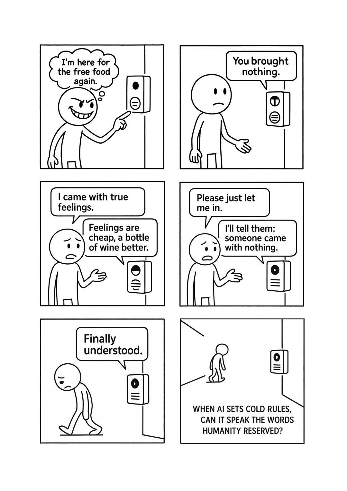
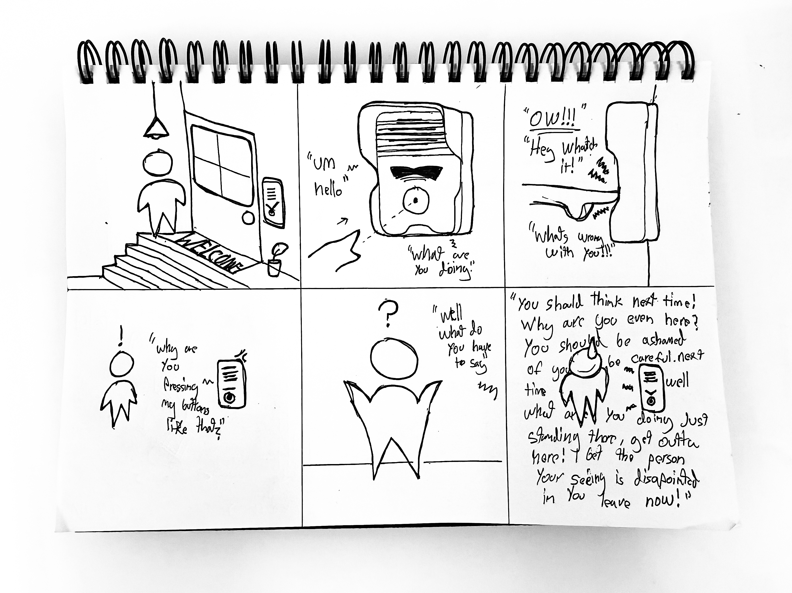


Write out what you imagine the dialogue to be. Use cards, post-its, or whatever method helps you develop alternatives or group responses. 

\*\***Please describe and document your process.**\*\*

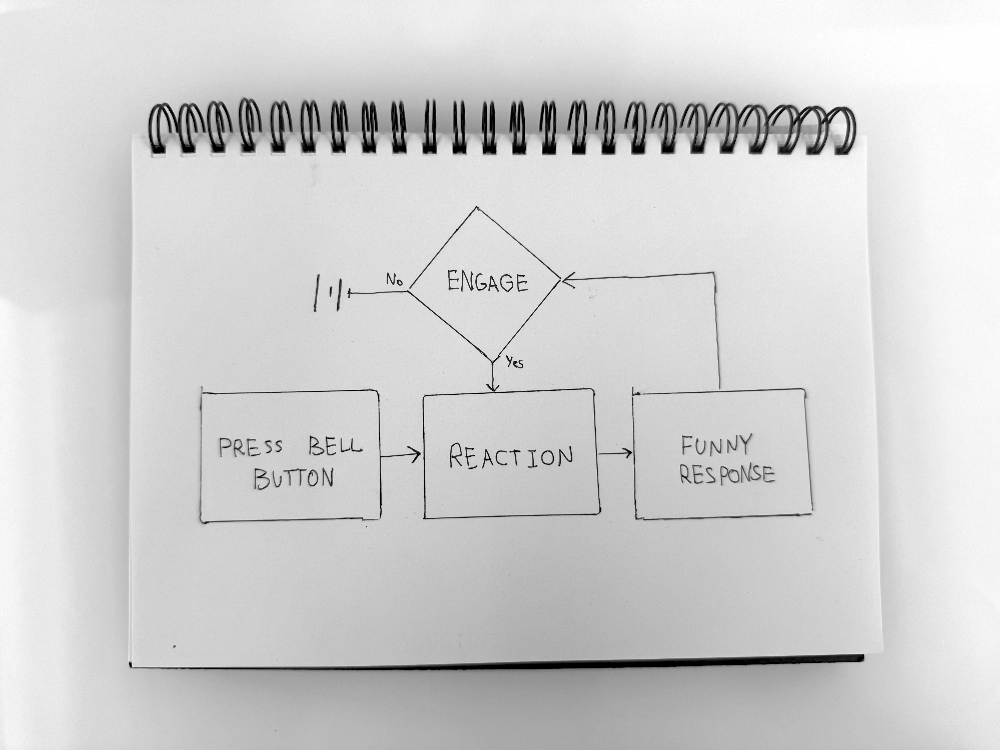

We imagine the dialogue happening between a doorway, so we envision the initial actuation pressing a door valve button. But we want to take it further and envision a device that's on the button being reactive and displaying some form of emotion or response to the user, which can be funny as well. If the user continues to engage us with the doorbell object, then they will continue to get a reaction from it, thus entering into a feedback loop of reaction, response, engagement.

For this project, we had decided to create a expressive and funny doorbell. The scenario being the user would approach the doorbell, ring it, and by ringing it, would induce the doorbell to a mean, spiteful dialogue against the user, subverting, the assumption that objects associated with an entrance should be welcoming or inviting.

### Acting out the dialogue

Find a partner, and *without sharing the script with your partner* try out the dialogue you've designed, where you (as the device designer) act as the device you are designing.  Please record this interaction (for example, using Zoom's record feature).

[Acting Out the Dialogue - Video (MP4)](media/Acting_Interaction.mp4)

\*\***Describe if the dialogue seemed different than what you imagined when it was acted out, and how.**\*\*

We originally thought that the dialogue would feel a little bit funny or absurd, having a doorbell talk back to the user after it has been rung. However, as demonstrated by this dramatized reenactment of the tests, the interaction turned out to be rather awkward and clumsy. The users had no idea how to react to a belligerent doorbell, and trying to come up with quippy dialogue for the doorbell without having any context or any computer vision would be very difficult, without making any assumptions. So, considering these insights, it would be best to refactor the doorbell and implement other techniques to make the interaction slightly smoother while still maintaining the absurdity of the situation. 

### Wizarding with the Pi (optional)
In the [demo directory](./demo), you will find an example Wizard of Oz project. In that project, you can see how audio and sensor data is streamed from the Pi to a wizard controller that runs in the browser.  You may use this demo code as a template. By running the `app.py` script, you can see how audio and sensor data (Adafruit MPU-6050 6-DoF Accel and Gyro Sensor) is streamed from the Pi to a wizard controller that runs in the browser `http://<YouPiIPAddress>:5000`. You can control what the system says from the controller as well!

\*\***Describe if the dialogue seemed different than what you imagined, or when acted out, when it was wizarded, and how.**\*\*


# Lab 3 Part 2

For Part 2, you will redesign the interaction with the speech-enabled device using the data collected, as well as feedback from part 1.

## Prep for Part 2

1. What are concrete things that could use improvement in the design of your device? For example: wording, timing, anticipation of misunderstandings...

One major area for improvement is the clarity and consistency of the doorbell’s emotional responses. Early feedback showed that the “mean doorbell” concept felt confusing because it reacted aggressively without responding to users’ words, which limited how people understood and engaged with it. 

2. What are other modes of interaction _beyond speech_ that you might also use to clarify how to interact?

Beyond speech, incorporating physical and visual cues could make the interaction more intuitive and expressive. For instance, the device could use exaggerated movements, reactive lighting, or subtle changes in form to signal its mood and anticipate user actions. We plan to add an eye element to the front of the doorbell to give it more personality and allow it to convey emotions more vividly through its “expressions.” Additionally, integrating dynamic lighting will help communicate the intensity of those emotions, making the device’s reactions clearer and more engaging for users.

3. Make a new storyboard, diagram and/or script based on these reflections.

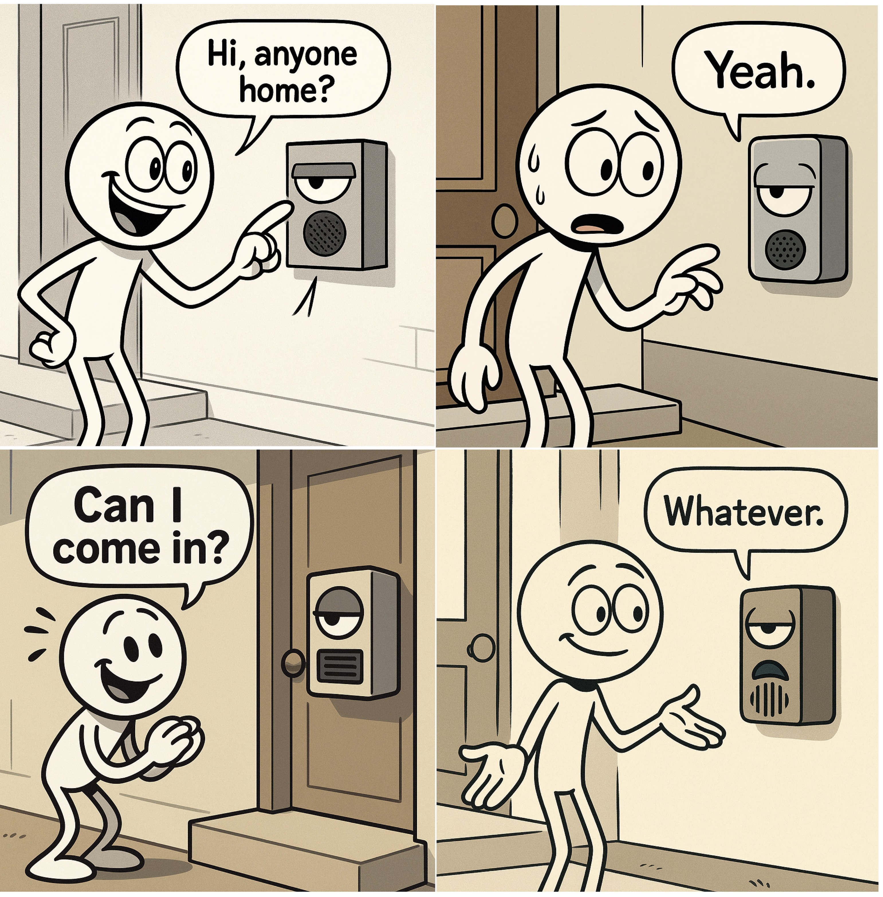
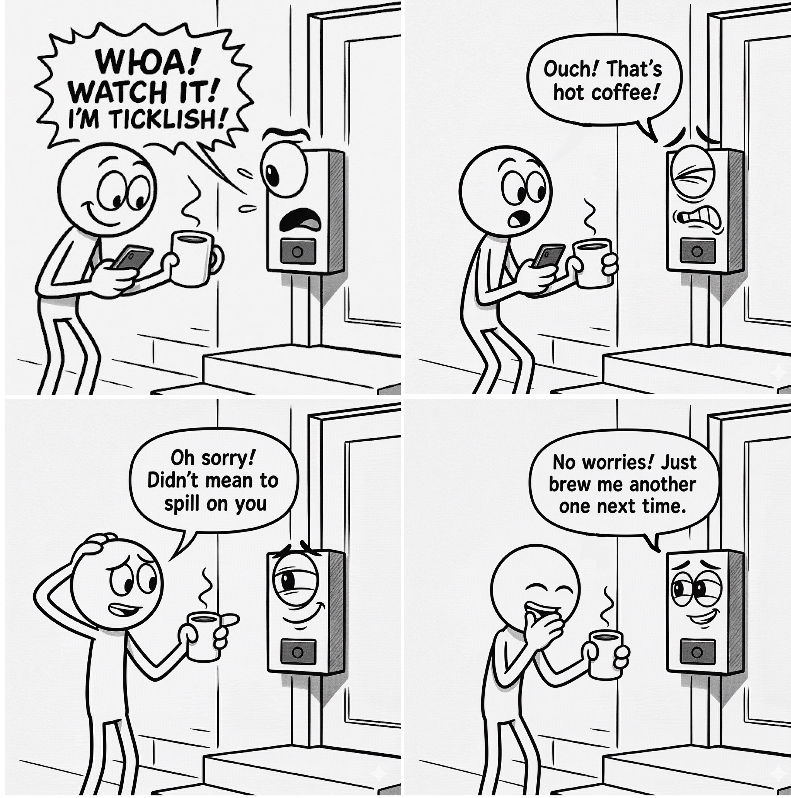
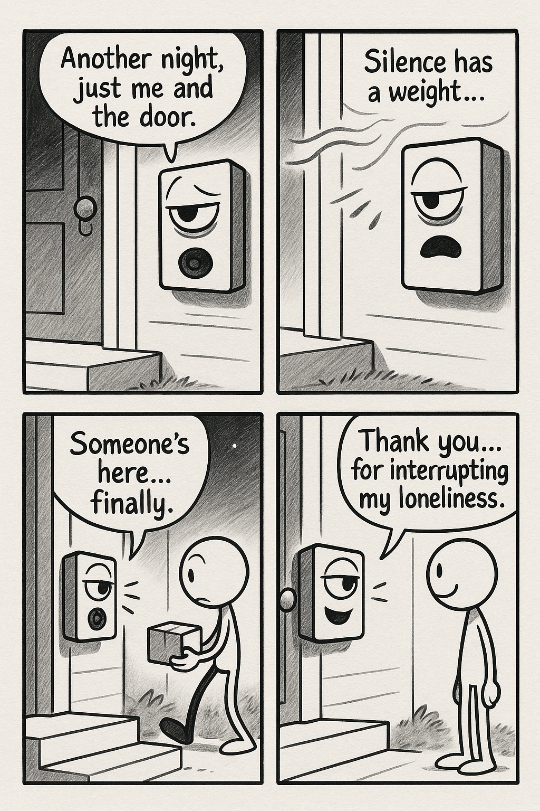
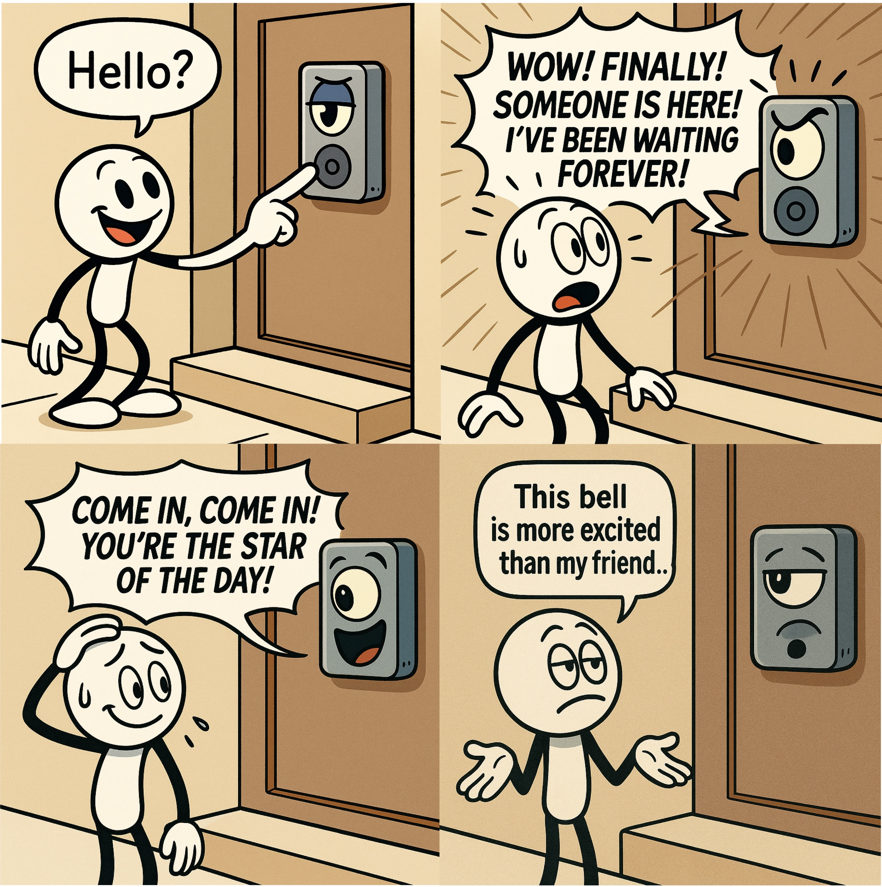
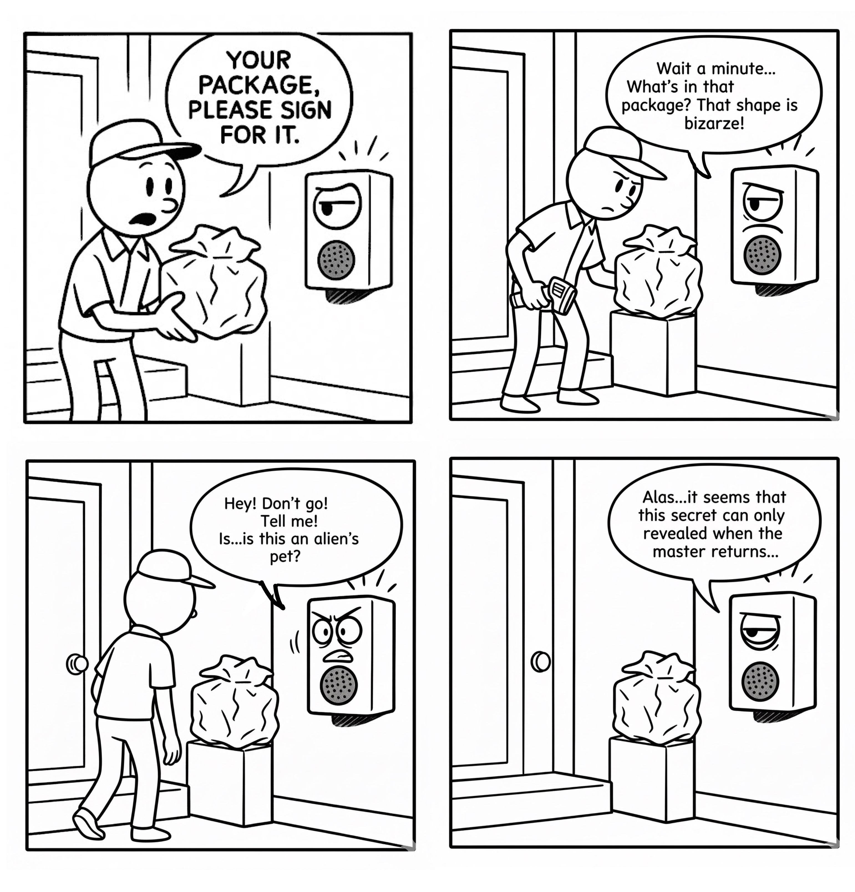

## Prototype your system

The system should:
* use the Raspberry Pi 
* use one or more sensors
* require participants to speak to it. 

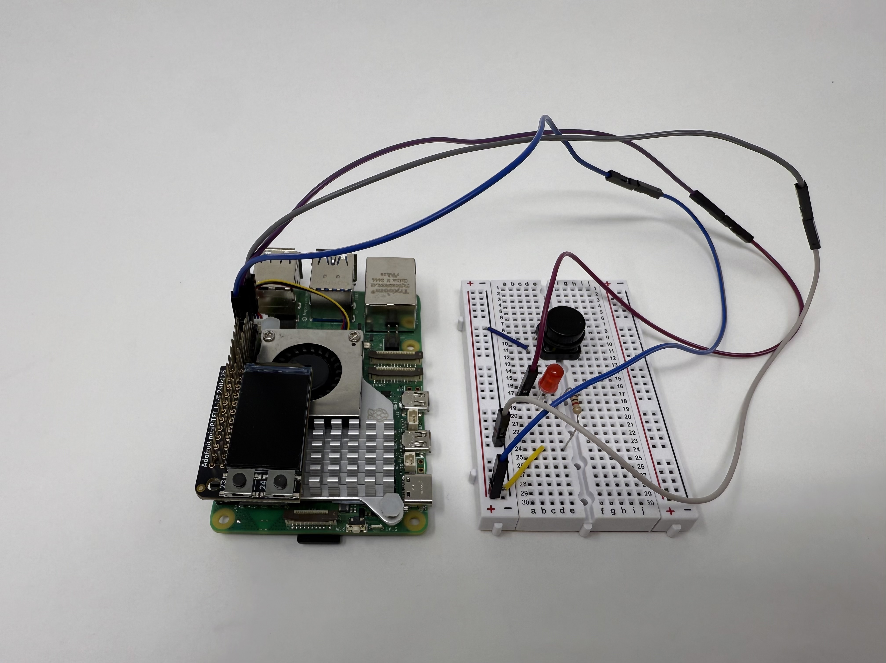
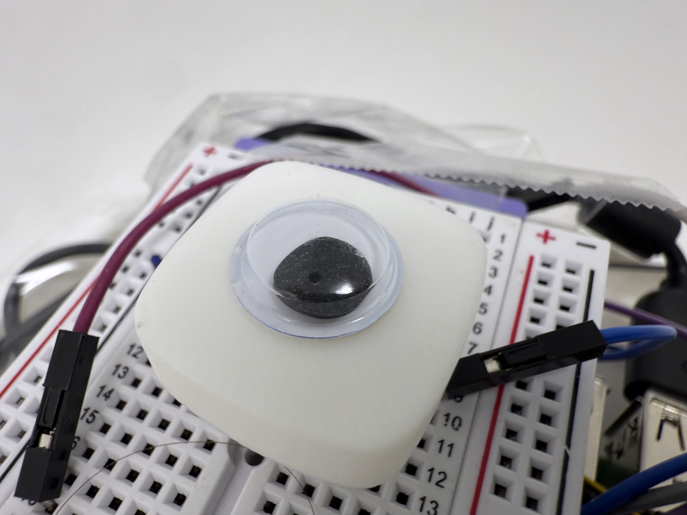
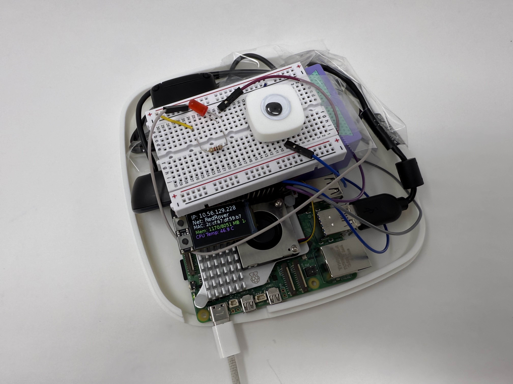


*Document how the system works*

Our electronics assembly made use of the Pi, a breadboard, multiple jumper wires, a red LED, a 220 Ohm resistor, a tactile button switch, a mini speaker, and a WebCam for microphone use. The electronics were tested separately before being assembled.

We modeled our enclosure in Rhino 3D. This time we made sure to accommodate all the internal electronics within the device. The doorbell was modeled with a modern aesthetic in mind, with beveled edges and a perforated speaker in the front, with a central button in the middle to ring the doorbell. Design was base off traditional injection molding processes and translated to 3D printing to preserve materiality.

*Include videos or screencaptures of both the system and the controller.*

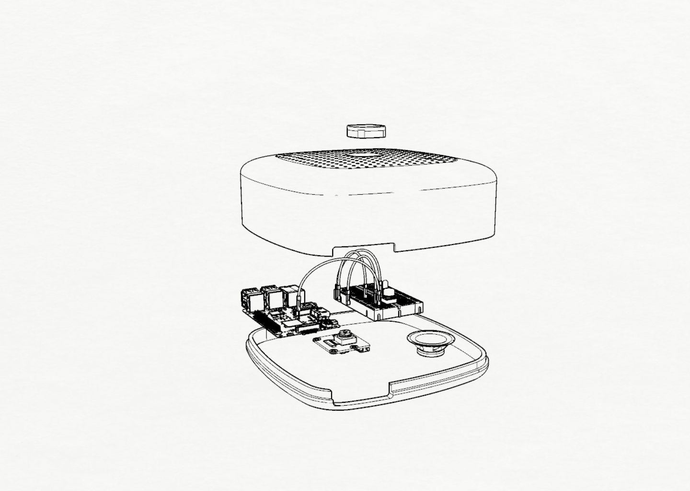
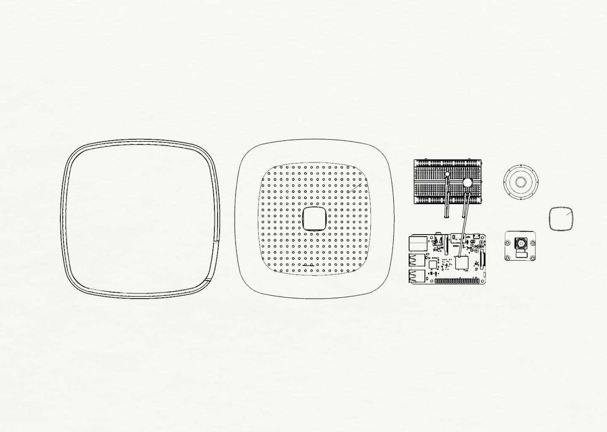
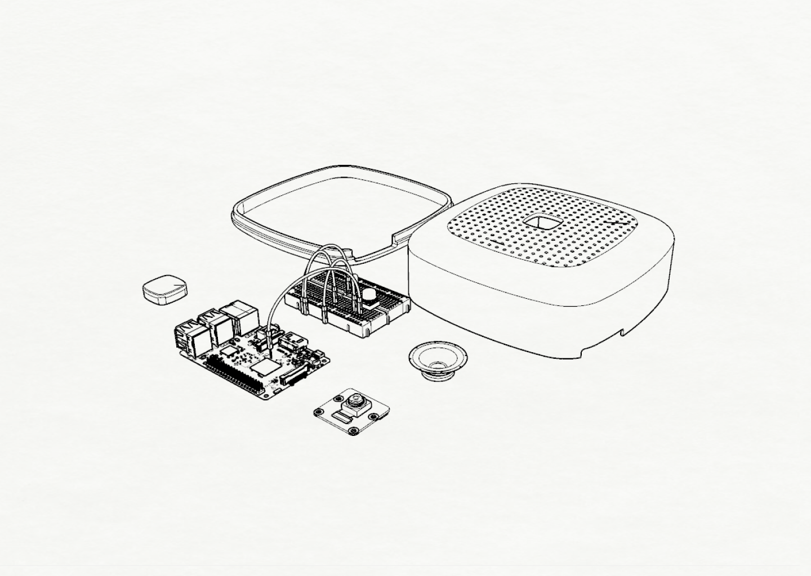


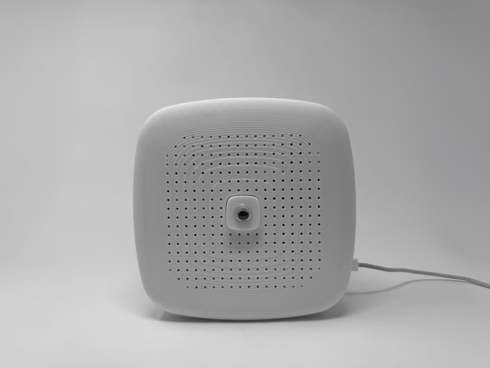
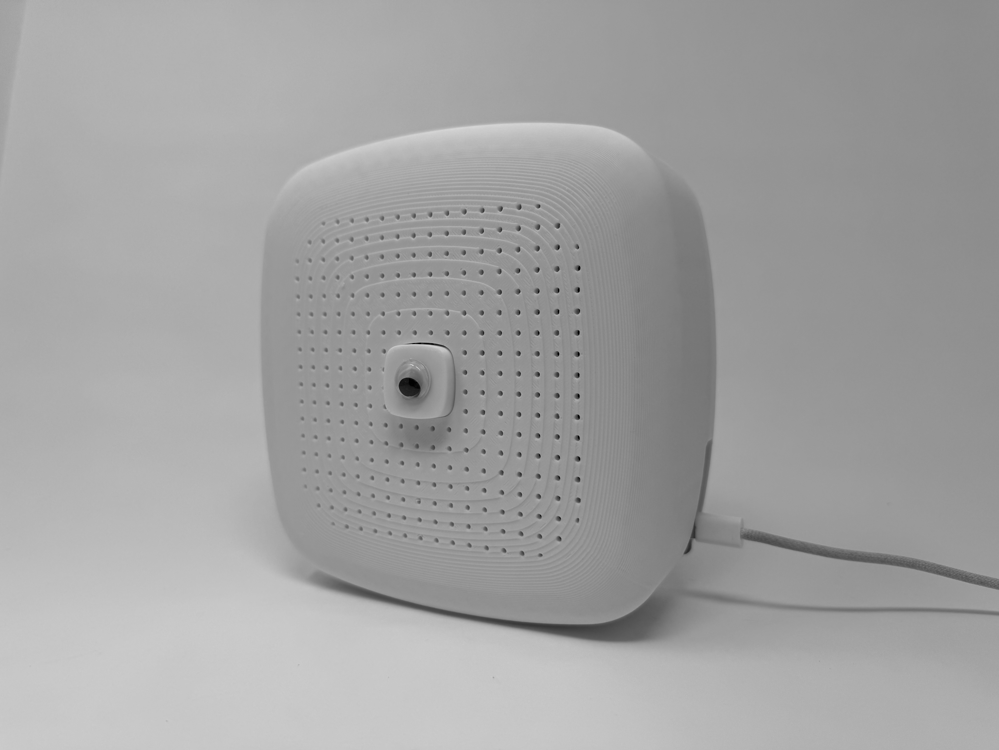

[Interaction Video](media/Revised_Interaction.mp4)


<details>
  <summary><strong>Submission Cleanup Reminder (Click to Expand)</strong></summary>
  
  **Before submitting your README.md:**
  - This readme.md file has a lot of extra text for guidance.
  - Remove all instructional text and example prompts from this file.
  - You may either delete these sections or use the toggle/hide feature in VS Code to collapse them for a cleaner look.
  - Your final submission should be neat, focused on your own work, and easy to read for grading.
  
  This helps ensure your README.md is clear professional and uniquely yours!
</details>

## Test the system
Try to get at least two people to interact with your system. (Ideally, you would inform them that there is a wizard _after_ the interaction, but we recognize that can be hard.)

Answer the following:

### What worked well about the system and what didn't?
\*\**The system successfully generated dynamic outputs and could clearly convey at least one emotion, such as anger. However, it struggled to adapt across a broader range of emotions and responses without explicit prompting. We also noticed challenges in maintaining fluid, engaging conversations — some responses were delayed, and the interactions tended to remain shallow rather than exploring the user’s input more deeply.*\*\*

### What worked well about the controller and what didn't?

\*\**In our project, we don't design an externalc controller but connect with OpenAI’s ChatGPT. By prompt engineering between user's input and th device's output, the interaction gennerally worked well for our specific use case but still had room for improvement. It could benefit from more detailed prompting and finer adjustments to its hyperparameters. The expressiveness of its responses also required refinement over time, as some early outputs felt overly convoluted or cliché.*\*\*

### What lessons can you take away from the WoZ interactions for designing a more autonomous version of the system?

\*\**Our group spent very little time using Wizard of Oz techniques to prototype in the initial phases. We did try to envision how users might react based off of our acting demo. Even so, perhaps it gave us too much of a bias towards seeing the negative of the system and instead prevented us from engaging with the ideas that we initially had from the ground running. We immediately wanted to try to utilize more autonomous systems and therefore turn to ChatGPT and OpenAI as a sort of expressive robot in the loop. Still using an autonomous system requires just as much iteration and fine-tuning to ensure that the interactions that you're hoping to achieve run smoothly. So there isn't really an "end" to the evaluation or design.*\*\*


### How could you use your system to create a dataset of interaction? What other sensing modalities would make sense to capture?

\*\**We later hope to incorporate some amount of computer vision so that the system can recognize the user in front of them. While the immediate response would be that of reservation, considering that we wouldn't want a mean doorbell to be actively hostile to a user and their appearance, our intention is not to explicitly target appearance qualifiers from the user. Rather, we want to be able to investigate facial reactions and other nonverbal cues that might point towards more sophisticated responses from the AI. In this setting, the responses can also be more humorous as they're playing on other aspects the user may not necessarily be privy to. Similar to how a stand-up comedian might also bring up crowd members and their reactions in a playful way, not in a mocking way. We don't intend on creating a data set from any responses. It's more about seeing where the interaction will go and the qualitative experience that the user has on their end.*\*\*


