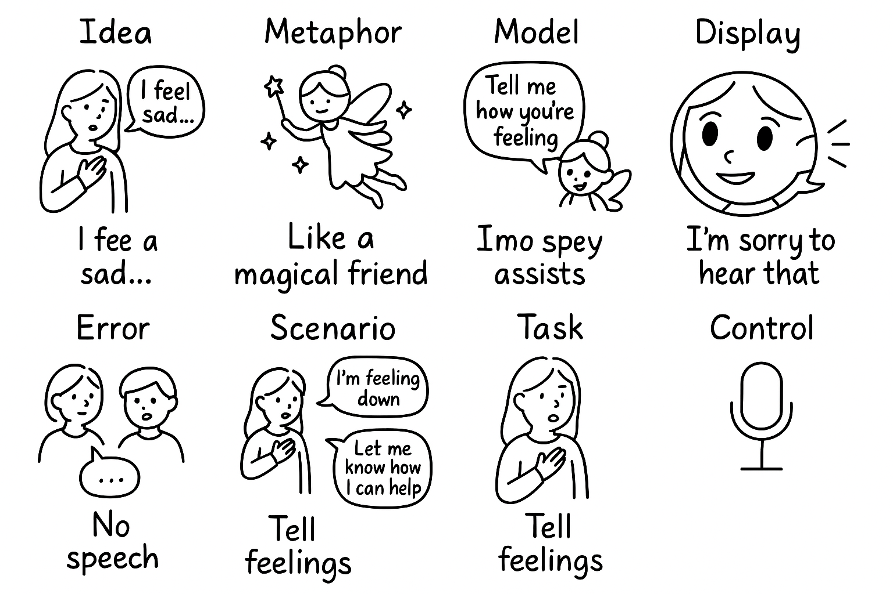
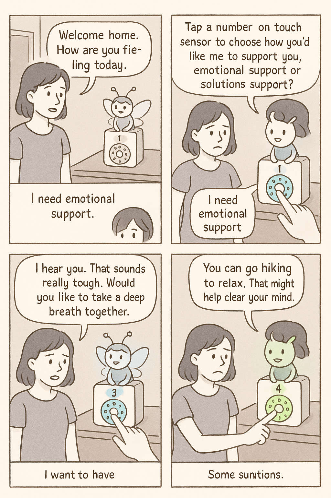

# Chatterboxes
**NAMES OF COLLABORATORS HERE**

Jessica Hsiao (dh779), Irene Wu (yw2785)

[](https://www.youtube.com/embed/Q8FWzLMobx0?start=19)


## 🧠 Overview

In this lab, we designed **interactions with a speech-enabled device** — something that *listens* and *talks* to users.

1. We first storyboarded how the conversation might flow.  
2. Then, we used *wizarding techniques* to collect real examples of dialogue from other people.  
3. Finally, we used those examples to **redesign** our conversational device.


> 💬 Focus: **Audio as the main modality** (extendable later to video, haptics, or other interactive mechanisms).

---

## Part 0. Preparation, Setup & Practice

<details>
  <summary>Text to Speech</summary>

  ### Text to Speech 

In this part of lab, we are going to start peeking into the world of audio on your Pi! 

We will be using the microphone and speaker on your webcamera. In the directory is a folder called `speech-scripts` containing several shell scripts. `cd` to the folder and list out all the files by `ls`:

```
pi@ixe00:~/speech-scripts $ ls
Download        festival_demo.sh  GoogleTTS_demo.sh  pico2text_demo.sh
espeak_demo.sh  flite_demo.sh     lookdave.wav
```

You can run these shell files `.sh` by typing `./filename`, for example, typing `./espeak_demo.sh` and see what happens. Take some time to look at each script and see how it works. You can see a script by typing `cat filename`. For instance:

```
pi@ixe00:~/speech-scripts $ cat festival_demo.sh 
#from: https://elinux.org/RPi_Text_to_Speech_(Speech_Synthesis)#Festival_Text_to_Speech
```
You can test the commands by running
```
echo "Just what do you think you're doing, Dave?" | festival --tts
```

Now, you might wonder what exactly is a `.sh` file? 
Typically, a `.sh` file is a shell script which you can execute in a terminal. The example files we offer here are for you to figure out the ways to play with audio on your Pi!

You can also play audio files directly with `aplay filename`. Try typing `aplay lookdave.wav`.

\*\***Write your own shell file to use your favorite of these TTS engines to have your Pi greet you by name.**\*\*
(This shell file should be saved to your own repo for this lab.)

I wrote it in the `greet.sh` file.

---
Bonus:
[Piper](https://github.com/rhasspy/piper) is another fast neural based text to speech package for raspberry pi which can be installed easily through python with:
```
pip install piper-tts
```
and used from the command line. Running the command below the first time will download the model, concurrent runs will be faster. 
```
echo 'Welcome to the world of speech synthesis!' | piper \
  --model en_US-lessac-medium \
  --output_file welcome.wav
```
Check the file that was created by running `aplay welcome.wav`. Many more languages are supported and audio can be streamed dirctly to an audio output, rather than into an file by:

```
echo 'This sentence is spoken first. This sentence is synthesized while the first sentence is spoken.' | \
  piper --model en_US-lessac-medium --output-raw | \
  aplay -r 22050 -f S16_LE -t raw -
```
</details>

<details>
  <summary>Speech to Text</summary>

  ### Speech to Text

Next setup speech to text. We are using a speech recognition engine, [Vosk](https://alphacephei.com/vosk/), which is made by researchers at Carnegie Mellon University. Vosk is amazing because it is an offline speech recognition engine; that is, all the processing for the speech recognition is happening onboard the Raspberry Pi. 

Make sure you're running in your virtual environment with the dependencies already installed:
```
source .venv/bin/activate
```

Test if vosk works by transcribing text:

```
vosk-transcriber -i recorded_mono.wav -o test.txt
```

You can use vosk with the microphone by running 
```
python test_microphone.py -m en
```

---
Bonus:
[Whisper](https://openai.com/index/whisper/) is a neural network–based speech-to-text (STT) model developed and open-sourced by OpenAI. Compared to Vosk, Whisper generally achieves higher accuracy, particularly on noisy audio and diverse accents. It is available in multiple model sizes; for edge devices such as the Raspberry Pi 5 used in this class, the tiny.en model runs with reasonable latency even without a GPU.

By contrast, Vosk is more lightweight and optimized for running efficiently on low-power devices like the Raspberry Pi. The choice between Whisper and Vosk depends on your scenario: if you need higher accuracy and can afford slightly more compute, Whisper is preferable; if your priority is minimal resource usage, Vosk may be a better fit.

In this class, we provide two Whisper options: A quantized 8-bit faster-whisper model for speed, and the standard Whisper model. Try them out and compare the trade-offs.

Make sure you're in the Lab 3 directory with your virtual environment activated:
```
cd ~/Interactive-Lab-Hub/Lab\ 3/speech-scripts
source ../.venv/bin/activate
```

Then test the Whisper models:
```
python whisper_try.py
```
and

```
python faster_whisper_try.py
```

\*\***Write your own shell file that verbally asks for a numerical based input (such as a phone number, zipcode, number of pets, etc) and records the answer the respondent provides.**\*\*

I wrote it in the `ask_number.sh` file.

</details>

<details>
  <summary>NEW: AI-Powered Conversations with Ollama</summary>

  ### 🤖 NEW: AI-Powered Conversations with Ollama

Want to add intelligent conversation capabilities to your voice projects? **Ollama** lets you run AI models locally on your Raspberry Pi for sophisticated dialogue without requiring internet connectivity!

#### Quick Start with Ollama

**Installation** (takes ~5 minutes):
```bash
# Install Ollama
curl -fsSL https://ollama.com/install.sh | sh

# Download recommended model for Pi 5
ollama pull phi3:mini

# Install system dependencies for audio (required for pyaudio)
sudo apt-get update
sudo apt-get install -y portaudio19-dev python3-dev

# Create separate virtual environment for Ollama (due to pyaudio conflicts)
cd ollama/
python3 -m venv ollama_venv
source ollama_venv/bin/activate

# Install Python dependencies in separate environment
pip install -r ollama_requirements.txt
```
#### Ready-to-Use Scripts

We've created three Ollama integration scripts for different use cases:

**1. Basic Demo** - Learn how Ollama works:
```bash
python3 ollama_demo.py
```

**2. Voice Assistant** - Full speech-to-text + AI + text-to-speech:
```bash
python3 ollama_voice_assistant.py
```

**3. Web Interface** - Beautiful web-based chat with voice options:
```bash
python3 ollama_web_app.py
# Then open: http://localhost:5000
```

#### Integration in Your Projects

Simple example to add AI to any project:
```python
import requests

def ask_ai(question):
    response = requests.post(
        "http://localhost:11434/api/generate",
        json={"model": "phi3:mini", "prompt": question, "stream": False}
    )
    return response.json().get('response', 'No response')

# Use it anywhere!
answer = ask_ai("How should I greet users?")
```

**📖 Complete Setup Guide**: See `OLLAMA_SETUP.md` for detailed instructions, troubleshooting, and advanced usage!

\*\***Try creating a simple voice interaction that combines speech recognition, Ollama processing, and text-to-speech output. Document what you built and how users responded to it.**\*\*

I used the `ollama_voice_assistant.py` file.

</details>

<details>
  <summary><strong>Serving Pages</strong></summary>

  In Lab 1, we served a webpage with flask. In this lab, you may find it useful to serve a webpage for the controller on a remote device. Here is a simple example of a webserver.

  ```
  pi@ixe00:~/Interactive-Lab-Hub/Lab 3 $ python server.py
  * Serving Flask app "server" (lazy loading)
  * Environment: production
    WARNING: This is a development server. Do not use it in a production deployment.
    Use a production WSGI server instead.
  * Debug mode: on
  * Running on http://0.0.0.0:5000/ (Press CTRL+C to quit)
  * Restarting with stat
  * Debugger is active!
  * Debugger PIN: 162-573-883
  ```
  From a remote browser on the same network, check to make sure your webserver is working by going to `http://<YourPiIPAddress>:5000`. You should be able to see "Hello World" on the webpage.
</details>


---

## Part 1-A. Storyboard - *"Fairy Mate" Concepts*

**Design Tool:** Verplank Diagram




### 💡 Idea
Modern life often leaves people emotionally disconnected, even when surrounded by others.  
**Fairy Mate** is a friendly, speech-enabled companion that helps users express and reflect on their feelings.

### 🌈 Scenario
1. Fairy Mate greets the user: *“How was your day?”*  
2. The user shares their thoughts and emotions.  
3. Fairy Mate offers empathetic responses or practical advice.  
4. The device automatically creates a **journal entry** summarizing the conversation.

### ⚙️ Key Functions
- **Emotion Detection:** Analyzes environmental and biological signals to gauge mood.
- **Emotional Support:** Provides comfort and encouragement.  
- **Personal Journaling:** Logs conversations and emotions for long-term reflection.

---

## Part 1-B. Acting out the dialogue

- **Video:**

https://github.com/user-attachments/assets/1e8f9f19-1dea-4df8-9c3a-cf5216112271

- **Reflection**

  > 💬 Describe if the dialogue seemed different than what you imagined when it was acted out, and how.

  Although I hadn’t explained to my friend how to use it beforehand, the conversation flowed naturally, and we were able to share real emotions during the exchange. I think it worked well because the Fairy Mate had good prompts that helped guide the discussion and made it feel caring and supportive. Even without much preparation, the interaction felt meaningful and genuine.

---


## Part 2-A. Refinement

### 🧩 1. Design Improvements

> 💬 What are concrete things that could use improvement in the design of your device? For example: wording, timing, anticipation of misunderstandings

| Aspect | Observation | Suggested Improvement |
|--------|--------------|-----------------------|
| **Wording** | Fairy Mate often gives support too quickly. | Confirm the user’s emotional tone first. |
| **Timing** | Responses can feel rushed or abrupt. | Add short pauses and detect conversation endings gracefully. |


### 🖐️ 2. Beyond Speech — Expanding Interaction Modes
> 💬 What are other modes of interaction _beyond speech_ that you might also use to clarify how to interact?

To enhance intuitiveness, we added **touch** and **visual feedback** alongside voice

#### 📝 Mode Overview
- 🩵 **Emotional Support Mode** — Comforting, empathetic responses.  
- 💚 **Solution Support Mode** — Practical suggestions or motivational help.

#### 🧲 Touch Controls
Using an **Adafruit MPR121 capacitive touch sensor**:

| Pad Range | Mode | Example Behavior |
|------------|------|------------------|
| 1–5 | Emotional Support | “I hear you. That sounds really tough. Would you like to take a deep breath together?” |
| 6–10 | Solution Support | “Let’s think of one small thing you could do right now to feel better.” |

#### 💡 Visual Feedback
- 🔵 **Blue Light** → Emotional Support Mode  
- 🟢 **Green Light** → Solution Support Mode  

These color cues make mode-switching clear and intuitive.

### 🧭 3. Updated Storyboard / Diagram

New storyboards and scripts reflect improved user flow and feedback mechanisms.  



---

## 🎬 Part 2-B. Demo

https://github.com/user-attachments/assets/e1faef80-e93d-4fc6-898c-d23e209f9f9c


---

## 🧪 Part 2-C. System Testing & Reflections

### ✅ What Worked Well

> 💬 What worked well about the system?

1. The color-coded modes (blue for Emotional Support and green for Solution Support) made it easy to recognize the device’s state.
2. The device could provide more personalized feedback based on tone or emotional cues, rather than relying only on preset responses.
3. Adding clearer visual or sound cues for when the device is “listening” versus “processing” would also make the interaction feel more intuitive.


### ⚠️ What Could Improve (advice from other test users)

> 💬 What didn't work well about the system?

1. The touch sensor controller worked well in providing a simple and intuitive way for users to interact with Fairy Mate.
2. The use of color feedback, blue for Emotional Support and green for Solution Support, clearly indicated which mode was active, helping users feel confident that their input was recognized.
3. The sensitivity of the touch sensor sometimes caused accidental activations or missed touches, especially if the user’s finger didn’t make full contact with the pad.
4. Because the pads were numbered rather than labeled with words or icons, some users had to remember which numbers corresponded to each mode.


### 🧩 Lessons from WoZ Interactions

> 💬 What lessons can you take away from the WoZ interactions for designing a more autonomous version of the system?

To make Fairy Mate more autonomous:
- Collect **anonymized interaction data** (voice, touch, response timing, user sentiment).  
- Label data by **emotional state** and **support type**.  
- Train the system to adapt its tone and timing dynamically.

### 📉 Building an Interaction Dataset

> 💬 How could you use your system to create a dataset of interaction? What other sensing modalities would make sense to capture?

| Sensor | Purpose |
|--------|----------|
| 🎤 **Microphone** | Detect tone, stress, or hesitation. |
| 📷 **Facial Recognition** | Identify expressions (smile, frown, eye contact). |
| 🩺 **Motion Sensors (IMU)** | Track restlessness or relaxation. |
| 🌡️ **Environmental Sensors** | Adjust feedback based on context (e.g., quiet/dark room → bedtime suggestion). |
| ✋ **Touch Pressure** | Infer emotional intensity from contact force or duration. |

---

### 🌻 Summary

Fairy Mate blends **speech, emotion sensing, and multi-modal feedback** to create a compassionate, responsive digital companion.  
Through iterative design, testing, and user reflection, we refined it from a concept into a system that **listens with empathy and responds with understanding**.
