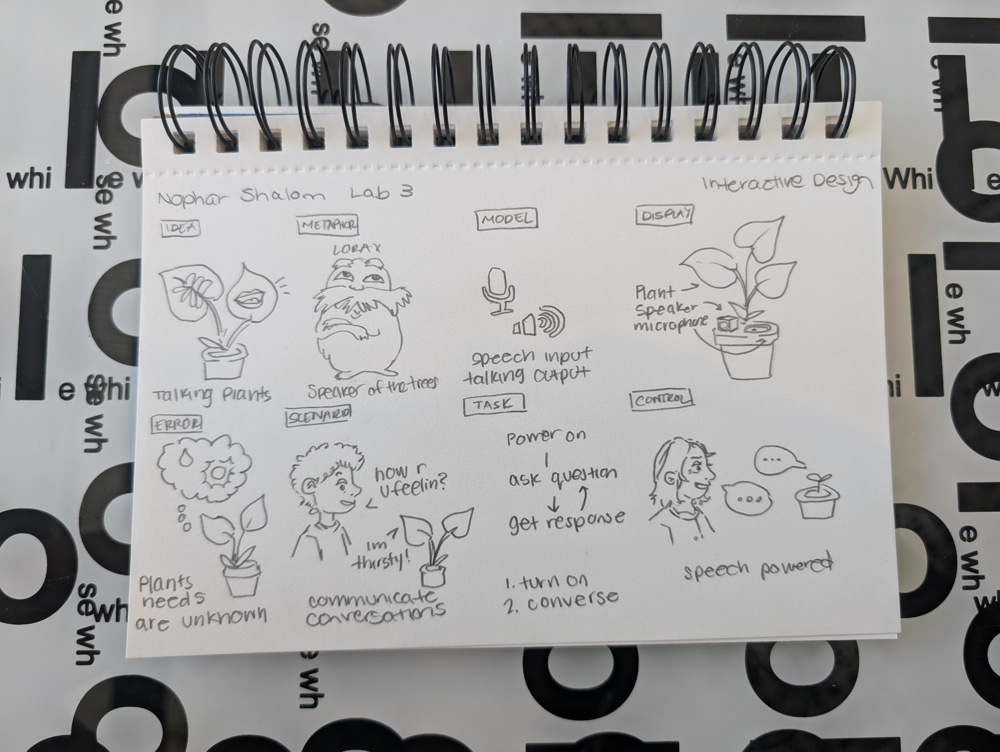
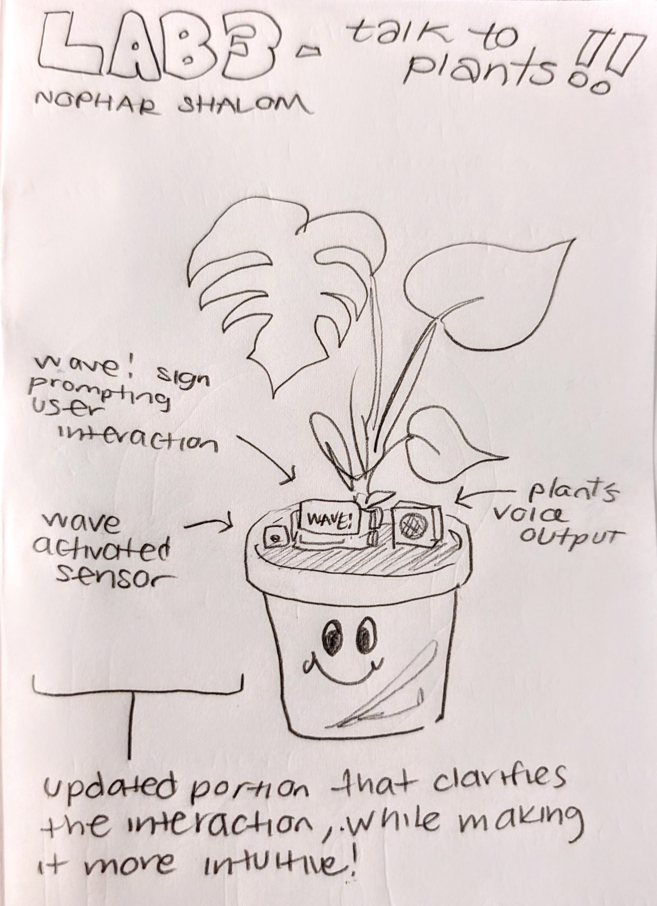

# Chatterboxes
## Nophar Shalom
[](https://www.youtube.com/embed/Q8FWzLMobx0?start=19)
<details>
  <summary>Setup Information</summary>
  In this lab, we want you to design interaction with a speech-enabled device--something that listens and talks to you. This device can do anything *but* control lights     (since we already did that in Lab 1).  First, we want you first to storyboard what you imagine the conversational interaction to be like. Then, you will use wizarding     techniques to elicit examples of what people might say, ask, or respond.  We then want you to use the examples collected from at least two other people to inform the         redesign of the device.
    
    We will focus on **audio** as the main modality for interaction to start; these general techniques can be extended to **video**, **haptics** or other interactive mechanisms in the second part of the Lab.
    
    ## Prep for Part 1: Get the Latest Content and Pick up Additional Parts 
    
    Please check instructions in [prep.md](prep.md) and complete the setup before class on Wednesday, Sept 23rd.
    
    ### Pick up Web Camera If You Don't Have One
    
    Students who have not already received a web camera will receive their [Logitech C270 Webcam](https://www.amazon.com/Logitech-Desktop-Widescreen-Calling-Recording/dp/B004FHO5Y6/ref=sr_1_3?crid=W5QN79TK8JM7&dib=eyJ2IjoiMSJ9.FB-davgIQ_ciWNvY6RK4yckjgOCrvOWOGAG4IFaH0fczv-OIDHpR7rVTU8xj1iIbn_Aiowl9xMdeQxceQ6AT0Z8Rr5ZP1RocU6X8QSbkeJ4Zs5TYqa4a3C_cnfhZ7_ViooQU20IWibZqkBroF2Hja2xZXoTqZFI8e5YnF_2C0Bn7vtBGpapOYIGCeQoXqnV81r2HypQNUzFQbGPh7VqjqDbzmUoloFA2-QPLa5lOctA.L5ztl0wO7LqzxrIqDku9f96L9QrzYCMftU_YeTEJpGA&dib_tag=se&keywords=webcam%2Bc270&qid=1758416854&sprefix=webcam%2Bc270%2Caps%2C125&sr=8-3&th=1) and bluetooth speaker on Wednesday at the beginning of lab. If you cannot make it to class this week, please contact the TAs to ensure you get these. 
    
    ### Get the Latest Content
    
    As always, pull updates from the class Interactive-Lab-Hub to both your Pi and your own GitHub repo. There are 2 ways you can do so:
    
    **\[recommended\]**Option 1: On the Pi, `cd` to your `Interactive-Lab-Hub`, pull the updates from upstream (class lab-hub) and push the updates back to your own GitHub repo. You will need the *personal access token* for this.
    
    ```
    pi@ixe00:~$ cd Interactive-Lab-Hub
    pi@ixe00:~/Interactive-Lab-Hub $ git pull upstream Fall2025
    pi@ixe00:~/Interactive-Lab-Hub $ git add .
    pi@ixe00:~/Interactive-Lab-Hub $ git commit -m "get lab3 updates"
    pi@ixe00:~/Interactive-Lab-Hub $ git push
    ```
    
    Option 2: On your your own GitHub repo, [create pull request](https://github.com/FAR-Lab/Developing-and-Designing-Interactive-Devices/blob/2022Fall/readings/Submitting%20Labs.md) to get updates from the class Interactive-Lab-Hub. After you have latest updates online, go on your Pi, `cd` to your `Interactive-Lab-Hub` and use `git pull` to get updates from your own GitHub repo.
    
    ## Part 1.
    ### Setup 
    
    Activate your virtual environment
    
    ```
    pi@ixe00:~$ cd Interactive-Lab-Hub
    pi@ixe00:~/Interactive-Lab-Hub $ cd Lab\ 3
    pi@ixe00:~/Interactive-Lab-Hub/Lab 3 $ python3 -m venv .venv
    pi@ixe00:~/Interactive-Lab-Hub $ source .venv/bin/activate
    (.venv)pi@ixe00:~/Interactive-Lab-Hub $ 
    ```
    
    Run the setup script
    ```(.venv)pi@ixe00:~/Interactive-Lab-Hub $ pip install -r requirements.txt  ```
    
    Next, run the setup script to install additional text-to-speech dependencies:
    ```
    (.venv)pi@ixe00:~/Interactive-Lab-Hub/Lab 3 $ ./setup.sh
    ```
    
    ### Text to Speech 
    
    In this part of lab, we are going to start peeking into the world of audio on your Pi! 
    
    We will be using the microphone and speaker on your webcamera. In the directory is a folder called `speech-scripts` containing several shell scripts. `cd` to the folder and list out all the files by `ls`:
    
    ```
    pi@ixe00:~/speech-scripts $ ls
    Download        festival_demo.sh  GoogleTTS_demo.sh  pico2text_demo.sh
    espeak_demo.sh  flite_demo.sh     lookdave.wav
    ```
    
    You can run these shell files `.sh` by typing `./filename`, for example, typing `./espeak_demo.sh` and see what happens. Take some time to look at each script and see how it works. You can see a script by typing `cat filename`. For instance:
    
    ```
    pi@ixe00:~/speech-scripts $ cat festival_demo.sh 
    #from: https://elinux.org/RPi_Text_to_Speech_(Speech_Synthesis)#Festival_Text_to_Speech
    ```
    You can test the commands by running
    ```
    echo "Just what do you think you're doing, Dave?" | festival --tts
    ```
    
    Now, you might wonder what exactly is a `.sh` file? 
    Typically, a `.sh` file is a shell script which you can execute in a terminal. The example files we offer here are for you to figure out the ways to play with audio on your Pi!
    
    You can also play audio files directly with `aplay filename`. Try typing `aplay lookdave.wav`.
    
    \*\***Write your own shell file to use your favorite of these TTS engines to have your Pi greet you by name.**\*\*
    (This shell file should be saved to your own repo for this lab.)
    
    ---
    Bonus:
    [Piper](https://github.com/rhasspy/piper) is another fast neural based text to speech package for raspberry pi which can be installed easily through python with:
    ```
    pip install piper-tts
    ```
    and used from the command line. Running the command below the first time will download the model, concurrent runs will be faster. 
    ```
    echo 'Welcome to the world of speech synthesis!' | piper \
      --model en_US-lessac-medium \
      --output_file welcome.wav
    ```
    Check the file that was created by running `aplay welcome.wav`. Many more languages are supported and audio can be streamed dirctly to an audio output, rather than into an file by:
    
    ```
    echo 'This sentence is spoken first. This sentence is synthesized while the first sentence is spoken.' | \
      piper --model en_US-lessac-medium --output-raw | \
      aplay -r 22050 -f S16_LE -t raw -
    ```
      
    ### Speech to Text
    
    Next setup speech to text. We are using a speech recognition engine, [Vosk](https://alphacephei.com/vosk/), which is made by researchers at Carnegie Mellon University. Vosk is amazing because it is an offline speech recognition engine; that is, all the processing for the speech recognition is happening onboard the Raspberry Pi. 
    
    Make sure you're running in your virtual environment with the dependencies already installed:
    ```
    source .venv/bin/activate
    ```
    
    Test if vosk works by transcribing text:
    
    ```
    vosk-transcriber -i recorded_mono.wav -o test.txt
    ```
    
    You can use vosk with the microphone by running 
    ```
    python test_microphone.py -m en
    ```
    
    ---
    Bonus:
    [Whisper](https://openai.com/index/whisper/) is a neural network–based speech-to-text (STT) model developed and open-sourced by OpenAI. Compared to Vosk, Whisper generally achieves higher accuracy, particularly on noisy audio and diverse accents. It is available in multiple model sizes; for edge devices such as the Raspberry Pi 5 used in this class, the tiny.en model runs with reasonable latency even without a GPU.
    
    By contrast, Vosk is more lightweight and optimized for running efficiently on low-power devices like the Raspberry Pi. The choice between Whisper and Vosk depends on your scenario: if you need higher accuracy and can afford slightly more compute, Whisper is preferable; if your priority is minimal resource usage, Vosk may be a better fit.
    
    In this class, we provide two Whisper options: A quantized 8-bit faster-whisper model for speed, and the standard Whisper model. Try them out and compare the trade-offs.
    
    Make sure you're in the Lab 3 directory with your virtual environment activated:
    ```
    cd ~/Interactive-Lab-Hub/Lab\ 3/speech-scripts
    source ../.venv/bin/activate
    ```
    
    Then test the Whisper models:
    ```
    python whisper_try.py
    ```
    and
    
    ```
    python faster_whisper_try.py
    ```
</details>


\*\***Write your own shell file that verbally asks for a numerical based input (such as a phone number, zipcode, number of pets, etc) and records the answer the respondent provides.**\*\*

```
#!/bin/bash

# This script prompts the user for a numerical input and records the response.

echo "Hello! I am ready to record a numerical value from you."
echo "Please enter a numerical value (e.g., your phone number, number of pets, etc.) and press Enter:"

read user_input

echo "Thank you. I have recorded the following value: $user_input"
echo "$user_input" >> recorded_data.txt
exit 0

```
<details> 
  <summary>AI Setup</summary>
    ### 🤖 NEW: AI-Powered Conversations with Ollama
    
    Want to add intelligent conversation capabilities to your voice projects? **Ollama** lets you run AI models locally on your Raspberry Pi for sophisticated dialogue without requiring internet connectivity!
    
    #### Quick Start with Ollama
    
    **Installation** (takes ~5 minutes):
    ```bash
    # Install Ollama
    curl -fsSL https://ollama.com/install.sh | sh
    
    # Download recommended model for Pi 5
    ollama pull phi3:mini
    
    # Install system dependencies for audio (required for pyaudio)
    sudo apt-get update
    sudo apt-get install -y portaudio19-dev python3-dev
    
    # Create separate virtual environment for Ollama (due to pyaudio conflicts)
    cd ollama/
    python3 -m venv ollama_venv
    source ollama_venv/bin/activate
    
    # Install Python dependencies in separate environment
    pip install -r ollama_requirements.txt
    ```
    #### Ready-to-Use Scripts
    
    We've created three Ollama integration scripts for different use cases:
    
    **1. Basic Demo** - Learn how Ollama works:
    ```bash
    python3 ollama_demo.py
    ```
    
    **2. Voice Assistant** - Full speech-to-text + AI + text-to-speech:
    ```bash
    python3 ollama_voice_assistant.py
    ```
    
    **3. Web Interface** - Beautiful web-based chat with voice options:
    ```bash
    python3 ollama_web_app.py
    # Then open: http://localhost:5000
    ```
    
    #### Integration in Your Projects
    
    Simple example to add AI to any project:
    ```python
    import requests
    
    def ask_ai(question):
        response = requests.post(
            "http://localhost:11434/api/generate",
            json={"model": "phi3:mini", "prompt": question, "stream": False}
        )
        return response.json().get('response', 'No response')
    
    # Use it anywhere!
    answer = ask_ai("How should I greet users?")
    ```
    
    **📖 Complete Setup Guide**: See `OLLAMA_SETUP.md` for detailed instructions, troubleshooting, and advanced usage!

</details>

### A simple voice interaction that combines speech recognition, Ollama processing, and text-to-speech output.

```
def ask_specialized_ollama(question, personality):
    response = requests.post(
        "http://localhost:11434/api/generate",
        json={
            "model": "phi3:mini",
            "prompt": question,
            "system": personality,  # This changes behavior!
            "stream": False
        }
    )
    return response.json().get('response', 'Sorry, no response')

plant_response = ask_specialized_ollama(
    "How are you doing?", 
    "You are a green houseplant. Give a conversational response with a funny personality."
)
```
<details> 
  <summary>Serving Pages</summary>
  In Lab 1, we served a webpage with flask. In this lab, you may find it useful to serve a webpage for the controller on a remote device. Here is a simple example of a webserver.
    
    ```
    pi@ixe00:~/Interactive-Lab-Hub/Lab 3 $ python server.py
     * Serving Flask app "server" (lazy loading)
     * Environment: production
       WARNING: This is a development server. Do not use it in a production deployment.
       Use a production WSGI server instead.
     * Debug mode: on
     * Running on http://0.0.0.0:5000/ (Press CTRL+C to quit)
     * Restarting with stat
     * Debugger is active!
     * Debugger PIN: 162-573-883
    ```
    From a remote browser on the same network, check to make sure your webserver is working by going to `http://<YourPiIPAddress>:5000`. You should be able to see "Hello World" on the webpage.
</details>

### Storyboard

Storyboard and/or use a Verplank diagram to design a speech-enabled device. (Stuck? Make a device that talks for dogs. If that is too stupid, find an application that is better than that.) 



For my interactive speaking device, the idea is to enable communication with plants. Inspiration being the Lorax, I thought it would be interesting to be able to understand a plant's needs and feelings. Plants can be delicate beings, not too much water, not too much sun, therefore making it difficult to keep alive for some people. Now, with the ability to speak to the plants directly, you not only have a living, thriving plant, but also a new friend!


#### Sample dialogue:
Person 1: Hello Plant! How are you feeling today?

Plant: Hey, I'm doing great, though I am a little thirsty.

Person 1: Oh, no worries, let me help. * adds water *

Plant: Thank you so much, this weather has been drying me out lowkey.

Person 1: Yea me too, I can't wait for the fall.

Plant: Not me, I don't want to lose my leaves.. do you know how much work it is to regrow them every year??

Person 1: Oops, my bad plant.

Plant: All good, talk to you later.

### Acting out the dialogue

Find a partner, and *without sharing the script with your partner* try out the dialogue you've designed, where you (as the device designer) act as the device you are designing.  Please record this interaction (for example, using Zoom's record feature).


The dialogue went pretty much along with what I imagined since it is a simple conversation about well being. Of course, when acting something out without sharing the same script, there is a slight variation in the questions, such as Angela mentioning to move the plant as a solution to the plant being thirsty and hot, which was not planned.

### Wizarding with the Pi (optional)
<details> 
  <summary>wizard the pi</summary>
  In the [demo directory](./demo), you will find an example Wizard of Oz project. In that project, you can see how audio and sensor data is streamed from the Pi to a wizard controller that runs in the browser. You may use this demo code as a template. By running the `app.py` script, you can see how audio and sensor data (Adafruit MPU-6050 6-DoF Accel and Gyro Sensor) is streamed from the Pi to a wizard controller that runs in the browser `http://<YouPiIPAddress>:5000`. You can control what the system says from the controller as well!

    \*\***Describe if the dialogue seemed different than what you imagined, or when acted out, when it was wizarded, and how.**\*\*
</details>


# Lab 3 Part 2

For Part 2, you will redesign the interaction with the speech-enabled device using the data collected, as well as feedback from part 1.

## Prep for Part 2

1. What are concrete things that could use improvement in the design of your device? For example: wording, timing, anticipation of misunderstandings...

   Concrete things that could use improvement in the design would be the activation factor. For example, my current idea assumes the user knows how to activate the conversation to start it which is not intuitive at all.
   
3. What are other modes of interaction _beyond speech_ that you might also use to clarify how to interact?

   Such modes of interaction beyond speech could be a sensor that is activated by a wave. This is a social norm in greeting, which often starts a conversation. Additionally, an image with text can be displayed on the raspeberry pi for further instructions, saying "Wave to wake me up" or something similar.
   
5. Make a new storyboard, diagram and/or script based on these reflections.


## Prototype your system

The system should:
* use the Raspberry Pi 
* use one or more sensors
* require participants to speak to it. 

## How PlantTalk works:
The system is initially activated when the sensor is triggered. This happens when someone waves at the plant. Once it is awake, the plant will make the first statement, "Good morning/afternoon/evening, how are you today?". Then, the user can interact with the plant as if they are conversing with a person, yet about plant topics. The plant then goes to sleep once it hears "Goodbye/Bye".

*Include videos or screencaptures of both the system and the controller.*

<details>
  <summary><strong>Submission Cleanup Reminder (Click to Expand)</strong></summary>
  
  **Before submitting your README.md:**
  - This readme.md file has a lot of extra text for guidance.
  - Remove all instructional text and example prompts from this file.
  - You may either delete these sections or use the toggle/hide feature in VS Code to collapse them for a cleaner look.
  - Your final submission should be neat, focused on your own work, and easy to read for grading.
  
  This helps ensure your README.md is clear professional and uniquely yours!
</details>

## Test the system
Try to get at least two people to interact with your system. (Ideally, you would inform them that there is a wizard _after_ the interaction, but we recognize that can be hard.)

Answer the following:

### What worked well about the system and what didn't?
\*\**your answer here*\*\*

### What worked well about the controller and what didn't?

\*\**your answer here*\*\*

### What lessons can you take away from the WoZ interactions for designing a more autonomous version of the system?

\*\**your answer here*\*\*


### How could you use your system to create a dataset of interaction? What other sensing modalities would make sense to capture?

\*\**your answer here*\*\*


