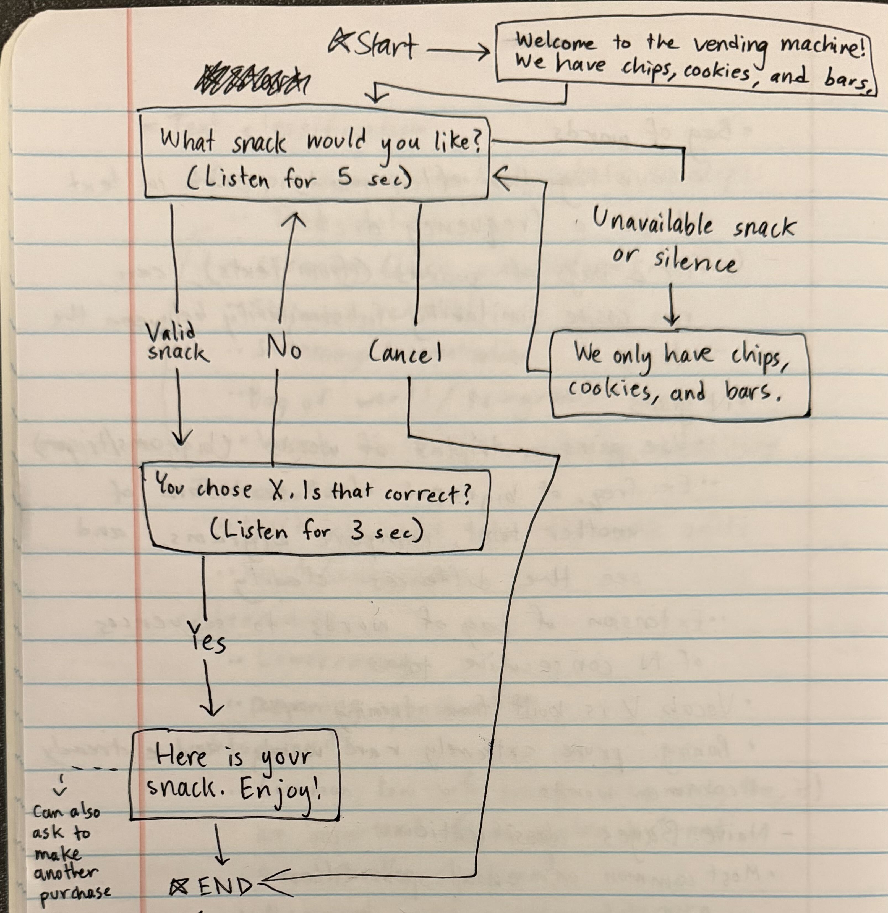

# Chatterboxes

**COLLABORATORS: Neeha Ravula (nr485), Gaurav Patel (gp438), Nishant Ray (nr487), Ammar Syed (as4422)**

---

# Part 1

## Setup

Successfully set up the following:
- classic speech synthesizers
- voice activity detection model
- neural voice and speech recognition models
- microphone and speaker

## A. Text to Speech

We played around with all of the the different models and demos, including espeak, festival, and neural TTS with piper. It was very cool to see the differences in tone between each model, but we liked the piper one the most because it seemed the most human-like. We wrote a **text_to_speech.sh** script (under speech-scripts/) which successfully greeted our teammate, Gaurav, utilizing the piper model.

When testing the models, we found that the greeting was NOT the same across all the different voices. For example, the espeak model renders the greeting with a very flat, almost mechanical-sounding tone, with very little variation in pitch. On the other hand, piper's neural voice adds natural inflections in tone including a rise towards the end of "How are you doing?" to indicate a question is being asked. The use of these natural inflections makes Piper the more "human-like" speech model.


## B. Speech to Text

**Whisper Models**

We tested various models of OpenAI's [faster-whisper](https://github.com/SYSTRAN/faster-whisper), including `tiny.en`, `base.en`, `small.en`, `medium.en`.

We recorded a few seconds of speech in speech-scripts/test.wav, and observed the following real-time factors across the following models:
- tiny.en: real-time factor of 0.25x
- base.en, real-time factor was 0.42x
We noticed the accuracy improvement stops being worth the delay when a larger model makes the conversation noticeably slower without meaningfully reducing transcription errors. base.en took 0.86 seconds longer than tiny.en but produced essentially the same words, so tiny.en offers the better trade-off for that recording. If it frequently misunderstands requests, a slower, more accurate model could be worth it. From these numbers, it seems that a model with a real-time factor greater than 1.0 would not be worth it as well.

**Speech to Text Experiment**

We wrote a speech_to_text.sh script (under speech-scripts/) using the piper speech model and the faster-whisper transcription, which asks the user for their zip code, waits a specified duration for input (default of 5 seconds), and prints out what was transcribed in the terminal output.


## C. Turn-taking: knowing when someone has stopped talking

We tested various extremes of the **voice activity detector** (VAD).

There is no correct value. A system that takes drink orders and a system that listens to someone think out loud want very different thresholds, and the right one depends on what your users are doing with their pauses.

At 0.2 seconds, the system cut my voice short. I said "I'd like a coffee um with oat milk and acutally to make it a large" but it only captured "with oat milk and actually make it a large." Pauses and filler words were treated as the end of my turn. At 1.5s it captured the entire sentence but I had to wait for a bit in silence afterwards. The 1.5s made be a bit unsure on whether I was done or what the status was. In between at 0.6 seconds it caught my sentence and replied much quicker.


### The complete loop

`echo_bot.py` puts the pieces together: it listens, endpoints, transcribes, and speaks a reply through Piper. The dialogue policy is deliberately trivial — it repeats what you said — so that everything you notice is a property of the timing rather than the content.

```
(.venv) $ python echo_bot.py
```

## D. Storyboard

Storyboard and/or use a Verplank diagram to design a speech-enabled device. (Stuck? Make a device that talks for dogs. If that is too stupid, find an application that is better than that.)

\*\***Post your storyboard and diagram here.**\*\*



We chose a speech-enabled vending machine because it provides a simple, familiar interaction that can be completed through a short conversation. We started with the successful path: the machine asks what snack the user wants, the user chooses, and the machine confirms before announcing that the snack is ready. We then considered alternative responses, including an unavailable snack, an incorrect selection, and silence. These became branches in the diagram, allowing the machine to repeat the available options, accept a correction, or cancel the interaction. We chose a five-second listening window for selecting a snack and a three-second window for confirmation because choosing a snack may take longer than answering yes or no. We also simplified the system by making the snacks free and not having any payment, allowing us to focus on asking for a snack, recognizing the response, and confirming the selection.

## E. Acting out the dialogue

Find a partner, and *without sharing the script with your partner* try out the dialogue you've designed, where you (as the device designer) act as the device you are designing. Please record this interaction (for example, using Zoom's record feature).

\*\***Describe if the dialogue seemed different than what you imagined when it was acted out, and how.**\*\*

[Link to dialogue recording](https://drive.google.com/file/d/1If0gT5JYrgCUZfPp079eUhKI9P43WqOS/view?usp=sharing)

The dialogue felt less natural when acted out than we had imagined. Our partner first asked what the options were, which showed that the machine should list the snacks in its opening question. They also said "Oh, okay how about cookies" instead of simply "Cookies." Repeating the options after that felt awkward because their choice was already clear. The fixed listening windows also created pauses even when my partner answered immediately. However, the confirmation step worked well when they changed their mind about chips, and asking whether they wanted another order made it easy to continue. We would improve the interaction by listing the options upfront, accepting more natural phrases, and responding sooner when the user finishes speaking if possible.


---

# Lab 3 Part 2

For Part 2, you will redesign the interaction with the speech-enabled device using the data collected, as well as feedback from part 1.

Feedback from classmates:
- **[Abiola Bolaji](https://github.com/9JAyemi/Interactive-Lab-Hub/tree/Fall2026/Lab%203):**
- **[Feiyu (Morin) Zhou](https://github.com/Morinzzz/Interactive-Lab-Hub/tree/Fall2026/Lab%203):** I really like the idea of vending machine and the states of the machine. I think the states you came up with covered every scenario possible. Maybe the machine can just ask for the snack, no need for welcome message, or maybe indicate how long the welcome message will last.

## Prep for Part 2

**1. What are concrete things that could use improvement in the design of your device? For example: wording, timing, anticipation of misunderstandings.**

From the dialogue we found a few issues. Options were hidden, the first thing the partner said was what are the options and the machine doesn't really answer that question. It's also annoying for the transcriptoin to match the exact wording of the item and rely on that to select the snack. Another thing is that listening windows are very fixed and some snacks have a longer name or the user might be thinking a lot.

**2. What are other modes of interaction *beyond speech* that you might also use to clarify how to interact? In particular: how does someone know when the device is listening, and when it is thinking? You have a screen and an LED.**

We can use the joystick for browsing through the vending machine items. This addresses the what are the options questions as users can see and figure it out themselves. The screen can show the currently selected item/menu one by one. We can show on the LED the current state on whether the device is listening or speaking or dispensing.

**3. Make a new storyboard, diagram and/or script based on these reflections.**
**TODO**

**4. (optional) Integrate [input devices](inputs.md) in the system**

## Prototype your system

The system should:
* use the Raspberry Pi
* use one or more sensors
* require participants to speak to it

*Document how the system works.*

*Include videos or screencaptures of both the system and the controller.*

## Test the system

Try to get at least two people to interact with your system. (Ideally, you would inform them that there is a wizard *after* the interaction, but we recognize that can be hard.)

Answer the following:

### What worked well about the system and what didn't?
\*\**your answer here*\*\*

### What worked well about the controller and what didn't?
\*\**your answer here*\*\*

### What lessons can you take away from the WoZ interactions for designing a more autonomous version of the system?
\*\**your answer here*\*\*

### How could you use your system to create a dataset of interaction? What other sensing modalities would make sense to capture?
\*\**your answer here*\*\*

<details>
  <summary><strong>Submission Cleanup Reminder (Click to Expand)</strong></summary>

  **Before submitting your README.md:**
  - This readme.md file has a lot of extra text for guidance.
  - Remove all instructional text and example prompts from this file.
  - You may either delete these sections or use the toggle/hide feature in VS Code to collapse them for a cleaner look.
  - Your final submission should be neat, focused on your own work, and easy to read for grading.
</details>
