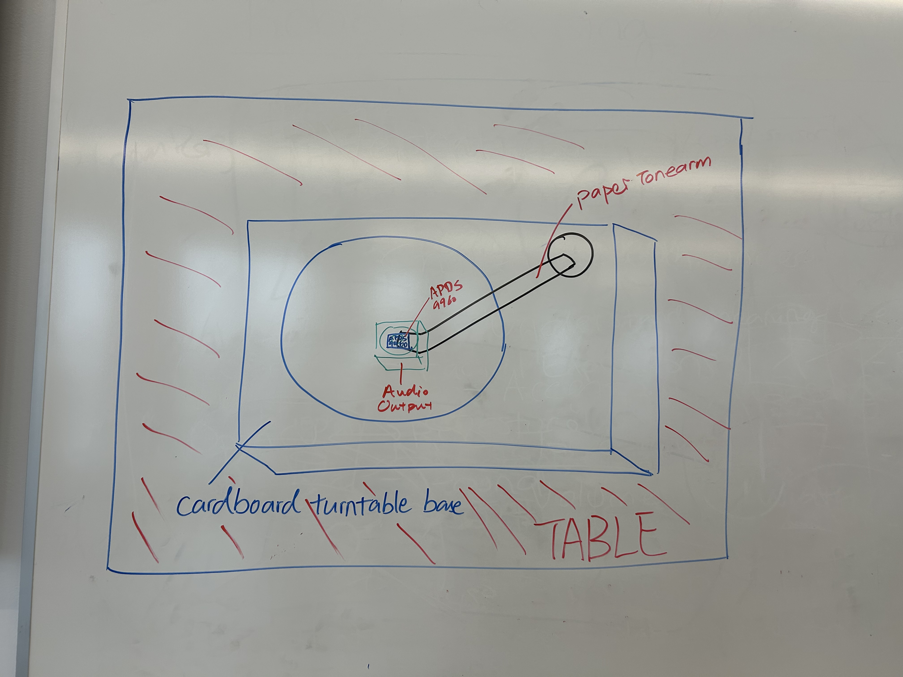
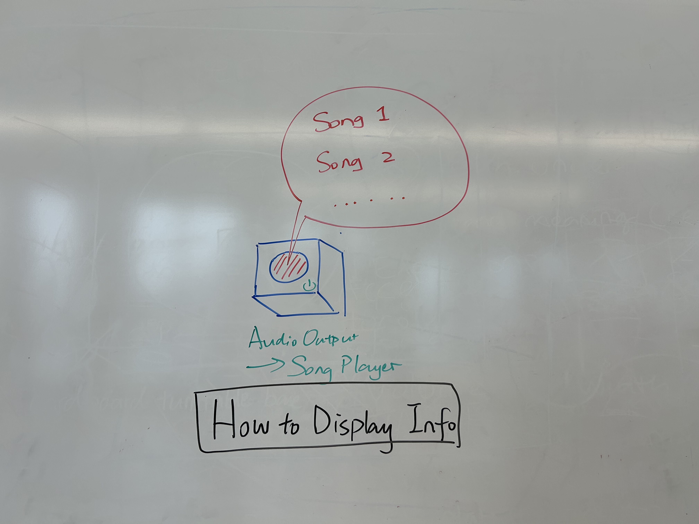
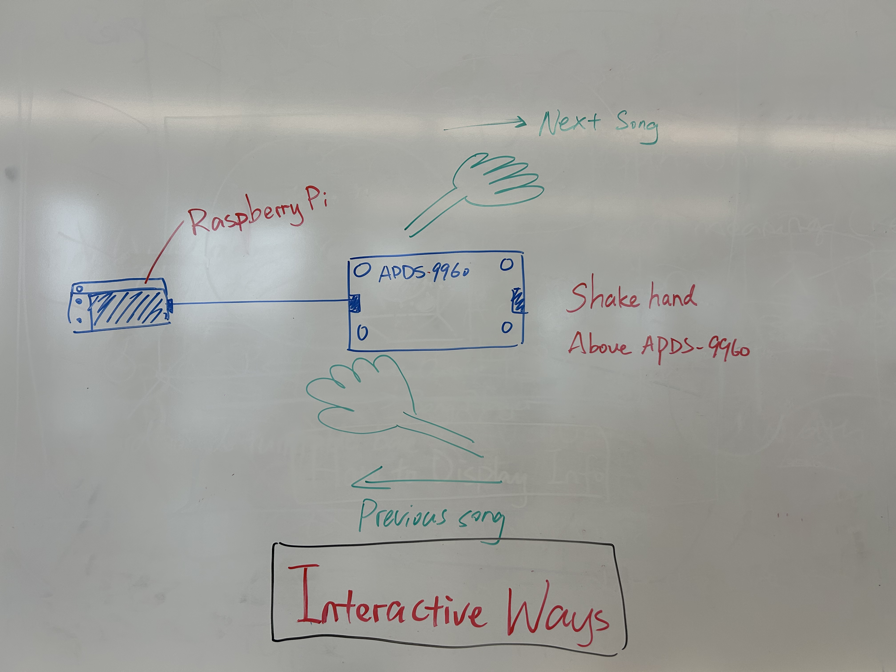
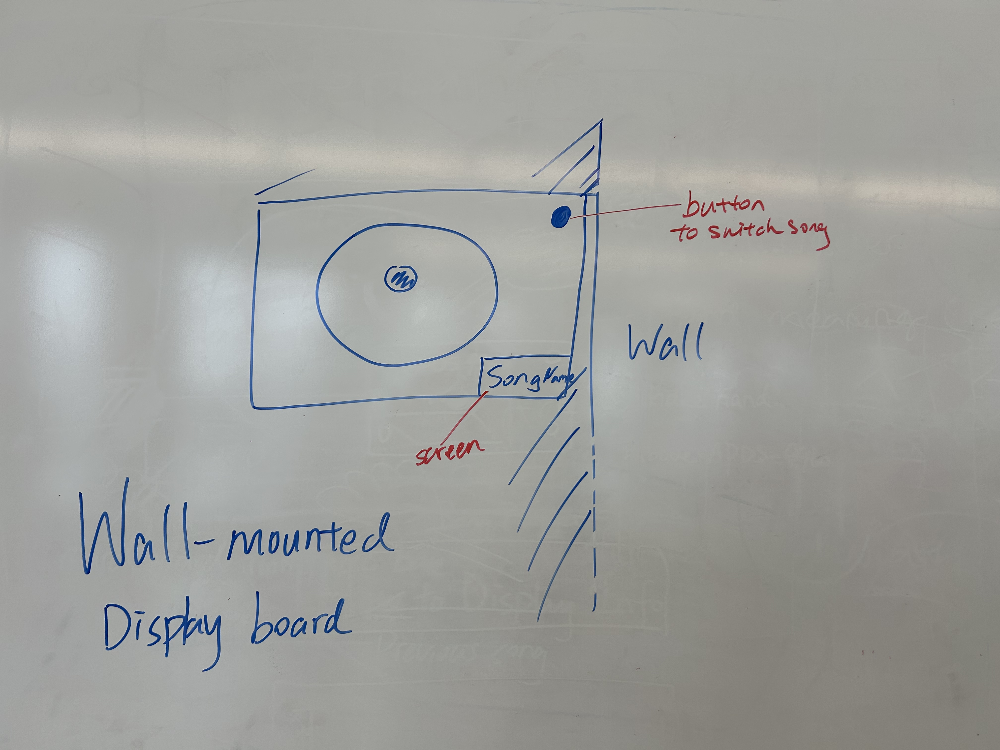
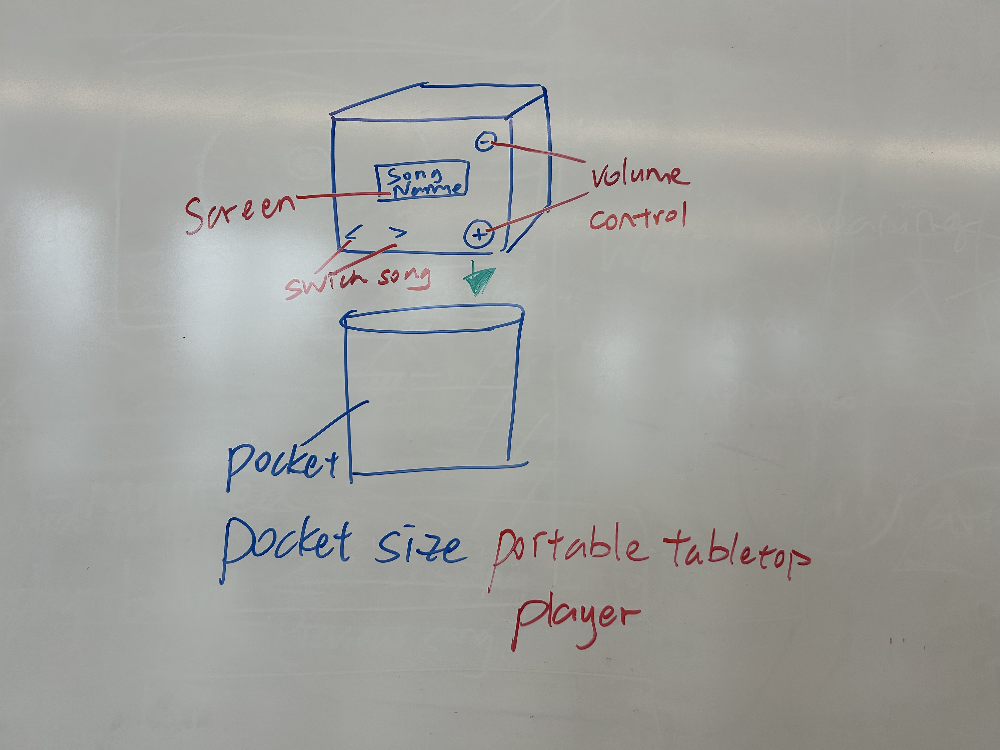
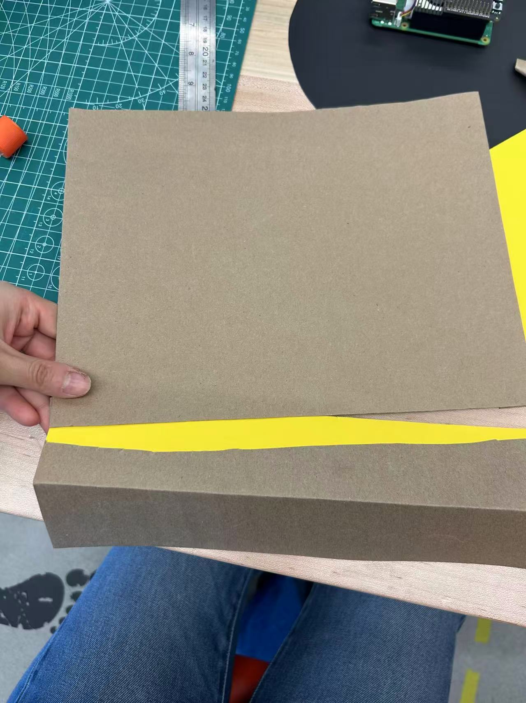
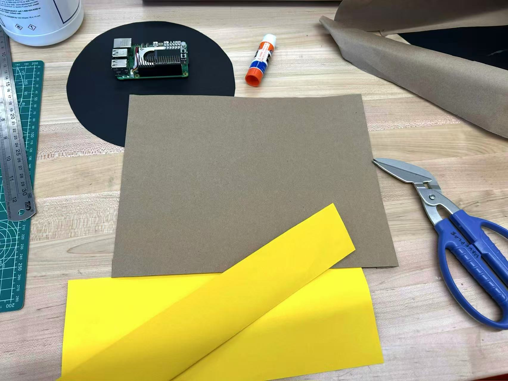

# Ph-UI!!!

<details>
	<summary><strong>Instructions for Students (Click to Expand)</strong></summary>
  
	**Submission Cleanup Reminder:**
	- This README.md contains extra instructional text for guidance.
	- Before submitting, remove all instructional text and example prompts from this file.
	- You may delete these sections or use the toggle/hide feature in VS Code to collapse them for a cleaner look.
	- Your final submission should be neat, focused on your own work, and easy to read for grading.
  
	This helps ensure your README.md is clear, professional, and uniquely yours!


---
</details>
<details>
<summary><h2>Lab 4 Deliverables</h2></summary>

### Part 1 (Week 1)
**Submit the following for Part 1:**  
*️⃣ **A. Capacitive Sensing**
	- Photos/videos of your Twizzler (or other object) capacitive sensor setup
	- Code and terminal output showing touch detection

*️⃣ **B. More Sensors**
	- Photos/videos of each sensor tested (light/proximity, rotary encoder, joystick, distance sensor)
	- Code and terminal output for each sensor

*️⃣ **C. Physical Sensing Design**
	- 5 sketches of different ways to use your chosen sensor
	- Written reflection: questions raised, what to prototype
	- Pick one design to prototype and explain why

*️⃣ **D. Display & Housing**
	- 5 sketches for display/button/knob positioning
	- Written reflection: questions raised, what to prototype
	- Pick one display design to integrate
	- Rationale for design
	- Photos/videos of your cardboard prototype

---

### Part 2 (Week 2)
**Submit the following for Part 2:**  
*️⃣ **E. Multi-Device Demo**
	- Code and video for your multi-input multi-output demo (e.g., chaining Qwiic buttons, servo, GPIO expander, etc.)
	- Reflection on interaction effects and chaining

*️⃣ **F. Final Documentation**
	- Photos/videos of your final prototype
	- Written summary: what it looks like, works like, acts like
	- Reflection on what you learned and next steps

---
</details>

## Lab Overview
Jiayi Sun and Huiying Zhan

For lab this week, we focus both on sensing, to bring in new modes of input into your devices, as well as prototyping the physical look and feel of the device. You will think about the physical form the device needs to perform the sensing as well as present the display or feedback about what was sensed. 

<details>
<summary><h2>Part 1 Lab Preparation</h2></summary>

### Get the latest content:
As always, pull updates from the class Interactive-Lab-Hub to both your Pi and your own GitHub repo. As we discussed in the class, there are 2 ways you can do so:


Option 1: On the Pi, `cd` to your `Interactive-Lab-Hub`, pull the updates from upstream (class lab-hub) and push the updates back to your own GitHub repo. You will need the personal access token for this.
```
pi@ixe00:~$ cd Interactive-Lab-Hub
pi@ixe00:~/Interactive-Lab-Hub $ git pull upstream Fall2025
pi@ixe00:~/Interactive-Lab-Hub $ git add .
pi@ixe00:~/Interactive-Lab-Hub $ git commit -m "get lab4 content"
pi@ixe00:~/Interactive-Lab-Hub $ git push
```

Option 2: On your own GitHub repo, [create pull request](https://github.com/FAR-Lab/Developing-and-Designing-Interactive-Devices/blob/2021Fall/readings/Submitting%20Labs.md) to get updates from the class Interactive-Lab-Hub. After you have latest updates online, go on your Pi, `cd` to your `Interactive-Lab-Hub` and use `git pull` to get updates from your own GitHub repo.

Option 3: (preferred) use the Github.com interface to update the changes.

### Start brainstorming ideas by reading: 

* [What do prototypes prototype?](https://www.semanticscholar.org/paper/What-do-Prototypes-Prototype-Houde-Hill/30bc6125fab9d9b2d5854223aeea7900a218f149)
* [Paper prototyping](https://www.uxpin.com/studio/blog/paper-prototyping-the-practical-beginners-guide/) is used by UX designers to quickly develop interface ideas and run them by people before any programming occurs. 
* [Cardboard prototypes](https://www.youtube.com/watch?v=k_9Q-KDSb9o) help interactive product designers to work through additional issues, like how big something should be, how it could be carried, where it would sit. 
* [Tips to Cut, Fold, Mold and Papier-Mache Cardboard](https://makezine.com/2016/04/21/working-with-cardboard-tips-cut-fold-mold-papier-mache/) from Make Magazine.
* [Surprisingly complicated forms](https://www.pinterest.com/pin/50032245843343100/) can be built with paper, cardstock or cardboard.  The most advanced and challenging prototypes to prototype with paper are [cardboard mechanisms](https://www.pinterest.com/helgangchin/paper-mechanisms/) which move and change. 
* [Dyson Vacuum Cardboard Prototypes](http://media.dyson.com/downloads/JDF/JDF_Prim_poster05.pdf)
<p align="center"> </p>

### Gathering materials for this lab:

* Cardboard (start collecting those shipping boxes!)
* Found objects and materials--like bananas and twigs.
* Cutting board
* Cutting tools
* Markers


(We do offer shared cutting board, cutting tools, and markers on the class cart during the lab, so do not worry if you don't have them!)
</details>

<details>
<summary><h2> Deliverables \& Submission for Lab 4</h2></summary>

The deliverables for this lab are, writings, sketches, photos, and videos that show what your prototype:
* "Looks like": shows how the device should look, feel, sit, weigh, etc.
* "Works like": shows what the device can do.
* "Acts like": shows how a person would interact with the device.

For submission, the readme.md page for this lab should be edited to include the work you have done:
* Upload any materials that explain what you did, into your lab 4 repository, and link them in your lab 4 readme.md.
* Link your Lab 4 readme.md in your main Interactive-Lab-Hub readme.md. 
* Labs are due on Mondays, make sure to submit your Lab 4 readme.md to Canvas.
</details>

## Lab Overview

A) [Capacitive Sensing](#part-a)

B) [OLED screen](#part-b) 

C) [Paper Display](#part-c)

D) [Materiality](#part-d)

E) [Servo Control](#part-e)

F) [Record the interaction](#part-f)


## The Report (Part 1: A-D, Part 2: E-F)

<details>
<summary><h3>Quick Start: Python Environment Setup</h3></summary>

1. **Create and activate a virtual environment in Lab 4:**
	```bash
	cd ~/Interactive-Lab-Hub/Lab\ 4
	python3 -m venv .venv
	source .venv/bin/activate
	```
2. **Install all Lab 4 requirements:**
	```bash
	pip install -r requirements2025.txt
	```
3. **Check CircuitPython Blinka installation:**
	```bash
	python blinkatest.py
	```
	If you see "Hello blinka!", your setup is correct. If not, follow the troubleshooting steps in the file or ask for help.
</details>

### Part A
<details>
<summary><h4>Capacitive Sensing, a.k.a. Human-Twizzler Interaction</h4></summary>
We want to introduce you to the [capacitive sensor](https://learn.adafruit.com/adafruit-mpr121-gator) in your kit. It's one of the most flexible input devices we are able to provide. At boot, it measures the capacitance on each of the 12 contacts. Whenever that capacitance changes, it considers it a user touch. You can attach any conductive material. In your kit, you have copper tape that will work well, but don't limit yourself! In the example below, we use Twizzlers--you should pick your own objects.


<p float="left">

 
</p>

Plug in the capacitive sensor board with the QWIIC connector. Connect your Twizzlers with either the copper tape or the alligator clips (the clips work better). Install the latest requirements from your working virtual environment:

These Twizzlers are connected to pads 6 and 10. When you run the code and touch a Twizzler, the terminal will print out the following

```
(circuitpython) pi@ixe00:~/Interactive-Lab-Hub/Lab 4 $ python cap_test.py 
Twizzler 10 touched!
Twizzler 6 touched!
```
</details>

[Watch the Capacitive Sensing Test video here](https://youtu.be/Zkkp4hpUmT0)   


### Part B
### More sensors
<details>
<summary><h4>Light/Proximity/Gesture sensor (APDS-9960)</h4></summary>

We here want you to get to know this awesome sensor [Adafruit APDS-9960](https://www.adafruit.com/product/3595). It is capable of sensing proximity, light (also RGB), and gesture! 
 

 

Connect it to your pi with Qwiic connector and try running the three example scripts individually to see what the sensor is capable of doing!

```
(circuitpython) pi@ixe00:~/Interactive-Lab-Hub/Lab 4 $ python proximity_test.py
...
(circuitpython) pi@ixe00:~/Interactive-Lab-Hub/Lab 4 $ python gesture_test.py
...
(circuitpython) pi@ixe00:~/Interactive-Lab-Hub/Lab 4 $ python color_test.py
...
```

You can go the the [Adafruit GitHub Page](https://github.com/adafruit/Adafruit_CircuitPython_APDS9960) to see more examples for this sensor!
</details>

[Watch the Proximity Test video here](https://youtu.be/O3EXj9QbpGg)   
[Watch the Gesture Test video here](https://youtu.be/lSCrs3jGfG8)   
[Watch the Color Test video here](https://youtu.be/w0VfGBpko4k)


<details>
<summary><h4>Rotary Encoder</h4></summary>
A rotary encoder is an electro-mechanical device that converts the angular position to analog or digital output signals. The [Adafruit rotary encoder](https://www.adafruit.com/product/4991#technical-details) we ordered for you came with separate breakout board and encoder itself, that is, they will need to be soldered if you have not yet done so! We will be bringing the soldering station to the lab class for you to use, also, you can go to the MakerLAB to do the soldering off-class. Here is some [guidance on soldering](https://learn.adafruit.com/adafruit-guide-excellent-soldering/preparation) from Adafruit. When you first solder, get someone who has done it before (ideally in the MakerLAB environment). It is a good idea to review this material beforehand so you know what to look at.

<p float="left">

   


</p>

Connect it to your pi with Qwiic connector and try running the example script, it comes with an additional button which might be useful for your design!

```
(circuitpython) pi@ixe00:~/Interactive-Lab-Hub/Lab 4 $ python encoder_test.py
```

You can go to the [Adafruit Learn Page](https://learn.adafruit.com/adafruit-i2c-qt-rotary-encoder/python-circuitpython) to learn more about the sensor! The sensor actually comes with an LED (neo pixel): Can you try lighting it up? 
</details>

[Watch the Encoder Test video here](https://youtu.be/-VMnZd_K9Kw)

<details>
<summary><h4>Joystick</h4></summary>
A [joystick](https://www.sparkfun.com/products/15168) can be used to sense and report the input of the stick for it pivoting angle or direction. It also comes with a button input!

<p float="left">

</p>

Connect it to your pi with Qwiic connector and try running the example script to see what it can do!

```
(circuitpython) pi@ixe00:~/Interactive-Lab-Hub/Lab 4 $ python joystick_test.py
```

You can go to the [SparkFun GitHub Page](https://github.com/sparkfun/Qwiic_Joystick_Py) to learn more about the sensor!
</details>

[Watch the Joystick Test video here](https://youtu.be/3UiWbI6_ZkE)

<details>
<summary><h4>Distance Sensor</h4></summary>
Earlier we have asked you to play with the proximity sensor, which is able to sense objects within a short distance. Here, we offer [Sparkfun Proximity Sensor Breakout](https://www.sparkfun.com/products/15177), With the ability to detect objects up to 20cm away.

<p float="left">


</p>

Connect it to your pi with Qwiic connector and try running the example script to see how it works!

```
(circuitpython) pi@ixe00:~/Interactive-Lab-Hub/Lab 4 $ python qwiic_distance.py
```

You can go to the [SparkFun GitHub Page](https://github.com/sparkfun/Qwiic_Proximity_Py) to learn more about the sensor and see other examples
</details>

[Watch the Distance Sensor Test video here](https://youtu.be/49AnOakKdbU)

### Part C
<details>
<summary><h3>Physical considerations for sensing</h3></summary>
Usually, sensors need to be positioned in specific locations or orientations to make them useful for their application. Now that you've tried a bunch of the sensors, pick one that you would like to use, and an application where you use the output of that sensor for an interaction. For example, you can use a distance sensor to measure someone's height if you position it overhead and get them to stand under it.
</details>

### Smart Hygiene Dispenser
Detects hand proximity to automatically dispense sanitizer and supports gesture control to switch modes.
<p align="center">
  
</p>

### Breathing Trainer
Synchronizes light brightness with the user's breathing rhythm and turns off once the user falls asleep.
<p align="center">
  
</p>

### Touchless Music Controller
Uses simple hand gestures to switch, pause, and resume songs without physical contact.
<p align="center">
  
</p>

### Distance Mirror
Displays real-time weather and time when the user approaches, and hides them when the user moves away.
<p align="center">
  
</p>

### Gesture Lamp
Allows users to adjust light intensity and switch lighting modes through up–down and left–right hand waves.
<p align="center">
  
</p>

---
### What questions do these sketches raise?

While sketching these five concepts, we realized that many of them share similar challenges around gesture detection, sensing range, and user feedback.
Some key questions that emerged are:

#### 1. Sensor sensitivity and detection range
How far should the user's hand be for the APDS-9960 to reliably detect gestures?
Will small or fast movements be missed or misclassified?

#### 2. Sensor placement and orientation
Does the sensor need to face directly toward the user, or can it work at an angle or behind a surface like acrylic?
How much does the physical mounting affect recognition accuracy?

#### 3. Environmental interference
Will ambient light, sunlight, or reflections interfere with the proximity or gesture readings?

#### 4. User feedback and learnability
How can the system communicate successful detection?
Do users need audio, visual, or haptic cues to understand when the system has responded?

#### 5. Safety and usability in real contexts
In touchless designs (like the dispenser or music controller), how do we avoid false triggers or unwanted activations when people simply pass by?   


### What do we need to prototype to answer those questions?
To explore these issues, we will need to physically prototype and test the following aspects:
1. Vary the distance and angle between the user's hand and the sensor to measure detection accuracy.
2. Test gesture recognition (up, down, left, right) in different lighting environments.
3. Integrate visual or sound feedback (like LEDs or audio tones) to evaluate whether users can easily understand system responses.
4. Experiment with different enclosure materials (cardboard, plastic, translucent cover) to see how they affect proximity sensing.
5. Observe how users interact with the device naturally, identifying when false detections occur.
   

### Prototype Choice
We decided to prototype the gesture-controlled music player using the APDS-9960 sensor.
This design feels both fun and practical—it allows users to control music playback without touching any buttons, which is useful when their hands are busy or unclean (for example, while cooking or studying).

With this prototype, we want to explore how well the sensor can recognize left and right gestures for switching songs, and near/far gestures for pausing and resuming playback. It will also help us understand how users perceive the responsiveness of the system and whether adding visual or audio feedback (like an LED flash or short tone) improves the overall interaction experience.


### Part D
<details>
<summary><h3>Physical considerations for displaying information and housing parts</h3></summary>


Here is a Pi with a paper faceplate on it to turn it into a display interface:


This is fine, but the mounting of the display constrains the display location and orientation a lot. Also, it really only works for applications where people can come and stand over the Pi, or where you can mount the Pi to the wall.

Here is another prototype for a paper display:


Your kit includes these [SparkFun Qwiic OLED screens](https://www.sparkfun.com/products/17153). These use less power than the MiniTFTs you have mounted on the GPIO pins of the Pi, but, more importantly, they can be more flexibly mounted elsewhere on your physical interface. The way you program this display is almost identical to the way you program a  Pi display. Take a look at `oled_test.py` and some more of the [Adafruit examples](https://github.com/adafruit/Adafruit_CircuitPython_SSD1306/tree/master/examples).

<p float="left">


</p>


It holds a Pi and usb power supply, and provides a front stage on which to put writing, graphics, LEDs, buttons or displays.

This design can be made by scoring a long strip of corrugated cardboard of width X, with the following measurements:

| Y height of box <br> <sub><sup>- thickness of cardboard</sup></sub> | Z  depth of box <br><sub><sup>- thickness of cardboard</sup></sub> | Y height of box  | Z  depth of box | H height of faceplate <br><sub><sup>* * * * * (don't make this too short) * * * * *</sup></sub>|
| --- | --- | --- | --- | --- | 

Fold the first flap of the strip so that it sits flush against the back of the face plate, and tape, velcro or hot glue it in place. This will make a H x X interface, with a box of Z x X footprint (which you can adapt to the things you want to put in the box) and a height Y in the back. 

Here is an example:


Think about how you want to present the information about what your sensor is sensing! Design a paper display for your project that communicates the state of the Pi and a sensor. Ideally you should design it so that you can slide the Pi out to work on the circuit or programming, and then slide it back in and reattach a few wires to be back in operation.
</details>

### Sketch 5 designs for how you would physically position your display and any buttons or knobs needed to interact with it.
#### Sketch 1 – Turntable
<p align="center">
  
</p>   

- The APDS-9960 sensor is positioned at the center of a turntable to detect left and right swipe gestures for switching songs.
- The larger device is designed as a flat record player, allowing users to interact naturally by moving their hands horizontally across the sensor.  

#### Sketch 2 – Song Player
<p align="center">
  
</p> 

- The focus of this design is how to display information through sound — using the speaker as the main medium to communicate playback status.
- - Instead of visual feedback, music itself becomes the output, spreading through the speaker so that people nearby can hear and perceive the interaction.

#### Sketch 3 – Interaction Diagram
<p align="center">
  
</p>

- This diagram clarifies how hand gestures are recognized:  
  - Swipe right → Next song  
  - Swipe left → Previous song  
- The Raspberry Pi connects to the APDS-9960 through I²C wiring, with enough open space around the sensor to avoid reflections or blocking.   
- The first three sketches together describe a **single prototype concept** — an interactive vinyl record player that combines gesture-based control, sound output, and tangible form to create a better user experience.

#### Sketch 4 – Wall-mounted Display Turntable
<p align="center">
  
</p>

- The sensor are mounted on a vertical display turntable, fixed to the wall.  
- Users can touch a simple “next/previous” button as backup control.  
- Display on wall make device more public and interactive.

#### Sketch 5 – Portable Pocket Player
<p align="center">
  
</p>

- A compact, pocket-sized version of the music player.  
- Includes a screen, two small buttons for switching songs, and a rotary knob for volume control.
- The physical form focuses on mobility and personal use.

---

### What are some things these sketches raise as questions? What do you need to physically prototype to understand how to anwer those questions?\*\*\***
1. **Gesture Reliability:**  
   - How consistently does the APDS-9960 recognize left/right gestures under different lighting conditions and angles?  
   - Physical prototyping can help determine the optimal sensor placement and gesture distance.  

2. **User Feedback and Visibility:**  
   - Can users easily understand which song is playing or what gesture was detected?  
   - Prototyping a screen layout or paper interface will help refine the feedback design.  

3. **Form and Accessibility:**  
   - How should the device’s size, height, and orientation change between tabletop, wall-mounted, and portable versions?  
   - Physical mockups will help test usability in different contexts.  

4. **Interaction Comfort:**  
   - How natural does it feel to wave or swipe above the sensor?

5. **Aesthetic Integration:**  
   - How can the retro turntable appearance blend with the modern digital interaction?  
---

### Prototype
<p align="center">
  
</p>

[Watch the Prototype video here](https://youtu.be/M_O3RC8Aed4)   

The gesture-controlled music player is implemented in [`Lab 4/music_player.py`](https://github.com/hz764/Interactive-Lab-Hub-hz764/blob/Fall2025/Lab%204/music_player.py)

### Explain the Rationale for the Design
- The design takes inspiration from a **vinyl record player**, emphasizing tangible interaction and visual familiarity.
- The circular base represents the turntable, while the **paper tonearm** mimics the motion of a real record player.
- The **APDS-9960 sensor** is positioned at the center, where users can naturally wave their hands to control playback.
- This placement ensures the gestures are **easily recognized** without obstruction and allows intuitive control from a short distance (5-10 cm).
- The overall **size and form** are chosen to be tabletop scale — large enough for comfortable hand motion, but compact enough to fit on a desk.
- The **speaker connection** allows music to be heard by everyone around, reinforcing the shared and social aspect of the design.

### Document Your Rough Prototype
<p align="center">
  
</p>
<p align="center">
  
</p>

- The prototype is constructed using **cardboard and colored paper**, with the Raspberry Pi and APDS-9960 connected through I²C wiring.
- The tonearm is made from **lightweight cardboard**, and the base includes **aesthetic blue and black color contrast** to highlight the interaction zone.
- The Raspberry Pi handles audio playback and gesture recognition through a Python script.
- This rough prototype helps visualize how the **gesture input**, **sensor placement**, and **audio feedback** work together in a cohesive setup.
---

### User Feedback
- Early testers reported that the design was **visually clear and intuitive**, as the record-player metaphor made the interaction immediately understandable.
- However, they noted that **gesture sensitivity** could be improved — sometimes swipes were not recognized consistently, especially under bright lighting conditions.
- Users also suggested that adding **visual indicators or LED feedback** could make the interaction feel more responsive.

# LAB PART 2

### Part 2

Following exploration and reflection from Part 1, complete the "looks like," "works like" and "acts like" prototypes for your design, reiterated below.


### Part E

#### Chaining Devices and Exploring Interaction Effects

For Part 2, you will design and build a fun interactive prototype using multiple inputs and outputs. This means chaining Qwiic and STEMMA QT devices (e.g., buttons, encoders, sensors, servos, displays) and/or combining with traditional breadboard prototyping (e.g., LEDs, buzzers, etc.).

**Your prototype should:**
- Combine at least two different types of input and output devices, inspired by your physical considerations from Part 1.
- Be playful, creative, and demonstrate multi-input/multi-output interaction.

**Document your system with:**
- Code for your multi-device demo
- Photos and/or video of the working prototype in action
- A simple interaction diagram or sketch showing how inputs and outputs are connected and interact
- Written reflection: What did you learn about multi-input/multi-output interaction? What was fun, surprising, or challenging?

**Questions to consider:**
- What new types of interaction become possible when you combine two or more sensors or actuators?
- How does the physical arrangement of devices (e.g., where the encoder or sensor is placed) change the user experience?
- What happens if you use one device to control or modulate another (e.g., encoder sets a threshold, sensor triggers an action)?
- How does the system feel if you swap which device is "primary" and which is "secondary"?

Try chaining different combinations and document what you discover!

See encoder_accel_servo_dashboard.py in the Lab 4 folder for an example of chaining together three devices.

**`Lab 4/encoder_accel_servo_dashboard.py`**

#### Using Multiple Qwiic Buttons: Changing I2C Address (Physically & Digitally)

If you want to use more than one Qwiic Button in your project, you must give each button a unique I2C address. There are two ways to do this:

##### 1. Physically: Soldering Address Jumpers

On the back of the Qwiic Button, you'll find four solder jumpers labeled A0, A1, A2, and A3. By bridging these with solder, you change the I2C address. Only one button on the chain can use the default address (0x6F).

**Address Table:**

| A3 | A2 | A1 | A0 | Address (hex) |
|----|----|----|----|---------------|
|  0 |  0 |  0 |  0 |    0x6F       |
|  0 |  0 |  0 |  1 |    0x6E       |
|  0 |  0 |  1 |  0 |    0x6D       |
|  0 |  0 |  1 |  1 |    0x6C       |
|  0 |  1 |  0 |  0 |    0x6B       |
|  0 |  1 |  0 |  1 |    0x6A       |
|  0 |  1 |  1 |  0 |    0x69       |
|  0 |  1 |  1 |  1 |    0x68       |
|  1 |  0 |  0 |  0 |    0x67       |
| ...| ...| ...| ... |     ...      |

For example, if you solder A0 closed (leave A1, A2, A3 open), the address becomes 0x6E.

**Soldering Tips:**
- Use a small amount of solder to bridge the pads for the jumper you want to close.
- Only one jumper needs to be closed for each address change (see table above).
- Power cycle the button after changing the jumper.

##### 2. Digitally: Using Software to Change Address

You can also change the address in software (temporarily or permanently) using the example script `qwiic_button_ex6_changeI2CAddress.py` in the Lab 4 folder. This is useful if you want to reassign addresses without soldering.

Run the script and follow the prompts:
```bash
python qwiic_button_ex6_changeI2CAddress.py
```
Enter the new address (e.g., 5B for 0x5B) when prompted. Power cycle the button after changing the address.

**Note:** The software method is less foolproof and you need to make sure to keep track of which button has which address!


##### Using Multiple Buttons in Code

After setting unique addresses, you can use multiple buttons in your script. See these example scripts in the Lab 4 folder:

- **`qwiic_1_button.py`**: Basic example for reading a single Qwiic Button (default address 0x6F). Run with:
	```bash
	python qwiic_1_button.py
	```

- **`qwiic_button_led_demo.py`**: Demonstrates using two Qwiic Buttons at different addresses (e.g., 0x6F and 0x6E) and controlling their LEDs. Button 1 toggles its own LED; Button 2 toggles both LEDs. Run with:
	```bash
	python qwiic_button_led_demo.py
	```

Here is a minimal code example for two buttons:
```python
import qwiic_button

# Default button (0x6F)
button1 = qwiic_button.QwiicButton()
# Button with A0 soldered (0x6E)
button2 = qwiic_button.QwiicButton(0x6E)

button1.begin()
button2.begin()

while True:
		if button1.is_button_pressed():
				print("Button 1 pressed!")
		if button2.is_button_pressed():
				print("Button 2 pressed!")
```

For more details, see the [Qwiic Button Hookup Guide](https://learn.sparkfun.com/tutorials/qwiic-button-hookup-guide/all#i2c-address).

---

### PCF8574 GPIO Expander: Add More Pins Over I²C

Sometimes your Pi’s header GPIO pins are already full (e.g., with a display or HAT). That’s where an I²C GPIO expander comes in handy.

We use the Adafruit PCF8574 I²C GPIO Expander, which gives you 8 extra digital pins over I²C. It’s a great way to prototype with LEDs, buttons, or other components on the breadboard without worrying about pin conflicts—similar to how Arduino users often expand their pinouts when prototyping physical interactions.

**Why is this useful?**
- You only need two wires (I²C: SDA + SCL) to unlock 8 extra GPIOs.
- It integrates smoothly with CircuitPython and Blinka.
- It allows a clean prototyping workflow when the Pi’s 40-pin header is already occupied by displays, HATs, or sensors.
- Makes breadboard setups feel more like an Arduino-style prototyping environment where it’s easy to wire up interaction elements.

**Demo Script:** `Lab 4/gpio_expander.py`

<p align="center">
    
</p>

We connected 8 LEDs (through 220 Ω resistors) to the expander and ran a little light show. The script cycles through three patterns:
- Chase (one LED at a time, left to right)
- Knight Rider (back-and-forth sweep)
- Disco (random blink chaos)

Every few runs, the script swaps to the next pattern automatically:
```bash
python gpio_expander.py
```

This is a playful way to visualize how the expander works, but the same technique applies if you wanted to prototype buttons, switches, or other interaction elements. It’s a lightweight, flexible addition to your prototyping toolkit.

---

### Servo Control with SparkFun Servo pHAT
For this lab, you will use the **SparkFun Servo pHAT** to control a micro servo (such as the Miuzei MS18 or similar 9g servo). The Servo pHAT stacks directly on top of the Adafruit Mini PiTFT (135×240) display without pin conflicts:
- The Mini PiTFT uses SPI (GPIO22, 23, 24, 25) for display and buttons ([SPI pinout](https://pinout.xyz/pinout/spi)).
- The Servo pHAT uses I²C (GPIO2 & 3) for the PCA9685 servo driver ([I2C pinout](https://pinout.xyz/pinout/i2c)).
- Since SPI and I²C are separate buses, you can use both boards together.
**⚡ Power:**
- Plug a USB-C cable into the Servo pHAT to provide enough current for the servos. The Pi itself should still be powered by its own USB-C supply. Do NOT power servos from the Pi’s 5V rail.

<p align="center">
    
</p>

**Basic Python Example:**
We provide a simple example script: `Lab 4/pi_servo_hat_test.py` (requires the `pi_servo_hat` Python package).
Run the example:
```
python pi_servo_hat_test.py
```
For more details and advanced usage, see the [official SparkFun Servo pHAT documentation](https://learn.sparkfun.com/tutorials/pi-servo-phat-v2-hookup-guide/all#resources-and-going-further).
A servo motor is a rotary actuator that allows for precise control of angular position. The position is set by the width of an electrical pulse (PWM). You can read [this Adafruit guide](https://learn.adafruit.com/adafruit-arduino-lesson-14-servo-motors/servo-motors) to learn more about how servos work.

---


### Part F

### Record

Document all the prototypes and iterations you have designed and worked on! Again, deliverables for this lab are writings, sketches, photos, and videos that show what your prototype:
* "Looks like": shows how the device should look, feel, sit, weigh, etc.
* "Works like": shows what the device can do
* "Acts like": shows how a person would interact with the device
