# Ph-UI!!!

Partner: Celeste (Lianne) Bisch (lb854)

<details>
	<summary><strong>Instructions for Students (Click to Expand)</strong></summary>
  
	**Submission Cleanup Reminder:**
	- This README.md contains extra instructional text for guidance.
	- Before submitting, remove all instructional text and example prompts from this file.
	- You may delete these sections or use the toggle/hide feature in VS Code to collapse them for a cleaner look.
	- Your final submission should be neat, focused on your own work, and easy to read for grading.
  
	This helps ensure your README.md is clear, professional, and uniquely yours!


---

## Lab 4 Deliverables

### Part 1 (Week 1)
**Submit the following for Part 1:**  
*️⃣ **A. Capacitive Sensing**
	- Photos/videos of your Twizzler (or other object) capacitive sensor setup
	- Code and terminal output showing touch detection

*️⃣ **B. More Sensors**
	- Photos/videos of each sensor tested (light/proximity, rotary encoder, joystick, distance sensor)
	- Code and terminal output for each sensor

*️⃣ **C. Physical Sensing Design**
	- 5 sketches of different ways to use your chosen sensor
	- Written reflection: questions raised, what to prototype
	- Pick one design to prototype and explain why

*️⃣ **D. Display & Housing**
	- 5 sketches for display/button/knob positioning
	- Written reflection: questions raised, what to prototype
	- Pick one display design to integrate
	- Rationale for design
	- Photos/videos of your cardboard prototype

---

### Part 2 (Week 2)
**Submit the following for Part 2:**  
*️⃣ **E. Multi-Device Demo**
	- Code and video for your multi-input multi-output demo (e.g., chaining Qwiic buttons, servo, GPIO expander, etc.)
	- Reflection on interaction effects and chaining

*️⃣ **F. Final Documentation**
	- Photos/videos of your final prototype
	- Written summary: what it looks like, works like, acts like
	- Reflection on what you learned and next steps

---

## Lab Overview
**NAMES OF COLLABORATORS HERE**


For lab this week, we focus both on sensing, to bring in new modes of input into your devices, as well as prototyping the physical look and feel of the device. You will think about the physical form the device needs to perform the sensing as well as present the display or feedback about what was sensed. 

## Part 1 Lab Preparation

### Get the latest content:
As always, pull updates from the class Interactive-Lab-Hub to both your Pi and your own GitHub repo. As we discussed in the class, there are 2 ways you can do so:


Option 1: On the Pi, `cd` to your `Interactive-Lab-Hub`, pull the updates from upstream (class lab-hub) and push the updates back to your own GitHub repo. You will need the personal access token for this.
```
pi@ixe00:~$ cd Interactive-Lab-Hub
pi@ixe00:~/Interactive-Lab-Hub $ git pull upstream Fall2025
pi@ixe00:~/Interactive-Lab-Hub $ git add .
pi@ixe00:~/Interactive-Lab-Hub $ git commit -m "get lab4 content"
pi@ixe00:~/Interactive-Lab-Hub $ git push
```

Option 2: On your own GitHub repo, [create pull request](https://github.com/FAR-Lab/Developing-and-Designing-Interactive-Devices/blob/2021Fall/readings/Submitting%20Labs.md) to get updates from the class Interactive-Lab-Hub. After you have latest updates online, go on your Pi, `cd` to your `Interactive-Lab-Hub` and use `git pull` to get updates from your own GitHub repo.

Option 3: (preferred) use the Github.com interface to update the changes.

### Start brainstorming ideas by reading: 

* [What do prototypes prototype?](https://www.semanticscholar.org/paper/What-do-Prototypes-Prototype-Houde-Hill/30bc6125fab9d9b2d5854223aeea7900a218f149)
* [Paper prototyping](https://www.uxpin.com/studio/blog/paper-prototyping-the-practical-beginners-guide/) is used by UX designers to quickly develop interface ideas and run them by people before any programming occurs. 
* [Cardboard prototypes](https://www.youtube.com/watch?v=k_9Q-KDSb9o) help interactive product designers to work through additional issues, like how big something should be, how it could be carried, where it would sit. 
* [Tips to Cut, Fold, Mold and Papier-Mache Cardboard](https://makezine.com/2016/04/21/working-with-cardboard-tips-cut-fold-mold-papier-mache/) from Make Magazine.
* [Surprisingly complicated forms](https://www.pinterest.com/pin/50032245843343100/) can be built with paper, cardstock or cardboard.  The most advanced and challenging prototypes to prototype with paper are [cardboard mechanisms](https://www.pinterest.com/helgangchin/paper-mechanisms/) which move and change. 
* [Dyson Vacuum Cardboard Prototypes](http://media.dyson.com/downloads/JDF/JDF_Prim_poster05.pdf)
<p align="center"> </p>

### Gathering materials for this lab:

* Cardboard (start collecting those shipping boxes!)
* Found objects and materials--like bananas and twigs.
* Cutting board
* Cutting tools
* Markers


(We do offer shared cutting board, cutting tools, and markers on the class cart during the lab, so do not worry if you don't have them!)

## Deliverables \& Submission for Lab 4

The deliverables for this lab are, writings, sketches, photos, and videos that show what your prototype:
* "Looks like": shows how the device should look, feel, sit, weigh, etc.
* "Works like": shows what the device can do.
* "Acts like": shows how a person would interact with the device.

For submission, the readme.md page for this lab should be edited to include the work you have done:
* Upload any materials that explain what you did, into your lab 4 repository, and link them in your lab 4 readme.md.
* Link your Lab 4 readme.md in your main Interactive-Lab-Hub readme.md. 
* Labs are due on Mondays, make sure to submit your Lab 4 readme.md to Canvas.


## Lab Overview

A) [Capacitive Sensing](#part-a)

B) [OLED screen](#part-b) 

C) [Paper Display](#part-c)

D) [Materiality](#part-d)

E) [Servo Control](#part-e)

F) [Record the interaction](#part-f)


## The Report (Part 1: A-D, Part 2: E-F)

### Quick Start: Python Environment Setup

1. **Create and activate a virtual environment in Lab 4:**
	```bash
	cd ~/Interactive-Lab-Hub/Lab\ 4
	python3 -m venv .venv
	source .venv/bin/activate
	```
2. **Install all Lab 4 requirements:**
	```bash
	pip install -r requirements2025.txt
	```
3. **Check CircuitPython Blinka installation:**
	```bash
	python blinkatest.py
	```
	If you see "Hello blinka!", your setup is correct. If not, follow the troubleshooting steps in the file or ask for help.

### Part A
### Capacitive Sensing, a.k.a. Human-Twizzler Interaction 

We want to introduce you to the [capacitive sensor](https://learn.adafruit.com/adafruit-mpr121-gator) in your kit. It's one of the most flexible input devices we are able to provide. At boot, it measures the capacitance on each of the 12 contacts. Whenever that capacitance changes, it considers it a user touch. You can attach any conductive material. In your kit, you have copper tape that will work well, but don't limit yourself! In the example below, we use Twizzlers--you should pick your own objects.


<p float="left">

 
</p>

Plug in the capacitive sensor board with the QWIIC connector. Connect your Twizzlers with either the copper tape or the alligator clips (the clips work better). Install the latest requirements from your working virtual environment:

These Twizzlers are connected to pads 6 and 10. When you run the code and touch a Twizzler, the terminal will print out the following

```
(circuitpython) pi@ixe00:~/Interactive-Lab-Hub/Lab 4 $ python cap_test.py 
Twizzler 10 touched!
Twizzler 6 touched!
```

### Part B
### More sensors

#### Light/Proximity/Gesture sensor (APDS-9960)

We here want you to get to know this awesome sensor [Adafruit APDS-9960](https://www.adafruit.com/product/3595). It is capable of sensing proximity, light (also RGB), and gesture! 
 

 

Connect it to your pi with Qwiic connector and try running the three example scripts individually to see what the sensor is capable of doing!

```
(circuitpython) pi@ixe00:~/Interactive-Lab-Hub/Lab 4 $ python proximity_test.py
...
(circuitpython) pi@ixe00:~/Interactive-Lab-Hub/Lab 4 $ python gesture_test.py
...
(circuitpython) pi@ixe00:~/Interactive-Lab-Hub/Lab 4 $ python color_test.py
...
```

You can go the the [Adafruit GitHub Page](https://github.com/adafruit/Adafruit_CircuitPython_APDS9960) to see more examples for this sensor!

#### Rotary Encoder 

A rotary encoder is an electro-mechanical device that converts the angular position to analog or digital output signals. The [Adafruit rotary encoder](https://www.adafruit.com/product/4991#technical-details) we ordered for you came with separate breakout board and encoder itself, that is, they will need to be soldered if you have not yet done so! We will be bringing the soldering station to the lab class for you to use, also, you can go to the MakerLAB to do the soldering off-class. Here is some [guidance on soldering](https://learn.adafruit.com/adafruit-guide-excellent-soldering/preparation) from Adafruit. When you first solder, get someone who has done it before (ideally in the MakerLAB environment). It is a good idea to review this material beforehand so you know what to look at.

<p float="left">

   


</p>

Connect it to your pi with Qwiic connector and try running the example script, it comes with an additional button which might be useful for your design!

```
(circuitpython) pi@ixe00:~/Interactive-Lab-Hub/Lab 4 $ python encoder_test.py
```

You can go to the [Adafruit Learn Page](https://learn.adafruit.com/adafruit-i2c-qt-rotary-encoder/python-circuitpython) to learn more about the sensor! The sensor actually comes with an LED (neo pixel): Can you try lighting it up? 

#### Joystick 


A [joystick](https://www.sparkfun.com/products/15168) can be used to sense and report the input of the stick for it pivoting angle or direction. It also comes with a button input!

<p float="left">

</p>

Connect it to your pi with Qwiic connector and try running the example script to see what it can do!

```
(circuitpython) pi@ixe00:~/Interactive-Lab-Hub/Lab 4 $ python joystick_test.py
```

You can go to the [SparkFun GitHub Page](https://github.com/sparkfun/Qwiic_Joystick_Py) to learn more about the sensor!

#### Distance Sensor


Earlier we have asked you to play with the proximity sensor, which is able to sense objects within a short distance. Here, we offer [Sparkfun Proximity Sensor Breakout](https://www.sparkfun.com/products/15177), With the ability to detect objects up to 20cm away.

<p float="left">


</p>

Connect it to your pi with Qwiic connector and try running the example script to see how it works!

```
(circuitpython) pi@ixe00:~/Interactive-Lab-Hub/Lab 4 $ python qwiic_distance.py
```

You can go to the [SparkFun GitHub Page](https://github.com/sparkfun/Qwiic_Proximity_Py) to learn more about the sensor and see other examples

### Part C
### Physical considerations for sensing


Usually, sensors need to be positioned in specific locations or orientations to make them useful for their application. Now that you've tried a bunch of the sensors, pick one that you would like to use, and an application where you use the output of that sensor for an interaction. For example, you can use a distance sensor to measure someone's height if you position it overhead and get them to stand under it.


**\*\*\*Draw 5 sketches of different ways you might use your sensor, and how the larger device needs to be shaped in order to make the sensor useful.\*\*\***

**\*\*\*What are some things these sketches raise as questions? What do you need to physically prototype to understand how to anwer those questions?\*\*\***

**\*\*\*Pick one of these designs to prototype.\*\*\***


### Part D
### Physical considerations for displaying information and housing parts


Here is a Pi with a paper faceplate on it to turn it into a display interface:


This is fine, but the mounting of the display constrains the display location and orientation a lot. Also, it really only works for applications where people can come and stand over the Pi, or where you can mount the Pi to the wall.

Here is another prototype for a paper display:


Your kit includes these [SparkFun Qwiic OLED screens](https://www.sparkfun.com/products/17153). These use less power than the MiniTFTs you have mounted on the GPIO pins of the Pi, but, more importantly, they can be more flexibly mounted elsewhere on your physical interface. The way you program this display is almost identical to the way you program a  Pi display. Take a look at `oled_test.py` and some more of the [Adafruit examples](https://github.com/adafruit/Adafruit_CircuitPython_SSD1306/tree/master/examples).

<p float="left">


</p>


It holds a Pi and usb power supply, and provides a front stage on which to put writing, graphics, LEDs, buttons or displays.

This design can be made by scoring a long strip of corrugated cardboard of width X, with the following measurements:

| Y height of box <br> <sub><sup>- thickness of cardboard</sup></sub> | Z  depth of box <br><sub><sup>- thickness of cardboard</sup></sub> | Y height of box  | Z  depth of box | H height of faceplate <br><sub><sup>* * * * * (don't make this too short) * * * * *</sup></sub>|
| --- | --- | --- | --- | --- | 

Fold the first flap of the strip so that it sits flush against the back of the face plate, and tape, velcro or hot glue it in place. This will make a H x X interface, with a box of Z x X footprint (which you can adapt to the things you want to put in the box) and a height Y in the back. 

Here is an example:


Think about how you want to present the information about what your sensor is sensing! Design a paper display for your project that communicates the state of the Pi and a sensor. Ideally you should design it so that you can slide the Pi out to work on the circuit or programming, and then slide it back in and reattach a few wires to be back in operation.
 
**\*\*\*Sketch 5 designs for how you would physically position your display and any buttons or knobs needed to interact with it.\*\*\***

**\*\*\*What are some things these sketches raise as questions? What do you need to physically prototype to understand how to anwer those questions?\*\*\***

**\*\*\*Pick one of these display designs to integrate into your prototype.\*\*\***

**\*\*\*Explain the rationale for the design.\*\*\*** (e.g. Does it need to be a certain size or form or need to be able to be seen from a certain distance?)

Build a cardboard prototype of your design.


**\*\*\*Document your rough prototype.\*\*\***


# LAB PART 2

### Part 2

Following exploration and reflection from Part 1, complete the "looks like," "works like" and "acts like" prototypes for your design, reiterated below.


### Part E

#### Chaining Devices and Exploring Interaction Effects

For Part 2, you will design and build a fun interactive prototype using multiple inputs and outputs. This means chaining Qwiic and STEMMA QT devices (e.g., buttons, encoders, sensors, servos, displays) and/or combining with traditional breadboard prototyping (e.g., LEDs, buzzers, etc.).

**Your prototype should:**
- Combine at least two different types of input and output devices, inspired by your physical considerations from Part 1.
- Be playful, creative, and demonstrate multi-input/multi-output interaction.

**Document your system with:**
- Code for your multi-device demo
- Photos and/or video of the working prototype in action
- A simple interaction diagram or sketch showing how inputs and outputs are connected and interact
- Written reflection: What did you learn about multi-input/multi-output interaction? What was fun, surprising, or challenging?

**Questions to consider:**
- What new types of interaction become possible when you combine two or more sensors or actuators?
- How does the physical arrangement of devices (e.g., where the encoder or sensor is placed) change the user experience?
- What happens if you use one device to control or modulate another (e.g., encoder sets a threshold, sensor triggers an action)?
- How does the system feel if you swap which device is "primary" and which is "secondary"?

Try chaining different combinations and document what you discover!

See encoder_accel_servo_dashboard.py in the Lab 4 folder for an example of chaining together three devices.

**`Lab 4/encoder_accel_servo_dashboard.py`**

#### Using Multiple Qwiic Buttons: Changing I2C Address (Physically & Digitally)

If you want to use more than one Qwiic Button in your project, you must give each button a unique I2C address. There are two ways to do this:

##### 1. Physically: Soldering Address Jumpers

On the back of the Qwiic Button, you'll find four solder jumpers labeled A0, A1, A2, and A3. By bridging these with solder, you change the I2C address. Only one button on the chain can use the default address (0x6F).

**Address Table:**

| A3 | A2 | A1 | A0 | Address (hex) |
|----|----|----|----|---------------|
|  0 |  0 |  0 |  0 |    0x6F       |
|  0 |  0 |  0 |  1 |    0x6E       |
|  0 |  0 |  1 |  0 |    0x6D       |
|  0 |  0 |  1 |  1 |    0x6C       |
|  0 |  1 |  0 |  0 |    0x6B       |
|  0 |  1 |  0 |  1 |    0x6A       |
|  0 |  1 |  1 |  0 |    0x69       |
|  0 |  1 |  1 |  1 |    0x68       |
|  1 |  0 |  0 |  0 |    0x67       |
| ...| ...| ...| ... |     ...      |

For example, if you solder A0 closed (leave A1, A2, A3 open), the address becomes 0x6E.

**Soldering Tips:**
- Use a small amount of solder to bridge the pads for the jumper you want to close.
- Only one jumper needs to be closed for each address change (see table above).
- Power cycle the button after changing the jumper.

##### 2. Digitally: Using Software to Change Address

You can also change the address in software (temporarily or permanently) using the example script `qwiic_button_ex6_changeI2CAddress.py` in the Lab 4 folder. This is useful if you want to reassign addresses without soldering.

Run the script and follow the prompts:
```bash
python qwiic_button_ex6_changeI2CAddress.py
```
Enter the new address (e.g., 5B for 0x5B) when prompted. Power cycle the button after changing the address.

**Note:** The software method is less foolproof and you need to make sure to keep track of which button has which address!


##### Using Multiple Buttons in Code

After setting unique addresses, you can use multiple buttons in your script. See these example scripts in the Lab 4 folder:

- **`qwiic_1_button.py`**: Basic example for reading a single Qwiic Button (default address 0x6F). Run with:
	```bash
	python qwiic_1_button.py
	```

- **`qwiic_button_led_demo.py`**: Demonstrates using two Qwiic Buttons at different addresses (e.g., 0x6F and 0x6E) and controlling their LEDs. Button 1 toggles its own LED; Button 2 toggles both LEDs. Run with:
	```bash
	python qwiic_button_led_demo.py
	```

Here is a minimal code example for two buttons:
```python
import qwiic_button

# Default button (0x6F)
button1 = qwiic_button.QwiicButton()
# Button with A0 soldered (0x6E)
button2 = qwiic_button.QwiicButton(0x6E)

button1.begin()
button2.begin()

while True:
		if button1.is_button_pressed():
				print("Button 1 pressed!")
		if button2.is_button_pressed():
				print("Button 2 pressed!")
```

For more details, see the [Qwiic Button Hookup Guide](https://learn.sparkfun.com/tutorials/qwiic-button-hookup-guide/all#i2c-address).

---

### PCF8574 GPIO Expander: Add More Pins Over I²C

Sometimes your Pi’s header GPIO pins are already full (e.g., with a display or HAT). That’s where an I²C GPIO expander comes in handy.

We use the Adafruit PCF8574 I²C GPIO Expander, which gives you 8 extra digital pins over I²C. It’s a great way to prototype with LEDs, buttons, or other components on the breadboard without worrying about pin conflicts—similar to how Arduino users often expand their pinouts when prototyping physical interactions.

**Why is this useful?**
- You only need two wires (I²C: SDA + SCL) to unlock 8 extra GPIOs.
- It integrates smoothly with CircuitPython and Blinka.
- It allows a clean prototyping workflow when the Pi’s 40-pin header is already occupied by displays, HATs, or sensors.
- Makes breadboard setups feel more like an Arduino-style prototyping environment where it’s easy to wire up interaction elements.

**Demo Script:** `Lab 4/gpio_expander.py`

<p align="center">
    
</p>

We connected 8 LEDs (through 220 Ω resistors) to the expander and ran a little light show. The script cycles through three patterns:
- Chase (one LED at a time, left to right)
- Knight Rider (back-and-forth sweep)
- Disco (random blink chaos)

Every few runs, the script swaps to the next pattern automatically:
```bash
python gpio_expander.py
```

This is a playful way to visualize how the expander works, but the same technique applies if you wanted to prototype buttons, switches, or other interaction elements. It’s a lightweight, flexible addition to your prototyping toolkit.

---

### Servo Control with SparkFun Servo pHAT
For this lab, you will use the **SparkFun Servo pHAT** to control a micro servo (such as the Miuzei MS18 or similar 9g servo). The Servo pHAT stacks directly on top of the Adafruit Mini PiTFT (135×240) display without pin conflicts:
- The Mini PiTFT uses SPI (GPIO22, 23, 24, 25) for display and buttons ([SPI pinout](https://pinout.xyz/pinout/spi)).
- The Servo pHAT uses I²C (GPIO2 & 3) for the PCA9685 servo driver ([I2C pinout](https://pinout.xyz/pinout/i2c)).
- Since SPI and I²C are separate buses, you can use both boards together.
**⚡ Power:**
- Plug a USB-C cable into the Servo pHAT to provide enough current for the servos. The Pi itself should still be powered by its own USB-C supply. Do NOT power servos from the Pi’s 5V rail.

<p align="center">
    
</p>

**Basic Python Example:**
We provide a simple example script: `Lab 4/pi_servo_hat_test.py` (requires the `pi_servo_hat` Python package).
Run the example:
```
python pi_servo_hat_test.py
```
For more details and advanced usage, see the [official SparkFun Servo pHAT documentation](https://learn.sparkfun.com/tutorials/pi-servo-phat-v2-hookup-guide/all#resources-and-going-further).
A servo motor is a rotary actuator that allows for precise control of angular position. The position is set by the width of an electrical pulse (PWM). You can read [this Adafruit guide](https://learn.adafruit.com/adafruit-arduino-lesson-14-servo-motors/servo-motors) to learn more about how servos work.

---


### Part F

### Record

Document all the prototypes and iterations you have designed and worked on! Again, deliverables for this lab are writings, sketches, photos, and videos that show what your prototype:
* "Looks like": shows how the device should look, feel, sit, weigh, etc.
* "Works like": shows what the device can do
* "Acts like": shows how a person would interact with the device

</details>

## Part 1

### A. Capacitive Sensing

#### Capacitive Sensing, a.k.a. Human-Twizzler Interaction
- [video](https://drive.google.com/file/d/18yES5zgi9vadJ35WmzPh92G5otRxhHDW/view?usp=drive_link)


### B. More Sensors 

#### Light/Proximity/Gesture sensor (APDS-9960)
- [color_sensor](https://drive.google.com/file/d/1nGoNoW5VqaMlu44S1YrABpeoOqZt3pnG/view?usp=drive_link)
- [Gesture](https://drive.google.com/file/d/1kV9ytehZo7h0iTpj5iUL3qDl60VlzUWA/view?usp=drive_link)

#### Rotary Encoder
- [video](https://drive.google.com/file/d/1gFWGG_V0EaZ-SAlwyjkxl6xNygtXT9-M/view?usp=drive_link)

#### Joystick
- [video](https://drive.google.com/file/d/1-eFuz5ohCwvVwxiNTdq3e_H6tSxvZnMg/view?usp=drive_link)

#### Distance Sensor
- [video](https://drive.google.com/file/d/1nly-xRRw7lkPNoYq9m0ssxKG0KIIMCPE/view?usp=drive_link)

### C. Physical Sensing Design

**\*\*\*Sketch 5 designs for how you would physically position your display and any buttons or knobs needed to interact with it.\*\*\***
- **Idea1 (Color Sensor)** -  Detecting the color of the clothes for color-blinded people

- **Idea2 (Rotary Encoder)** - Security Box 

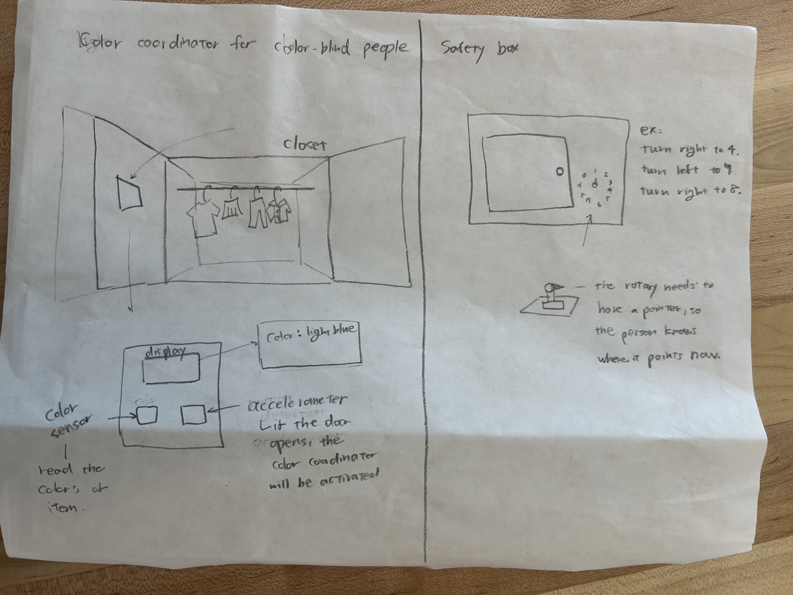

- **Idea3 (Distance Sensor)** - Curling Game 

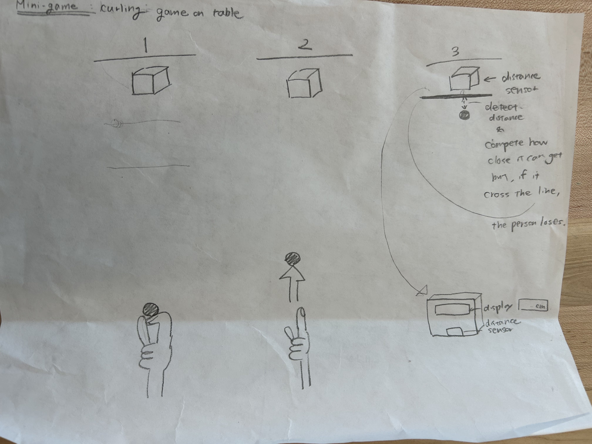

- **Idea4(Capacitive Sensor)** - Draw and play music!

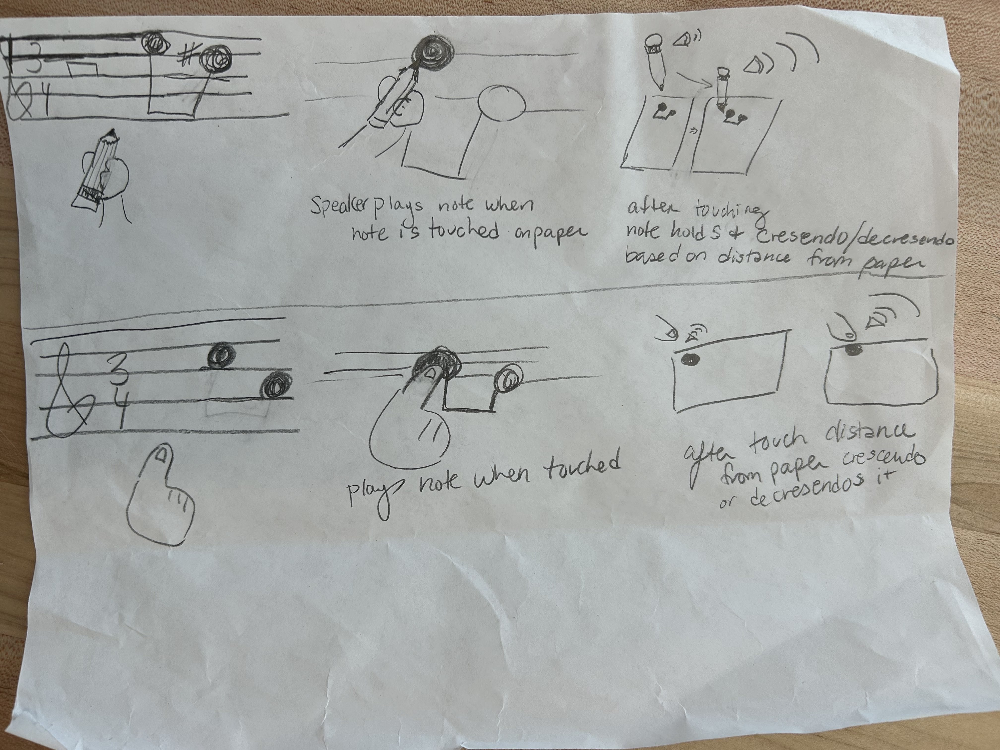

- **Idea5(Rotary Encoder, Joystick)** - Drawing board

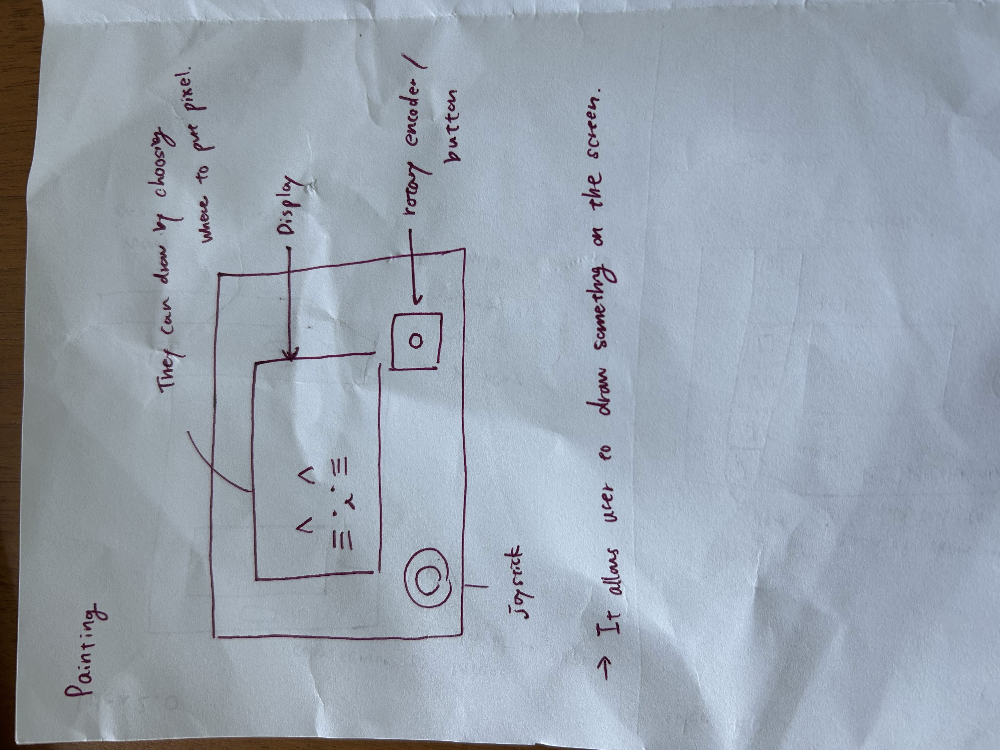

**\*\*\*What are some things these sketches raise as questions? What do you need to physically prototype to understand how to anwer those questions?\*\*\***

1. When should the sensors be activated?

While sketching the color-detection cloth, I realized that having the sensor always on might not be ideal—it could waste energy or annoy the user. This raises the question: When should the sensor be active?
Should users control activation manually (e.g., with an on/off button), or should it be triggered automatically (e.g., by motion detection when the door opens)?
To answer this, we need to build a physical prototype and test both conditions to observe user preferences and comfort levels—whether constant activation feels intrusive or if automatic triggering feels intuitive.

2. How steady should the drawing board be?

In Idea 5 (the drawing board), we imagined how the user would physically interact with the joystick and rotary encoder. These components require a certain level of resistance—too loose and they feel flimsy, too tight and they’re hard to control.
This raises questions about stability and usability: How much resistance or structural support should the board have for comfortable use?
We need to prototype the actual physical setup to test different materials, resistances, and mounting methods that balance stability with smooth movement.

3. What is the appropriate size for the device?

For both Idea 1 and Idea 5, scale is an important factor, especially for the drawing board. It needs to be large enough for expressive drawing but small enough to remain portable and easy to handle.
This raises the question: How big should the board be to fit the intended user and context of use?
To explore this, we’ll prototype boards at different scales and test them with target users, considering comfort, usability, and situational fit (e.g., classroom, home, or outdoor use).


**\*\*\*Pick one of these display designs to integrate into your prototype.\*\*\***

- We decided to proceed with the **Idea 5. drawing board**!


### D. Display & Housing - 5 sketches for display/button/knob positioning - Written reflection: questions raised, what to prototype - Pick one display design to integrate - Rationale for design - Photos/videos of your cardboard prototype

**\*\*\*Sketch 5 designs for how you would physically position your display and any buttons or knobs needed to interact with it.\*\*\***

<!--  -->

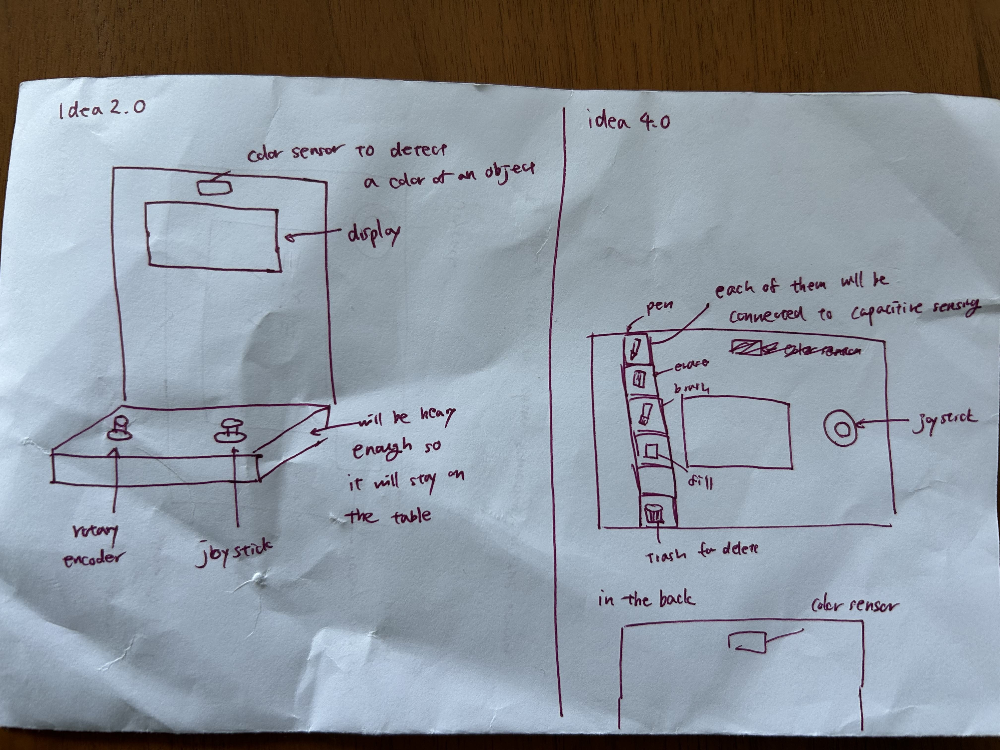
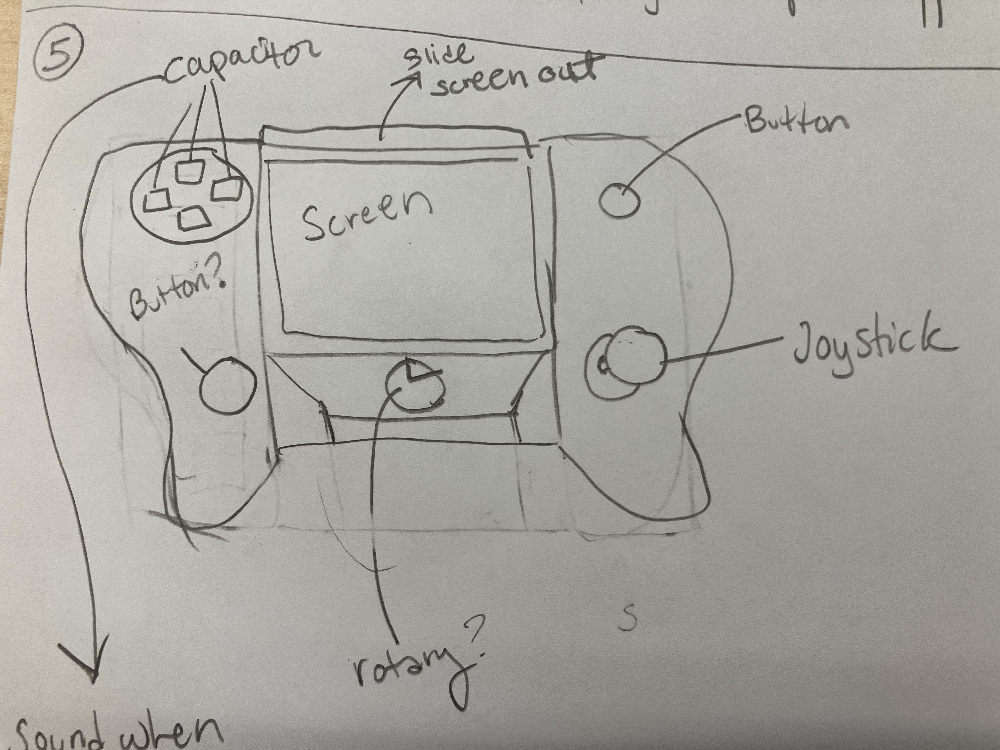
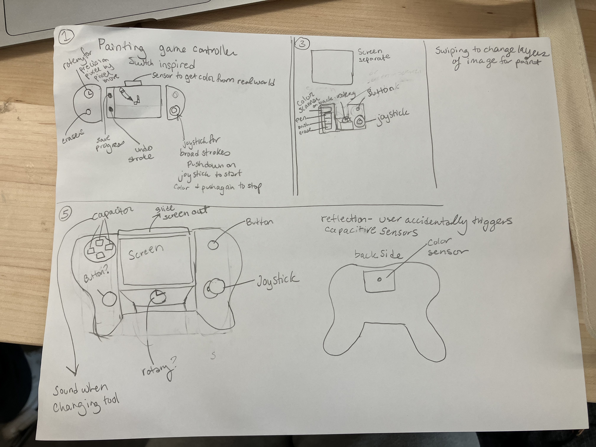


**\*\*\*What are some things these sketches raise as questions? What do you need to physically prototype to understand how to anwer those questions?\*\*\***

1. Where should the rotary encoder be placed?

The rotary encoder requires two fingers to hold and rotate, unlike the joystick (which only needs one finger) or the capacitive sensor (which just needs a tap). This raised the question of where it should be located.
We thought it might be more comfortable to have the encoder fixed on a table, so the user doesn’t have to hold it while rotating (like in Idea 2.0). However, we also wondered if integrating it into a handheld version (like in Idea 5.0) would still feel natural.
To find out, we plan to prototype both versions and observe how users interact with each design—whether holding it feels awkward or stable enough for precise control.

2. Where should the capacitive sensors be—and how many is too many?

In Idea 4.0, we explored using multiple capacitive sensors to enable many functions. But while working on Idea 5.0, we started to worry about accidental touches: What if the user unintentionally activates the wrong sensor or finds it confusing to distinguish between them?
To answer this, we need to build a physical prototype and test different numbers and placements of capacitive sensors. This will help us determine how many touch points feel intuitive and accessible without overwhelming the user.

3. Where should the color sensor be located?

We want users to be able to pick any color from their surroundings. Initially, we imagined placing the color sensor on the front of the board, but later thought it might be better positioned on the back so users can “point” the back toward the color source (like a rose or wall).
We’ll test both placements with a physical prototype to see which orientation feels more natural and precise for color picking.

4. What shape and size make the handheld version comfortable to hold?

If we create a handheld version, we need to consider what shape and size are easiest and most comfortable for users to hold. We plan to experiment through trial and error, prototyping different forms inspired by familiar objects such as game controllers or the Nintendo Switch.
By testing these variations, we can learn how grip, weight, and balance affect usability and comfort.


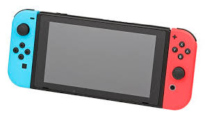


**\*\*\*Pick one of these display designs to integrate into your prototype.\*\*\***

We decided to proceed with **Idea 5.0**; however, we also modified a bit while we are building the physical prototype. 

**\*\*\*Explain the rationale for the design.\*\*\*** (e.g. Does it need to be a certain size or form or need to be able to be seen from a certain distance?)

Our product is called <span style="color: pink">**ColorCatcher**</span>, a drawing board that lets anyone paint using the colors around them.
Unlike typical drawing tools where users must mix or select colors manually, ColorCatcher allows users to “catch” real-world colors directly from their surroundings.
For example, if you want to draw a rose, you can simply capture the rose’s color and use it to paint!

Because this product is designed for spontaneous, creative drawing anywhere, we prioritized portability and ease of use without a desk.
Our design choices reflect these goals:

- Handheld design:
The board must be easily held and operated in mid-air, so we added two side handles for a stable grip.

- Integrated display and tool:
To keep the experience intuitive and compact, the display and drawing interface are combined into one device rather than separated.

- Joystick placement:
The joystick is located at the bottom-right corner, assuming right-handed use. This allows the user to draw continuously without needing to reposition their hand.

- Capacitive sensor buttons:
These are placed on the upper-left corner to reduce the chance of accidental touches during use.

- Rotary encoder:
Positioned at the upper-right corner, it can be comfortably operated by the right hand while the left hand holds the board firmly using the left handle.

- Size and form:
The overall dimensions are based on the sensor modules’ actual sizes and ergonomic testing. The screen area is roughly the size of an iPhone 14—large enough for visible drawing but small enough to remain lightweight and easy to hold.

**\*\*\*Document your rough prototype.\*\*\***

- We went through multiple iterations of cardboard prototype, starting very simple with just openings for the specific sensors we wanted. At first we mocked up the screen to be at the bottom of the controller and later incorporated it into the center for ease of use. We also started with rough cut outs before creating multiple svgs for the laser cutter to make. We asked Chatgpt to make the initial svg and then edited it as we fined tuned our design.
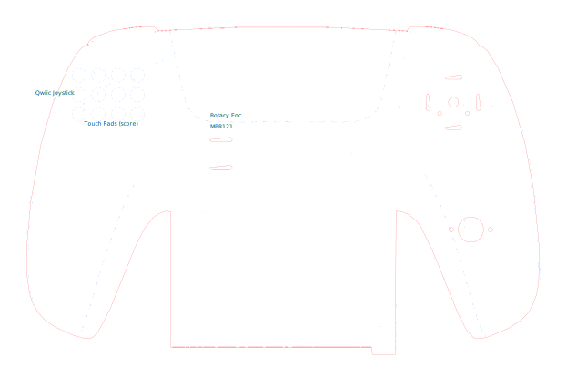


- The image below from left to right shows the general progression of our carboard protyping. Including smaller models that were made to understand how we might want to layout the sensors before cutting a larger version.

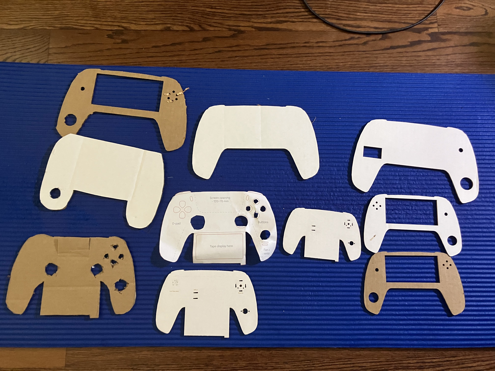

- We created an initial 3D model in TinkerCad to visualize the physical layout and dimensions.
- The model was 3D printed to check how it feels in hand — whether it’s comfortable to hold and if all sensors fit properly.
- Through multiple iterations, we refined the size and sensor placement based on user comfort and accessibility.
- Initially, the prototype included six capacitive sensor buttons, but after testing, we realized this caused frequent accidental touches. We reduced the number to improve usability and control.

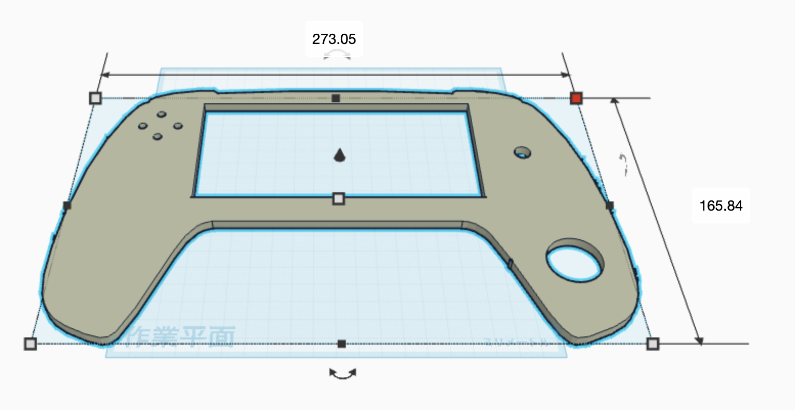

- We also chose to add a plastic acrylic cover to help protect the cardboard since constant handling would cause the cardboard to bend and lose integrity more quickly than we would have preferred. It also provided a sturdy base for the cardboad components to be adheared to.

## Part 2

<!-- *️⃣ E. Multi-Device Demo - Code and video for your multi-input multi-output demo (e.g., chaining Qwiic buttons, servo, GPIO expander, etc.) - Reflection on interaction effects and chaining

*️⃣ F. Final Documentation - Photos/videos of your final prototype - Written summary: what it looks like, works like, acts like - Reflection on what you learned and next steps -->
### E. Multi-Device Demo


#### Code for ColorCatcher: 
---
[Code_For_ColorCatcher](color_catcher/paint.py)

#### Setup
---

**Code setup**
1. **Create and activate a virtual environment in Lab 4:**
	```bash
	cd ~/Interactive-Lab-Hub/Lab\ 4
	python3 -m venv .venv
	source .venv/bin/activate
	```
2. **Install all Lab 4 requirements:**
	```bash
	pip install -r requirements2025.txt
	```

3. **Move to the color_catcher folder and install additional requirements:**
	```bash
	cd color_catcher
	pip install -r requirements.txt
	```

4. **Then run the code:**
	```bash
	python paint.py
	```

**Hardware setup**

Connect Rasberry Pi with **Capacitve Sensor, color sensor, joystick, and rotary encoder, and accelerometer**. 
For Capacitive sensor, make sure each button is associated to the right number. 

| Number | Function |
|---|---|
| 3 | Drawing (Rectangler / Ellipse shape) |
| 5 | Save the image|
| 6 | Fill in the background color |
| 8 | Erase |


**iPhone setup**

1. Download **RealVNC** Viewer
2. Login using your rasberry pi IP. User: pi, and password: your_password. 
3. Run the paint.py

#### System Sketch
---
We mapped the input sensors to intuitive actions that mirror physical drawing experiences. The joystick enables directional drawing and control, while the rotary encoder adjusts brush size. Capacitive sensors serve as mode-switch buttons for tools like rectangle, ellipse, and eraser. The accelerometer allows for quick clearing gestures, and the color sensor continuously adapts the brush color to match the user’s environment

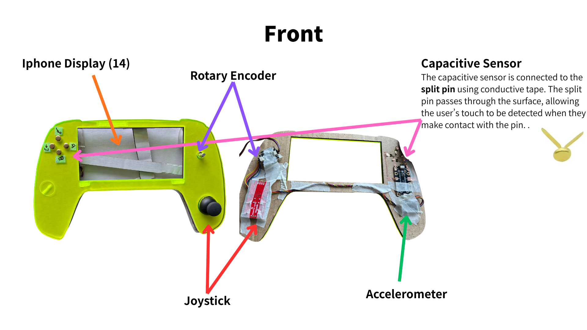
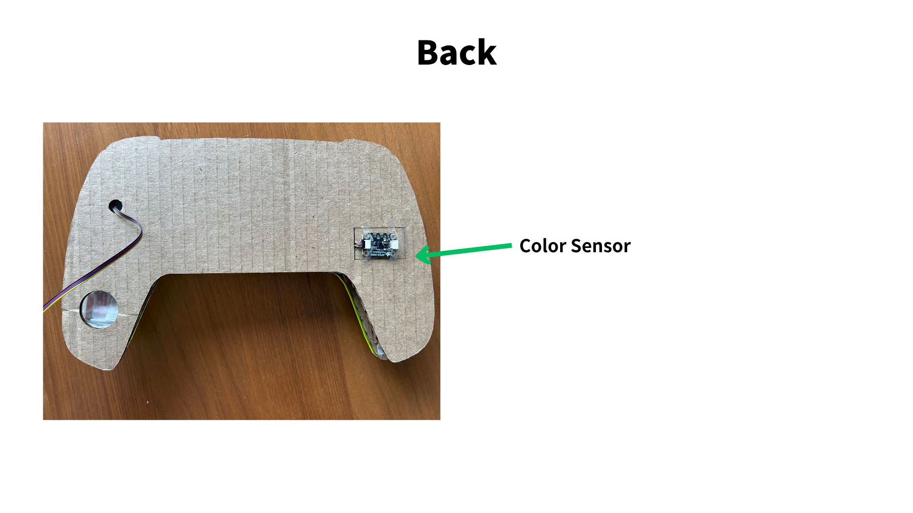


| Input Sensor | Input Action | Output On Screen | Output On Speaker|
|---|---|---|---|
| Joystick | Press Button | Start/Stop Drawing| __ |
| Joystick | Tilt | Draw in the direction of tilt| Drawing sound |
|Rotary Encoder| Rotate | Adjust brush size (increase/decrease) | __|
| Capacitive Sensor(3)| Tap |Change drawing tool (Rectangle/Ellipse) | __| 
| Capacitive Sensor(5)| Tap |Save the current image | __| 
| Capacitive Sensor(6)| Tap | Fill background with the selected color | __| 
| Capacitive Sensor(8)| Tap | Erase part of the drawing | Erasing Sound|
| Accelerometer | Tilt forward (y < 0) | Clear the canvas | __|  
|Color Sensor | *continuous* | Change brush color based on detected environmental color | __ |

#### What We Learned!
---
We learned that by combining multiple sensors and actuators in ColorCatcher, we can unlock new kinds of creative and expressive interactions that go beyond what a single sensor can do.

1. Color Sensor + Joystick → “Paint the World” Interaction
At first, we thought the color sensor would just be a fun add-on. But when we combined it with the joystick, it created a unique experience—letting users literally paint with the colors around them. Users can move their brush using the joystick while the color sensor continuously captures live colors from their environment. This makes it feel like blending the physical and digital worlds, as if they’re “painting directly with nature.”
If the color sensor were placed separately or awkwardly, this smooth, color-flow experience would be lost.

2. Accelerometer + Color Sensor → Gesture-Based Actions
By combining the accelerometer and color sensor, we created playful, embodied interactions. Tilting or shaking the board can clear or recolor the canvas, connecting physical motion with visual change. These gestures make the experience feel more natural and alive—much more intuitive than pressing a button. It is also a familiar action to any of those who had used an etch-a-sketch.

3. Effect of Physical Arrangement on User Experience
The physical layout of each component plays a major role in how natural the interaction feels:
- The color sensor on the back encourages users to point the board toward real objects, making “color catching” feel similar to taking a photo.
- The joystick at the bottom-right corner allows smooth, continuous control with the thumb while holding the board.
- The right-side controls both protrude and are dedicated to brush basic functions: joystick for brush movement, rotary for brush size adjustment. 
- The additional top left buttons provide access to a separate menu independent from the joystick and rotary controls, resembling the layout of the directional buttons on the switch controller. They house broader functions such as save, fill, erase, and rectangular brush selection. 

4. Changing Primary and Secondary Devices
When we experimented with swapping which device is “primary,” the experience changed dramatically.
For example, if the color sensor became the main input (triggering actions based on brightness or hue) and the joystick became secondary (just adjusting direction), the experience shifted from intentional drawing to responsive painting. It felt more like the environment was guiding the artwork.

5. Drawing and Erasing Sound
We added sound effects for drawing and erasing to make the experience feel more immersive. We also found that audio feedback was helpful when users moved the joystick—it let them know their actions were being registered, even if the screen lagged or their movements weren’t clearly visible. This was especially useful when using the eraser before we added a visual pointer.

#### Things We Learned from Asking others to play around. 
---
We tested with two users and they both actually really loved it, which we are super happy!
They liked the idea of they can color based on the color around you, and enjoyed interacting. 
During user testing, we received several pieces of valuable feedback that helped us refine the design of ColorCatcher:

1. **Unclear color detection**

Users found it difficult to tell which color was being detected. Even after an explanation, they struggled to capture the color they wanted. This highlighted the need for better feedback — perhaps a visible color indicator or preview on the screen.

2. **Should colors be stored?**

One user wanted the option to save favorite colors, while another enjoyed the spontaneous, constantly changing colors. This raised an interesting design question: should ColorCatcher allow users to store selected colors, or keep the experience immediate and dynamic?

3. **Tilt-to-erase confusion**

One participant accidentally deleted their drawing while tilting the board to detect colors. They felt the erase gesture was too sensitive and wanted a more intentional action — such as a confirmation step or a separate erase button.

4. **Lack of visual pointer (now fixed)**

Initially, users were confused about where the drawing or erasing was happening because there was no visible cursor. We fixed this issue by adding a pointer indicator, which greatly improved clarity.

5. **Joystick ergonomics**

Some users found the joystick slightly hard to tilt. One user with larger hands mentioned that the joystick felt too close to the handle, making it awkward to use. This feedback suggests we may need to adjust spacing or resistance for better accessibility.

### F. Final Documentation

[Video_of_demo](https://drive.google.com/file/d/1emJ2zIF4F7Sx4GhbfLyXz1QM-JCBCluI/view?usp=sharing)

<!-- 
Record
Document all the prototypes and iterations you have designed and worked on! Again, deliverables for this lab are writings, sketches, photos, and videos that show what your prototype:

"Looks like": shows how the device should look, feel, sit, weigh, etc.
"Works like": shows what the device can do
"Acts like": shows how a person would interact with the device -->


*I used the chatgpt to clean my sentences and codes. We also asked chatgpt to create an initial svg for us to work with so we could use the laser cutter*