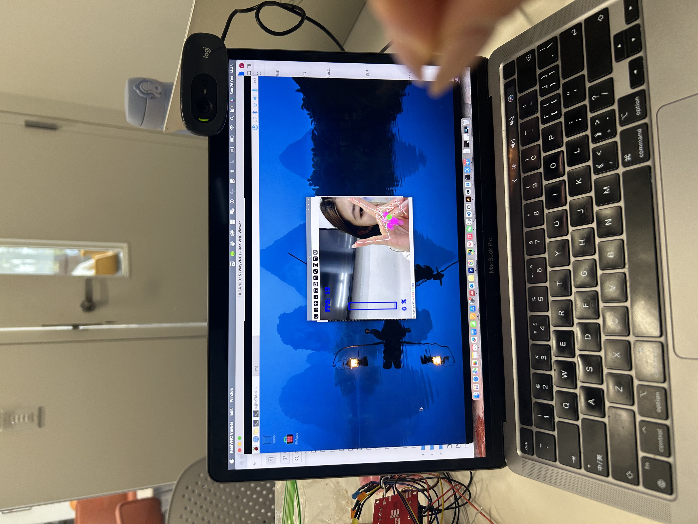

# Observant Systems

**Huiying Zhan, Jiayi Sun**


For lab this week, we focus on creating interactive systems that can detect and respond to events or stimuli in the environment of the Pi, like the Boat Detector we mentioned in lecture. 
Your **observant device** could, for example, count items, find objects, recognize an event or continuously monitor a room.

This lab will help you think through the design of observant systems, particularly corner cases that the algorithms need to be aware of.

<details>
	<summary><h2> Prep </h2></summary>

1.  Install VNC on your laptop if you have not yet done so. This lab will actually require you to run script on your Pi through VNC so that you can see the video stream. Please refer to the [prep for Lab 2](https://github.com/FAR-Lab/Interactive-Lab-Hub/blob/-/Lab%202/prep.md#using-vnc-to-see-your-pi-desktop).
2.  Install the dependencies as described in the [prep document](prep.md). 
3.  Read about [OpenCV](https://opencv.org/about/),[Pytorch](https://pytorch.org/), [MediaPipe](https://mediapipe.dev/), and [TeachableMachines](https://teachablemachine.withgoogle.com/).
4.  Read Belloti, et al.'s [Making Sense of Sensing Systems: Five Questions for Designers and Researchers](https://www.cc.gatech.edu/~keith/pubs/chi2002-sensing.pdf).

### For the lab, you will need:
1. Pull the new Github Repo
1. Raspberry Pi
1. Webcam 

### Deliverables for this lab are:
1. Show pictures, videos of the "sense-making" algorithms you tried.
1. Show a video of how you embed one of these algorithms into your observant system.
1. Test, characterize your interactive device. Show faults in the detection and how the system handled it.
</details>

## Overview
Building upon the paper-airplane metaphor (we're understanding the material of machine learning for design), here are the four sections of the lab activity:

A) [Play](#part-a)

B) [Fold](#part-b)

C) [Flight test](#part-c)

D) [Reflect](#part-d)

---
<details>
	<summary><h2>
    
### Part A
### Play with different sense-making algorithms.
<details>
	<summary><h4>Pytorch for object recognition</h4></summary>

For this first demo, you will be using PyTorch and running a MobileNet v2 classification model in real time (30 fps+) on the CPU. We will be following steps adapted from [this tutorial](https://pytorch.org/tutorials/intermediate/realtime_rpi.html).


To get started, install dependencies into a virtual environment for this exercise as described in [prep.md](prep.md).

Make sure your webcam is connected.

You can check the installation by running:

```
python -c "import torch; print(torch.__version__)"
```

If everything is ok, you should be able to start doing object recognition. For this default example, we use [MobileNet_v2](https://arxiv.org/abs/1801.04381). This model is able to perform object recognition for 1000 object classes (check [classes.json](classes.json) to see which ones.

Start detection by running  

```
python infer.py
```

The first 2 inferences will be slower. Now, you can try placing several objects in front of the camera.

Read the `infer.py` script and become familiar with the code. You can change the video resolution and frames per second (FPS). You may also use the weights of the larger pre-trained mobilenet_v3_large model, as described [here](https://pytorch.org/tutorials/intermediate/realtime_rpi.html#model-choices).
</details>

<details>
	<summary><h4> More classes </h4></summary>

[PyTorch supports transfer learning](https://pytorch.org/tutorials/beginner/transfer_learning_tutorial.html), so you can fine‑tune and transfer learn models to recognize your own objects. It requires extra steps, so we won't cover it here.

For more details on transfer learning and deployment to embedded devices, see Deep Learning on Embedded Systems: A Hands‑On Approach Using Jetson Nano and Raspberry Pi (Tariq M. Arif). [Chapter 10](https://onlinelibrary.wiley.com/doi/10.1002/9781394269297.ch10) covers transfer learning for object detection on desktop, and [Chapter 15](https://onlinelibrary.wiley.com/doi/10.1002/9781394269297.ch15) describes moving models to the Pi using ONNX.
</details>

### Machine Vision With Other Tools
The following sections describe tools ([MediaPipe](#mediapipe) and [Teachable Machines](#teachable-machines)).

<details>
	<summary><h4> MediaPipe </h4></summary>

A established open source and efficient method of extracting information from video streams comes out of Google's [MediaPipe](https://mediapipe.dev/), which offers state of the art face, face mesh, hand pose, and body pose detection.


To get started, install dependencies into a virtual environment for this exercise as described in [prep.md](prep.md):

Each of the installs will take a while, please be patient. After successfully installing mediapipe, connect your webcam to your Pi and use **VNC to access to your Pi**, open the terminal, and go to Lab 5 folder and run the hand pose detection script we provide:
(***it will not work if you use ssh from your laptop***)


```
(venv-ml) pi@ixe00:~ $ cd Interactive-Lab-Hub/Lab\ 5
(venv-ml) pi@ixe00:~ Interactive-Lab-Hub/Lab 5 $ python hand_pose.py
```

Try the two main features of this script: 1) pinching for percentage control, and 2) "[Quiet Coyote](https://www.youtube.com/watch?v=qsKlNVpY7zg)" for instant percentage setting. Notice how this example uses hardcoded positions and relates those positions with a desired set of events, in `hand_pose.py`. 

Consider how you might use this position based approach to create an interaction, and write how you might use it on either face, hand or body pose tracking.

(You might also consider how this notion of percentage control with hand tracking might be used in some of the physical UI you may have experimented with in the last lab, for instance in controlling a servo or rotary encoder.)
</details>

The image of interaction with MediaPipe Hand Pose Tracking:  


🎥 The video of the interaction demo: [Watch on YouTube](https://www.youtube.com/shorts/eNRD24geNUE)   
#### **Concept:** Gesture-based media control  
I experimented with using MediaPipe’s hand tracking to build a simple contactless media controller — something that lets users adjust playback or volume just by moving their hands in front of the camera.

For example, raising an index finger upward could increase the volume, while pointing it downward could lower it.  
Swiping the hand to the left or right would move to the previous or next track.  
A closed fist would act as a play/pause toggle.  

Each gesture is recognized by checking which fingers are extended and how the hand moves in space.  
By tracking the 21 key points that MediaPipe provides, I can detect fingertip positions, calculate the relative distance to the palm center, and interpret movement direction over time.  

This allows the system to respond naturally to gestures like pointing, swiping, or closing the hand.


#### **Advantages:**  
This approach feels natural and doesn’t require any physical buttons, which makes it especially useful in situations like cooking or exercising, when touching a screen isn’t convenient.  
It’s intuitive, hygienic, and works smoothly for basic controls like volume and playback.  


#### **Challenges:**  
However, it can sometimes misinterpret casual hand motions as gestures, and lighting conditions strongly affect recognition accuracy.  

Users also need to hold their hands at a comfortable distance — too close or too far and tracking becomes unstable.  


#### **Future ideas:**  
Adding a short delay before confirming gestures could reduce accidental triggers, and simple on-screen or audio feedback would make interactions clearer.  

It could also be extended to recognize multiple hands or combined with face detection so the system only responds when someone is actually looking at the screen.


<details>
	<summary><h4> Moondream Vision-Language Model </h4></summary>

[Moondream](https://www.ollama.com/library/moondream) is a lightweight vision-language model that can understand and answer questions about images. Unlike the classification models above, Moondream can describe images in natural language and answer specific questions about what it sees.

To use Moondream, first make sure Ollama is running and pull the model:
```bash
ollama pull moondream
```

Then run the simple demo script:
```bash
python moondream_simple.py
```

This will capture an image from your webcam and let you ask questions about it in natural language. Note that vision-language models are slower than classification models (responses may take up to minutes on a Raspberry Pi). There are newer models like [LFM2-VL](https://huggingface.co/LiquidAI/LFM2-VL-450M-GGUF), but many are very recent and not yet optimized for embedded devices.

**Design consideration**: Think about how slower response times change your interaction design. What kinds of observant systems benefit from thoughtful, delayed responses rather than real-time classification? Consider systems that monitor over longer time periods or provide periodic summaries rather than instant feedback.
</details>

<details>
	<summary><h4>Teachable Machines</h4></summary>
Google's [TeachableMachines](https://teachablemachine.withgoogle.com/train) is very useful for prototyping with the capabilities of machine learning. We are using [a python package](https://github.com/MeqdadDev/teachable-machine-lite) with tensorflow lite to simplify the deployment process.


To get started, install dependencies into a virtual environment for this exercise as described in [prep.md](prep.md):

After installation, connect your webcam to your Pi and use **VNC to access to your Pi**, open the terminal, and go to Lab 5 folder and run the example script:
(***it will not work if you use ssh from your laptop***)


```
(venv-tml) pi@ixe00:~ Interactive-Lab-Hub/Lab 5 $ python tml_example.py
```


Next train your own model. Visit [TeachableMachines](https://teachablemachine.withgoogle.com/train), select Image Project and Standard model. The raspberry pi 4 is capable to run not just the low resource models. Second, use the webcam on your computer to train a model. *Note: It might be advisable to use the pi webcam in a similar setting you want to deploy it to improve performance.*  For each class try to have over 150 samples, and consider adding a background or default class where you have nothing in view so the model is trained to know that this is the background. Then create classes based on what you want the model to classify. Lastly, preview and iterate. Finally export your model as a 'Tensorflow lite' model. You will find an '.tflite' file and a 'labels.txt' file. Upload these to your pi (through one of the many ways such as [scp](https://www.raspberrypi.com/documentation/computers/remote-access.html#using-secure-copy), sftp, [vnc](https://help.realvnc.com/hc/en-us/articles/360002249917-VNC-Connect-and-Raspberry-Pi#transferring-files-to-and-from-your-raspberry-pi-0-6), or a connected visual studio code remote explorer).


Include screenshots of your use of Teachable Machines, and write how you might use this to create your own classifier. Include what different affordances this method brings, compared to the OpenCV or MediaPipe options.
</details>

<details>
	<summary><h4> (Optional) Legacy audio and computer vision observation approaches </h4></summary>
In an earlier version of this class students experimented with observing through audio cues. Find the material here:
[Audio_optional/audio.md](Audio_optional/audio.md). 
Teachable machines provides an audio classifier too. If you want to use audio classification this is our suggested method. 

In an earlier version of this class students experimented with foundational computer vision techniques such as face and flow detection. Techniques like these can be sufficient, more performant, and allow non discrete classification. Find the material here:
[CV_optional/cv.md](CV_optional/cv.md).
</details>

### Part B
### Construct a simple interaction.

* Pick one of the models you have tried, and experiment with prototyping an interaction.
* This can be as simple as the boat detector shown in lecture.
* Try out different interaction outputs and inputs.

**\*\*\*Describe and detail the interaction, as well as your experimentation here.\*\*\***
### Gesture-Based Music Controller; Model Used: MediaPipe Hand Tracking

I experimented with MediaPipe’s hand pose detection to build a simple hands-free music controller.  
The idea was to let users control playback and volume through natural hand movements — useful in situations like cooking or working out, when touching a screen isn’t convenient.

#### Design Process

At first, I tried basic one-finger gestures like pointing up or left, but they were too sensitive and often triggered by mistake.  

After a few rounds of testing, I found that combining finger positions worked much better — for example, using both the index finger and thumb for navigation, and using open or closed hand poses for play/pause control.

Here’s the final gesture set I settled on:
- **Index finger up** → Volume up  
- **Index finger down** → Volume down  
- **Index + thumb in “7” shape pointing right** → Next track  
- **Index + thumb in “7” shape pointing left** → Previous track  
- **Open hand** → Play  
- **Closed fist** → Stop  

These gestures felt stable and distinct enough that they weren’t accidentally triggered, even when I moved naturally in front of the camera.

#### Implementation

I used a Python script called `gesture_remote.py` to handle the gesture detection and link it to simple playback functions.   

The controller cycles through a small music library (four tracks from Lab 4) that loop automatically after finishing.

#### Interaction Flow

When the camera detects a recognized gesture, it sends a corresponding command to the music player.  
The open and closed hand gestures act like a “play/stop switch,” while finger gestures provide finer control for volume and track navigation.

This setup makes the interaction feel surprisingly natural — like conducting a small orchestra with your hands.

#### Demo
🎥 [Demo Video on YouTube](https://youtu.be/XQkTvs8Damo)


### Part C
### Test the interaction prototype

Now flight test your interactive prototype and **note down your observations**:
For example:
1. When does it what it is supposed to do?
1. When does it fail?
1. When it fails, why does it fail?
1. Based on the behavior you have seen, what other scenarios could cause problems?

**\*\*\*Think about someone using the system. Describe how you think this will work.\*\*\***
1. Are they aware of the uncertainties in the system?
1. How bad would they be impacted by a miss classification?
1. How could change your interactive system to address this?
1. Are there optimizations you can try to do on your sense-making algorithm.

### Part D
### Characterize your own Observant system

Now that you have experimented with one or more of these sense-making systems **characterize their behavior**.
During the lecture, we mentioned questions to help characterize a material:
* What can you use X for?
* What is a good environment for X?
* What is a bad environment for X?
* When will X break?
* When it breaks how will X break?
* What are other properties/behaviors of X?
* How does X feel?

**\*\*\*Include a short video demonstrating the answers to these questions.\*\*\***

### Part 2.

Following exploration and reflection from Part 1, finish building your interactive system, and demonstrate it in use with a video.

**\*\*\*Include a short video demonstrating the finished result.\*\*\***
