# Observant Systems

<details><summary>Prep</summary>
  
For lab this week, we focus on creating interactive systems that can detect and respond to events or stimuli in the environment of the Pi, like the Boat Detector we mentioned in lecture. 
Your **observant device** could, for example, count items, find objects, recognize an event or continuously monitor a room.

This lab will help you think through the design of observant systems, particularly corner cases that the algorithms need to be aware of.

## Prep

1.  Install VNC on your laptop if you have not yet done so. This lab will actually require you to run script on your Pi through VNC so that you can see the video stream. Please refer to the [prep for Lab 2](https://github.com/FAR-Lab/Interactive-Lab-Hub/blob/-/Lab%202/prep.md#using-vnc-to-see-your-pi-desktop).
2.  Install the dependencies as described in the [prep document](prep.md). 
3.  Read about [OpenCV](https://opencv.org/about/),[Pytorch](https://pytorch.org/), [MediaPipe](https://mediapipe.dev/), and [TeachableMachines](https://teachablemachine.withgoogle.com/).
4.  Read Belloti, et al.'s [Making Sense of Sensing Systems: Five Questions for Designers and Researchers](https://www.cc.gatech.edu/~keith/pubs/chi2002-sensing.pdf).

### For the lab, you will need:
1. Pull the new Github Repo
1. Raspberry Pi
1. Webcam 
</details>


### Deliverables for this lab are:
1. Show pictures, videos of the "sense-making" algorithms you tried.
1. Show a video of how you embed one of these algorithms into your observant system.
1. Test, characterize your interactive device. Show faults in the detection and how the system handled it.

## Overview
Building upon the paper-airplane metaphor (we're understanding the material of machine learning for design), here are the four sections of the lab activity:

A) [Play](#part-a)

B) [Fold](#part-b)

C) [Flight test](#part-c)

D) [Reflect](#part-d)

---

## Part A

### Object Recognition
<details><summary><strong>Expand</strong></summary>
  
### Play with different sense-making algorithms.

#### Pytorch for object recognition

For this first demo, you will be using PyTorch and running a MobileNet v2 classification model in real time (30 fps+) on the CPU. We will be following steps adapted from [this tutorial](https://pytorch.org/tutorials/intermediate/realtime_rpi.html).


To get started, install dependencies into a virtual environment for this exercise as described in [prep.md](prep.md).

Make sure your webcam is connected.

You can check the installation by running:

```
python -c "import torch; print(torch.__version__)"
```

If everything is ok, you should be able to start doing object recognition. For this default example, we use [MobileNet_v2](https://arxiv.org/abs/1801.04381). This model is able to perform object recognition for 1000 object classes (check [classes.json](classes.json) to see which ones.

Start detection by running  

```
python infer.py
```

The first 2 inferences will be slower. Now, you can try placing several objects in front of the camera.

Read the `infer.py` script, and get familiar with the code. You can change the video resolution and frames per second (fps). You can also easily use the weights of other pre-trained models. You can see examples of other models [here](https://pytorch.org/tutorials/intermediate/realtime_rpi.html#model-choices). 

</details>

#### ⭐🎥 Infer.py Demo Video
*Click on the image to see the video*

<a href="https://drive.google.com/file/d/1Wc19oo6U5gZBWtoS2AaZ0H9Lis3aGAxa/view?usp=sharing">
  
</a>

### Machine Vision With Other Tools
<details><summary>Expand</summary>
  
The following sections describe tools ([MediaPipe](#mediapipe) and [Teachable Machines](#teachable-machines)).

#### MediaPipe

A recent open source and efficient method of extracting information from video streams comes out of Google's [MediaPipe](https://mediapipe.dev/), which offers state of the art face, face mesh, hand pose, and body pose detection.

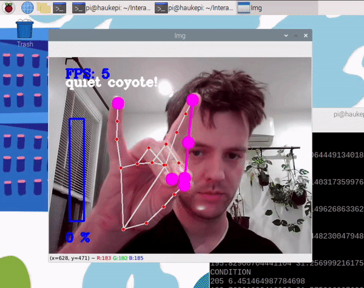

To get started, install dependencies into a virtual environment for this exercise as described in [prep.md](prep.md):

Each of the installs will take a while, please be patient. After successfully installing mediapipe, connect your webcam to your Pi and use **VNC to access to your Pi**, open the terminal, and go to Lab 5 folder and run the hand pose detection script we provide:
(***it will not work if you use ssh from your laptop***)


```
(venv-ml) pi@ixe00:~ $ cd Interactive-Lab-Hub/Lab\ 5
(venv-ml) pi@ixe00:~ Interactive-Lab-Hub/Lab 5 $ python hand_pose.py
```

Try the two main features of this script: 1) pinching for percentage control, and 2) "[Quiet Coyote](https://www.youtube.com/watch?v=qsKlNVpY7zg)" for instant percentage setting. Notice how this example uses hardcoded positions and relates those positions with a desired set of events, in `hand_pose.py`. 

Consider how you might use this position based approach to create an interaction, and write how you might use it on either face, hand or body pose tracking.

(You might also consider how this notion of percentage control with hand tracking might be used in some of the physical UI you may have experimented with in the last lab, for instance in controlling a servo or rotary encoder.)
</details>

#### ⭐🎥 Quiet Coyote Demo Video
*Click on the image to see the video*

<a href="https://drive.google.com/file/d/16SciaAVm2LMVtIh_f_4XarKLgEfQMkag/view?usp=sharing">
  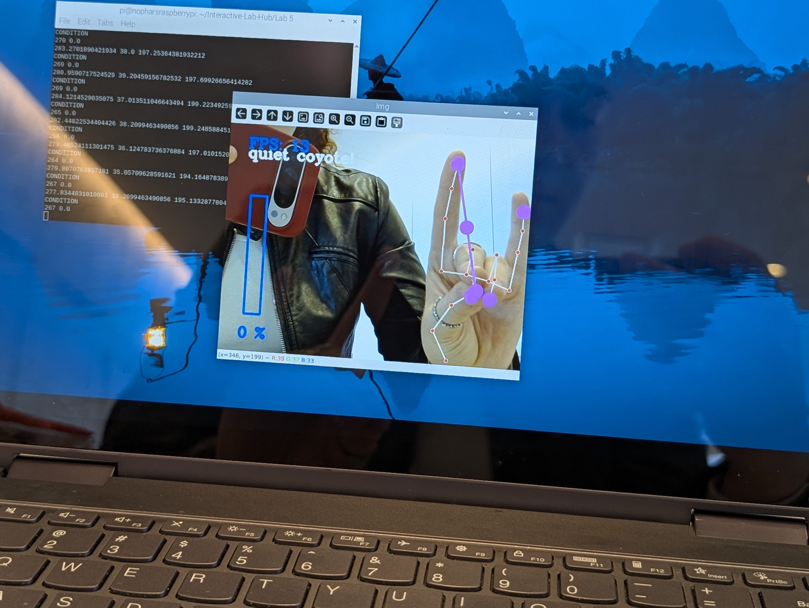
</a> 

#### ⭐🎥 Pinch Demo Video
*Click on the image to see the video*

<a href="https://drive.google.com/file/d/1Z2WOuQ-_rirG95ZQxE_GQh2GR8UqEceX/view?usp=sharing">
  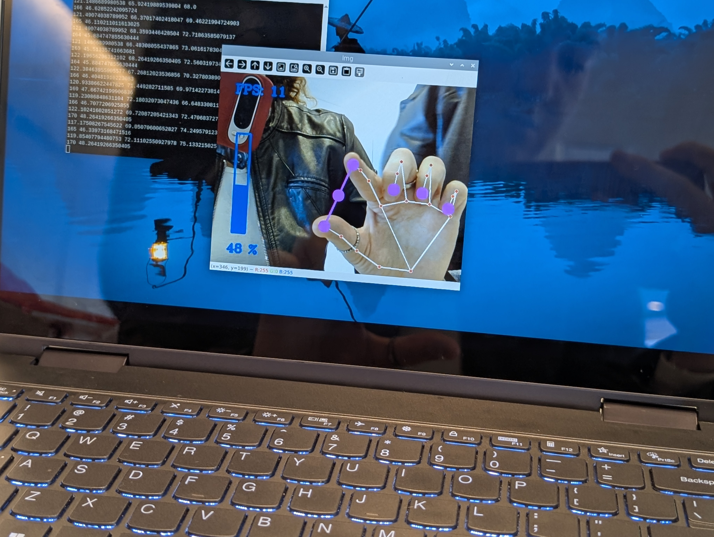
</a>


### Teachable Machines
<details><summary>Expand</summary>
  
Google's [TeachableMachines](https://teachablemachine.withgoogle.com/train) is very useful for prototyping with the capabilities of machine learning. We are using [a python package](https://github.com/MeqdadDev/teachable-machine-lite) with tensorflow lite to simplify the deployment process.

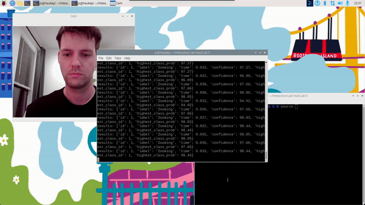

To get started, install dependencies into a virtual environment for this exercise as described in [prep.md](prep.md):

After installation, connect your webcam to your Pi and use **VNC to access to your Pi**, open the terminal, and go to Lab 5 folder and run the example script:
(***it will not work if you use ssh from your laptop***)


```
(venv-tml) pi@ixe00:~ Interactive-Lab-Hub/Lab 5 $ python tml_example.py
```


Next train your own model. Visit [TeachableMachines](https://teachablemachine.withgoogle.com/train), select Image Project and Standard model. The raspberry pi 4 is capable to run not just the low resource models. Second, use the webcam on your computer to train a model. *Note: It might be advisable to use the pi webcam in a similar setting you want to deploy it to improve performance.*  For each class try to have over 150 samples, and consider adding a background or default class where you have nothing in view so the model is trained to know that this is the background. Then create classes based on what you want the model to classify. Lastly, preview and iterate. Finally export your model as a 'Tensorflow lite' model. You will find an '.tflite' file and a 'labels.txt' file. Upload these to your pi (through one of the many ways such as [scp](https://www.raspberrypi.com/documentation/computers/remote-access.html#using-secure-copy), sftp, [vnc](https://help.realvnc.com/hc/en-us/articles/360002249917-VNC-Connect-and-Raspberry-Pi#transferring-files-to-and-from-your-raspberry-pi-0-6), or a connected visual studio code remote explorer).
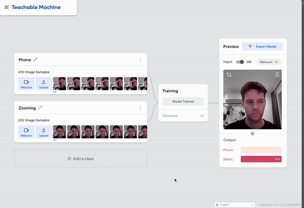
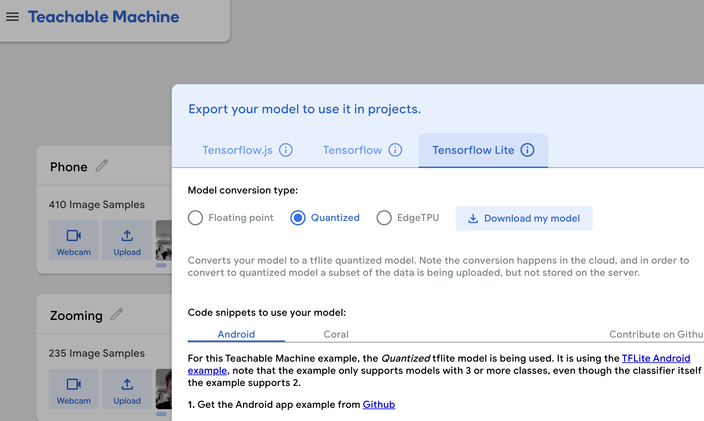

Include screenshots of your use of Teachable Machines, and write how you might use this to create your own classifier. Include what different affordances this method brings, compared to the OpenCV or MediaPipe options.

#### (Optional) Legacy audio and computer vision observation approaches
In an earlier version of this class students experimented with observing through audio cues. Find the material here:
[Audio_optional/audio.md](Audio_optional/audio.md). 
Teachable machines provides an audio classifier too. If you want to use audio classification this is our suggested method. 

In an earlier version of this class students experimented with foundational computer vision techniques such as face and flow detection. Techniques like these can be sufficient, more performant, and allow non discrete classification. Find the material here:
[CV_optional/cv.md](CV_optional/cv.md).
</details>

Teachable Machinge Files
[labels.txt file](labels.txt)
[model.tflite file](model.tflite)

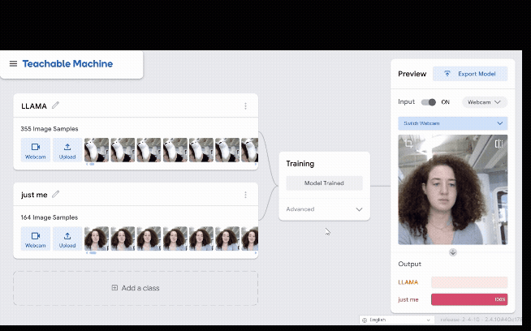

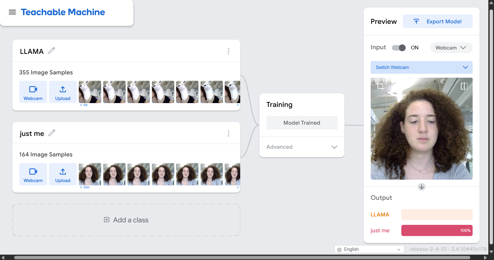

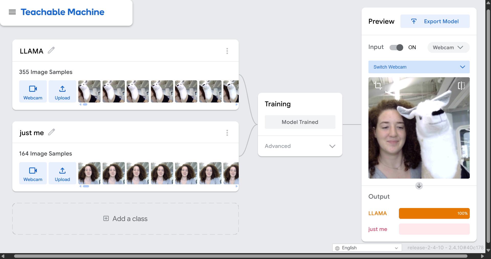

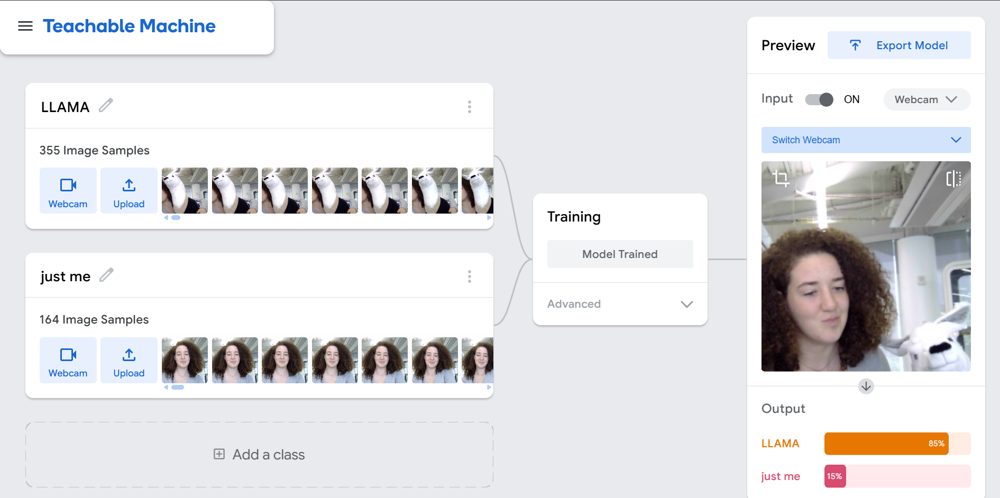

## Part B
### Construct a simple interaction.
#### ⭐☕There's a Line for Coffee!☕⭐
Using the Teachable Machine software, I am attempting to create a detector that notifies if there is a line to get coffee. Everytime there is at least one person ordering/in line, it notifies the user. The input is the camera video, spotting if there are people or not in the line area. The output is the notification that provides feedback on the situation. I am overall experimenting with the sensitivity of the machine learning, to see what threshehold it detects a line or does not. Ideally, if there is at least one person, it would.
#### Example frames
| Line for Coffee! | No Line |
|------------------|---------|
| 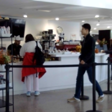 |  |

## Part C
### Testing the interaction prototype

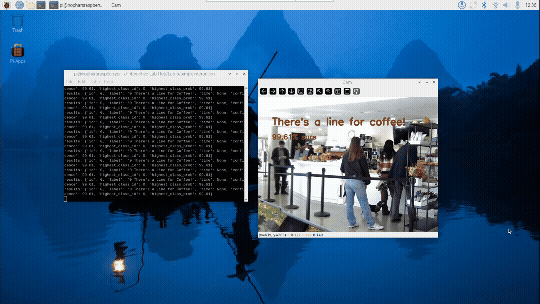

Flight test interactive prototype **observation notes**:

1. When does it do what it is supposed to do?

   The detection machine does exactly what its supposed to when there are people in the frame. When it detects even just one person in line, it flashes the confirmation message: "There's a Line for Coffee!" as well as displaying the confidence level. I coded it so that it only displays this message when the confidence is over 75% to avoid false alarms or flashing messages.
  
2. When does it fail?

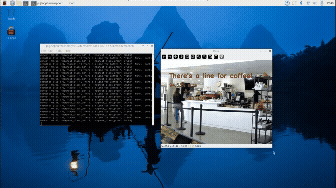

  The detection fails when the barista is visible, even if there is no one actually in line. This can be observed in the GIF above. However, when there is no one visible on screen, or the barista is moving around and not standing by the cashier, then it accurately does not notify a line.
  
3. When it fails, why does it fail?
   
  When it fails, it most likely fails because of the proximity of the cashier to where the people usually stand in line. Especially when it is only one person in line, they stand in the area covering the cashier. My guess is that the detection cannot differentiate whether the person is behind or in front of the kiosk, thus causing this issue.

4. Based on the behavior you have seen, what other scenarios could cause problems?
   
  Other possible problems could occur if the lighting in the space changes significantly (for example, sunlight streaming through the window) or if someone walks in front of the line, therefore covering the line and triggering the detection. The system might also misinterpret people chatting near the counter or waiting for their coffee to be made as being “in line,” especially if they pause in the detection zone.

1. Are they aware of the uncertainties in the system?
   
   Most users would not be aware of the system’s confidence threshold or its sensitivity to visual overlap. They would likely perceive the system as either “working” or “not working,” without realizing that the model makes probabilistic guesses based on what it sees.
   
2. How bad would they be impacted by a miss classification?
   
   In this context, the impact is low. A false positive might simply display “There’s a line for coffee!” when there isn’t one, which could be confusing but not harmful. However, in a more practical deployment (e.g., an automated notification system for staff), frequent false positives could lead to frustration or wasted effort if employees respond unnecessarily.
   
3. How could change your interactive system to address this?
   
   I could improve the system by training it with more diverse examples, especially ones that include baristas without customers, single-person lines, and different camera angles. Adding spatial awareness could also reduce confusion between the barista and customers.
   
4. Are there optimizations you can try to do on your sense-making algorithm.
   
  The algorithm could be improved by refining how it processes and interprets frames. For example, it could average predictions over several frames before deciding, to smooth out random fluctuations. I could also adjust the confidence threshold dynamically based on movement in the scene. Another optimization would be retraining or fine-tuning the model with better-balanced data to help it distinguish between similar visual patterns, like a barista and a customer. These changes would make the algorithm more stable and reliable in real-time detection.

## Part D

### GestureTrack👋🎚️🎶

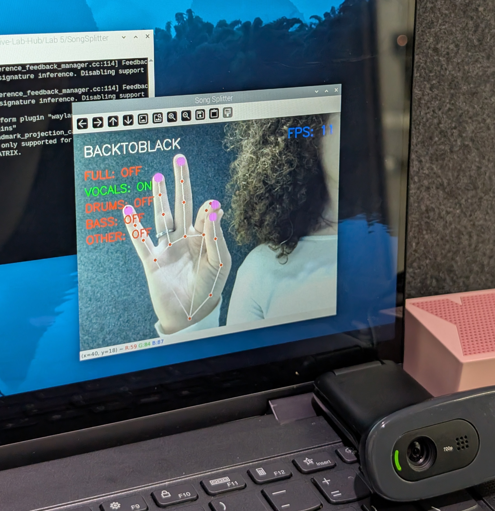

Inspired by Imogen Heap's music engineering glove [MiMU](https://www.mimugloves.com/), I decided to implement a version that relies on pre-existing songs and uses hand detection to activate one of the layered tracks of the song.

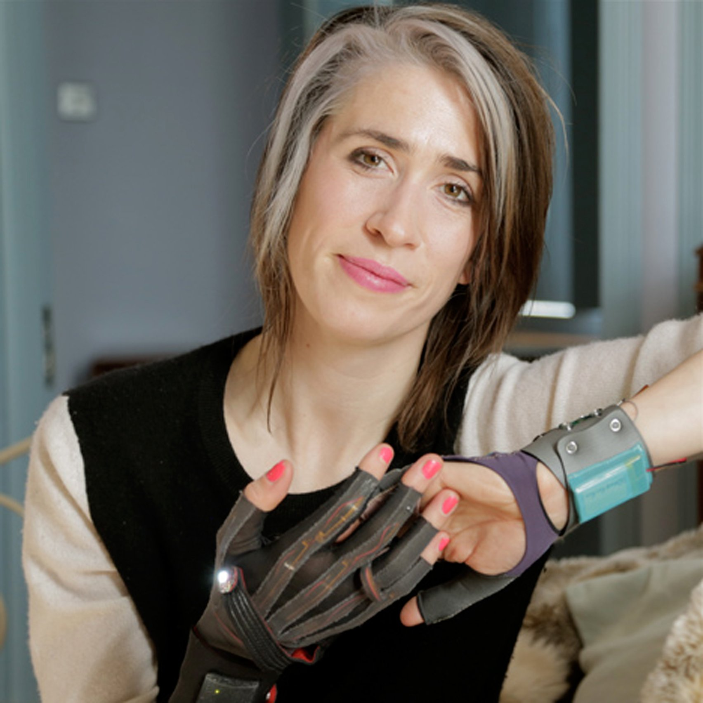

### Thought Process

For the code, I built off of the provided code for the hand gesture tracking that portrayed 'quiet coyote' and finger distance. With this I assigned each finger a specific music track and coded its activation based on when it touches the thumb. For every chosen song, purposefully hand selected layered, complex songs, I split the mp3 files into stems using Bandlab. These stems included, full, which plays the entire song track, bass, which plays the bass sounds, vocals, which plays the singing portions, drums, which plays drums, and other, which plays all other musical melodies of the song.

Here is a breakdown of the actions:
  * 🖐️🎵 Open Palm: Plays the full mix (all stems muted except “full”).
  * 🤏🎤 Thumb + Index Touch: Activates vocals stem.
  * 👌🥁 Thumb + Middle Touch: Activates drums stem.
  * 🤙🎸 Thumb + Ring Touch: Activates bass stem.
  * 🤟🎹 Thumb + Pinky Touch: Activates other/instrumental stem.
  * ✊⏭️ Fist: Skips to the next song.

<details>
  <summary><strong>GestureTrack Code</strong></summary>
  
    import cv2
    import time
    import math
    import os
    import pygame
    import HandTrackingModule as htm
    
    # ==== CONFIG ====
    SONG_FOLDERS = ["WWIMF", "AFFECTION", "BORDERLINE", "RIBS", "BACKTOBLACK"]
    STEMS = ["full", "vocals", "drums", "bass", "other"]
    
    current_index = 0
    current_song = SONG_FOLDERS[current_index]
    
    # Audio settings
    BASE_VOL = 0.5        # unmuted volume (50%)
    FIST_HOLD_TIME = 0.6  # seconds to hold fist to trigger skip
    SKIP_COOLDOWN = 1.5   # minimum seconds between skips
    
    # Initialize pygame mixer
    pygame.mixer.init()
    channels = {}
    muted_states = {stem: True for stem in STEMS}
    
    # Fist debounce state
    fist_start_time = None
    last_skip_time = 0.0
    
    # ==== HELPER FUNCTIONS ====
    def load_song(song_folder):
        """Load all stems for the given song and start them once (not looped)."""
        global channels
        stop_all()
        channels.clear()

    print(f"Loading stems for: {song_folder}")
    for i, stem in enumerate(STEMS):
        path = os.path.join(song_folder, f"{stem}.mp3")
        if os.path.exists(path):
            try:
                sound = pygame.mixer.Sound(path)
            except Exception as e:
                print(f"Error loading {path}: {e}")
                continue
            ch = pygame.mixer.Channel(i)
            ch.play(sound, loops=0)  # play once for auto-next detection
            ch.set_volume(0.0)       # start muted
            channels[stem] = ch
        else:
            print(f"Missing file: {path}")

    def set_mute_state(stem, muted):
        """Mute or unmute a specific stem."""
        if stem in channels:
            volume = 0.0 if muted else BASE_VOL
            try:
                channels[stem].set_volume(volume)
                muted_states[stem] = muted
            except Exception as e:
                print(f"Error setting volume for {stem}: {e}")
    
    def stop_all():
        """Stop all sounds."""
        for ch in list(channels.values()):
            try:
                ch.stop()
            except Exception:
                pass
    
    def next_song():
        """Advance to the next song and load it."""
        global current_index, current_song, fist_start_time, last_skip_time
        stop_all()
        current_index = (current_index + 1) % len(SONG_FOLDERS)
        current_song = SONG_FOLDERS[current_index]
        load_song(current_song)
        fist_start_time = None
        last_skip_time = time.time()
        print(f"Now playing: {current_song}")
    
    def check_auto_next():
        """Auto-skip to next song when all stems have finished."""
        if not channels:
            return
        if not any(ch.get_busy() for ch in channels.values()):
            next_song()
    
    # ==== START FIRST SONG ====
    load_song(current_song)
    
    # ==== CAMERA + HAND TRACKING ====
    cap = cv2.VideoCapture(0)
    cap.set(3, 640)
    cap.set(4, 480)
    detector = htm.handDetector(detectionCon=0.7)
    pTime = 0
    
    def distance(a, b):
        return math.hypot(a[0] - b[0], a[1] - b[1])
    
    try:
        while True:
            success, img = cap.read()
            if not success:
                time.sleep(0.01)
                continue

        img = detector.findHands(img)
        lmList = detector.findPosition(img, draw=False)

        # Show song title
        cv2.putText(img, f'{current_song}', (20, 50), cv2.FONT_HERSHEY_SIMPLEX, 1, (255, 255, 255), 2)

        if len(lmList) != 0:
            thumb = lmList[4][1:3]
            index = lmList[8][1:3]
            middle = lmList[12][1:3]
            ring = lmList[16][1:3]
            pinky = lmList[20][1:3]

            d_index = distance(thumb, index)
            d_middle = distance(thumb, middle)
            d_ring = distance(thumb, ring)
            d_pinky = distance(thumb, pinky)

            TOUCH_DIST = 40
            OPEN_DIST = 100
            FIST_DIST = 60  # more forgiving

            open_palm = all(d > OPEN_DIST for d in [d_index, d_middle, d_ring, d_pinky])

            # --- forgiving fist detection ---
            fingers_closed = sum(d < FIST_DIST for d in [d_index, d_middle, d_ring, d_pinky])
            fist = fingers_closed >= 3  # count as fist if 3+ fingers near thumb

            # --- stem muting logic ---
            if open_palm:
                for s in STEMS:
                    set_mute_state(s, True)
                set_mute_state("full", False)
            else:
                any_combo = (
                    d_index < TOUCH_DIST or
                    d_middle < TOUCH_DIST or
                    d_ring < TOUCH_DIST or
                    d_pinky < TOUCH_DIST
                )
                set_mute_state("full", any_combo)
                set_mute_state("vocals", not (d_index < TOUCH_DIST))
                set_mute_state("drums", not (d_middle < TOUCH_DIST))
                set_mute_state("bass",  not (d_ring < TOUCH_DIST))
                set_mute_state("other", not (d_pinky < TOUCH_DIST))

            # --- fist skip with hold + cooldown ---
            now = time.time()
            if fist:
                if fist_start_time is None:
                    fist_start_time = now
                else:
                    if (now - fist_start_time) >= FIST_HOLD_TIME and (now - last_skip_time) >= SKIP_COOLDOWN:
                        print("Fist held - skipping to next song.")
                        next_song()
                        fist_start_time = None
            else:
                fist_start_time = None

            # Draw finger markers
            for id in [4, 8, 12, 16, 20]:
                cv2.circle(img, (lmList[id][1], lmList[id][2]), 10, (255, 0, 255), cv2.FILLED)

            # Display stem states
            y = 100
            for stem, muted in muted_states.items():
                color = (0, 255, 0) if not muted else (0, 0, 255)
                status = "ON" if not muted else "OFF"
                cv2.putText(img, f'{stem.upper()}: {status}', (20, y), cv2.FONT_HERSHEY_SIMPLEX, 0.8, color, 2)
                y += 35

        # FPS display
        cTime = time.time()
        fps = 1 / (cTime - pTime + 0.0001)
        pTime = cTime
        cv2.putText(img, f'FPS: {int(fps)}', (500, 50), cv2.FONT_HERSHEY_SIMPLEX, 1, (255, 0, 0), 2)

        cv2.imshow("Song Splitter", img)

        # Auto-next if song finished
        check_auto_next()

        if cv2.waitKey(1) & 0xFF == ord('q'):
            stop_all()
            break

    finally:
        cap.release()
        cv2.destroyAllWindows()
        stop_all()
        pygame.mixer.quit()
</details>

**Use**

GestureTrack can be used to control and remix the aspects of each song (e.g. Bass, Voice, Melody, Drums) through hand gestures in real time. Each finger position manipulates different audio stems, while a fist gestures to skip to the next track. It allows for expressive and contactless interaction with music, while also enabling to listen to the bare bones that make up each song.

**Good Environment**

GestureTrack works best in well-lit spaces with minimal visual noise, where the camera can clearly detect hand positions. Controlled indoor environments like studios, labs, or performance spaces—help ensure consistent detection and stable performance.

**Bad Environment**

Poor lighting, cluttered backgrounds, or environments with excessive movement (like outdoors in bright sunlight or busy workspaces) interfere with hand tracking accuracy. Low-performance hardware or laggy cameras can also disrupt real-time response.

**When it may break**

It “breaks” when hand tracking fails. If the camera loses sight of the hand, lighting changes drastically, or gestures are too fast or subtle to detect is when this would happen. It may also break logically when gestures overlap or are ambiguous, leading to incorrect audio stem activation. When it breaks, It won’t crash dramatically but will likely misinterpret gestures like muting or unmuting the wrong stems, or failing to register a skip. The user might perceive a lag or loss of responsiveness. Audio may briefly cut or overlap incorrectly, breaking immersion.

**Other properties/behaviors**

  * It reacts continuously rather than in discrete steps, continuing the song seamlessly as the user plays around.
  * It encourages physical expressiveness and play; gestures become part of the musical experience.
  * It is more performative than about precision, more about exploration.

**How does it feel?**

GestureTrack should feel intuitive and freeing, almost like a peek inside into the artist's studios as they are creating the songs. Controlling the music allows for discovery of details that haven't been previously noted, or unique combinations of the stems that can play with the music's overall feel and impact.

## Final Product

#### 🩻👁️'Ribs' to 🖤🎹'Back to Black'
*Click on the image to see the video*
*This video demonstrates the use of all the gestures, including skipping to the next song on Ribs by Lorde and Back to Black by Amy Winehouse*

<a href="https://drive.google.com/file/d/1b3JwO9-rdfujm0LzS-xhmF3umqP59GZA/view?usp=sharing">
  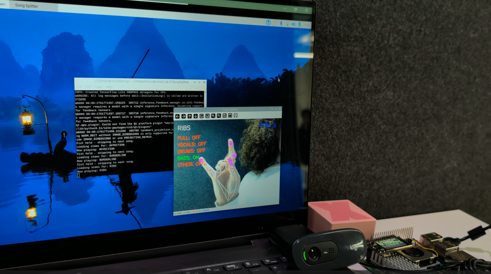
</a>

#### 🌀⭐'Borderline'
*Click on the image to see the video*
*This video demonstrates the use of all the gestures on Borderline by Tame Impala*

<a href="https://drive.google.com/file/d/1LmGm7Aev2S92YzCOlDptKKa6L_vyB_KT/view?usp=sharing">
  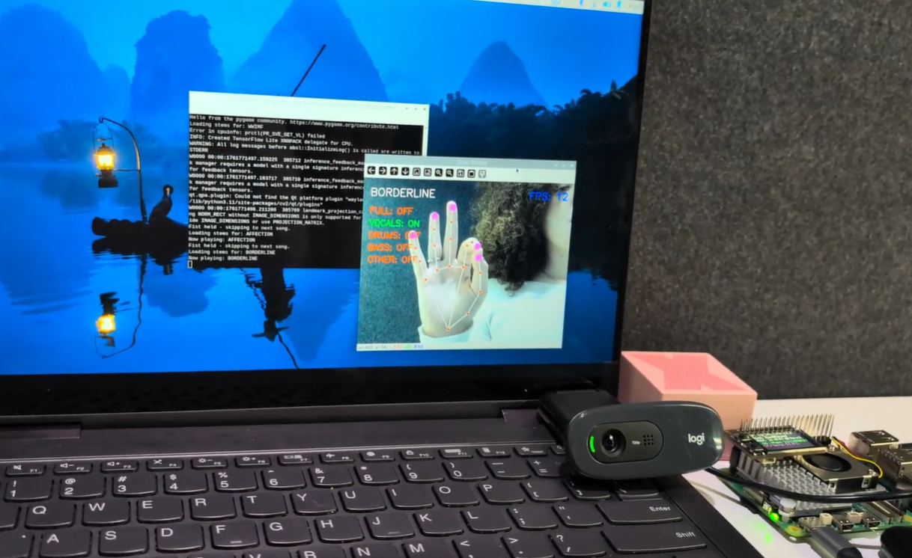
</a>

#### 💞🎧🌙'Affection'
*Click on the image to see the video*
*This video demonstrates the use of all the gestures on Affection by BETWEENFRIENDS*

<a href="https://drive.google.com/file/d/10xfE4hFErZzkN3eCKbgRXW00fvjBBd6x/view?usp=sharing">
  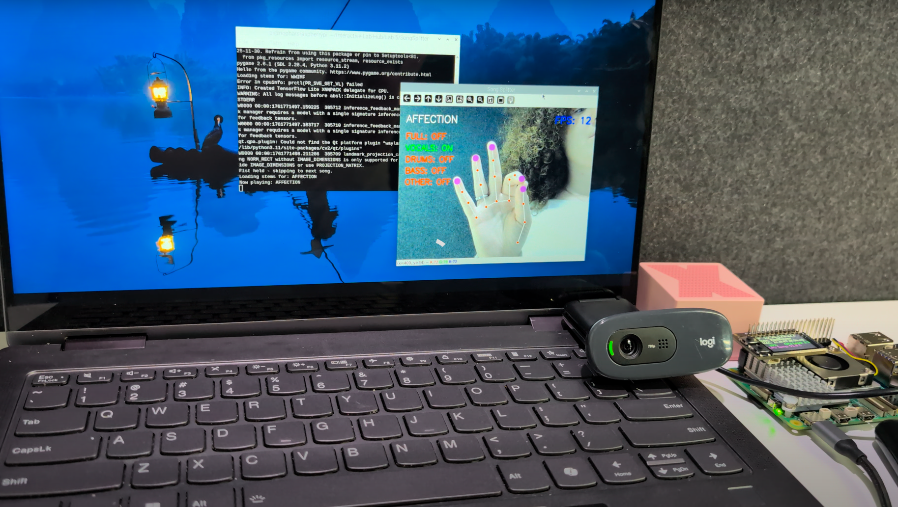
</a>

