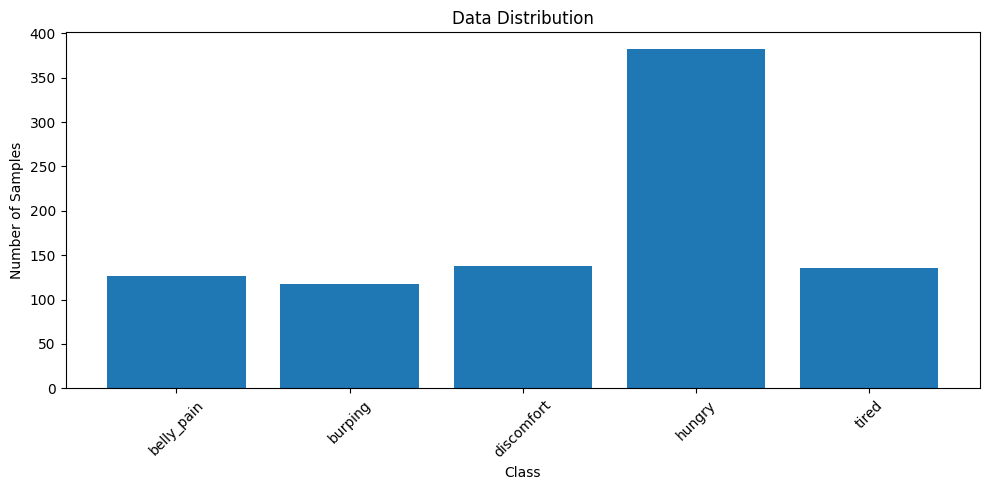
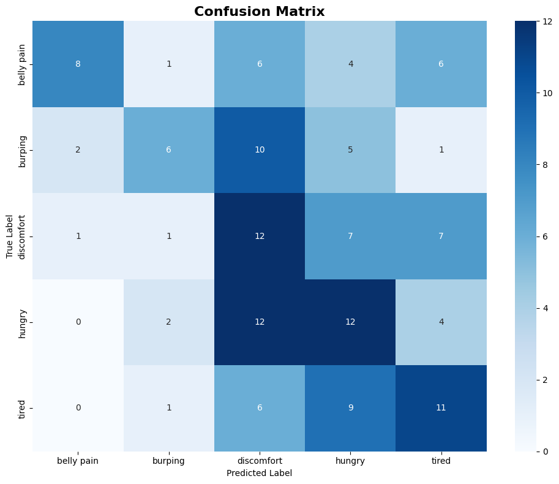
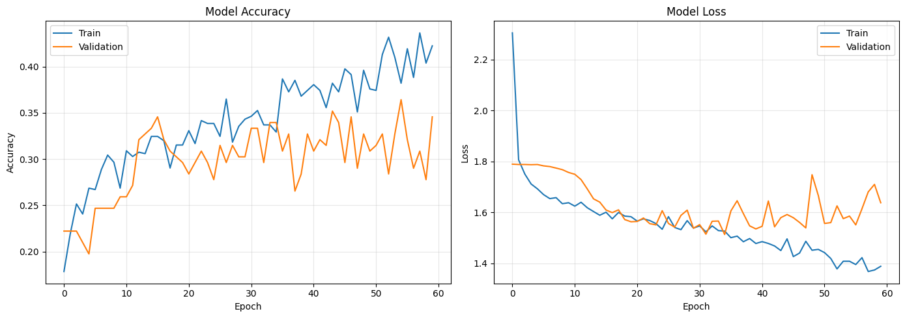
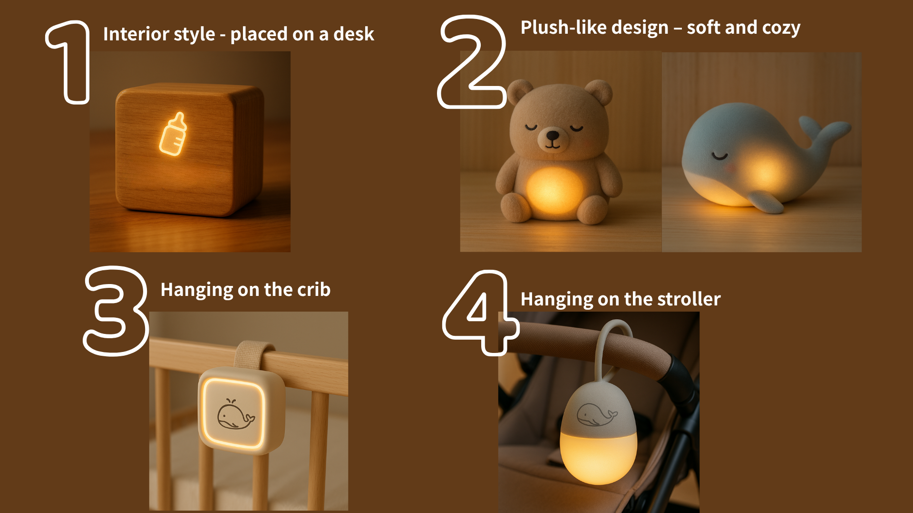
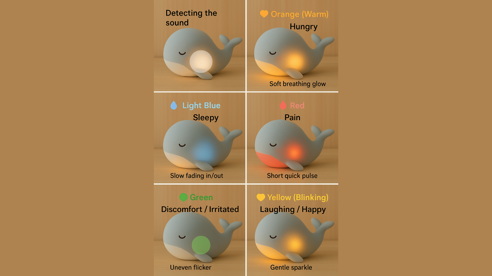
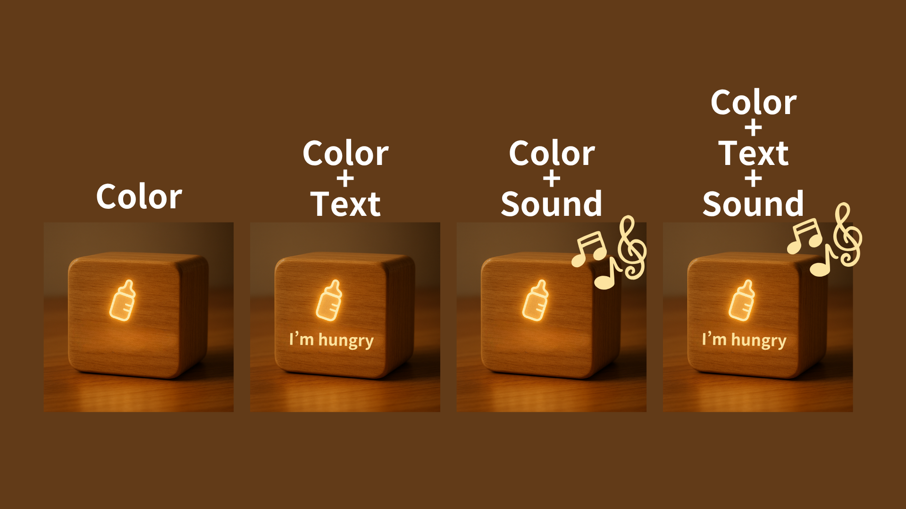
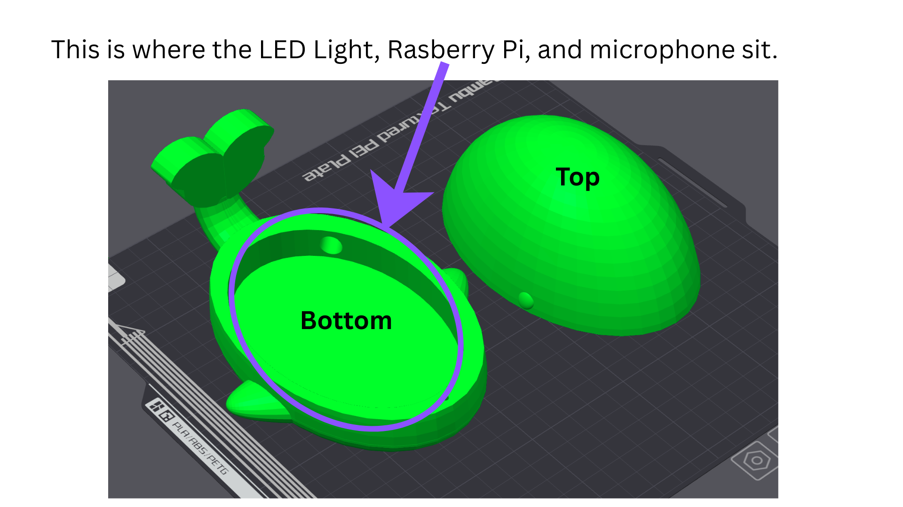

# Observant Systems

**NAMES OF COLLABORATORS HERE**
Celeste (Lianne) Bisch (lb854)

<details>
	<summary><strong> Assignment </strong></summary>
For lab this week, we focus on creating interactive systems that can detect and respond to events or stimuli in the environment of the Pi, like the Boat Detector we mentioned in lecture. 
Your **observant device** could, for example, count items, find objects, recognize an event or continuously monitor a room.

This lab will help you think through the design of observant systems, particularly corner cases that the algorithms need to be aware of.

## Prep

1.  Install VNC on your laptop if you have not yet done so. This lab will actually require you to run script on your Pi through VNC so that you can see the video stream. Please refer to the [prep for Lab 2](https://github.com/FAR-Lab/Interactive-Lab-Hub/blob/-/Lab%202/prep.md#using-vnc-to-see-your-pi-desktop).
2.  Install the dependencies as described in the [prep document](prep.md). 
3.  Read about [OpenCV](https://opencv.org/about/),[Pytorch](https://pytorch.org/), [MediaPipe](https://mediapipe.dev/), and [TeachableMachines](https://teachablemachine.withgoogle.com/).
4.  Read Belloti, et al.'s [Making Sense of Sensing Systems: Five Questions for Designers and Researchers](https://www.cc.gatech.edu/~keith/pubs/chi2002-sensing.pdf).

### For the lab, you will need:
1. Pull the new Github Repo
1. Raspberry Pi
1. Webcam 

### Deliverables for this lab are:
1. Show pictures, videos of the "sense-making" algorithms you tried.
1. Show a video of how you embed one of these algorithms into your observant system.
1. Test, characterize your interactive device. Show faults in the detection and how the system handled it.

## Overview
Building upon the paper-airplane metaphor (we're understanding the material of machine learning for design), here are the four sections of the lab activity:

A) [Play](#part-a)

B) [Fold](#part-b)

C) [Flight test](#part-c)

D) [Reflect](#part-d)

---

### Part A
### Play with different sense-making algorithms.

#### Pytorch for object recognition

For this first demo, you will be using PyTorch and running a MobileNet v2 classification model in real time (30 fps+) on the CPU. We will be following steps adapted from [this tutorial](https://pytorch.org/tutorials/intermediate/realtime_rpi.html).


To get started, install dependencies into a virtual environment for this exercise as described in [prep.md](prep.md).

Make sure your webcam is connected.

You can check the installation by running:

```
python -c "import torch; print(torch.__version__)"
```

If everything is ok, you should be able to start doing object recognition. For this default example, we use [MobileNet_v2](https://arxiv.org/abs/1801.04381). This model is able to perform object recognition for 1000 object classes (check [classes.json](classes.json) to see which ones.

Start detection by running  

```
python infer.py
```

The first 2 inferences will be slower. Now, you can try placing several objects in front of the camera.

Read the `infer.py` script and become familiar with the code. You can change the video resolution and frames per second (FPS). You may also use the weights of the larger pre-trained mobilenet_v3_large model, as described [here](https://pytorch.org/tutorials/intermediate/realtime_rpi.html#model-choices).

#### More classes

[PyTorch supports transfer learning](https://pytorch.org/tutorials/beginner/transfer_learning_tutorial.html), so you can fine‑tune and transfer learn models to recognize your own objects. It requires extra steps, so we won't cover it here.

For more details on transfer learning and deployment to embedded devices, see Deep Learning on Embedded Systems: A Hands‑On Approach Using Jetson Nano and Raspberry Pi (Tariq M. Arif). [Chapter 10](https://onlinelibrary.wiley.com/doi/10.1002/9781394269297.ch10) covers transfer learning for object detection on desktop, and [Chapter 15](https://onlinelibrary.wiley.com/doi/10.1002/9781394269297.ch15) describes moving models to the Pi using ONNX.

### Machine Vision With Other Tools
The following sections describe tools ([MediaPipe](#mediapipe) and [Teachable Machines](#teachable-machines)).

#### MediaPipe

A established open source and efficient method of extracting information from video streams comes out of Google's [MediaPipe](https://mediapipe.dev/), which offers state of the art face, face mesh, hand pose, and body pose detection.


To get started, install dependencies into a virtual environment for this exercise as described in [prep.md](prep.md):

Each of the installs will take a while, please be patient. After successfully installing mediapipe, connect your webcam to your Pi and use **VNC to access to your Pi**, open the terminal, and go to Lab 5 folder and run the hand pose detection script we provide:
(***it will not work if you use ssh from your laptop***)


```
(venv-ml) pi@ixe00:~ $ cd Interactive-Lab-Hub/Lab\ 5
(venv-ml) pi@ixe00:~ Interactive-Lab-Hub/Lab 5 $ python hand_pose.py
```

Try the two main features of this script: 1) pinching for percentage control, and 2) "[Quiet Coyote](https://www.youtube.com/watch?v=qsKlNVpY7zg)" for instant percentage setting. Notice how this example uses hardcoded positions and relates those positions with a desired set of events, in `hand_pose.py`. 

Consider how you might use this position based approach to create an interaction, and write how you might use it on either face, hand or body pose tracking.

(You might also consider how this notion of percentage control with hand tracking might be used in some of the physical UI you may have experimented with in the last lab, for instance in controlling a servo or rotary encoder.)


#### Moondream Vision-Language Model

[Moondream](https://www.ollama.com/library/moondream) is a lightweight vision-language model that can understand and answer questions about images. Unlike the classification models above, Moondream can describe images in natural language and answer specific questions about what it sees.

To use Moondream, first make sure Ollama is running and pull the model:
```bash
ollama pull moondream
```

Then run the simple demo script:
```bash
python moondream_simple.py
```

This will capture an image from your webcam and let you ask questions about it in natural language. Note that vision-language models are slower than classification models (responses may take up to minutes on a Raspberry Pi). There are newer models like [LFM2-VL](https://huggingface.co/LiquidAI/LFM2-VL-450M-GGUF), but many are very recent and not yet optimized for embedded devices.

**Design consideration**: Think about how slower response times change your interaction design. What kinds of observant systems benefit from thoughtful, delayed responses rather than real-time classification? Consider systems that monitor over longer time periods or provide periodic summaries rather than instant feedback.

#### Teachable Machines
Google's [TeachableMachines](https://teachablemachine.withgoogle.com/train) is very useful for prototyping with the capabilities of machine learning. We are using [a python package](https://github.com/MeqdadDev/teachable-machine-lite) with tensorflow lite to simplify the deployment process.


To get started, install dependencies into a virtual environment for this exercise as described in [prep.md](prep.md):

After installation, connect your webcam to your Pi and use **VNC to access to your Pi**, open the terminal, and go to Lab 5 folder and run the example script:
(***it will not work if you use ssh from your laptop***)


```
(venv-tml) pi@ixe00:~ Interactive-Lab-Hub/Lab 5 $ python tml_example.py
```


Next train your own model. Visit [TeachableMachines](https://teachablemachine.withgoogle.com/train), select Image Project and Standard model. The raspberry pi 4 is capable to run not just the low resource models. Second, use the webcam on your computer to train a model. *Note: It might be advisable to use the pi webcam in a similar setting you want to deploy it to improve performance.*  For each class try to have over 150 samples, and consider adding a background or default class where you have nothing in view so the model is trained to know that this is the background. Then create classes based on what you want the model to classify. Lastly, preview and iterate. Finally export your model as a 'Tensorflow lite' model. You will find an '.tflite' file and a 'labels.txt' file. Upload these to your pi (through one of the many ways such as [scp](https://www.raspberrypi.com/documentation/computers/remote-access.html#using-secure-copy), sftp, [vnc](https://help.realvnc.com/hc/en-us/articles/360002249917-VNC-Connect-and-Raspberry-Pi#transferring-files-to-and-from-your-raspberry-pi-0-6), or a connected visual studio code remote explorer).


Include screenshots of your use of Teachable Machines, and write how you might use this to create your own classifier. Include what different affordances this method brings, compared to the OpenCV or MediaPipe options.

#### (Optional) Legacy audio and computer vision observation approaches
In an earlier version of this class students experimented with observing through audio cues. Find the material here:
[Audio_optional/audio.md](Audio_optional/audio.md). 
Teachable machines provides an audio classifier too. If you want to use audio classification this is our suggested method. 

In an earlier version of this class students experimented with foundational computer vision techniques such as face and flow detection. Techniques like these can be sufficient, more performant, and allow non discrete classification. Find the material here:
[CV_optional/cv.md](CV_optional/cv.md).

</details>

### Part B
### Construct a simple interaction.

<!-- * Pick one of the models you have tried, and experiment with prototyping an interaction.
* This can be as simple as the boat detector shown in lecture.
* Try out different interaction outputs and inputs. -->

**\*\*\*Describe and detail the interaction, as well as your experimentation here.\*\*\***


When testing Moondream’s object recognition, we found it challenging to verify what we were actually capturing, especially since Ollama took some time to generate responses. After each capture, the feedback often revealed that our target object wasn’t clearly visible, centered, or in focus. Additionally, the model tended to describe every element in the image rather than focusing on the main subject. For example, it would mention a backpack in the background or note that our bowl of clementines was on a wooden table (when it was actually on a wooden floor). In one case, we showed it a bowl of clementine slices and asked for an estimate of how many pieces were visible, but the model returned an empty response twice.

[handposes1](https://drive.google.com/file/d/1FGjA3zXD-M4hODSVeRuCSNTlp-TrRu1F/view?usp=drive_link).
[handposes2](https://drive.google.com/file/d/1CqSVaQJKrWMCyCA4WoSZFqAnkiVy7xy-/view?usp=drive_link)
[handposes3](https://drive.google.com/file/d/1__EVslAZBcMr_7dW2-_4YkbENZJmwDfM/view?usp=drive_link)
[handposes4] (https://drive.google.com/file/d/1D2A-eIvYE4Hi-TGWy7JowXizzbcxRCTS/view?usp=drive_link)

The hand pose detection lagged noticeably and performed well only under good lighting conditions. When the hand was in shadow, tracking became unreliable. The program also crashed multiple times during attempts to capture hand poses. Even though the hand was visibly recognizable in shadow, similar to how one can still discern hand shapes in shadow puppets. It seemed like the system struggled to identify the general form, suggesting it should have been capable of detecting at least a basic hand outline.

Our final choice began with simple audio evaluation so we could build a baby cry detector that would detect baby cries and inform the user as to why the baby maybe upset.


### Part C
### Test the interaction prototype

<!-- Now flight test your interactive prototype and **note down your observations**:
For example:
1. When does it what it is supposed to do?
1. When does it fail?
1. When it fails, why does it fail?
1. Based on the behavior you have seen, what other scenarios could cause problems? -->

The model is designed to detect baby cries and identify the likely reason the baby is upset. It performs as expected when the cries are clearly audible and the surrounding environment is relatively quiet. Under these conditions, it can reliably recognize the presence of a cry and provide a reasonable classification of its cause (such as hunger, tiredness, or discomfort).

The model tends to fail when the crying is too soft or when there is significant background noise. These environmental factors interfere with audio clarity and make it harder for the algorithm to distinguish between different types of cries.
 
Some failures stem from limitations in both the dataset and the modeling platform. We initially experimented with Google’s Teachable Machine, but it did not support uploading our existing baby-cry dataset, so we transitioned to Edge Impulse Studio. During early testing, we discovered that the dataset had a disproportionate number of “hungry” samples, which caused the model to become biased toward that class. To fix this imbalance, we reduced the number of hungry-cry samples to 80, aligning it more closely with the 60–70 samples in other categories. While this adjustment improved the model’s balance, the overall validation accuracy remained relatively low at 38%, indicating that the model still struggles to generalize.

Beyond noise and volume issues, the system may encounter difficulties when cries overlap with other baby sounds, such as cooing or babbling. It could also misclassify sounds if the microphone is positioned too far from the baby or if the device used has poor audio quality. In addition, variability in background environments—like music, television, or household conversations—may lead to false detections or missed cries.

**\*\*\*Think about someone using the system. Describe how you think this will work.\*\*\***
<!-- 1. Are they aware of the uncertainties in the system?
2. How bad would they be impacted by a miss classification?
3. How could change your interactive system to address this?
4. Are there optimizations you can try to do on your sense-making algorithm. -->

Users are likely aware that some level of uncertainty is unavoidable as no system is perfect and even experienced parents sometimes struggle to identify why a baby is crying. They understand that every baby has unique behaviors and sensitivities, so occasional misclassifications are expected and not surprising. 

A misclassification would not have a major negative impact. Since every baby is unique, with their own quirks and sensitivities, occasional misclassifications are expected. If a “tired” cry were misidentified as “hungry,” the baby would still receive attention, and parents would quickly realize the suggestion was wrong through the baby’s reactions like refusing to feed or showing signs of being wet. These small errors may be mildly inconvenient but wouldn’t undermine trust in the system overall.
[detection-during-silence](https://drive.google.com/file/d/1ZNj9anCrkcoXCRk6JLdvNibIv2hcEJAq/view?usp=sharing)

To better support users, the interface could show a secondary or “next most likely” suggestion, giving parents alternative explanations when confidence is low. Adding a simple feedback option—like confirming or correcting the system’s guess—would also help users feel more in control and allow the model to adapt to each baby’s unique cry patterns over time.

The sense-making algorithm could be improved by collecting more diverse training data, enhancing noise filtering to better handle background sounds, and optimizing microphone placement for clearer input. These steps would make detection more robust, reducing false positives such as the early issue where the system sometimes detected crying during silence. Over time, these refinements would improve both accuracy and personalization.

### Part D
### Characterize your own Observant system

<!-- Now that you have experimented with one or more of these sense-making systems **characterize their behavior**.
During the lecture, we mentioned questions to help characterize a material: -->

* What can you use X for?

The Cry Analyzer helps users understand the meaning behind a baby’s cry. This function is valuable not only for parents but also for other caregivers such as grandparents, nannies, or anyone temporarily helping with childcare. These caregivers may be less familiar with the baby’s usual crying patterns, so the system provides useful interpretive support.

* What is a good environment for X?

The ideal environment is one close to the baby—such as on a desk, shelf, or hanging from the crib—where the device can clearly capture sound. The space should be stable, quiet, and free from excessive background noise. It should also maintain a safe distance from the baby to avoid accidental grabbing or mouthing.

* What is a bad environment for X?

A noisy or unstable environment is unsuitable. The current model lacks effective noise reduction, and even small disturbances can disrupt sound recognition. Environments with background music, talking, or television make it difficult for the system to isolate the baby’s cry.

* When will X break?

- When there are additional or overlapping sounds in the environment.
- When the baby’s voice is too quiet to be detected.
- When the baby’s cry characteristics differ significantly from those in the training dataset (which currently consists of American babies). This may lead to poor generalization to babies from other linguistic or cultural backgrounds.


* When it breaks how will X break?

- It may fail to detect any sound at all.
- It may misclassify non-baby sounds (e.g., adult speech or ambient noise) as baby cries.
- It may detect a cry but produce incorrect interpretations of the baby’s state (e.g., confusing hunger with pain).

* What are other properties/behaviors of X?

Beyond analysis, the Cry Analyzer can also function as a comforting presence for parents. It communicates that someone—or something—is “listening” and paying attention to the baby’s needs. This emotional affordance may help reduce parental stress and feelings of isolation.
In future iterations, we plan to integrate a gentle light that changes color based on the detected reason for the baby’s cry (e.g., hunger, pain, sleepiness), making the feedback more intuitive and ambient.

* How does X feel?

The Cry Analyzer evokes a sense of empathy and calm. Its behavior feels gentle and observant—like a sympathetic companion that listens quietly and supports both the baby and the caregiver.

<!-- **\*\*\*Include a short video demonstrating the answers to these questions.\*\*\***
[working prototype](https://drive.google.com/file/d/1Ozcg7YShvg9VVkacQZsd3CqvtyLgxMEJ/view?usp=sharing) -->

### Part 2.

Following exploration and reflection from Part 1, finish building your interactive system, and demonstrate it in use with a video.

**\*\*\*Include a short video demonstrating the finished result.\*\*\***

#### 1. Building Model 

**Code for my model**

I trained on Google colab. 

[https://drive.google.com/file/d/1szE_3IFeeR5-WK1p4GEbuyg1xlWRdH4O/view?usp=sharing](https://drive.google.com/file/d/1szE_3IFeeR5-WK1p4GEbuyg1xlWRdH4O/view?usp=sharing)

**Dataset**

I used the following dataset: 
- [Datasource1](https://github.com/gveres/donateacry-corpus)
- [Datasource2](https://www.kaggle.com/datasets/mennaahmed23/baby-cry-sense-dataset)

The original dataset: 



Since the dataset is too imbalanced, I modified the number of each data. However, if I balance, it's also will be too different from the actual data distribution, I just limit teh number of "hungry" to **150**. 

Most of them are 7s. 

**Preprocessing**

- Audio loading: librosa.load(file, sr=16000) (mono, resampled to 16 kHz).
- Feature extraction: 40 MFCCs per file via librosa.feature.mfcc(...), then mean over time → a single 40-dim vector per clip.
- Normalization: Divide all features by the global max |X| across the dataset.
- Split: 80/20 train/validation with stratification.
- Reshape for model: X → (N, 40, 1) to look like a 1D sequence of length 40 with 1 channel.

**Model**

I used TensorFlow.

- Conv1D(32, k=3, ReLU) → MaxPool1D(2) → Dropout(0.2)
- Conv1D(64, k=3, ReLU) → MaxPool1D(2) → Dropout(0.2)
- Flatten
- Dense(64, ReLU) → Dropout(0.3)
- Dense(#classes, Softmax)
- Compile: optimizer='adam', loss='sparse_categorical_crossentropy', metrics=['accuracy'].
- Training
	-	Epochs: 40
	- 	Batch size: 32
- Validation: (X_val, y_val) provided each epoch

What I tested: 
- I tried training without normalization, but found that applying normalization resulted in better accuracy. This sounds weird becasue it removes the timing of the sound. 
- I also experimented with converting the audio into 2D spectrogram (WAV) images and training a CNN on those, but this simple averaged-MFCC model still outperformed that approach.
- I reviewed several papers reporting around 80% accuracy, but many of those results appear inflated due to imbalanced datasets—for example, models that predict “hungry” for most samples can still achieve high accuracy.
- Further work is needed; however, as of now, I accepted the current model so that we can work on the outside. 

**Final Accuracy**

Validation Accuracy: 36.6%

It's not good... but better than random guessing (20.0%). 

Model predicts 5 different classes:
- belly pain     :  11 predictions (  8.2%)
- burping        :  11 predictions (  8.2%)
- discomfort     :  46 predictions ( 34.3%)
- hungry         :  37 predictions ( 27.6%)
- tired          :  29 predictions ( 21.6%)

Per-class Accuracy:
- belly pain     :  32.0% (8/25)
- burping        :  25.0% (6/24)
- discomfort     :  42.9% (12/28)
- hungry         :  40.0% (12/30)
- tired          :  40.7% (11/27)





### 2. Initial Physical Prototype

We came up with several physical prototypes for looks. 



### 3. Mid-feedback from two parents

After completing the crying detection model, I conducted brief interviews with my sister (who has a 6-month-old baby) and my friend (who has a 1-year-old baby). Their feedback highlighted several important insights:
- Desire for positive feedback: They found that a device focused solely on crying detection could feel depressing. They suggested including pleasant feedback such as detecting laughing or babbling sounds, which would make the product more enjoyable and emotionally balanced.
- Concerns about brightness: They liked the idea of a lamp that can hang on the crib, but were concerned that if the light is too bright, it might keep the baby awake—especially when the baby cries due to sleepiness.
- Aesthetic appeal: They appreciated the cute design, especially shapes like bears or whales, simply because they are visually comforting and baby-friendly.



- Alerts and notifications: Both felt that urgent notifications (e.g., for hunger or diaper changes) were not essential. My sister mentioned that overly strong alerts could create stress or pressure, and she would prefer a bright or urgent signal only when the baby is in pain.



- Information display: They noted that five distinct colors are easy to remember, especially if paired with clear instructions and optional phone notifications for confirmation.


### 4. Physical Prototype

We decided to prototype the whale one.



Final look: 


### 5. Code on Rasberry Pi

We initially asked the user to press the button when they want to analyze; however, I got feedback that when the baby is crying, they don't have calm to press the button, so I modified to check continuously. 

[Initial](https://drive.google.com/file/d/1ZNj9anCrkcoXCRk6JLdvNibIv2hcEJAq/view?usp=drive_link)

We also added cry/laugh detection using **Google YAMNet**. It has classes for Babbling, Baby laughter, and Baby cry, infant cry. 

Ref: [https://github.com/tensorflow/models/blob/master/research/audioset/yamnet/yamnet_class_map.csv](https://github.com/tensorflow/models/blob/master/research/audioset/yamnet/yamnet_class_map.csv)

Final System: 

- Continuously listens and saves 4 seconds of audio.
- Checks whether the sound is laughing, crying, babbling, or other.
- If it detects crying, it then determines the reason for the crying.
	- belly pain   
	- burping       
	- discomfort    
	- hungry        
	- tired  
- Displays whether the detected sound is laughing, burping, or a specific reason for crying.

**Code**

[Folder](https://github.com/eigenValue7/Interactive-Lab-Hub/tree/Fall2025/Lab%205/cry_analyzer)

**How to run this code**
```bash 
python3 -m venv .venv
source .venv/bin/activate
pip install -r requirements.txt

#make sure to turnoff the display
sudo systemctl stop piscreen.service --now

#check if the microphone is running 
arecord -l

python baby_monitor.py

# to test if the cry analyzer is working or not using the crying audio file
python test/cry_analyzer_model_only.py *"test.wav"*
```

### 6. Video

[video](https://drive.google.com/file/d/1Ozcg7YShvg9VVkacQZsd3CqvtyLgxMEJ/view?usp=drive_link)

### 7. End Note

We planned to test the system with the LED light, but it didn’t arrive in time.
Once it arrives, we’ll upload a new video!

### How we divided our work. 

Nana Takada mainly worked on coding part, and Celeste worked on phtsical prototype part and documentation!
We think we equally contributed to this project!
