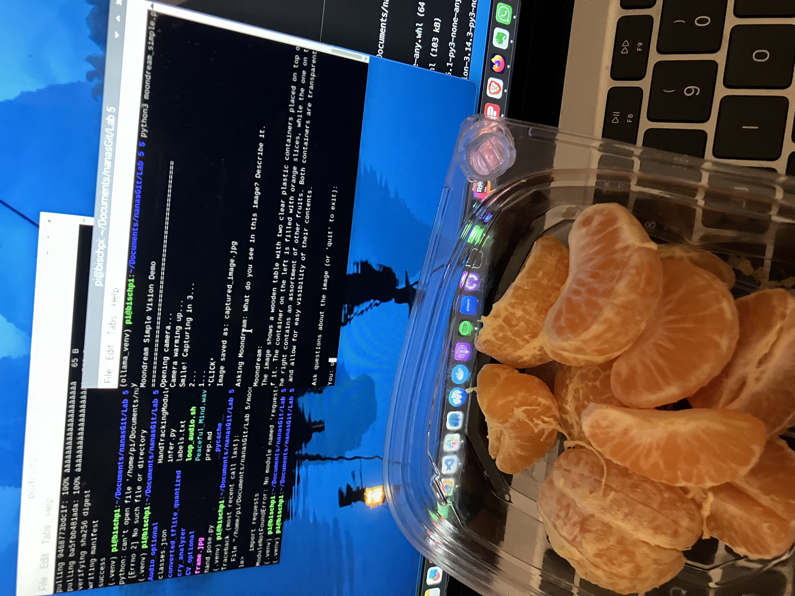
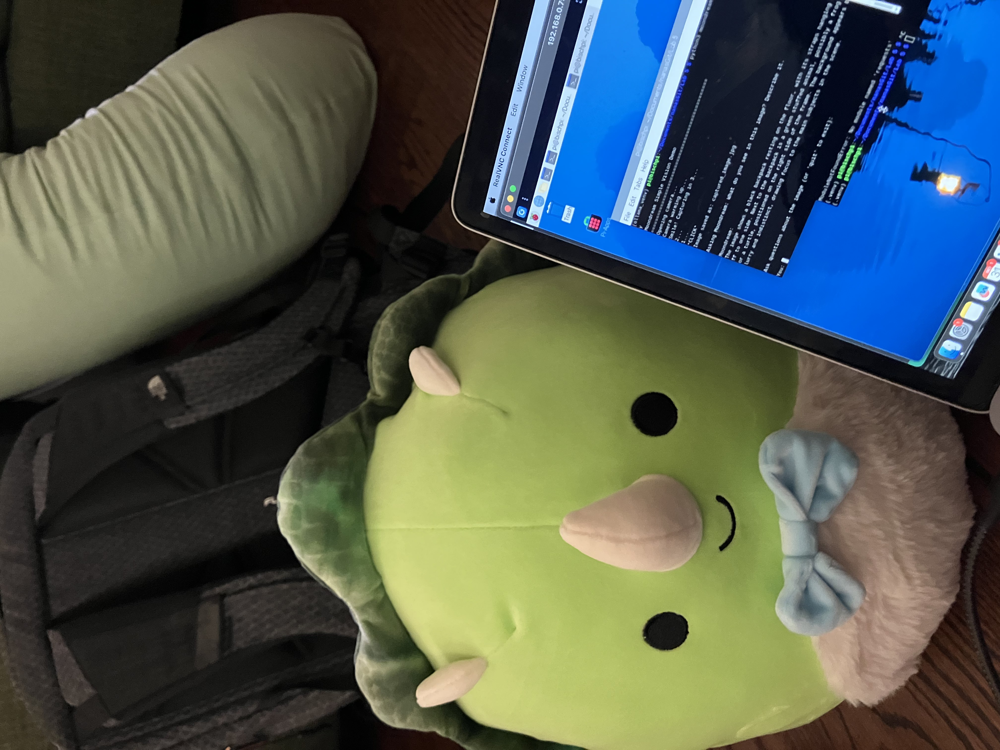
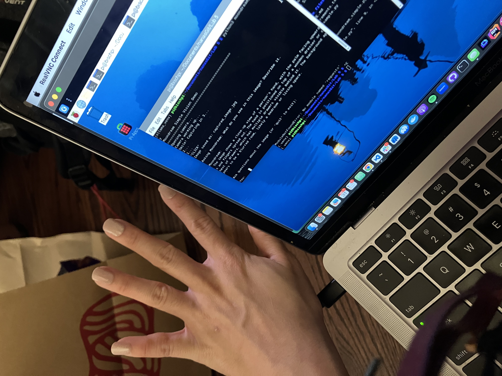

# Observant Systems

**NAMES OF COLLABORATORS HERE**


For lab this week, we focus on creating interactive systems that can detect and respond to events or stimuli in the environment of the Pi, like the Boat Detector we mentioned in lecture. 
Your **observant device** could, for example, count items, find objects, recognize an event or continuously monitor a room.

This lab will help you think through the design of observant systems, particularly corner cases that the algorithms need to be aware of.

## Prep

1.  Install VNC on your laptop if you have not yet done so. This lab will actually require you to run script on your Pi through VNC so that you can see the video stream. Please refer to the [prep for Lab 2](https://github.com/FAR-Lab/Interactive-Lab-Hub/blob/-/Lab%202/prep.md#using-vnc-to-see-your-pi-desktop).
2.  Install the dependencies as described in the [prep document](prep.md). 
3.  Read about [OpenCV](https://opencv.org/about/),[Pytorch](https://pytorch.org/), [MediaPipe](https://mediapipe.dev/), and [TeachableMachines](https://teachablemachine.withgoogle.com/).
4.  Read Belloti, et al.'s [Making Sense of Sensing Systems: Five Questions for Designers and Researchers](https://www.cc.gatech.edu/~keith/pubs/chi2002-sensing.pdf).

### For the lab, you will need:
1. Pull the new Github Repo
1. Raspberry Pi
1. Webcam 

### Deliverables for this lab are:
1. Show pictures, videos of the "sense-making" algorithms you tried.
1. Show a video of how you embed one of these algorithms into your observant system.
1. Test, characterize your interactive device. Show faults in the detection and how the system handled it.

## Overview
Building upon the paper-airplane metaphor (we're understanding the material of machine learning for design), here are the four sections of the lab activity:

A) [Play](#part-a)

B) [Fold](#part-b)

C) [Flight test](#part-c)

D) [Reflect](#part-d)

---

### Part A
<details>
	<summary><strong> Part A Examples & Instructions </strong></summary>
### Play with different sense-making algorithms.

#### Pytorch for object recognition

For this first demo, you will be using PyTorch and running a MobileNet v2 classification model in real time (30 fps+) on the CPU. We will be following steps adapted from [this tutorial](https://pytorch.org/tutorials/intermediate/realtime_rpi.html).


To get started, install dependencies into a virtual environment for this exercise as described in [prep.md](prep.md).

Make sure your webcam is connected.

You can check the installation by running:

```
python -c "import torch; print(torch.__version__)"
```

If everything is ok, you should be able to start doing object recognition. For this default example, we use [MobileNet_v2](https://arxiv.org/abs/1801.04381). This model is able to perform object recognition for 1000 object classes (check [classes.json](classes.json) to see which ones.

Start detection by running  

```
python infer.py
```

The first 2 inferences will be slower. Now, you can try placing several objects in front of the camera.

Read the `infer.py` script, and get familiar with the code. You can change the video resolution and frames per second (fps). You can also easily use the weights of other pre-trained models. You can see examples of other models [here](https://pytorch.org/tutorials/intermediate/realtime_rpi.html#model-choices). 


### Machine Vision With Other Tools
The following sections describe tools ([MediaPipe](#mediapipe) and [Teachable Machines](#teachable-machines)).

#### MediaPipe

A recent open source and efficient method of extracting information from video streams comes out of Google's [MediaPipe](https://mediapipe.dev/), which offers state of the art face, face mesh, hand pose, and body pose detection.


To get started, install dependencies into a virtual environment for this exercise as described in [prep.md](prep.md):

Each of the installs will take a while, please be patient. After successfully installing mediapipe, connect your webcam to your Pi and use **VNC to access to your Pi**, open the terminal, and go to Lab 5 folder and run the hand pose detection script we provide:
(***it will not work if you use ssh from your laptop***)


```
(venv-ml) pi@ixe00:~ $ cd Interactive-Lab-Hub/Lab\ 5
(venv-ml) pi@ixe00:~ Interactive-Lab-Hub/Lab 5 $ python hand_pose.py
```

Try the two main features of this script: 1) pinching for percentage control, and 2) "[Quiet Coyote](https://www.youtube.com/watch?v=qsKlNVpY7zg)" for instant percentage setting. Notice how this example uses hardcoded positions and relates those positions with a desired set of events, in `hand_pose.py`. 

Consider how you might use this position based approach to create an interaction, and write how you might use it on either face, hand or body pose tracking.

(You might also consider how this notion of percentage control with hand tracking might be used in some of the physical UI you may have experimented with in the last lab, for instance in controlling a servo or rotary encoder.)


#### Teachable Machines
Google's [TeachableMachines](https://teachablemachine.withgoogle.com/train) is very useful for prototyping with the capabilities of machine learning. We are using [a python package](https://github.com/MeqdadDev/teachable-machine-lite) with tensorflow lite to simplify the deployment process.


To get started, install dependencies into a virtual environment for this exercise as described in [prep.md](prep.md):

After installation, connect your webcam to your Pi and use **VNC to access to your Pi**, open the terminal, and go to Lab 5 folder and run the example script:
(***it will not work if you use ssh from your laptop***)


```
(venv-tml) pi@ixe00:~ Interactive-Lab-Hub/Lab 5 $ python tml_example.py
```


Next train your own model. Visit [TeachableMachines](https://teachablemachine.withgoogle.com/train), select Image Project and Standard model. The raspberry pi 4 is capable to run not just the low resource models. Second, use the webcam on your computer to train a model. *Note: It might be advisable to use the pi webcam in a similar setting you want to deploy it to improve performance.*  For each class try to have over 150 samples, and consider adding a background or default class where you have nothing in view so the model is trained to know that this is the background. Then create classes based on what you want the model to classify. Lastly, preview and iterate. Finally export your model as a 'Tensorflow lite' model. You will find an '.tflite' file and a 'labels.txt' file. Upload these to your pi (through one of the many ways such as [scp](https://www.raspberrypi.com/documentation/computers/remote-access.html#using-secure-copy), sftp, [vnc](https://help.realvnc.com/hc/en-us/articles/360002249917-VNC-Connect-and-Raspberry-Pi#transferring-files-to-and-from-your-raspberry-pi-0-6), or a connected visual studio code remote explorer).


Include screenshots of your use of Teachable Machines, and write how you might use this to create your own classifier. Include what different affordances this method brings, compared to the OpenCV or MediaPipe options.

#### (Optional) Legacy audio and computer vision observation approaches
In an earlier version of this class students experimented with observing through audio cues. Find the material here:
[Audio_optional/audio.md](Audio_optional/audio.md). 
Teachable machines provides an audio classifier too. If you want to use audio classification this is our suggested method. 

In an earlier version of this class students experimented with foundational computer vision techniques such as face and flow detection. Techniques like these can be sufficient, more performant, and allow non discrete classification. Find the material here:
[CV_optional/cv.md](CV_optional/cv.md).
</details>

### Part B
### Construct a simple interaction.

* Pick one of the models you have tried, and experiment with prototyping an interaction.
* This can be as simple as the boat detector shown in lecture.
* Try out different interaction outputs and inputs.




When testing Moondream’s object recognition, we found it challenging to verify what we were actually capturing, especially since Ollama took some time to generate responses. After each capture, the feedback often revealed that our target object wasn’t clearly visible, centered, or in focus. Additionally, the model tended to describe every element in the image rather than focusing on the main subject. For example, it would mention a backpack in the background or note that our bowl of clementines was on a wooden table (when it was actually on a wooden floor). In one case, we showed it a bowl of clementine slices and asked for an estimate of how many pieces were visible, but the model returned an empty response twice.

[handposes1](https://drive.google.com/file/d/1FGjA3zXD-M4hODSVeRuCSNTlp-TrRu1F/view?usp=drive_link).
[handposes2](https://drive.google.com/file/d/1CqSVaQJKrWMCyCA4WoSZFqAnkiVy7xy-/view?usp=drive_link)
[handposes3](https://drive.google.com/file/d/1__EVslAZBcMr_7dW2-_4YkbENZJmwDfM/view?usp=drive_link)
[handposes4] (https://drive.google.com/file/d/1D2A-eIvYE4Hi-TGWy7JowXizzbcxRCTS/view?usp=drive_link)

The hand pose detection lagged noticeably and performed well only under good lighting conditions. When the hand was in shadow, tracking became unreliable. The program also crashed multiple times during attempts to capture hand poses. Even though the hand was visibly recognizable in shadow, similar to how one can still discern hand shapes in shadow puppets. It seemed like the system struggled to identify the general form, suggesting it should have been capable of detecting at least a basic hand outline.

Our final choice began with simple audio evaluation so we could build a baby cry detector that would detect baby cries and inform the user as to why the baby maybe upset.

**\*\*\*Describe and detail the interaction, as well as your experimentation here.\*\*\***

### Part C
### Test the interaction prototype

Now flight test your interactive prototype and **note down your observations**:
For example:
1. When does it what it is supposed to do?
1. When does it fail?
1. When it fails, why does it fail?
1. Based on the behavior you have seen, what other scenarios could cause problems?

The model is designed to detect baby cries and identify the likely reason the baby is upset. It performs as expected when the cries are clearly audible and the surrounding environment is relatively quiet. Under these conditions, it can reliably recognize the presence of a cry and provide a reasonable classification of its cause (such as hunger, tiredness, or discomfort).

The model tends to fail when the crying is too soft or when there is significant background noise. These environmental factors interfere with audio clarity and make it harder for the algorithm to distinguish between different types of cries.
 
Some failures stem from limitations in both the dataset and the modeling platform. We initially experimented with Google’s Teachable Machine, but it did not support uploading our existing baby-cry dataset, so we transitioned to Edge Impulse Studio. During early testing, we discovered that the dataset had a disproportionate number of “hungry” samples, which caused the model to become biased toward that class. To fix this imbalance, we reduced the number of hungry-cry samples to 80, aligning it more closely with the 60–70 samples in other categories. While this adjustment improved the model’s balance, the overall validation accuracy remained relatively low at 38%, indicating that the model still struggles to generalize.

Beyond noise and volume issues, the system may encounter difficulties when cries overlap with other baby sounds, such as cooing or babbling. It could also misclassify sounds if the microphone is positioned too far from the baby or if the device used has poor audio quality. In addition, variability in background environments—like music, television, or household conversations—may lead to false detections or missed cries.

**\*\*\*Think about someone using the system. Describe how you think this will work.\*\*\***
1. Are they aware of the uncertainties in the system?
2. How bad would they be impacted by a miss classification?
3. How could change your interactive system to address this?
4. Are there optimizations you can try to do on your sense-making algorithm.

Users are likely aware that some level of uncertainty is unavoidable as no system is perfect and even experienced parents sometimes struggle to identify why a baby is crying. They understand that every baby has unique behaviors and sensitivities, so occasional misclassifications are expected and not surprising. 

A misclassification would not have a major negative impact. Since every baby is unique, with their own quirks and sensitivities, occasional misclassifications are expected. If a “tired” cry were misidentified as “hungry,” the baby would still receive attention, and parents would quickly realize the suggestion was wrong through the baby’s reactions like refusing to feed or showing signs of being wet. These small errors may be mildly inconvenient but wouldn’t undermine trust in the system overall.
[detection-during-silence](https://drive.google.com/file/d/1ZNj9anCrkcoXCRk6JLdvNibIv2hcEJAq/view?usp=sharing)

To better support users, the interface could show a secondary or “next most likely” suggestion, giving parents alternative explanations when confidence is low. Adding a simple feedback option—like confirming or correcting the system’s guess—would also help users feel more in control and allow the model to adapt to each baby’s unique cry patterns over time.

The sense-making algorithm could be improved by collecting more diverse training data, enhancing noise filtering to better handle background sounds, and optimizing microphone placement for clearer input. These steps would make detection more robust, reducing false positives such as the early issue where the system sometimes detected crying during silence. Over time, these refinements would improve both accuracy and personalization.

### Part D
### Characterize your own Observant system

Now that you have experimented with one or more of these sense-making systems **characterize their behavior**.
During the lecture, we mentioned questions to help characterize a material:
* What can you use X for?
* What is a good environment for X?
* What is a bad environment for X?
* When will X break?
* When it breaks how will X break?
* What are other properties/behaviors of X?
* How does X feel?

**\*\*\*Include a short video demonstrating the answers to these questions.\*\*\***
[working prototype](https://drive.google.com/file/d/1Ozcg7YShvg9VVkacQZsd3CqvtyLgxMEJ/view?usp=sharing)

### Part 2.

Following exploration and reflection from Part 1, finish building your interactive system, and demonstrate it in use with a video.

**\*\*\*Include a short video demonstrating the finished result.\*\*\***
