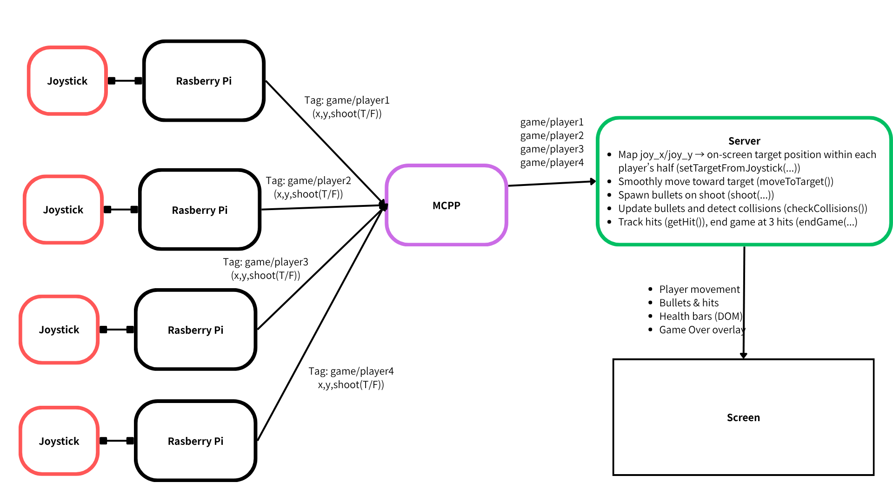

# Distributed Interaction

**NAMES OF COLLABORATORS HERE**

Iqra Khan(ik368), Celeste Bisch(lb854), Jaspreet Singh(jl4536)

<!-- For submission, replace this section with your documentation!

---

## Prep

1. Pull the new changes
2. Read: [The Presence Table](https://dl.acm.org/doi/10.1145/1935701.1935800) ([video](https://vimeo.com/15932020))

## Overview

Build interactive systems where **multiple devices communicate over a network** using MQTT messaging. Work in teams of 3+ with Raspberry Pis.

**Parts:**
- A: Learn MQTT messaging
- B: Try collaborative pixel grid demo  
- C: Build your own distributed system

---

## Part A: MQTT Messaging

MQTT = lightweight messaging for IoT. Publish/subscribe model with central broker.

**Concepts:**
- **Broker**: `farlab.infosci.cornell.edu:1883`
- **Topic**: Like `IDD/bedroom/temperature` (use `#` wildcard)
- **Publish/Subscribe**: Send and receive messages

**Install MQTT tools on your Pi:**
```bash
sudo apt-get update
sudo apt-get install -y mosquitto-clients
```

**Test it:**

**Subscribe to messages (listener):**
```bash
mosquitto_sub -h farlab.infosci.cornell.edu -p 1883 -t 'IDD/#' -u idd -P 'device@theFarm'
```

**Publish a message (sender):**
```bash
mosquitto_pub -h farlab.infosci.cornell.edu -p 1883 -t 'IDD/test/yourname' -m 'Hello!' -u idd -P 'device@theFarm'
```

> **💡 Tips:**
> - Replace `yourname` with your actual name in the topic
> - Use single quotes around the password: `'device@theFarm'`

**🔧 Debug Tool:** View all MQTT messages in real-time at `http://farlab.infosci.cornell.edu:5001`


**💡 Brainstorm 5 ideas for messaging between devices**

---

## Part B: Collaborative Pixel Grid

Each Pi = one pixel, controlled by RGB sensor, displayed in real-time grid.

**Architecture:** `Pi (sensor) → MQTT → Server → Web Browser`

**Setup:**

1. **Sensor**

#### Light/Proximity/Gesture sensor (APDS-9960)
We use this sensor [Adafruit APDS-9960](https://www.adafruit.com/product/3595) for this exmaple to detect light (also RGB)
 


Connect it to your pi with Qwiic connector


We need to use the screen to display the color detection, so we need to stop the running piscreen.service to make your screen available again

```bash
# stop the screen service
sudo systemctl stop piscreen.service
```

if you want to restart the screen service
```bash
# start the screen service
sudo systemctl start piscreen.service
```
 
2. **Server** (one person on laptop):
```bash
cd "Lab 6"  
source .venv/bin/activate
pip install -r requirements-server.txt
python app.py
```

2. **View in browser:**
   - Grid: `http://farlab.infosci.cornell.edu:5000`
   - Controller: `http://farlab.infosci.cornell.edu:5000/controller`

3. **Pi publisher** (everyone on their Pi):
```bash
# First time setup - create virtual environment
cd "Lab 6"
python -m venv .venv
source .venv/bin/activate
pip install -r requirements-pi.txt

# Run the publisher
python pixel_grid_publisher.py
```

Hold colored objects near sensor to change your pixel!


**📸 Include: Screenshot of grid + photo of your Pi setup**

---

## Part C: Make Your Own

**Requirements:**
- 3+ people, 3+ Pis
- Each Pi contributes sensor input via MQTT
- Meaningful or fun interaction

**Ideas:**

**Sensor Fortune Teller**
- Each Pi sends 0-255 from different sensor
- Server generates fortunes from combined values

**Frankenstories**
- Sensor events → story elements (not text!)
- Red = danger, gesture up = climbed, distance <10cm = suddenly

**Distributed Instrument**
- Each Pi = one musical parameter
- Only works together

**Others:** Games, presence display, mood ring

### Deliverables

Replace this README with your documentation:

**1. Project Description**
- What does it do? Why interesting? User experience?

**2. Architecture Diagram**
- Hardware, connections, data flow
- Label input/computation/output

**3. Build Documentation**
- Photos of each Pi + sensors
- MQTT topics used
- Code snippets with explanations

**4. User Testing**
- **Test with 2+ people NOT on your team**
- Photos/video of use
- What did they think before trying?
- What surprised them?
- What would they change?

**5. Reflection**
- What worked well?
- Challenges with distributed interaction?
- How did sensor events work?
- What would you improve?

---

## Code Files

**Server files:**
- `app.py` - Pixel grid server (Flask + WebSocket + MQTT)
- `mqtt_viewer.py` - MQTT message viewer for debugging
- `mqtt_bridge.py` - MQTT → WebSocket bridge
- `requirements-server.txt` - Server dependencies

**Pi files:**
- `pixel_grid_publisher.py` - Example (RGB sensor → MQTT)
- `requirements-pi.txt` - Pi dependencies

**Web interface:**
- `templates/grid.html` - Pixel grid display
- `templates/controller.html` - Color picker
- `templates/mqtt_viewer.html` - Message viewer

---

## Debugging Tools

**MQTT Message Viewer:** `http://farlab.infosci.cornell.edu:5001`
- See all MQTT messages in real-time
- View topics and payloads
- Helpful for debugging your own projects

**Command line:**
```bash
# See all IDD messages
mosquitto_sub -h farlab.infosci.cornell.edu -p 1883 -t "IDD/#" -u idd -P "device@theFarm"
```

---

## Troubleshooting

**MQTT:** Broker `farlab.infosci.cornell.edu:1883`, user `idd`, pass `device@theFarm`

**Sensor:** Check `i2cdetect -y 1`, APDS-9960 at `0x39`

**Grid:** Verify server running, check MQTT in console, test with web controller

**Pi venv:** Make sure to activate: `source .venv/bin/activate`


---

## Submission Checklist

Before submitting:
- [ ] Delete prep/instructions above
- [ ] Add YOUR project documentation
- [ ] Include photos/videos/diagrams  
- [ ] Document user testing with non-team members
- [ ] Add reflection on learnings
- [ ] List team names at top -->

<!-- **Your README = story of what YOU built!**

---

Resources: [MQTT Guide](https://www.hivemq.com/mqtt-essentials/) | [Paho Python](https://www.eclipse.org/paho/index.php?page=clients/python/docs/index.php) | [Flask-SocketIO](https://flask-socketio.readthedocs.io/) -->


## Part B

**📸 Include: Screenshot of grid + photo of your Pi setup**


[Video of tesitng](https://drive.google.com/file/d/1_v4XIgpmq1ViQQwSpHEUpifqzHxQ4F5R/view?usp=drive_link)


## Part C: Make Your Own

# Multiplayer Shooting Game

## 1. Project Description

Our project is a shooting game where each Raspberry Pi is connected to a joystick. There are two teams—left and right—and multiple players can join either team. Each player starts with three lives; once a player is hit three times, they are eliminated. When all players on a team are eliminated, the game is over. Players can move freely within their team's area.

Each Raspberry Pi has a unique label (e.g., `game/player1`) and transmits its tilt movements and shooting actions (based on joystick clicks) via MQTT. The server receives and processes each player's movement and shooting data.

## 2. Architecture Diagram



## 3. Build Documentation

### Video Demos

- [Prototype v1.0 - only two users](https://drive.google.com/file/d/1q2kW2iP4jFZXachqrEmqX1LXDZw4-zAk/view?usp=sharing)
- [Prototype v2.0 - with Joystick](https://drive.google.com/file/d/1gfdvAMW0J8bkEe9sS9Wu_g4WxeiCa-Uz/view?usp=sharing)

### MQTT Topics

- `game/player1`
- `game/player2`
- `game/player3`
- `game/player4`

### Setup

Get the canvas and 2D context:
```javascript
const ctx = canvas.getContext('2d');
```

Open a Socket.IO connection:
```javascript
const socket = io();
```

### Players

Four Player objects are created, two on each side:

- **Player 1** (Blue): Starts top-left
- **Player 2** (Red): Starts top-right
- **Player 3** (Green): Starts bottom-left
- **Player 4** (Yellow): Starts bottom-right

Each player has a target position and moves smoothly toward it in `moveToTarget()`.

### Joystick → Position

MQTT payload includes `joy_x`, `joy_y` in the `[-1, 1]` range. `setTargetFromJoystick(x, y)` maps these to screen coordinates:

- Players 1 & 3 are restricted to the left half of the screen
- Players 2 & 4 are restricted to the right half of the screen
- Values are clamped to the canvas bounds

### Shooting

When a payload has `shoot: true`, a Bullet is spawned:

- Players 1 & 3 (Left Side) shoot right (`direction = 1`)
- Players 2 & 4 (Right Side) shoot left (`direction = -1`)

### Collisions & Hits

Each frame, `checkCollisions()` checks if any active bullet `collidesWith()` a player.

- Players cannot hit themselves or teammates on the same side (e.g., Player 1 cannot hit Player 3)
- On a valid hit, `player.getHit()` increments hits
- After 3 hits, a player's `alive` status is set to `false`
- `checkWinner()` is called, and if only one player remains, the game ends

### Game Loop

`requestAnimationFrame(gameLoop)` updates positions, filters inactive bullets, checks collisions, and draws all players and bullets.

### Game Over / Restart

- `endGame(winnerPlayer)` shows an overlay with the winner
- `restartGame()` resets all players/bullets locally and emits `socket.emit('restart_game')` to notify the server (which resets the bot timers)

### Socket/Message Contract

**Server → Client** (via Socket.IO):

```javascript
socket.emit('mqtt_message', {
  topic: 'IDD/game/player1', // or player2, player3, player4
  payload: { joy_x: 0.4, joy_y: -0.2, shoot: false }
});

// Notifies client if a player is now AI-controlled
socket.emit('bot_status', {
  player: 'player1',
  active: true // true = bot active, false = human active
});
```

**Client → Server**:

```javascript
socket.emit('restart_game');
```

### Example MQTT Payloads

```json
{ "joy_x": -1.0, "joy_y": 0.6, "shoot": true }
```

Move target left/right with `joy_x`, up/down with `joy_y`. When `shoot` is `true`, a bullet spawns.

### Example mosquitto_pub Commands

```bash
# Player 1
mosquitto_pub -h farlab.infosci.cornell.edu -u idd -P 'device@theFarm' -t IDD/game/player1 -m '{"joy_x":0.3,"joy_y":0.6,"shoot":false}'

# Player 2
mosquitto_pub -h farlab.infosci.cornell.edu -u idd -P 'device@theFarm' -t IDD/game/player2 -m '{"joy_x":-0.1,"joy_y":-0.5,"shoot":true}'

# Player 3
mosquitto_pub -h farlab.infosci.cornell.edu -u idd -P 'device@theFarm' -t IDD/game/player3 -m '{"joy_x":0.9,"joy_y":-0.2,"shoot":false}'

# Player 4
mosquitto_pub -h farlab.infosci.cornell.edu -u idd -P 'device@theFarm' -t IDD/game/player4 -m '{"joy_x":-0.7,"joy_y":0.1,"shoot":false}'
```

## How to Run The Shooting Game

### Installation

Navigate to the game directory and set up the virtual environment:

```bash
cd game_final
python3 -m venv .venv
source .venv/bin/activate
pip install -r requirements.txt
```

### Running the Game

**Terminal 1 - Start the server:**

```bash
python game_server.py
```

**Terminals 2-5 - Start hardware joysticks** (one terminal for each player):

```bash
python joystick.py 1
python joystick.py 2
python joystick.py 3
python joystick.py 4
```

### Access the Game

Open your browser and navigate to:

**Game URL:** http://0.0.0.0:5002

**4. User Testing**
- **Test with 2+ people NOT on your team**
- We tested with three people from the class. 
- [video of final product + user study](https://drive.google.com/file/d/1TnAzbQIBP-7RIiOw5PKdG1k6p9cZIeOb/view?usp=drive_link)
<!-- - Photos/video of use -->
**What did they think before trying?**

Before using the game, we only explained that it was a shooting game. It seemed intuitive to them, so they immediately started playing without much instruction.

**What surprised them?**

They were unsure whether it was a team-based or individual game.
They didn’t like that the shooting was only in one direction and wanted bi-directional shooting instead.
They seemed to really enjoy playing and were surprised by how simple yet exciting the gameplay was.
However, since there was no feedback or reaction when a player got shot, it was hard to tell when that happened.

**What would they change?**

We plan to make the shooting bi-directional.
We will also add some form of feedback or reaction when a player is hit.
One participant mentioned they didn’t like how the joystick lacked any physical feedback or output—it felt less engaging without it.

**5. Reflection**

## What Worked Well?

### Decoupled Architecture

The separation of concerns was very successful. Using MQTT as a central "event bus" was a great choice:

- **`joystick.py`** did one thing well: read the hardware and publish data
- **`game_server.py`** did one thing well: relay messages and manage player (bot) state
- **`game.html`** did one thing well: render the game and listen for server events

### AI Bot Takeover

This was a huge success. The `game_server.py`'s ability to detect a disconnected player (based on a 5-second timeout) and spawn an AI bot in their place made the game incredibly resilient. It meant the game could continue uninterrupted even if a player's Raspberry Pi crashed or lost Wi-Fi.

### Real-Time Feel

The combination of MQTT and Socket.IO was fast enough for this game. The controls felt responsive because we were sending very small JSON payloads, and the client-side `moveToTarget()` function smoothed out the player movement.

## Challenges with Distributed Interaction

### Player Disconnection

The main challenge was "What happens when a player just disappears?" We couldn't rely on a "disconnect" message, as a crash or Wi-Fi loss would send nothing. This was the entire motivation for the AI bot controller. We had to create a "heartbeat" system where the server expects a message every few seconds, and if it doesn't get one, it assumes the player is gone.

### Latency

The signal path is long: **Pi → Wi-Fi → MQTT Broker → Server → Socket.IO → Browser**

We were worried this would feel laggy. We minimized this by keeping the MQTT payloads as tiny as possible (just `joy_x`, `joy_y`, `shoot`) and letting the client handle all the physics and rendering.

### State Management

Who is the "source of truth"? In our design, the `game.html` client holds the "true" game state (player health, bullet positions). The server is mostly "dumb" and just passes messages. This is simple, but it's also a weakness.


##  Sensor Processing Pipeline

Our "sensor" was the Qwiic joystick on the Raspberry Pi.

### 1. Reading

The `joystick.py` script runs an infinite loop that constantly reads the raw I2C data from the joystick for its X-axis, Y-axis, and button state.

### 2. Normalizing

It didn't send the raw `0-1024` values. It normalized the X/Y axis data into a simple `-1.0` to `1.0` range. This made it much easier for the game logic to process.

### 3. Event Detection

For shooting, it didn't just send "button is down." It specifically detected the transition from released (1) to pressed (0). This `check_shoot()` function ensured that one physical click resulted in one "shoot" event, preventing players from holding the button down to fire full-auto.

### 4. Publishing

It bundled this normalized data (`joy_x`, `joy_y`, `shoot`) into a JSON payload and published it to the player's specific MQTT topic (e.g., `IDD/game/player1`).

## What Would You Improve?

### 1. Authoritative Server

This is the biggest one. Right now, all the game logic, collision detection, and health are handled in the `game.html` browser. A much more robust (and cheat-proof) design would be to make the `game_server.py` authoritative. The server would run the entire game simulation. The browser would just be a "dumb" renderer that draws what the server tells it. This would also solve the state management challenge.

### 2. Smarter Bots

Our AI bots are very simple. They just move and shoot randomly. It would be a great improvement to make them "smarter"—for example, have them move with purpose, aim at opponents, and try to dodge bullets.

### 3. True Team Play ###

The game is set up for teams (left vs. right) and we prevent friendly fire. However, the win condition is "last player standing." I would change the `checkWinner()` logic to be "last team standing" (e.g., "Team Blue Wins!") to make it a proper team-based game.


**Distribution of Work**

Nana worked on the initial server code on game folder for two players game
Celest worked on the intial controller code on game folder
Iqra worked on modifying the server code to the multiple players game
