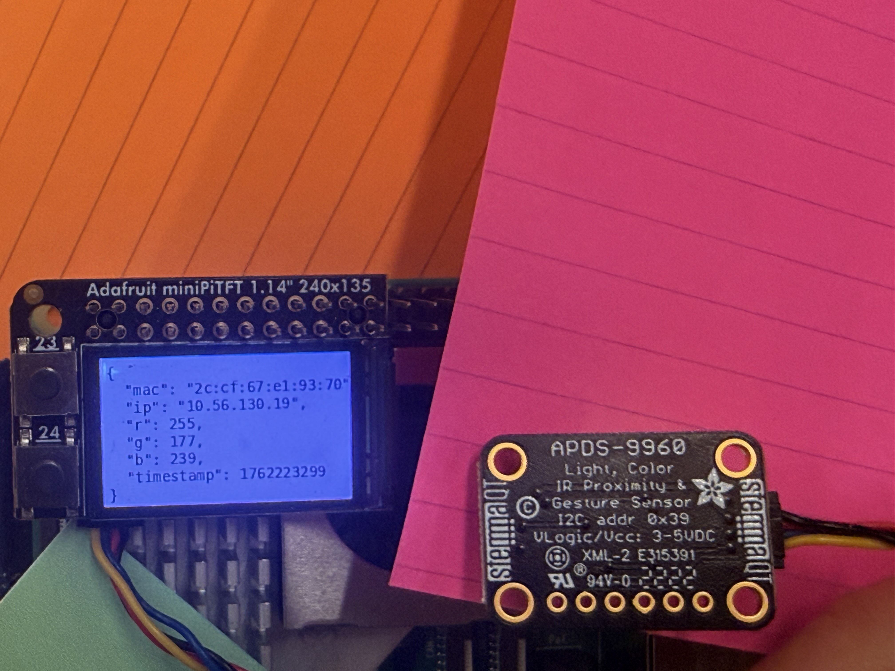

# Distributed Interaction

Huiying Zhan(hz764), 

For submission, replace this section with your documentation!

---

<details>
	<summary><h2> Prep </h2></summary>

1. Pull the new changes
2. Read: [The Presence Table](https://dl.acm.org/doi/10.1145/1935701.1935800) ([video](https://vimeo.com/15932020))
</details>

<details>
	<summary><h2> Overview </h2></summary>

Build interactive systems where **multiple devices communicate over a network** using MQTT messaging. Work in teams of 3+ with Raspberry Pis.

**Parts:**
- A: Learn MQTT messaging
- B: Try collaborative pixel grid demo  
- C: Build your own distributed system
</details>

---

<details>
	<summary><h2> Part A: MQTT Messaging </h2></summary>

MQTT = lightweight messaging for IoT. Publish/subscribe model with central broker.

**Concepts:**
- **Broker**: `farlab.infosci.cornell.edu:1883`
- **Topic**: Like `IDD/bedroom/temperature` (use `#` wildcard)
- **Publish/Subscribe**: Send and receive messages

**Install MQTT tools on your Pi:**
```bash
sudo apt-get update
sudo apt-get install -y mosquitto-clients
```

**Test it:**

**Subscribe to messages (listener):**
```bash
mosquitto_sub -h farlab.infosci.cornell.edu -p 1883 -t 'IDD/#' -u idd -P 'device@theFarm'
```

**Publish a message (sender):**
```bash
mosquitto_pub -h farlab.infosci.cornell.edu -p 1883 -t 'IDD/test/yourname' -m 'Hello!' -u idd -P 'device@theFarm'
```

> **💡 Tips:**
> - Replace `yourname` with your actual name in the topic
> - Use single quotes around the password: `'device@theFarm'`

**🔧 Debug Tool:** View all MQTT messages in real-time at `http://farlab.infosci.cornell.edu:5001`


</details>

**💡 Brainstorm 5 ideas for messaging between devices**

### 1. MQTT Setup & Testing
**Result:** ✅ Successfully received messages from other devices, including:
- Real-time RGB sensor data from classmates
- Test messages sent by myself
- Multiple device communications over the MQTT broker

#### Testing MQTT Publish (Sending Messages)
Command used to send test message:
```bash
mosquitto_pub -h farlab.infosci.cornell.edu -p 1883 -t 'IDD/test/huiying' -m 'Hello!' -u idd -P 'device@theFarm'
```

**Result:** ✅ Successfully sent and received my own message "Hello!" in the subscriber window.


### 2. 💡 Five Ideas for Distributed Device Messaging

#### Idea 1: **Collaborative Music Ensemble**
- **Description:** Each Pi controls one instrument/sound parameter (melody, rhythm, bass, harmony)
- **Interaction:** Sensors detect gestures or movements to trigger notes. All devices must play together to create harmonious music
- **MQTT Usage:** Each Pi publishes its current note/beat to a topic. A central controller synchronizes timing
- **Why Interesting:** Only works as a team - teaches coordination and creates something beautiful together

#### Idea 2: **Distributed Memory Game**
- **Description:** Like Simon Says but across multiple devices - each Pi displays a color sequence
- **Interaction:** Players must remember and repeat the pattern across all devices in correct order
- **MQTT Usage:** 
  - Topic: `IDD/game/sequence` - broadcasts the pattern
  - Topic: `IDD/game/player/[name]` - player responses
- **Why Interesting:** Classic game reimagined for distributed systems, tests memory and reaction time

#### Idea 3: **Virtual Plant Growth System**
- **Description:** Each Pi "waters" a shared virtual plant with different nutrients (light, water, temperature)
- **Interaction:** Distance sensors detect when someone approaches, contributing their "nutrient". Plant grows only when all nutrients are balanced
- **MQTT Usage:**
  - Topic: `IDD/plant/light` - light contribution
  - Topic: `IDD/plant/water` - water contribution  
  - Topic: `IDD/plant/growth` - overall growth status
- **Why Interesting:** Encourages collaboration and teaches about balanced ecosystems

#### Idea 4: **Emotion Wave Visualizer**
- **Description:** Detects group emotion through color/gesture sensors and creates a collective "mood wave" visualization
- **Interaction:** Each person's Pi reads their input (e.g., red object = excited, blue = calm). System combines all emotions into a flowing pattern displayed on all screens
- **MQTT Usage:**
  - Topic: `IDD/emotion/[username]` - individual emotion data (RGB values)
  - Topic: `IDD/emotion/collective` - aggregated visualization data
- **Why Interesting:** Makes abstract emotions visible and shows how individual feelings contribute to group atmosphere

#### Idea 5: **Distributed Story Generator**
- **Description:** Sensor events trigger story elements that build a collaborative narrative
- **Interaction:** 
  - Distance sensor < 10cm = "suddenly"
  - Red color detected = "danger appeared"
  - Gesture up = "climbed higher"
  - Proximity increases = "came closer"
- **MQTT Usage:**
  - Topic: `IDD/story/events` - sensor triggers
  - Topic: `IDD/story/narrative` - assembled story segments
- **Why Interesting:** Turns random sensor inputs into creative storytelling, unpredictable and fun


### 3. Reflections on MQTT

**What I Learned:**
- MQTT's publish/subscribe model is very efficient for IoT devices
- The broker-based architecture makes it easy to add/remove devices dynamically
- Using wildcards (#) in topics allows flexible message filtering
- Real-time communication enables new types of collaborative interactions

**Observations:**
- Saw active classmate devices sending RGB sensor data in real-time
- The system handles multiple simultaneous publishers seamlessly
- Message throughput is very fast - almost instantaneous delivery

**Potential Applications:**
These distributed messaging patterns could be used for:
- Smart home automation (coordinating multiple sensors/actuators)
- Group gaming and interactive art installations
- Collaborative learning environments
- Real-time monitoring systems

---


<details>
	<summary><h2> Part B: Collaborative Pixel Grid </h2></summary>

Each Pi = one pixel, controlled by RGB sensor, displayed in real-time grid.

**Architecture:** `Pi (sensor) → MQTT → Server → Web Browser`

**Setup:**

1. **Sensor**

#### Light/Proximity/Gesture sensor (APDS-9960)
We use this sensor [Adafruit APDS-9960](https://www.adafruit.com/product/3595) for this exmaple to detect light (also RGB)
 


Connect it to your pi with Qwiic connector



We need to use the screen to display the color detection, so we need to stop the running piscreen.service to make your screen available again

```bash
# stop the screen service
sudo systemctl stop piscreen.service
```

if you want to restart the screen service
```bash
# start the screen service
sudo systemctl start piscreen.service
```
 
2. **Server** (one person on laptop):
```bash
cd "Lab 6"  
source .venv/bin/activate
pip install -r requirements-server.txt
python app.py
```

2. **View in browser:**
   - Grid: `http://farlab.infosci.cornell.edu:5000`
   - Controller: `http://farlab.infosci.cornell.edu:5000/controller`

3. **Pi publisher** (everyone on their Pi):
```bash
# First time setup - create virtual environment
cd "Lab 6"
python -m venv .venv
source .venv/bin/activate
pip install -r requirements-pi.txt

# Run the publisher
python pixel_grid_publisher.py
```

Hold colored objects near sensor to change your pixel!


**📸 Include: Screenshot of grid + photo of your Pi setup**
</details>

---

## Part C: Make Your Own

**Requirements:**
- 3+ people, 3+ Pis
- Each Pi contributes sensor input via MQTT
- Meaningful or fun interaction

**Ideas:**

**Sensor Fortune Teller**
- Each Pi sends 0-255 from different sensor
- Server generates fortunes from combined values

**Frankenstories**
- Sensor events → story elements (not text!)
- Red = danger, gesture up = climbed, distance <10cm = suddenly

**Distributed Instrument**
- Each Pi = one musical parameter
- Only works together

**Others:** Games, presence display, mood ring

### Deliverables

Replace this README with your documentation:

**1. Project Description**
- What does it do? Why interesting? User experience?

**2. Architecture Diagram**
- Hardware, connections, data flow
- Label input/computation/output

**3. Build Documentation**
- Photos of each Pi + sensors
- MQTT topics used
- Code snippets with explanations

**4. User Testing**
- **Test with 2+ people NOT on your team**
- Photos/video of use
- What did they think before trying?
- What surprised them?
- What would they change?

**5. Reflection**
- What worked well?
- Challenges with distributed interaction?
- How did sensor events work?
- What would you improve?

---

## Code Files

**Server files:**
- `app.py` - Pixel grid server (Flask + WebSocket + MQTT)
- `mqtt_viewer.py` - MQTT message viewer for debugging
- `mqtt_bridge.py` - MQTT → WebSocket bridge
- `requirements-server.txt` - Server dependencies

**Pi files:**
- `pixel_grid_publisher.py` - Example (RGB sensor → MQTT)
- `requirements-pi.txt` - Pi dependencies

**Web interface:**
- `templates/grid.html` - Pixel grid display
- `templates/controller.html` - Color picker
- `templates/mqtt_viewer.html` - Message viewer

---

## Debugging Tools

**MQTT Message Viewer:** `http://farlab.infosci.cornell.edu:5001`
- See all MQTT messages in real-time
- View topics and payloads
- Helpful for debugging your own projects

**Command line:**
```bash
# See all IDD messages
mosquitto_sub -h farlab.infosci.cornell.edu -p 1883 -t "IDD/#" -u idd -P "device@theFarm"
```

---

## Troubleshooting

**MQTT:** Broker `farlab.infosci.cornell.edu:1883`, user `idd`, pass `device@theFarm`

**Sensor:** Check `i2cdetect -y 1`, APDS-9960 at `0x39`

**Grid:** Verify server running, check MQTT in console, test with web controller

**Pi venv:** Make sure to activate: `source .venv/bin/activate`


---

## Submission Checklist

Before submitting:
- [ ] Delete prep/instructions above
- [ ] Add YOUR project documentation
- [ ] Include photos/videos/diagrams  
- [ ] Document user testing with non-team members
- [ ] Add reflection on learnings
- [ ] List team names at top

**Your README = story of what YOU built!**

---

Resources: [MQTT Guide](https://www.hivemq.com/mqtt-essentials/) | [Paho Python](https://www.eclipse.org/paho/index.php?page=clients/python/docs/index.php) | [Flask-SocketIO](https://flask-socketio.readthedocs.io/)
