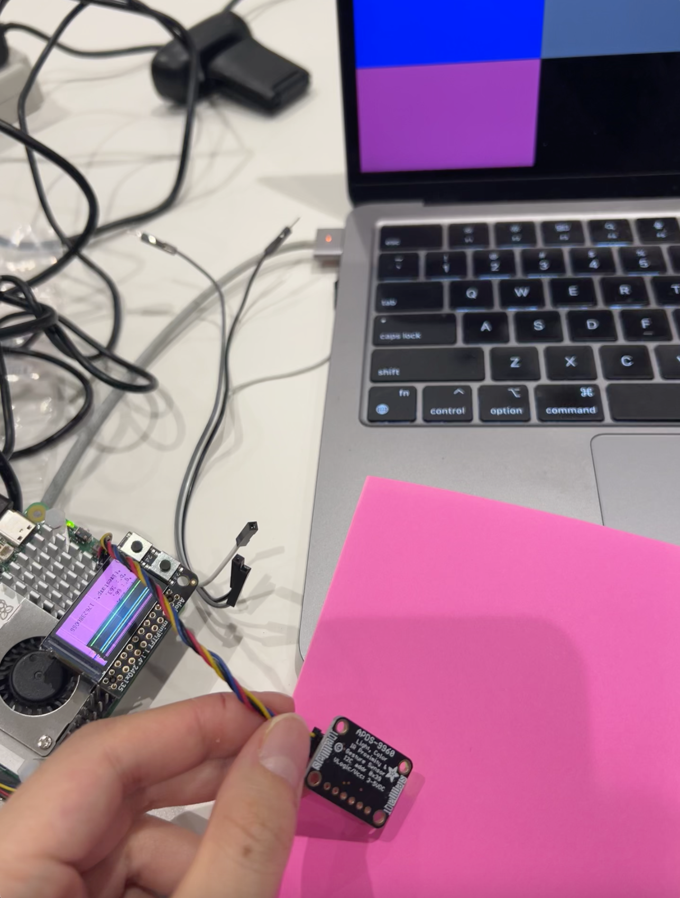

# Distributed Interaction

**NAMES OF COLLABORATORS HERE**

Celeste (Lianne) Bisch (lb854)

<!-- For submission, replace this section with your documentation!

---

## Prep

1. Pull the new changes
2. Read: [The Presence Table](https://dl.acm.org/doi/10.1145/1935701.1935800) ([video](https://vimeo.com/15932020))

## Overview

Build interactive systems where **multiple devices communicate over a network** using MQTT messaging. Work in teams of 3+ with Raspberry Pis.

**Parts:**
- A: Learn MQTT messaging
- B: Try collaborative pixel grid demo  
- C: Build your own distributed system

---

## Part A: MQTT Messaging

MQTT = lightweight messaging for IoT. Publish/subscribe model with central broker.

**Concepts:**
- **Broker**: `farlab.infosci.cornell.edu:1883`
- **Topic**: Like `IDD/bedroom/temperature` (use `#` wildcard)
- **Publish/Subscribe**: Send and receive messages

**Install MQTT tools on your Pi:**
```bash
sudo apt-get update
sudo apt-get install -y mosquitto-clients
```

**Test it:**

**Subscribe to messages (listener):**
```bash
mosquitto_sub -h farlab.infosci.cornell.edu -p 1883 -t 'IDD/#' -u idd -P 'device@theFarm'
```

**Publish a message (sender):**
```bash
mosquitto_pub -h farlab.infosci.cornell.edu -p 1883 -t 'IDD/test/yourname' -m 'Hello!' -u idd -P 'device@theFarm'
```

> **💡 Tips:**
> - Replace `yourname` with your actual name in the topic
> - Use single quotes around the password: `'device@theFarm'`

**🔧 Debug Tool:** View all MQTT messages in real-time at `http://farlab.infosci.cornell.edu:5001`


**💡 Brainstorm 5 ideas for messaging between devices**

---

## Part B: Collaborative Pixel Grid

Each Pi = one pixel, controlled by RGB sensor, displayed in real-time grid.

**Architecture:** `Pi (sensor) → MQTT → Server → Web Browser`

**Setup:**

1. **Sensor**

#### Light/Proximity/Gesture sensor (APDS-9960)
We use this sensor [Adafruit APDS-9960](https://www.adafruit.com/product/3595) for this exmaple to detect light (also RGB)
 


Connect it to your pi with Qwiic connector


We need to use the screen to display the color detection, so we need to stop the running piscreen.service to make your screen available again

```bash
# stop the screen service
sudo systemctl stop piscreen.service
```

if you want to restart the screen service
```bash
# start the screen service
sudo systemctl start piscreen.service
```
 
2. **Server** (one person on laptop):
```bash
cd "Lab 6"  
source .venv/bin/activate
pip install -r requirements-server.txt
python app.py
```

2. **View in browser:**
   - Grid: `http://farlab.infosci.cornell.edu:5000`
   - Controller: `http://farlab.infosci.cornell.edu:5000/controller`

3. **Pi publisher** (everyone on their Pi):
```bash
# First time setup - create virtual environment
cd "Lab 6"
python -m venv .venv
source .venv/bin/activate
pip install -r requirements-pi.txt

# Run the publisher
python pixel_grid_publisher.py
```

Hold colored objects near sensor to change your pixel!


**📸 Include: Screenshot of grid + photo of your Pi setup**

---

## Part C: Make Your Own

**Requirements:**
- 3+ people, 3+ Pis
- Each Pi contributes sensor input via MQTT
- Meaningful or fun interaction

**Ideas:**

**Sensor Fortune Teller**
- Each Pi sends 0-255 from different sensor
- Server generates fortunes from combined values

**Frankenstories**
- Sensor events → story elements (not text!)
- Red = danger, gesture up = climbed, distance <10cm = suddenly

**Distributed Instrument**
- Each Pi = one musical parameter
- Only works together

**Others:** Games, presence display, mood ring

### Deliverables

Replace this README with your documentation:

**1. Project Description**
- What does it do? Why interesting? User experience?

**2. Architecture Diagram**
- Hardware, connections, data flow
- Label input/computation/output

**3. Build Documentation**
- Photos of each Pi + sensors
- MQTT topics used
- Code snippets with explanations

**4. User Testing**
- **Test with 2+ people NOT on your team**
- Photos/video of use
- What did they think before trying?
- What surprised them?
- What would they change?

**5. Reflection**
- What worked well?
- Challenges with distributed interaction?
- How did sensor events work?
- What would you improve?

---

## Code Files

**Server files:**
- `app.py` - Pixel grid server (Flask + WebSocket + MQTT)
- `mqtt_viewer.py` - MQTT message viewer for debugging
- `mqtt_bridge.py` - MQTT → WebSocket bridge
- `requirements-server.txt` - Server dependencies

**Pi files:**
- `pixel_grid_publisher.py` - Example (RGB sensor → MQTT)
- `requirements-pi.txt` - Pi dependencies

**Web interface:**
- `templates/grid.html` - Pixel grid display
- `templates/controller.html` - Color picker
- `templates/mqtt_viewer.html` - Message viewer

---

## Debugging Tools

**MQTT Message Viewer:** `http://farlab.infosci.cornell.edu:5001`
- See all MQTT messages in real-time
- View topics and payloads
- Helpful for debugging your own projects

**Command line:**
```bash
# See all IDD messages
mosquitto_sub -h farlab.infosci.cornell.edu -p 1883 -t "IDD/#" -u idd -P "device@theFarm"
```

---

## Troubleshooting

**MQTT:** Broker `farlab.infosci.cornell.edu:1883`, user `idd`, pass `device@theFarm`

**Sensor:** Check `i2cdetect -y 1`, APDS-9960 at `0x39`

**Grid:** Verify server running, check MQTT in console, test with web controller

**Pi venv:** Make sure to activate: `source .venv/bin/activate`


---

## Submission Checklist

Before submitting:
- [ ] Delete prep/instructions above
- [ ] Add YOUR project documentation
- [ ] Include photos/videos/diagrams  
- [ ] Document user testing with non-team members
- [ ] Add reflection on learnings
- [ ] List team names at top -->

<!-- **Your README = story of what YOU built!**

---

Resources: [MQTT Guide](https://www.hivemq.com/mqtt-essentials/) | [Paho Python](https://www.eclipse.org/paho/index.php?page=clients/python/docs/index.php) | [Flask-SocketIO](https://flask-socketio.readthedocs.io/) -->


## Part B

**📸 Include: Screenshot of grid + photo of your Pi setup**



[Video of tesitng](https://drive.google.com/file/d/1_v4XIgpmq1ViQQwSpHEUpifqzHxQ4F5R/view?usp=drive_link)


## Part C: Make Your Own

**1. Project Description**
<!-- - What does it do? Why interesting? User experience? -->
Our project is a shooting game where each Raspberry Pi is connected to a joystick. There are two teams—left and right—and multiple players can join either team. Each player starts with three lives; once a player is hit three times, they are eliminated. When all players on a team are eliminated, the game is over. Players can move freely within their team’s area.

Each Raspberry Pi has a unique label (e.g., game/player1) and transmits its tilt movements and shooting actions (based on joystick clicks) via MQTT. The server receives and processes each player’s movement and shooting data.

**2. Architecture Diagram**
<!-- - Hardware, connections, data flow
- Label input/computation/output -->


**3. Build Documentation**
- Photos of each Pi + sensors
   - [Video of prototype](https://drive.google.com/file/d/1q2kW2iP4jFZXachqrEmqX1LXDZw4-zAk/view?usp=drive_link)
   - [Video of prototpe with joystick](https://drive.google.com/file/d/1gfdvAMW0J8bkEe9sS9Wu_g4WxeiCa-Uz/view?usp=drive_link)

- MQTT topics used: game/player1, game/player2, game/player3, game/player4
<!-- - Code snippets with explanations: -->

### How it works on the server side

A canvas game for 4 people. 
The browser listens to joystick updates coming from MQTT (relayed via Socket.IO) and moves/shoots accordingly. First to hit the other 3 times wins.

- Setup
   - Get the canvas and 2D context: const ctx = canvas.getContext('2d');
   - Open a Socket.IO connection: const socket = io();
- Players
   - Two Player objects (blue = left, red = right):
```bash
class Player { /* x,y,color,side,hits,alive; draw(); collidesWith(); getHit(); */ }
```
   - Each player has a target position and moves smoothly toward it in moveToTarget().
- Joystick → Position
   - MQTT payload includes joy_x, joy_y in [-1, 1].
   - setTargetFromJoystick(x, y) maps these to screen coordinates:
   - Left player stays in left half, right player in right half.
   - Values are clamped to canvas bounds.
- Shooting
   - When payload has shoot: true, spawn a Bullet heading toward the opponent:
   - class Bullet { /* x,y,direction,active; update(); draw(); */ }
   - Direction: player1 → +1 (right), player2 → -1 (left).

- Collisions & Hits
   - Each frame, bullets update() and are checked with player.collidesWith(bullet).
   - On hit: player.getHit() increments hits; 3 hits sets alive = false and ends the game.

- Game loop
   - requestAnimationFrame(gameLoop) updates positions, filters inactive bullets, checks collisions, and draws the scene (players, bullets, midline, HUD).

- Minimal DOM updates
   - updateHealthDisplay() updates the hit counters and small health bars under each player card.
- Game over / restart
   - endGame(winnerName) shows an overlay.
   - restartGame() resets players/bullets and emits socket.emit('restart_game').

### Socket/Message contract
- Server → Client (via Socket.IO):
```bash
socket.emit('mqtt_message', {
  topic: 'IDD/game/player1',   // or 'IDD/game/player2'
  payload: { joy_x: 0.4, joy_y: -0.2, shoot: false }
});
```
- Client → Server:
```bash
socket.emit('restart_game');
```

- Example payload
```bash
{ "joy_x": -1.0, "joy_y": 0.6, "shoot": true }
```
   - Move target left/right with joy_x, up/down with joy_y.
   - When shoot is true, a bullet spawns from that player.

- Example code: 
```bash
mosquitto_pub -h farlab.infosci.cornell.edu   -u idd -P 'device@theFarm'   -t IDD/game/player1   -m '{"joy_x":0.3,"joy_y":0.6,"shoot"false}'
```

### How to Run The Shooting Game

```bash
cd game_final
python3 -m venv .venv
source .venv/bin/activate
pip install -r requirements.txt

#On one terminal
python game_server.py

#On the other terminal 
python joystick.py 'player#'
```

Then, access to the 

- Game URL:     http://0.0.0.0:5002

**4. User Testing**
- **Test with 2+ people NOT on your team**
- Photos/video of use
- What did they think before trying?
- What surprised them?
- What would they change?

**5. Reflection**
- What worked well?
- Challenges with distributed interaction?
- How did sensor events work?
- What would you improve?

**6. Distribution of Work**
- Nana worked on the initial server code on game folder for two players game
- Celest worked on the intial controller code on game folder
- Iqra worked on modifying the server code to the multiple players game