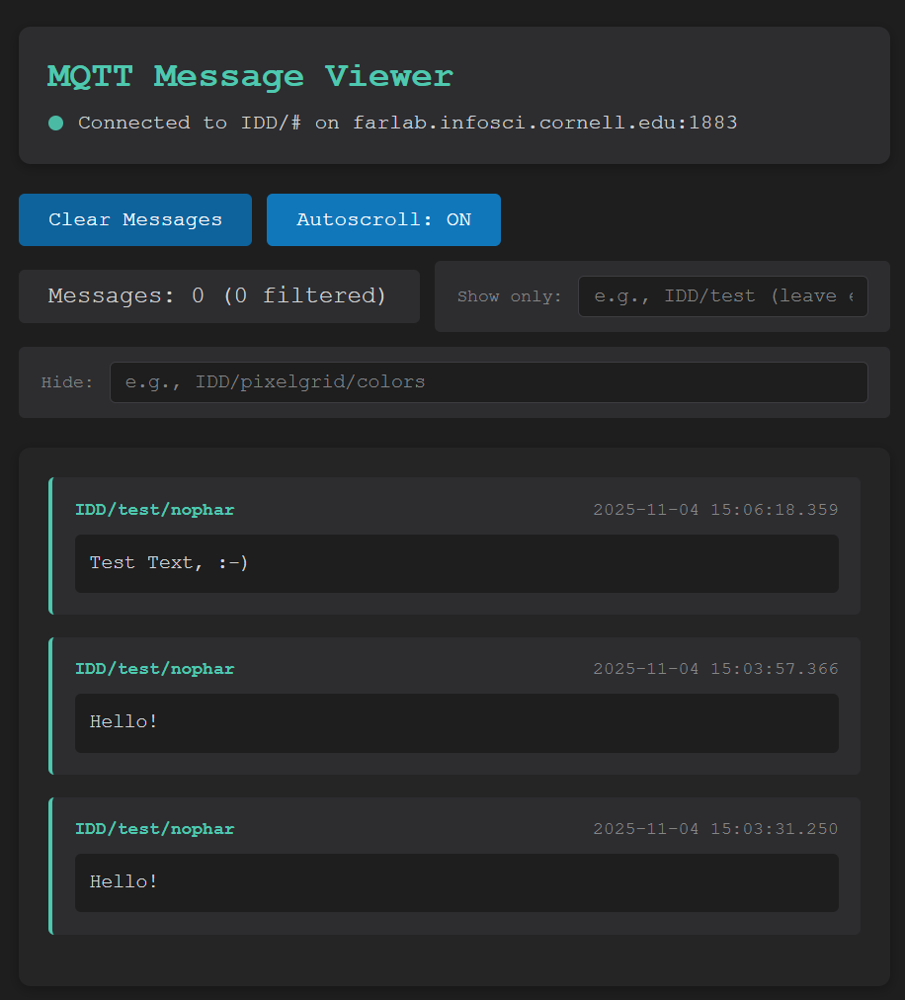
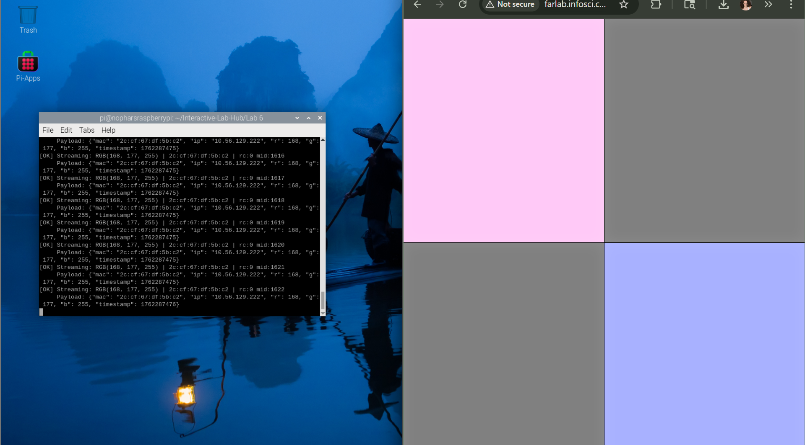
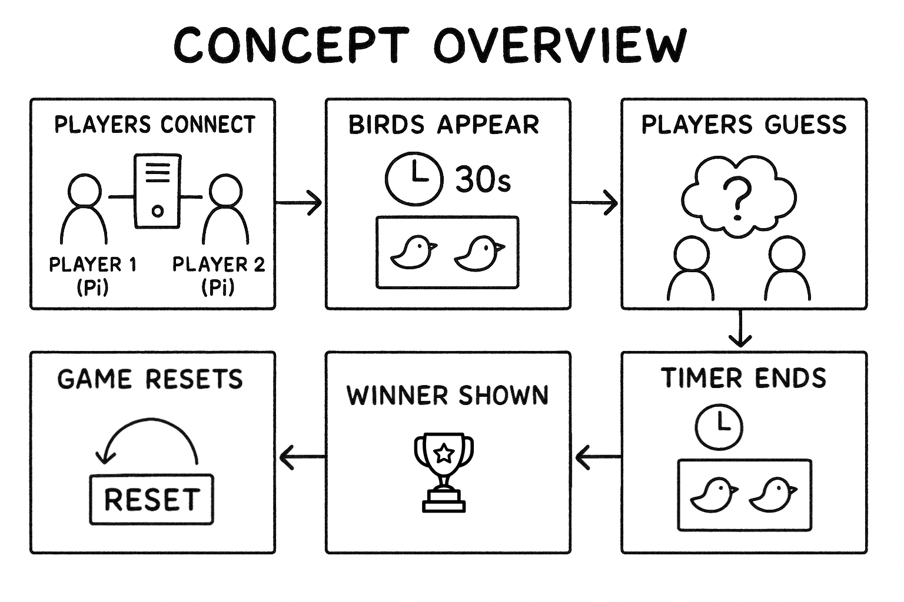
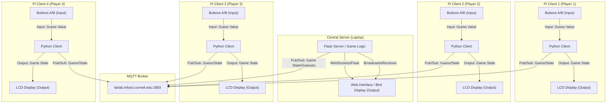
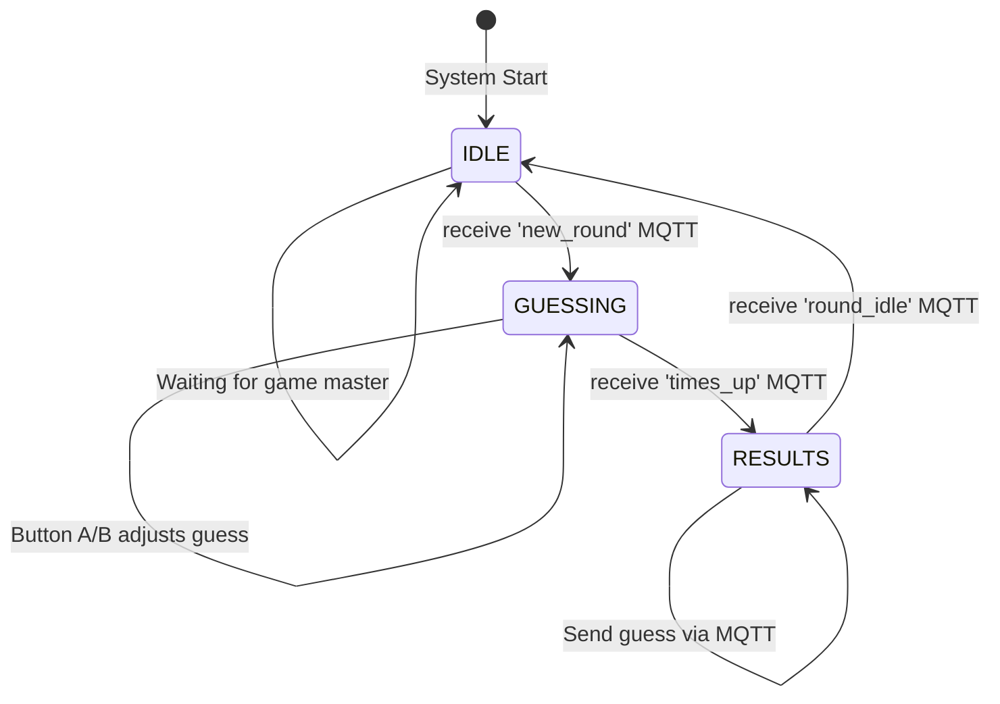
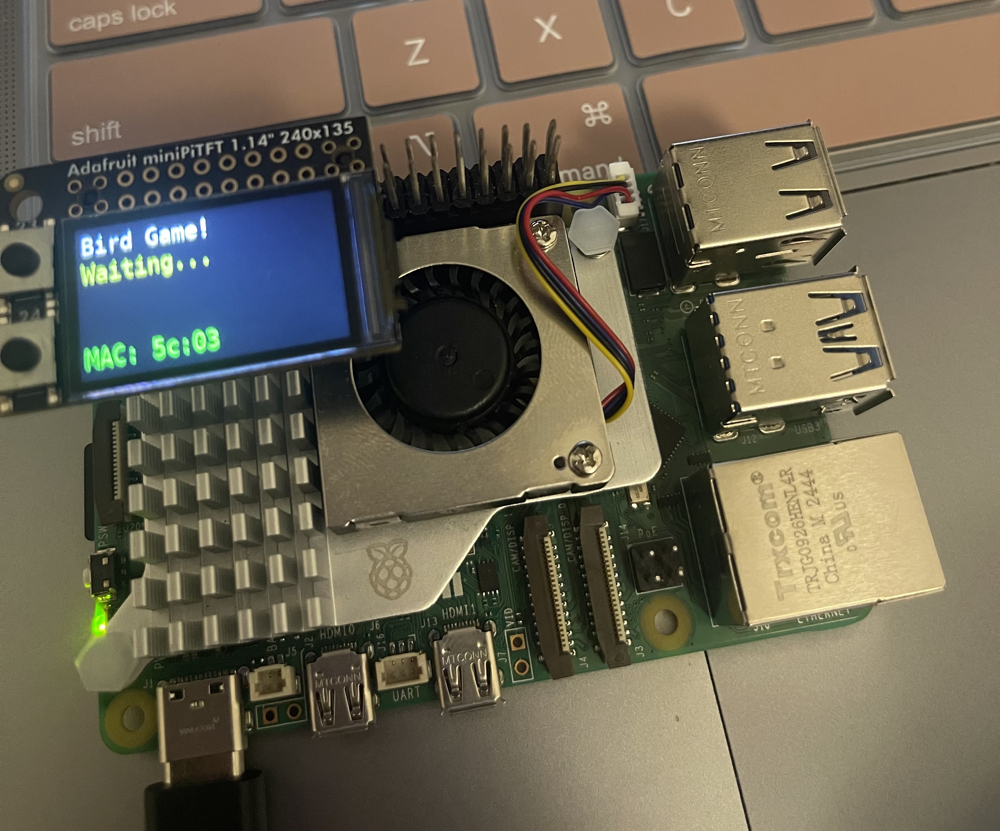
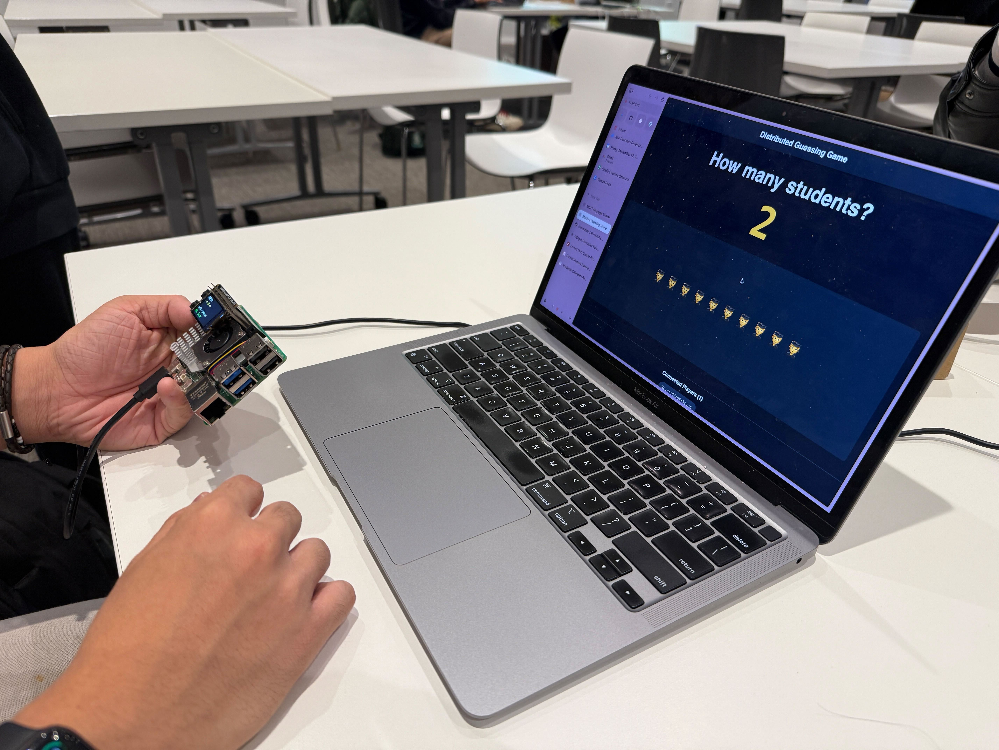
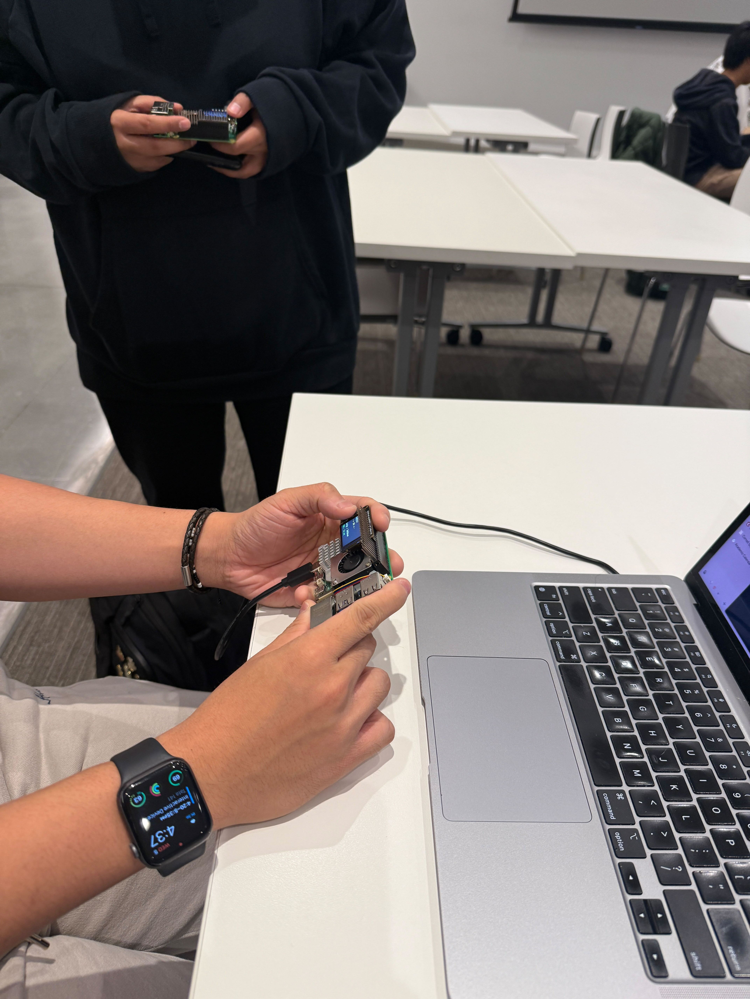
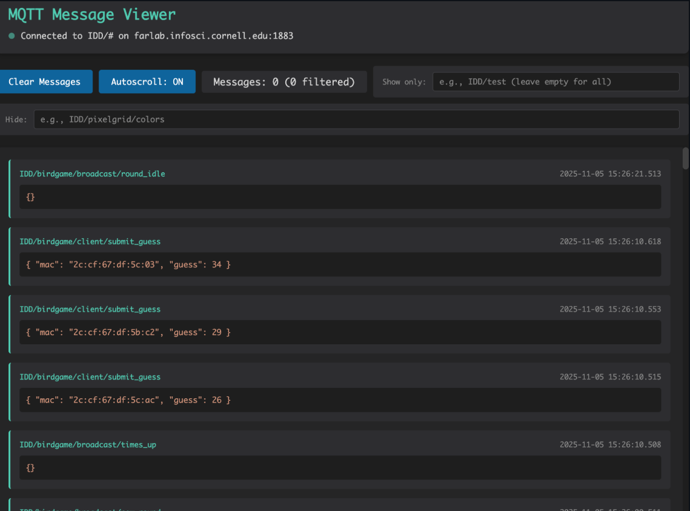

# Distributed Interaction

**Collaborators:**  
Angela Bi, Kyle Li, Nophar Shalom, Jesse Iriah

**Collaborators:**
Angela Bi, Kyle Li, Nophar Shalom, Jesse Iriah

## Team Contributions
| Collaborator   | Contributions                                                                                      |
| :-------------| :------------------------------------------------------------------------------------------------ |
| **Jesse Iriah**| Concept sketch/storyboard, architecture diagram, state machine, video/ testing participation, documentation, hardware setup. |
| **Kyle Li**   | Programming/Debugging, hardware setup, pi client code, video/testing participation, documentation.          |
| **Nophar Shalom**| Video/testing participation, documentation, hardware setup.                                             |
| **Angela Bi** | Documentation, video/testing participation, hardware setup.                                         |

---

## Project Overview

The distributed guessing game enables multiple players to use Raspberry Pis to guess the number of birds shown on a central display. Each Pi acts as an individual player controller with physical buttons for input and an LCD display for game state feedback. Players compete in timed rounds to see who can guess closest to the correct answer, with all devices communicating through MQTT messaging to maintain synchronized game state.  

---
# Part A: MQTT Messaging Setup

<details><summary><strong>MQTT Installation & Configuration</strong></summary>
    - **Installation Commands:**
    - **On Raspberry Pi:**
  ```bash
      sudo apt-get update
      sudo apt-get install -y mosquitto-clients
  ```
    - **On macOS:**
  ```bash
      brew install mosquitto
  ```
  - **Broker Configuration:** `farlab.infosci.cornell.edu:1883`
  - **Authentication:** User: `idd`, Password: `device@theFarm`
  
  ### MQTT Testing
  - **Subscribe Test:**
  ```bash
    mosquitto_sub -h farlab.infosci.cornell.edu -p 1883 -t 'IDD/#' -u idd -P 'device@theFarm'
  ```
    Successfully subscribed to all IDD topics and received published messages.
  
  - **Publish Test:**
  ```bash
    mosquitto_pub -h farlab.infosci.cornell.edu -p 1883 -t 'IDD/test/nophar' -m 'Testing Lab 6 MQTT from Nophar' -u idd -P 'device@theFarm'
  ```
</details>

- **Debug Tool Results:**
  
  
  
  *Web-based MQTT viewer at http://farlab.infosci.cornell.edu:5001 showing Hello! message*


### Brainstormed Ideas
1. **Number Guessing Game** - Multiple players guess a number/quantity shown on screen
2. **Music Maker** - Each Pi controls one instrument/sound parameter
3. **Colour Guessig Game** - Multiple players try to guess/replicate a colour using input RGB/hex 
4. **Mood Ring** - Combined sensor inputs create collective mood visualization
5. **Distributed Storytelling** - Each Pi adds elements to a collaborative narrative


---

# Part B: Collaborative Pixel Grid
<details><summary><strong>Setup</strong></summary>
  ### Hardware Setup
- **Sensor Configuration:** The **Adafruit APDS-9960 RGB Sensor** was used to capture color input.
- **Wiring:** The sensor was connected directly to the Raspberry Pi's I2C port using a **Qwiic connector cable**. The connection was verified using the diagnostic tool `sudo i2cdetect -y 1`.
- **Pi Setup:** [Photo of Pi Setup: Deliverables/pi_with_sensor.jpg]  

### Software Configuration
Due to an **OSError: [Errno 48] Address already in use** conflict on port 5000 (claimed by a macOS system process), the server's running port was manually changed to **5002** directly within the `app.py` script.

- **Server Setup:** 
The application was run on port 5002 after editing the `socketio.run()` line in `app.py`.
```bash
  # Activation and Dependency Installation
  cd "Lab 6"
  source server_venv/bin/activate
  pip install -r requirements-server.txt
  python3 app.py
```
- **Pi Publisher Script:** 
 ```bash
 python pixel_grid_publisher.py
 ```
- **Virtual Environment:** Created/ activated with `python -m venv .venv` 
</details>

### Grid Testing
Testing confirmed successful data flow:

- **Pi Sensor → MQTT Broker → Server → Web Grid (Port 5002)**

- **Multi-Device Grid:** Tested 2 devices, each creating different colored pixels simultaneously. The terminal output below confirms the simultaneous operation of the Mac Server (top window) and the Pi Publisher (bottom window), demonstrating the end-to-end distributed system flow.

  
- **Sensor Interaction:** Color detection worked by holding colored objects near APDS-9960.  


### Video Demonstration

| Component        | Description                                                                                 | Link                          |
|-----------------------------|---------------------------------------------------------------------------------------------|-------------------------------|
| Real-time sensor input       | Video of physical movement of the APDS-9960 sensor over colors with continuous pixel updates. | [Google Drive Video](https://drive.google.com/file/d/1i7xPzXFjYEbPrV4tQO05pbcccJPpa58D/view?usp=sharing) |


---

# Part C: Distributed System - Bird Guessing Game

## System Design

### Initial Concept Sketch/Storyboard



1. **Scene 1:** Players connect their Raspberry Pis to the central server.
2. **Scene 2:** A new round begins — the central display shows a group of birds, and a 30-second timer starts.
3. **Scene 3:** Players observe the screen and make their guesses using their Pis (represented by a thought bubble with a question mark).
4. **Scene 4:** When the timer ends, all guesses are automatically submitted via MQTT.
5. **Scene 5:** The correct answer and winner are displayed on the central screen.
6. **Scene 6:** The game resets, ready for the next round.

### Concept Description

The Bird Guessing Game requires users to estimate quantities presented on a central display within a time limit. Each player operates a Raspberry Pi as a personal controller with physical button inputs (increment/decrement) and receives real-time feedback on the device’s display. The game encourages interactive group participation through competitive timed rounds and illustrates distributed system coordination using MQTT messaging.

### Architecture Diagram


### State Diagram



### MQTT Topic Structure

- **Topics Used:**
  - `IDD/birdgame/client/register` - Pis register with MAC address
  - `IDD/birdgame/client/submit_guess` - Submit final guesses
  - `IDD/birdgame/broadcast/new_round` - Start new guessing round
  - `IDD/birdgame/broadcast/times_up` - End guessing period
  - `IDD/birdgame/broadcast/round_idle` - Return to idle state

- **Message Format:** 
```json
// Registration
{"mac": "2c:cf:67:df:5c:03"}

// Guess submission
{"mac": "2c:cf:67:df:5c:03", "guess": 34}
```

---

## Implementation

### Hardware Configuration

The Distributed Number Guessing Game uses a modular architecture where the same **client script** is deployed across all four Raspberry Pis. Each Pi is uniquely identified by its MAC address.

### Common Client Configuration (Pi Devices)
The client application is contained within the **`bird_client.py`** script (or its equivalent) and performs both publishing (sending guesses) and subscribing (receiving game state).

- **Hardware:** **ST7789 Display** (Output), **GPIO Buttons** (Pins 23/24 for Input).
- **MQTT Role:** Publisher/Subscriber (Both).
- **Code Reference:**  [Common Client Code](StudentCounterGame.py)

#### Key Code Snippet: Input Logic
This function, executed identically on all Pi devices, handles player input to increment or decrement the guess.  

```python
def poll_buttons():
    # Only processes input during the 'GUESSING' state
    if game_state == 'GUESSING':
        if not buttonA.value:  # Button A pressed (Increment)
            current_guess += 1
            display_needs_update = True
        elif not buttonB.value:  # Button B pressed (Decrement)
            current_guess = max(0, current_guess - 1)
```

### Pi Client Devices (Player Controllers)
The core difference between clients is the MAC address that serves as the Player ID.

| Device | Collaborator | Hardware                    | Setup Photo                            |
|--------|--------------|---------------------------------|--------------------------------------|
| Pi #1  | Jesse        | ST7789 Display, GPIO Buttons (Pins 23, 24) |  |
| Pi #2  | Kyle         | ST7789 Display, GPIO Buttons (Pins 23, 24) |  |
| Pi #3  | Angela       | ST7789 Display, GPIO Buttons (Pins 23, 24) |  |
| Pi #4  | Nophar       | ST7789 Display, GPIO Buttons (Pins 23, 24) |  |

### Server/Central Processing (Computation)

The server manages all game state transitions and result aggregation, relying entirely on the MQTT broker for communication.

- **Server Code:** The game logic is handled by the server script. [Link to game_server.py Code](/Deliverables/game_server.py)
- **Data Aggregation:** Collects all final player guesses from the `IDD/birdgame/client/+/guess` topic via MQTT, using the MAC address to track each submission.
- **Output Generation:** Determines the winner based on the closest guess to the target count and broadcasts the results to all clients and the web interface.


### Live MQTT Data Flow Proof



*This screenshot from the central MQTT Message Viewer confirms the successful distributed communication for a single round of the game. It shows three unique Pi clients (Player 1, Kyle, and Nophar) submitting their final guesses immediately following the game state broadcast.*

| MAC Address | Collaborator | Guess Submitted |
| :--- | :--- | :--- |
| **...df:5c:03** | **Jesse** | **34** |
| **...5b:c2** | Kyle | 29 |
| **...5c:ac** | Nophar | 26 |

---

## User Testing

To validate the **Distributed Number Guessing Game** and gather feedback on its competitive and real-time aspects, the system was tested with two individuals external to the development team simultaneously.

- **Testers:** Iqra and Akash (Non-team members)
- **Testing Videos:**
  [User Testing Video 1](https://drive.google.com/file/d/1qtUELGBDMRiwQ6vayPfnQEflKtKRF2uB/view?usp=sharing)
  [User Testing Video 2](https://drive.google.com/file/d/1hRcG17_nF7vg5Su6h5w8Pa4PZYicviEh/view?usp=sharing)


### Key Observations (Iqra & Akash)

| Tester | Initial Expectations | Key Surprises/Positive Feedback | Suggested Changes |
| :--- | :--- | :--- | :--- |
| **Iqra** | Expected a simple number entry game. | Enjoyed the **time pressure** and competitive aspect. Found **button controls intuitive** and liked seeing **real-time guess updates**. | Implement **tie-breaking** (first submission wins tie). Add more **visual feedback** for winner announcement. |
| **Akash** | Thought the game would be **turn-based**. | Disliked the game's **continuous looping** nature. | Add "best of 3" or **tournament mode** for a clear ending. Include player avatars/characters and **sound effects** for game events. Make countdown shorter. |

---

## Project Reflection

### What Worked Well

- **MQTT Synchronization:** All devices stayed perfectly in sync throughout gameplay
- **Physical Controls:** Button input felt responsive and intuitive for quick adjustments
- **Display Feedback:** Real-time guess updates on Pi displays kept players engaged


### Challenges with Distributed Interaction

- **Challenge 1: Network Latency**
  - Description: Occasional delay between button press and server acknowledgment
  - Solution: Implemented local display updates before MQTT confirmation

- **Challenge 2: Player Identification**
  - Description: Difficult to track which guess belonged to which player
  - Solution: Used MAC addresses as unique identifiers, displayed last 5 chars

- **Challenge 3: State Synchronization**
  - Description: Ensuring all Pis transitioned states simultaneously
  - Solution: Server broadcasts state changes to all clients at once

### Sensor Event Handling

The button-based interaction proved very for this fast-paced game. The physical buttons eliminated false triggers and provided clear user intent. The 200ms debounce timer prevented double-inputs while maintaining responsiveness. State-based input validation (only accepting input during GUESSING state) prevented erroneous submissions.


### Potential Improvements

1. **Tournament Mode:** Implement Akash's suggestion for "best of 3" rounds with cumulative scoring
2. **Player Avatars:** Add visual representation of each player on the main display
3. **Progressive Difficulty:** Start with easier counts, increase complexity over rounds
4. **Timing Bonuses:** Reward faster correct guesses as suggested by Iqra
5. **Audio Feedback:** Add sound effects for round start/end and winner announcement

---

## Technical Documentation

### Dependencies

- **Server Requirements:** 
  - Flask, Flask-SocketIO, paho-mqtt
  
- **Pi Requirements:**
  - adafruit-circuitpython-rgb-display
  - paho-mqtt
  - Pillow (PIL)

### Debugging Process

- **MQTT Monitoring:** Used viewer at :5001 to track all game messages and verify MAC addresses
- **Command Line Testing:** 
```bash
  mosquitto_sub -h farlab.infosci.cornell.edu -p 1883 -t "IDD/birdgame/#" -u idd -P "device@theFarm"
```
- **Troubleshooting:** Initial button wiring issues resolved by checking pull-up resistor configuration

---

## Sources

- MQTT Protocol Documentation
- Paho Python MQTT Client Library
- Adafruit CircuitPython RGB Display Guide
- Flask-SocketIO Documentation for real-time web communication

---
