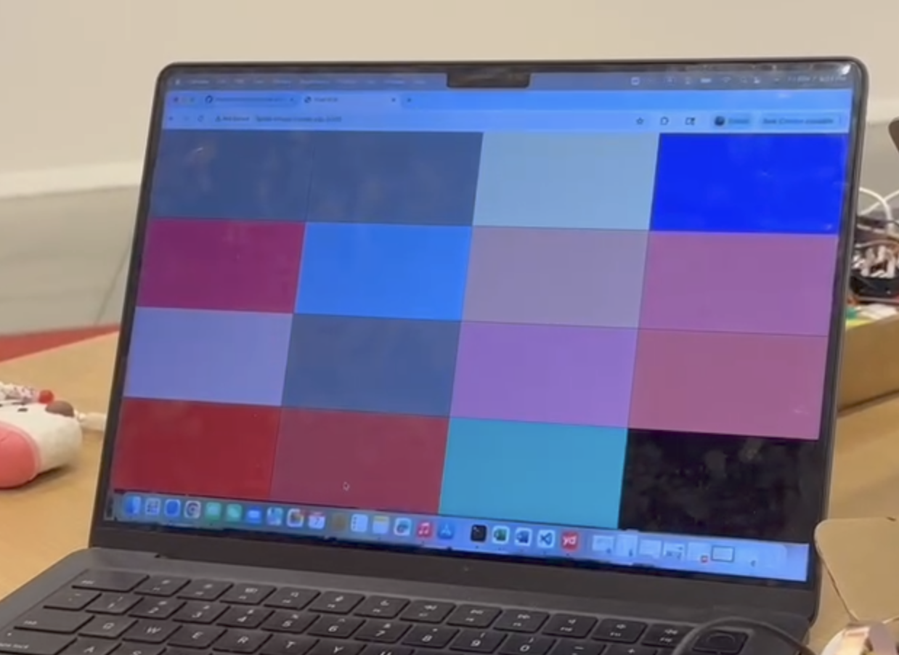
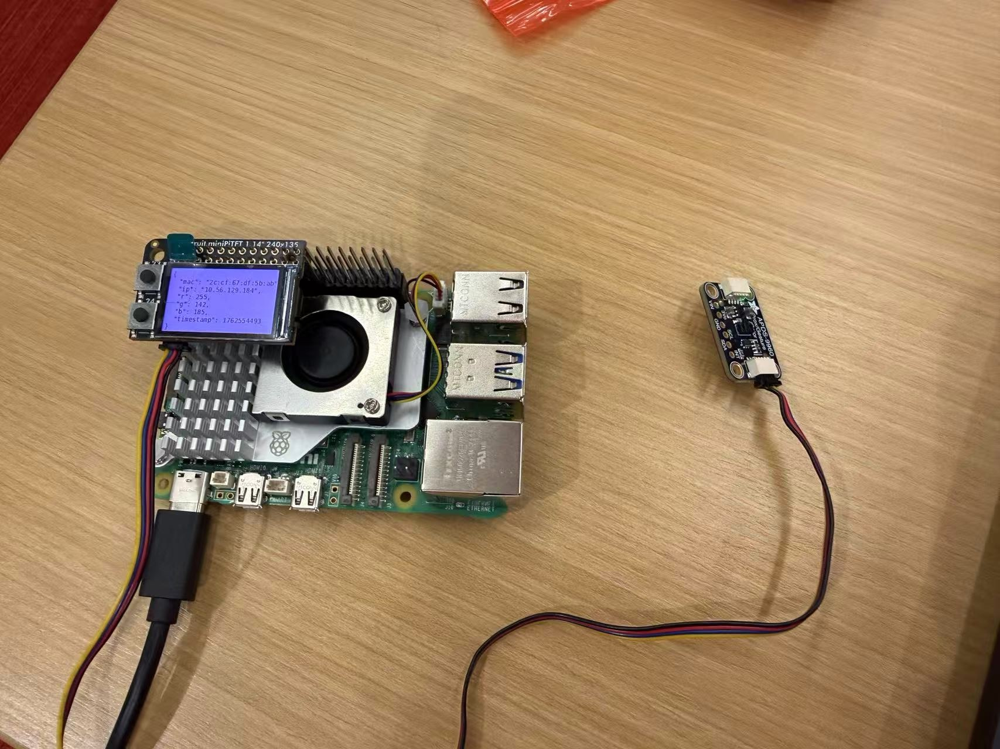
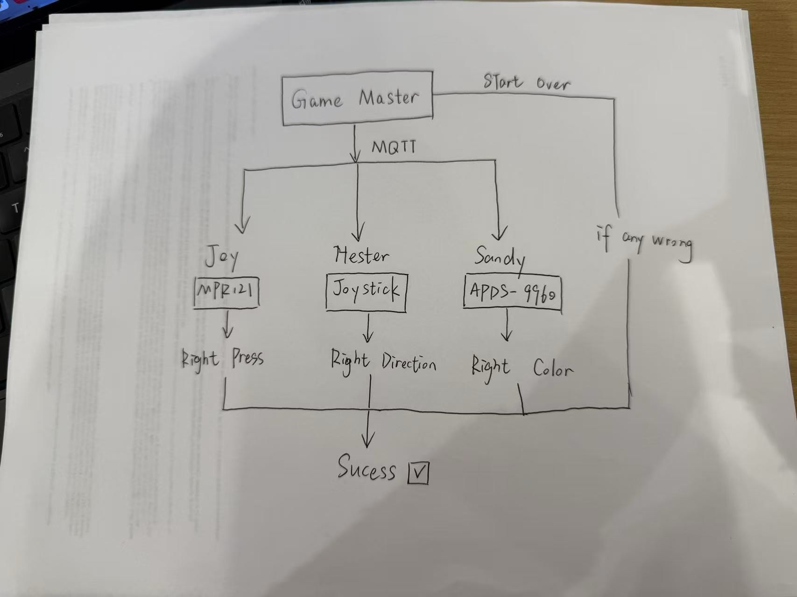
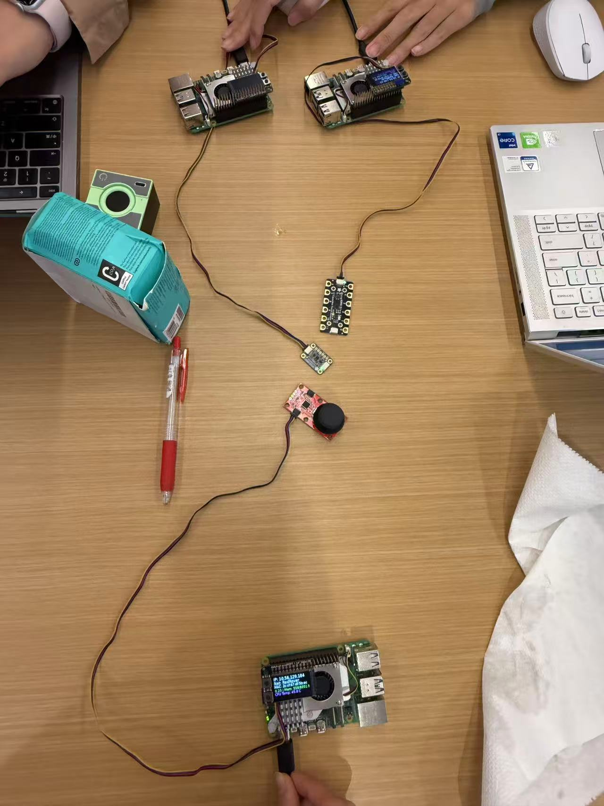
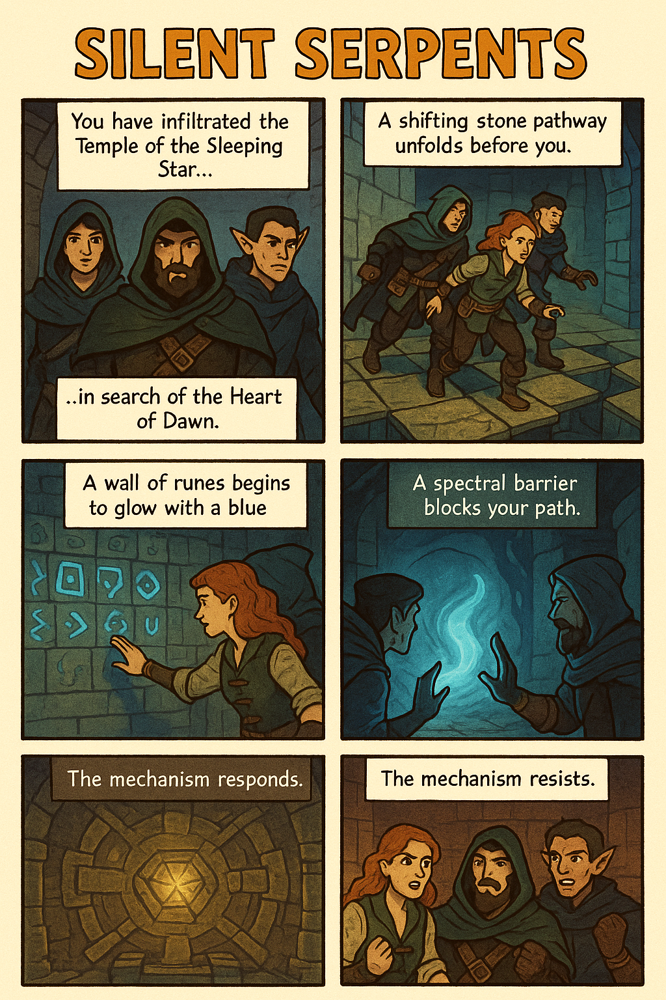

# Distributed Interaction

**Huiying Zhan, Jiayi Sun, Qinrui Li**


<details>
	<summary><h2> Prep </h2></summary>

1. Pull the new changes
2. Read: [The Presence Table](https://dl.acm.org/doi/10.1145/1935701.1935800) ([video](https://vimeo.com/15932020))
</details>

<details>
	<summary><h2> Overview </h2></summary>

Build interactive systems where **multiple devices communicate over a network** using MQTT messaging. Work in teams of 3+ with Raspberry Pis.

**Parts:**
- A: Learn MQTT messaging
- B: Try collaborative pixel grid demo  
- C: Build your own distributed system
</details>

---

<details>
	<summary><h2> Part A: MQTT Messaging </h2></summary>

MQTT = lightweight messaging for IoT. Publish/subscribe model with central broker.

**Concepts:**
- **Broker**: `farlab.infosci.cornell.edu:1883`
- **Topic**: Like `IDD/bedroom/temperature` (use `#` wildcard)
- **Publish/Subscribe**: Send and receive messages

**Install MQTT tools on your Pi:**
```bash
sudo apt-get update
sudo apt-get install -y mosquitto-clients
```

**Test it:**

**Subscribe to messages (listener):**
```bash
mosquitto_sub -h farlab.infosci.cornell.edu -p 1883 -t 'IDD/#' -u idd -P 'device@theFarm'
```

**Publish a message (sender):**
```bash
mosquitto_pub -h farlab.infosci.cornell.edu -p 1883 -t 'IDD/test/yourname' -m 'Hello!' -u idd -P 'device@theFarm'
```

> **💡 Tips:**
> - Replace `yourname` with your actual name in the topic
> - Use single quotes around the password: `'device@theFarm'`

**🔧 Debug Tool:** View all MQTT messages in real-time at `http://farlab.infosci.cornell.edu:5001`


</details>

**💡 Brainstorm 5 ideas for messaging between devices**

### 1. MQTT Setup & Testing
**Result:** ✅ Successfully received messages from other devices, including:
- Real-time RGB sensor data from classmates
- Test messages sent by myself
- Multiple device communications over the MQTT broker

#### Testing MQTT Publish (Sending Messages)
Command used to send test message:
```bash
mosquitto_pub -h farlab.infosci.cornell.edu -p 1883 -t 'IDD/test/huiying' -m 'Hello!' -u idd -P 'device@theFarm'
```

**Result:** ✅ Successfully sent and received my own message "Hello!" in the subscriber window.


### 2. 💡 Five Ideas for Distributed Device Messaging

#### Idea 1: **Team-Based Escape Room Timer**
- **Description:** Each Raspberry Pi is responsible for solving a different sensor-based puzzle. Only when all players complete their tasks simultaneously does the next stage unlock.
- **Interaction:**
  - Pi A: Press and hold a button when the light level is low.
  - Pi B: Tilt a joystick to match a displayed direction cue.
  - Pi C: Match a target color using a color sensor.
- **MQTT Usage:**
  - Each device publishes status: `IDD/escape/[player]/status`
  - Game master broadcasts puzzle progress: `IDD/escape/progress`
- **Why Interesting:** Requires real-time coordination under time pressure, similar to physical escape rooms.

#### Idea 2: **Distributed Heartbeat Synchronizer**
- **Description:** Each device tracks tapping or movement intensity to generate a “heartbeat” rhythm. The group must synchronize all rhythms to match.
- **Interaction:**
  - Players tap or shake their Pis to generate rhythm.
  - LEDs on each Pi pulse to show individual rhythm.
  - Goal is to align all rhythms into one synchronized pulse.
- **MQTT Usage:**
  - Individual rhythm: `IDD/heartbeat/[player]`
  - Group averaged rhythm: `IDD/heartbeat/group`
- **Why Interesting:** Encourages collective awareness and calm group synchronization.

#### Idea 3: **The Lighthouse and the Sailors**
- **Description:** One Pi acts as a lighthouse broadcasting a direction. Other Pis are sailors who must orient themselves to match it.
- **Interaction:**
  - Lighthouse Pi updates direction periodically.
  - Sailors rotate/tilt their devices to align heading.
  - Accuracy can translate into success or score.
- **MQTT Usage:**
  - Lighthouse direction: `IDD/lighthouse/direction`
  - Sailor heading: `IDD/sailor/[name]/heading`
- **Why Interesting:** A spatial coordination game requiring real-time reaction to a shared signal.

#### Idea 4: **Distributed Mood Lanterns**
- **Description:** Each Pi selects and displays a “mood” color. All moods blend into a shared ambient color visible on every device.
- **Interaction:**
  - Players choose mood → device displays corresponding color.
  - Group mood = averaged RGB values.
  - Colors transition smoothly for ambient visual effect.
- **MQTT Usage:**
  - Individual mood: `IDD/mood/[player]`
  - Group blended mood: `IDD/mood/group`
- **Why Interesting:** Creates a shared atmospheric visual experience representing collective emotional tone.

#### Idea 5: **Competitive Signal Jammer**
- **Description:** Each Pi influences a shared global signal differently. Players compete for control without destabilizing the shared signal.
- **Interaction:**
  - Pi A increases signal intensity.
  - Pi B dampens or stabilizes the signal.
  - Pi C modulates the rhythm or pattern.
- **MQTT Usage:**
  - Raw player input: `IDD/signal/raw/[player]`
  - Shared signal state: `IDD/signal/state`
- **Why Interesting:** Encourages strategy and sensing how each player affects the collective environment.


### 3. Reflections on MQTT

**What I Learned:**
- MQTT's publish/subscribe model is very efficient for IoT devices
- The broker-based architecture makes it easy to add/remove devices dynamically
- Using wildcards (#) in topics allows flexible message filtering
- Real-time communication enables new types of collaborative interactions

**Observations:**
- Saw active classmate devices sending RGB sensor data in real-time
- The system handles multiple simultaneous publishers seamlessly
- Message throughput is very fast - almost instantaneous delivery

**Potential Applications:**
These distributed messaging patterns could be used for:
- Smart home automation (coordinating multiple sensors/actuators)
- Group gaming and interactive art installations
- Collaborative learning environments
- Real-time monitoring systems

---


<details>
	<summary><h2> Part B: Collaborative Pixel Grid </h2></summary>

Each Pi = one pixel, controlled by RGB sensor, displayed in real-time grid.

**Architecture:** `Pi (sensor) → MQTT → Server → Web Browser`

**Setup:**

1. **Sensor**

#### Light/Proximity/Gesture sensor (APDS-9960)
We use this sensor [Adafruit APDS-9960](https://www.adafruit.com/product/3595) for this exmaple to detect light (also RGB)
 


Connect it to your pi with Qwiic connector


We need to use the screen to display the color detection, so we need to stop the running piscreen.service to make your screen available again

```bash
# stop the screen service
sudo systemctl stop piscreen.service
```

if you want to restart the screen service
```bash
# start the screen service
sudo systemctl start piscreen.service
```
 
2. **Server** (one person on laptop):
```bash
cd "Lab 6"  
source .venv/bin/activate
pip install -r requirements-server.txt
python app.py
```

2. **View in browser:**
   - Grid: `http://farlab.infosci.cornell.edu:5000`
   - Controller: `http://farlab.infosci.cornell.edu:5000/controller`

3. **Pi publisher** (everyone on their Pi):
```bash
# First time setup - create virtual environment
cd "Lab 6"
python -m venv .venv
source .venv/bin/activate
pip install -r requirements-pi.txt

# Run the publisher
python pixel_grid_publisher.py
```

Hold colored objects near sensor to change your pixel!


**📸 Include: Screenshot of grid + photo of your Pi setup**
</details>

We built a distributed pixel grid where each Raspberry Pi represents one pixel that changes color based on the RGB sensor input.

🎥 **Demo Video:** [Watch on YouTube](https://youtu.be/6vmiTTxWM5w)

Each Pi publishes its color data through MQTT to a shared server that displays all pixels in real time.




**Reflection:**  
We successfully visualized real-time color detection from multiple devices.  
The hardest part was coordinating MQTT topics and maintaining connection stability.  
This exercise helped us understand distributed interaction between hardware systems.


---

<details>
	<summary><h2> Part C: Make Your Own </h2></summary>

**Requirements:**
- 3+ people, 3+ Pis
- Each Pi contributes sensor input via MQTT
- Meaningful or fun interaction

**Ideas:**

**Sensor Fortune Teller**
- Each Pi sends 0-255 from different sensor
- Server generates fortunes from combined values

**Frankenstories**
- Sensor events → story elements (not text!)
- Red = danger, gesture up = climbed, distance <10cm = suddenly

**Distributed Instrument**
- Each Pi = one musical parameter
- Only works together

**Others:** Games, presence display, mood ring

### Deliverables

Replace this README with your documentation:

**1. Project Description**
- What does it do? Why interesting? User experience?

**2. Architecture Diagram**
- Hardware, connections, data flow
- Label input/computation/output

**3. Build Documentation**
- Photos of each Pi + sensors
- MQTT topics used
- Code snippets with explanations

**4. User Testing**
- **Test with 2+ people NOT on your team**
- Photos/video of use
- What did they think before trying?
- What surprised them?
- What would they change?

**5. Reflection**
- What worked well?
- Challenges with distributed interaction?
- How did sensor events work?
- What would you improve?

</details>

## Deliverables

Replace this README with your documentation:  

### **1. Project Description**
This is a cooperative game in which three players attempt to retrieve a legendary treasure hidden deep inside an ancient temple. Each player controls a different physical sensor device. The Game Master script delivers the story narration and instructions over MQTT. Players must perform their assigned actions in the correct order to advance the story.

The interaction becomes meaningful because:

- Each player contributes a unique action.
- No player can solve the puzzle alone.
- Success depends on communication and timing.

The story framework turns simple sensor actions into dramatic “temple mechanisms” that must be activated to progress.


### **2. Architecture Diagram**  

Three Raspberry Pis act as players:

- Player A uses a touch sensor
- Player B uses a joystick
- Player C uses a color sensor

A central Game Master coordinates the game:

1. Sends narration text to all players.
2. Sends individual tasks privately to each player.
3. Waits for each player to respond with either “success” or “fail.”
4. Determines whether the group continues or the adventure ends.

<p align="center">
  
</p>

### **3. Build Documentation**  

#### - **Hardware Setup**  

Each Raspberry Pi is connected to:

- Power
- I2C communication lines for its sensor

Player A interacts by touching specific pads.
Player B interacts by moving or pressing the joystick.
Player C interacts by showing colored objects to the APDS-9960.

Each sensor continuously reads input and checks whether the required action has been performed.

<p align="center">
  
  
</p>
<br>

#### - **MQTT Communication Structure**

The Game Master sends story narration using the topic:
game/story


The Game Master sends individual task commands:
game/<player_name>/task


Each player reports success or failure to:
game/<player_name>/result


The Game Master broadcasts final outcome:
game/status


Payload: game_success or game_fail
Broker:
Host: farlab.infosci.cornell.edu
Port: 1883
Username: idd
Password: device@theFarm

#### - **Story Integration**

Narration lines are stored inside game_master.py:  

#### - Story Introduction

You are part of a legendary trio of master thieves, known across kingdoms as the Silent Serpents.
Tonight, you infiltrate the ancient Temple of the Sleeping Star, a place rumored to guard the priceless relic known as the Heart of Dawn.

The temple is protected by layered traps, intricate puzzles, and arcane barriers.
Only perfect coordination will allow you to survive… and escape with the treasure.

<p align="center">
  
</p>

### Prototype Demo
<p align="left">
  <a href="https://youtu.be/X49TW9GbIAs?si=_uI-3xRdj2L-BlTg" target="_blank">
    ▶️ <strong>Watch our Prototype Demo on YouTube</strong>
  </a>
</p>

### Challenges
#### - Challenge 1 — The Shifting Pathway

A long stone pathway stretches before you.
The floor panels slide and realign like living machinery, revealing hidden spike pits beneath.

To move forward safely, your steps must be chosen with precision.
The temple waits for your command.

#### - Challenge 2 — The Runes of Awakening

A towering wall carved with ancient runes begins to glow in a cool blue light.
Each symbol corresponds to an old incantation — but only one correct combination will unlock the next chamber.

A single mistake could seal the passage forever.

#### - Challenge 3 — The Veil of Spectral Light

Ahead, a shimmering arcane barrier blocks the path.
Its surface ripples like moonlit water, changing color with an otherworldly rhythm.

Only by matching its hue precisely can the barrier be dissolved and the path revealed.

#### - Outcomes

**If the action is correct:**
Your movement is precise. The mechanism responds. The path forward opens.

**If the action fails:**
Your action falters. The mechanism resists. The temple remains sealed, and time is running out.


### **4. User Testing**

<p align="left">
  <a href="https://youtu.be/vdrnqq7rVQQ?si=gwL2ycjkJ4blA21E" target="_blank">
    ▶️ <strong>Watch our User Testing Session on YouTube</strong>
  </a>
  <br>
  This video captures participants interacting with the system, showing how they collaborated  
  to solve challenges using touch, joystick, and color sensors in real-time.
</p>
  
#### Before trying:
Most participants were curious but unsure how the different sensors would interact. They expected the game to be simple and linear.

#### During the game:
Players were surprised by how coordinated actions were required. The need to respond quickly and accurately to each step created tension and excitement. Participants particularly enjoyed seeing the story unfold in real-time as each sensor triggered events.

#### Feedback and observations:

- Players appreciated the story-driven experience; it added context and motivation for their actions.
- Some noted that the time limit for tasks was challenging but fun.
- A few suggested adding more variety to the story and sensor interactions to increase replay value.
- All participants enjoyed the distributed, collaborative nature — the game only worked when everyone succeeded together.

### **5. Reflection**
What worked well:

- The narrative improved engagement and made sensor tasks feel meaningful.
- The sequential structure ensured that cooperation was required.

Challenges:

- Color sensor thresholds required careful tuning under different lighting.
- Players sometimes forgot to watch the terminal for story or task updates.

Future improvements:

- Add sound or LED cues to reinforce when to act.
- Expand story paths for alternative outcomes.

---

<details>
	<summary><h2> Code Files </h2></summary>

**Server files:**
- `app.py` - Pixel grid server (Flask + WebSocket + MQTT)
- `mqtt_viewer.py` - MQTT message viewer for debugging
- `mqtt_bridge.py` - MQTT → WebSocket bridge
- `requirements-server.txt` - Server dependencies

**Pi files:**
- `pixel_grid_publisher.py` - Example (RGB sensor → MQTT)
- `requirements-pi.txt` - Pi dependencies

**Web interface:**
- `templates/grid.html` - Pixel grid display
- `templates/controller.html` - Color picker
- `templates/mqtt_viewer.html` - Message viewer
</details>

- [`game_master.py`](./final_code/game_master.py) | Central controller that sends narration, assigns tasks, and evaluates results via MQTT.
- [`Joy_Client.py`](./final_code/Joy_Client.py) | Player A’s client code (Touch sensor).
- [`Hester_Client.py`](./final_code/Hester_Client.py) | Player B’s client code (Joystick control).
- [`Sandy_Client.py`](./final_code/Sandy_Cilent.py) | Player C’s client code (Color sensor).


---

<details>
	<summary><h2> Debugging Tools </h2></summary>

**MQTT Message Viewer:** `http://farlab.infosci.cornell.edu:5001`
- See all MQTT messages in real-time
- View topics and payloads
- Helpful for debugging your own projects

**Command line:**
```bash
# See all IDD messages
mosquitto_sub -h farlab.infosci.cornell.edu -p 1883 -t "IDD/#" -u idd -P "device@theFarm"
```
</details>

---

<details>
	<summary><h2> Troubleshooting </h2></summary>

**MQTT:** Broker `farlab.infosci.cornell.edu:1883`, user `idd`, pass `device@theFarm`

**Sensor:** Check `i2cdetect -y 1`, APDS-9960 at `0x39`

**Grid:** Verify server running, check MQTT in console, test with web controller

**Pi venv:** Make sure to activate: `source .venv/bin/activate`
</details>

---

<details>
	<summary><h2> Submission Checklist </h2></summary>

Before submitting:
- [ ] Delete prep/instructions above
- [ ] Add YOUR project documentation
- [ ] Include photos/videos/diagrams  
- [ ] Document user testing with non-team members
- [ ] Add reflection on learnings
- [ ] List team names at top

**Your README = story of what YOU built!**

</details>

---

Resources: [MQTT Guide](https://www.hivemq.com/mqtt-essentials/) | [Paho Python](https://www.eclipse.org/paho/index.php?page=clients/python/docs/index.php) | [Flask-SocketIO](https://flask-socketio.readthedocs.io/)
