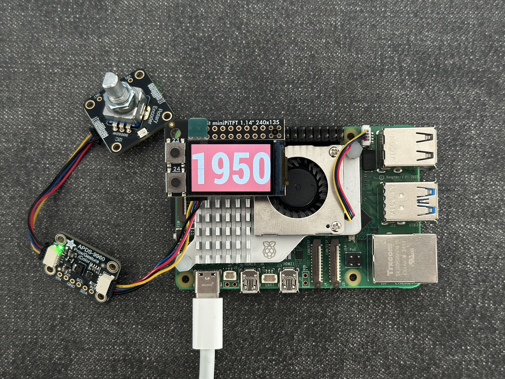
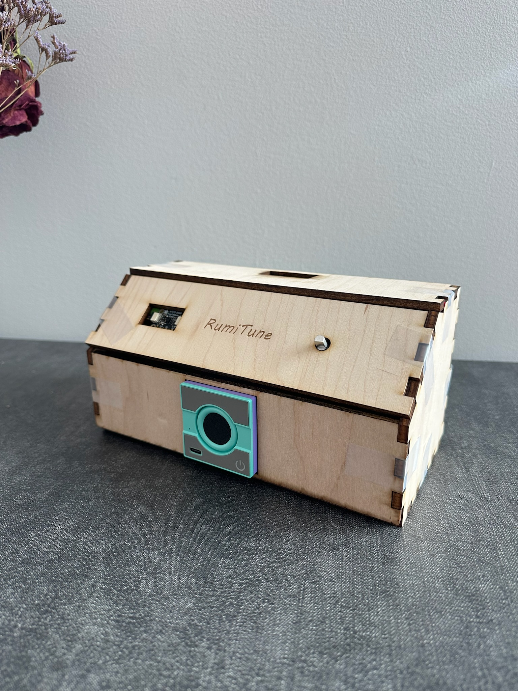
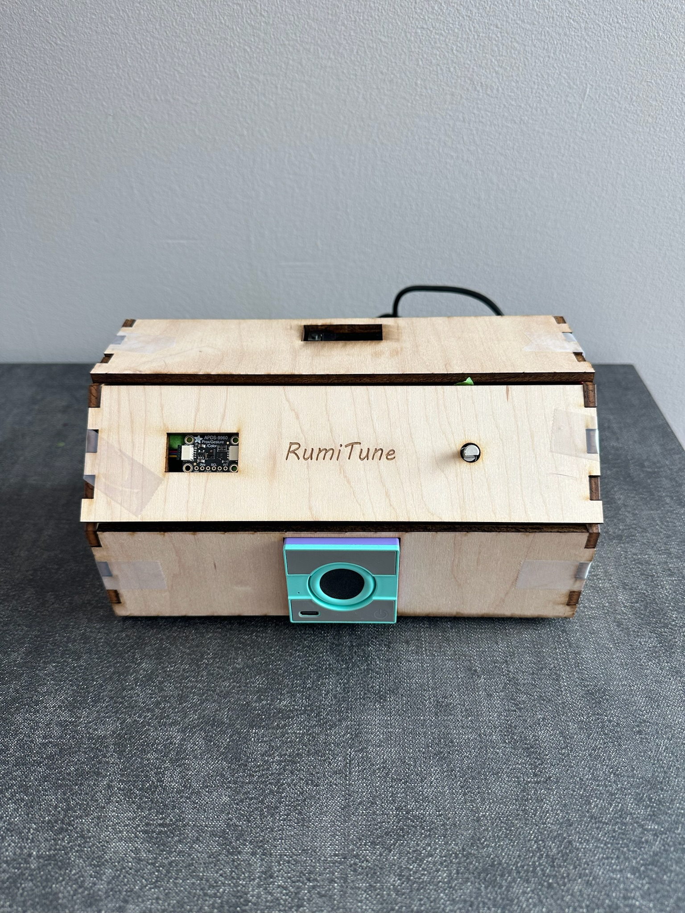
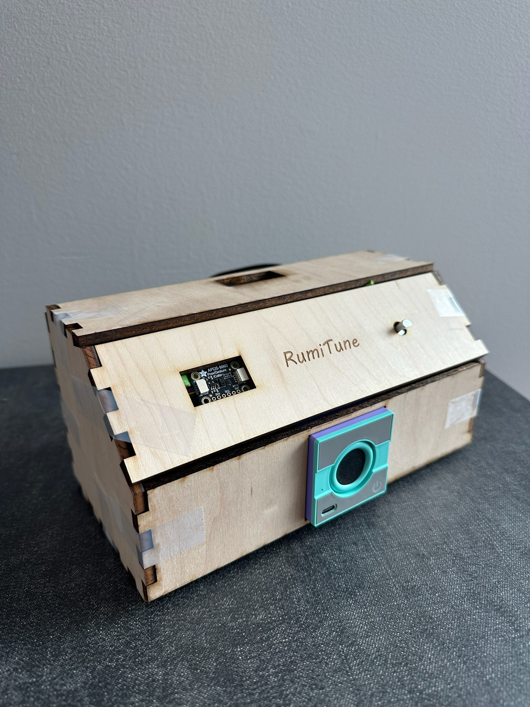
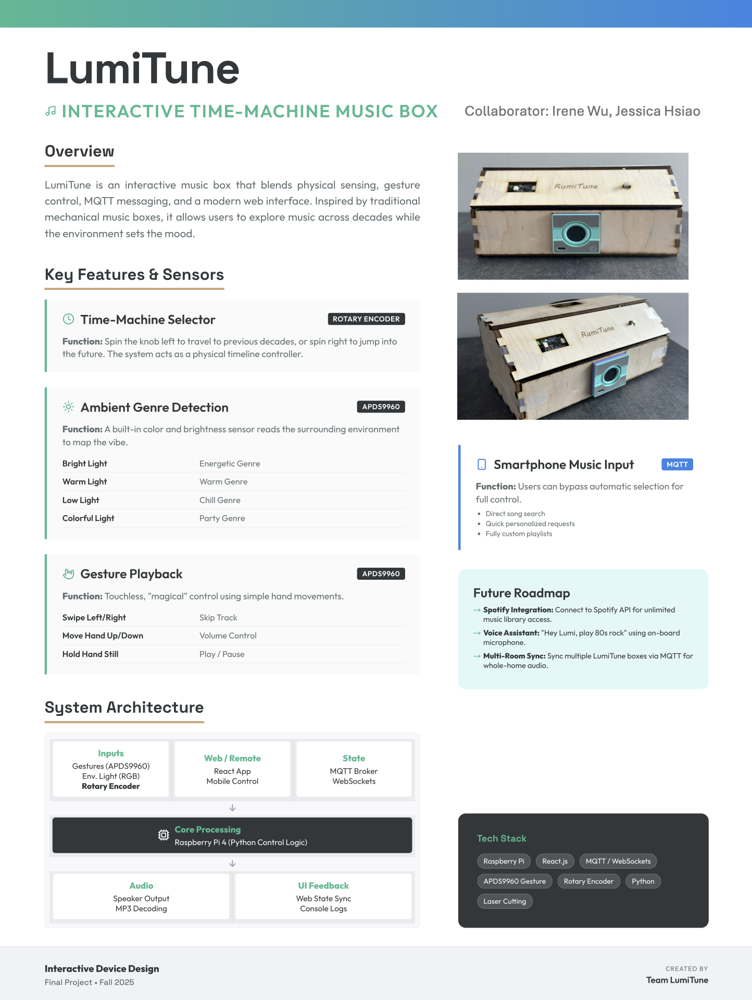

# 🎶 **LumiTune — Sensor-Driven Interactive Music Box**
**Collaborators: Jessica Hsiao (dh779), Irene Wu (yw2785)**

LumiTune is an immersive, sensor-driven music box that blends **physical interaction**, **environmental sensing**, and **networked control**.

Inspired by traditional mechanical music boxes, LumiTune lets users explore music across decades while the **environment dynamically sets the mood**.

---

## ⭐️ Design Process

**🔔 Motivation**

In an era dominated by streaming giants like Spotify and Apple Music, users are often overwhelmed by the "paradox of choice" presented by infinite catalogs and complex interfaces. The simple act of listening to music has shifted from an auditory pleasure to a visual task, requiring constant scrolling and interaction with glass screens. LumiTune seeks to eliminate this digital friction, restoring the immediate simplicity of "just turning on the radio" while offering a curated, magical experience that respects the user's visual attention.

Furthermore, LumiTune recognizes that music is intrinsically tied to both memory and atmosphere. It creates a unique dialogue between the user and the environment: the user manually controls the timeline (1950s–2020s) to satisfy their nostalgia, while the device automatically interprets ambient lighting to select the matching musical "vibe." This fusion of intentional human choice and dynamic environmental sensing generates moments of emotional resonance, making the technology feel like a responsive companion rather than just a tool.

Finally, this project responds to the growing desire for tactile interaction in a touchscreen-saturated world. By employing a rotary encoder for "time travel" and touch-free gestures for control, LumiTune reintroduces the satisfying physical feedback of vintage audio equipment. It effectively bridges the gap between the nostalgia of the physical world and the convenience of modern digital libraries.

**🎯 Goal**

To design and build LumiTune, a multimodal interactive music system that integrates tactile physical controls with environmental sensing to create a more embodied listening experience. LumiTune aims to shift music engagement from a passive, screen-based activity to an intuitive, atmospheric interaction shaped by both user intent and surrounding context.

**Key Design Objectives**

* Multimodal Integration: To engineer a robust system that seamlessly combines diverse inputs—light sensing (for genre selection), rotary encoding (for decade selection), and touch-free gestures (for playback control).

* Contextual Harmony: To create a device that "reads the room," automatically aligning the musical energy (e.g., Chill vs. Party) with the physical lighting environment, thereby reducing the friction of manual selection.

* Tangible Nostalgia: To bridge the gap between digital streaming and analog history by using physical, tactile controls to "time travel" through decades of music (1950s–2020s)

**👥 Target Audience**

* Digital Minimalist Users - Individuals who experience screen fatigue and want to enjoy music without the distraction of smartphone notifications, complex apps, or infinite scrolling. They value *Calm Technology* that operates instantly, intuitively, and with minimal cognitive load.

* Atmosphere-Creator Homeowners and Hosts - Users who treat music primarily as a way to shape ambience rather than to select specific artists or tracks. They benefit from a system that automatically adapts musical “vibe” to environmental cues, such as lighting conditions during a dinner party, study session, or relaxing evening.

* Tactile-Enthusiast Audiophiles and Retro-Tech Lovers - Users who miss the physical satisfaction of knobs, dials, and embodied interaction. They appreciate the novelty and emotional resonance of a tangible interface that controls modern digital music content.

* Smart Home Explorers - Tech-savvy users interested in IoT and ambient computing who enjoy devices that feel responsive, context-aware, and “alive” within their physical environment.

**🔖 Storyboard**


---

## 📝 Project Plan

**⏳ Timeline**

| Milestone | Date | Notes |
| :--- | :--- | :--- |
| **Setup & Box Design** | W1 Nov 15 | Create the storyboard and finalize the interaction flow. Verify that all hardware components and sensors are functioning properly and ready for integration. |
| **Module Development** | W2 Nov 18 | Implement #1 color/brightness detection, #2 gesture controls, and #3 rotary movement modes. |
| **Mobile Control + MQTT Development** | W2 Nov 23 | Implement MQTT messaging for phone; setup MQTT broke, build simple mobile UI to send messages, and implement Pi-side message parsing + fallback logic. |
| **Module Testing + Product Appearance Design** | W3 Nov 26 | Test all modules: verify gesture reliability, color detection, motor modes, MQTT message flow (connect, publish, subscribe, reconnection). |
| **System Integration + Product Outlook Generation** | W3 Dec 1 | Combine all modules into one system; ensure conflict handling and smooth state transitions. Design appearance and use 3D Printer & laser machine to generate product outlook. |
| **User Interaction Testing** | W4 Dec 5 | Conduct user tests to evaluate all functions; test common misuse scenarios. |
| **Final Write-up + Documentation** | W4 Dec 14 | Complete the final report, including functions, architecture diagrams, and final demo preparation. |

**🛡️ Fallback Plan**

* **Gesture Sensor Instability:** If the APDS-9960 sensor misreads inputs, the **Web Controller** serves as the primary backup for volume and track control.
* **Color Sensing Failure:** If lighting conditions cannot be determined, the system defaults to the **"Warm"** genre playlist to ensure continuous audio.
* **Network Disconnection:** If the Wi-Fi or MQTT connection drops, the system enters **Standalone Mode**—local playback and physical sensors continue to function without interruption.
* **Motor Malfunction:** The decorative servo operates asynchronously; if the motor stalls, the **audio engine continues running** unaffected.


---

## 🎥 Demo & Media

**📸 Device overview**

| Hardware | Enclosure - Left | Enclosure - Front | Enclosure - Right |
|--------|--------|--------|--------|
|  |  |  |  |


**🎬 User Testing Video**: [Click to watch](./assets/user_testing.MP4)

**🖇️ User Testing & Iteration**

Testing Challenge: Sensor Input Conflict
1. **Observation** During the usability testing phase, a critical conflict was identified between the two functions of the APDS-9960 sensor (Gesture Proximity and Ambient Light Sensing). Users attempting to execute the "Pause/Play" command—which requires holding a hand over the sensor for 1 second—inadvertently cast a shadow over the sensor. The system interpreted this sudden drop in brightness as a change in the environmental "vibe," causing the music genre to switch unexpectedly (e.g., from Energetic to Chill) at the same moment the music paused.

2. **Root Cause Analysis** The issue stemmed from both event triggers processing data simultaneously. The "Hold to Pause" threshold (approx. 1 second) was shorter than the light sensor's stability check at the time, meaning a hand hovering for a gesture was indistinguishable from the room lights being turned off.

3. **Solution: Temporal Hysteresis (Time-Based Filtering)** To resolve this, we implemented a software-based differentiation strategy using temporal thresholds:

* Proximity Logic (Immediate): The system continues to register "Hold" gestures after 1 second of proximity detection to ensure responsive playback control.

* Light Sensing Logic (Delayed): We introduced a significant delay (hysteresis) to the environmental sensing algorithm. The system now requires a new light level to remain stable for minimum 10 seconds before triggering a genre change.

4. **Outcome** This update effectively filters out transient shadows caused by hand gestures. In subsequent tests, users were able to pause/play music without triggering an unwanted genre switch, while the system remained responsive to genuine, sustained changes in room lighting.

---

## 📌 **System Overview**

LumiTune integrates:

✔ Light + color sensing (APDS-9960)  
✔ Gesture recognition (APDS-9960)  
✔ Rotary movement control (Rotary encoder)  
✔ MQTT communication via Mosquitto  
✔ TFT display feedback (ST7789 PiTFT)  
✔ Randomized decade-based music playback (1950s–2020s)  

It runs on a Raspberry Pi with a Bluetooth speaker and PiTFT display.

---

## ✨ **Core Features**

### 🕰 **1. Time-Machine Decade Selector**

Users (or the web UI) choose a decade (1950s–2020s).  
Each playback request selects one track from:

```text
<year>_<genre>_<01..03>.mp3
```

Example: `1960_chill_02.mp3`

---

### 🌈 **2. Environment-Based Genre Detection**

Ambient lighting determines the vibe:

| Environment Condition | Genre | Color |
|---|---|---|
| Very dim light | Chill | Blue |
| Extremely bright | Party | Red |
| Moderate brightness + warm tone | Warm | Yellow |
| Moderate brightness + neutral/cool tone | Energetic | Green |

Genre switching occurs **only when conditions remain stable** for several seconds to avoid flicker.

---

### ✋ **3. Gesture Playback Control**

Using APDS-9960:

| Gesture | Action |
|--------|--------|
| Up | Volume up |
| Down | Volume down |
| Left | Previous track |
| Right | Next track |
| Hold (proximity) | Pause/Play toggle |

A short proximity “hold” in front of the sensor toggles pause/play.

---

### 🎛 **4. Rotary Movement + Decade Control**

A rotary encoder controls:

- Decorative servo **movement mode**: Spin Left / Spin Right
- **Decade selection** (turning changes the current decade and triggers a new track).

---

### 📺 **5. TFT Display Feedback**

A PiTFT ST7789 screen shows:

- Background color = current genre/vibe
- Large central text = current decade year (e.g., 1950, 1980, 2020)

Colors are mapped per genre to give a quick, glanceable vibe indication.

--- 

### 📱 **6. Web Controller (React + MQTT)**

A small React web UI lets users:

- Choose decade
- Override genre
- Adjust volume
- Send playback requests

The web page connects to Mosquitto over **MQTT over WebSockets**.

---

## 🗂 **Project Structure**

```
Project/
│
├── backend/
│   ├── main_musicbox.py         # System coordinator (entry point)
│   ├── audio_engine.py          # Playback system (pygame.mixer, track selection)
│   ├── mqtt_controller.py       # MQTT bridge (song requests + status)
│   ├── display_controller.py    # ST7789 TFT display (year + vibe color)
│   ├── sensor_controller.py     # Gestures, light sensing, servo, rotary encoder
│   ├── requirements.txt         # Python dependencies for backend
│   └── __init__.py
│
├── music/                       # MP3 files (organized by decade + genre naming)
│   └── 1950_chill_01.mp3, 1950_chill_02.mp3, ...
│
├── LumiTune-webpage/            # Web UI (React/Vite)
│   ├── public/
│   │   └── config.js            # Defines PI_IP + WS_PORT for MQTT over WebSocket
│   ├── src/
│   │   ├── components/
│   │   ├── guidelines/
│   │   ├── styles/
│   │   ├── App.tsx
│   │   └── main.tsx
│   └── package.json
│
├── assets/
│   ├── poster.png
│   ├── hardware.jpg
│   ├── enclosure_1.jpg
│   ├── enclosure_2.jpg
│   ├── enclosure_3.jpg
│   ├── user_testing.mp4
│   └── storyboard.png
│
└── README.md
```

---

## ⚙ **Setup Instructions**

### 1️⃣ Install System Dependencies

```bash
sudo apt update
sudo apt install mpg123 espeak mosquitto
```

---

### 2️⃣ Install Python Dependencies

Backend core:

```bash
pip install -r backend/requirements.txt
```

Sensor stack:

```bash
pip install pygame adafruit-blinka adafruit-circuitpython-apds9960 adafruit-circuitpython-seesaw adafruit-circuitpython-servokit
```

Frontend:

```bash
cd LumiTune-webpage
npm install
```


---

### 3️⃣ Start MQTT Broker

```bash
sudo systemctl start mosquitto
```

---

## ▶️ **Launching LumiTune**

### ⚠️ IMPORTANT — Stop Pi Screen Driver First

Before running the display controller, **stop the default TFT framebuffer service** or it will conflict:

```bash
sudo systemctl stop piscreen.service
```

---

### ✅ Start the entire backend

```bash
cd backend
python3 main_musicbox.py
```

---

## 🌐 **Launching the Web UI**

### Start web controller

```bash
cd LumiTune-webpage
npm run dev -- --host
```

Access from any device on the same network:

```
http://<PI-IP>:3000/
```

Ensure `public/config.js` matches your Pi:

```javascript
window.MUSICBOX_CONFIG = {
  PI_IP: "10.xx.xx.xx",
  WS_PORT: 9001
};
```

---

## 🔊 **Audio File Organization**

MP3 naming format:

```
<year>_<genre>_<track>.mp3
```

Examples:

- 1950_chill_01.mp3  
- 1980_party_03.mp3  

Supported genres:

✔ chill  
✔ warm  
✔ energetic  
✔ party  

Each decade folder contains 12 total files (3 tracks × 4 genres).

---

## 🎞️ Reflection

Through the development of LumiTune, we learned the importance of extensive user testing and deliberate system integration in multimodal interactive devices. While individual sensors and interaction techniques functioned reliably in isolation, unexpected conflicts emerged once they were combined within a shared physical and temporal context. This experience highlighted the need to think beyond isolated features and instead design for how multiple inputs interact over time within a single embodied system.

The project also emphasized the value of clear collaboration structures and dedicated integration phases. Although dividing responsibilities by subsystem enabled efficient parallel development, many critical issues only became apparent during full-system testing. This reinforced the insight that integration is not merely a final implementation step, but a core design phase that requires intentional planning and iteration.

The following challenges were particularly significant lessons for us:

### 1. Managing Multi-Sensor Interactions Through Time-Based Logic

One key lesson was that sensor inputs cannot be treated independently when they reflect overlapping user intent or physical presence. Our initial implementation relied primarily on instantaneous thresholds (e.g., brightness levels or proximity duration), which led to unintended interactions—most notably when gesture-based pause controls interfered with ambient light sensing.

Through user testing, we identified time-based filtering and prioritization (temporal hysteresis) as essential strategies in sensor-driven interaction design. By introducing stability windows and input precedence rules, we were able to distinguish intentional environmental changes from transient human actions. This reinforced the understanding that robust interactive behavior often depends more on temporal logic and interaction design decisions than on hardware precision alone.

### 2. Collaboration Requires Clear Ownership and Dedicated Integration Time

Dividing development responsibilities across subsystems—such as sensing, frontend control, networking, and integration—proved effective for parallel progress. However, the project revealed that meaningful integration requires dedicated time and shared ownership. Many interaction conflicts only surfaced once all components operated simultaneously, underscoring that integration should be treated as a first-class design activity rather than a late-stage technical task.

Moving forward, we would approach future multimodal systems by prototyping integration earlier and treating temporal interaction logic as a primary design concern rather than an implementation detail.

---

## 👭 Team Contributions

Irene primarily focused on developing gesture sensing and ambient brightness sensing using the APDS990, as well as implementing music playback and designing the product’s physical appearance.

Jessica primarily focused on developing the rotation encoder, MQTT communication, and the web-based controller frontend, and on integrating all software components into a cohesive system.

Throughout the project, both team members collaborated closely, jointly troubleshooting technical challenges and supporting each other across different components as needed.

---

## 🖼 Project Poster



---

🎉 Enjoy building and extending LumiTune!
