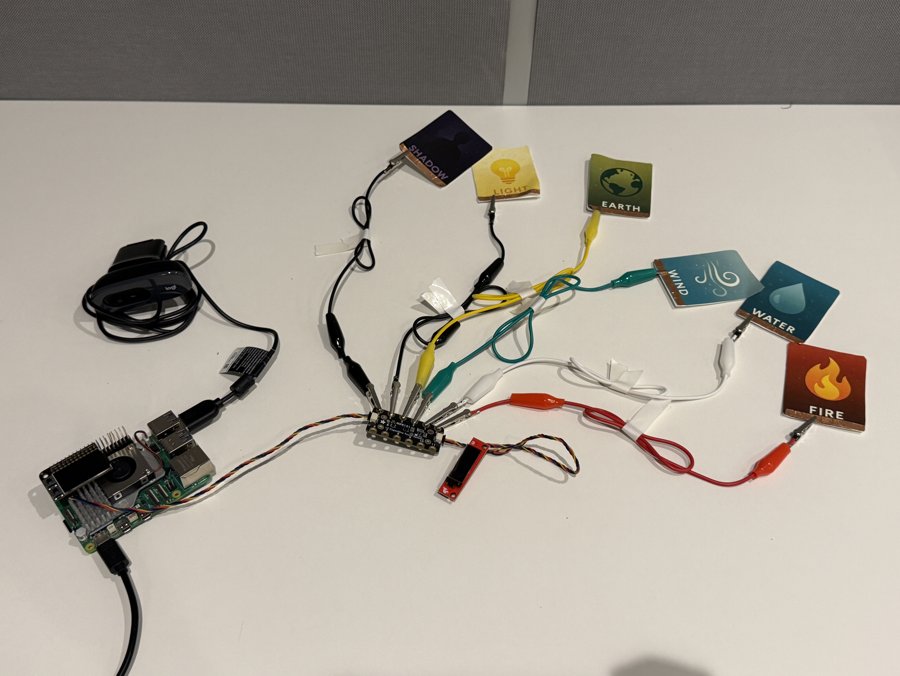
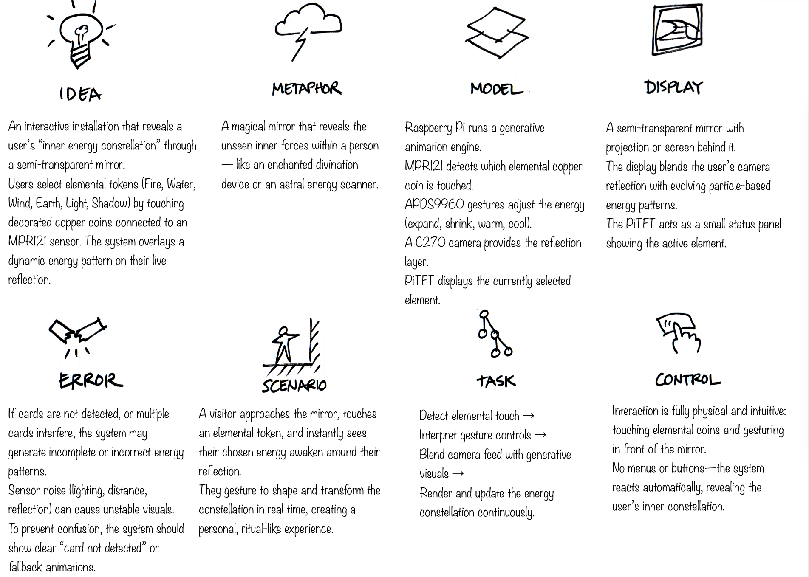
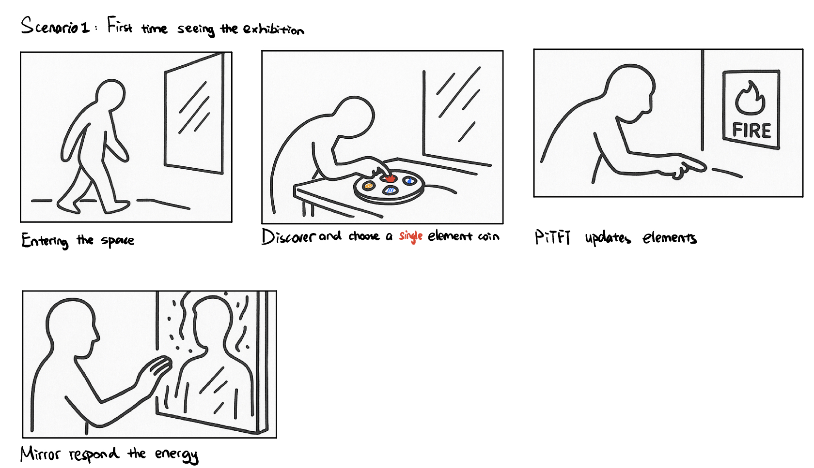
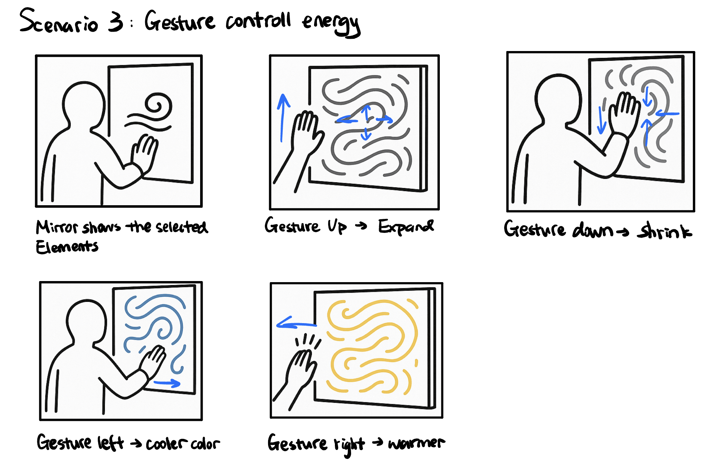
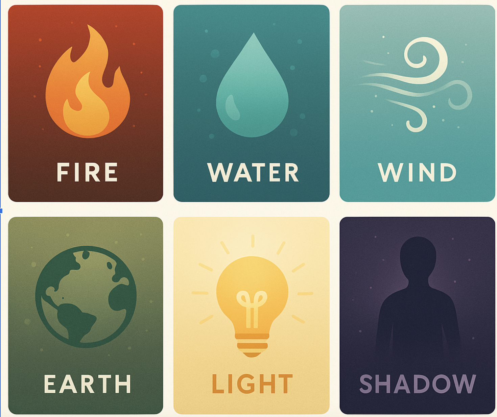

# Final Project

[Project Plan](#project-plan) 

[Functioning Project](#functioning-project) 

[Documentation of Design Process](#documentation-of-design-process) 

[Archive of All Code and Design Patterns](#archive-of-all-code-and-design-patterns) 

[Video Demo](#video-demo) 

[Reflections on Process](#reflections-on-process) 

[Group Work Distribution](#group-work-distribution) 

## Project Plan
Huiying Zhan (hz764), 

### Big Idea
Inner Constellation is an interactive art installation that visualizes a person’s inner energy as a living constellation made of light, color, and motion. It invites people to reflect on their emotions through simple, intuitive interactions.

When a participant begins, they choose one of six symbolic elements — Fire 🔥, Water 💧, Wind ❄️, Earth 🌍, Light 💡, or Shadow 🧍‍♀️🧍‍♂️ — each representing a different emotional tone or personality energy. This choice is made by tapping an NFC card or selecting on screen. The system, powered by a Raspberry Pi, then generates a real-time animation that moves and transforms based on that element’s characteristics — for example, Fire glows and flickers, Water flows smoothly, Wind drifts and spins, Earth pulses steadily, Light radiates softly, and Shadow creates shifting patterns.

A computer screen displays the animation blended with a live camera feed of the user, allowing them to see both their reflection and their personalized constellation at the same time. As they move their hands or adjust their posture, gesture and touch sensors detect these actions and feed them back into the system. The constellation reacts instantly — expanding, contracting, or changing colors — as if breathing together with the user.

Through these visual and sensory responses, Inner Constellation transforms abstract emotions into tangible experiences. It connects technology and self-awareness in a poetic way, turning each participant’s reflection on the screen into a unique portrait of their energy and mood in that moment.   

### Timeline
| **Milestone** | **Date** | **Notes / Details** |
|:--|:--:|:--|
| **Concept Lock & Story Development** | Nov 10–11 | Finalize core interaction and six energy elements. Write story concept and plan MVP scope. |
| **Visual MVP** | Nov 15 | Design an interactive energy circle that expands or contracts with hand gestures. |
| **Input Integration** | Nov 20 | Add gesture detection for circle control. Test responsiveness and stability. |
| **Projection Interaction** | Nov 22 | Project visualization on a large screen. Enable full-screen gesture control and adjust brightness. |
| **Parameter Tuning & Visual Polish** | Nov 25 | Refine color, motion, and gesture sensitivity. Add an “Energy Fortune” line and save-image feature. |
| **Functional Check-off** | Dec 1 | Demonstrate full flow: gesture → real-time motion → image save. Record performance notes. |
| **User Testing** | Dec 5 | Test with non-team users. Gather feedback on usability, aesthetics, and response. |
| **Final Presentation Prep** | Dec 6 | Prepare short demo video and slides. Present motivation, technical design, and evolution. |
| **Final Write-up & Repository Submission** | Dec 8 | Complete README, diagrams, and documentation. Upload final materials. |

### Parts Needed
**The Device**
- 1× Raspberry Pi 4 Board  
- 1× 32GB MicroSD Card w/ Card Reader  
- 1× Computer Display / Monitor  
- 1× USB Camera (for live reflection feed)  
- 1× NFC Reader + NFC Cards (for element selection)  
- 1× Gesture or Touch Sensor (e.g., APDS-9960 or Capacitive Pad)  
- 1× HDMI Cable  
- 1× USB Powered Speaker *(optional, for ambient sound)*  
- 1× Power Supply for Raspberry Pi (5V 3A recommended)  
- 1× Dupont Wire Set *(for sensor connections)*  

**For Exhibition Setup (optional)**
- 1× Projector *(for large-scale projection display)*  
- 1× Tripod or Mounting Stand  
- 1× External Light Diffuser or Frame *(for aesthetic setup)*

### Fallback Plan

If any hardware or sensor components fail, the system can still demonstrate the core experience through simplified input and display modes.

- **Gesture Sensor Fails:**  
  Use keyboard or mouse input to manually trigger expansion/contraction of the energy circle.

- **NFC Reader Malfunction:**  
  Replace NFC element selection with on-screen buttons for choosing Fire, Water, Wind, Earth, Light, or Shadow.

- **Camera Not Working:**  
  Run the visualization without live reflection mode — display only the animated energy field on screen.

- **Projector Unavailable:**  
  Switch to a standard monitor or laptop display for demonstration.

- **Performance or Frame Rate Issues:**  
  Lower the resolution or particle density in the animation to maintain smooth real-time rendering.

- **Sound Output Problem:**  
  Disable audio feedback and rely on visual responses only.

*These fallback modes ensure the installation remains functional and visually expressive, even if some hardware components are unavailable.*

## Functioning Project

The following images show the fully functioning version of the **Inner Constellation** interaction system.  
All hardware components—including the Raspberry Pi, MPR121 touch sensor, OLED display, USB camera, and six elemental touch cards—are wired together to create a seamless interactive experience.

### 1. Wiring Setup (Live Hardware Layout)

The first image shows the complete hardware arrangement during operation.  
Each elemental card (Fire, Water, Wind, Earth, Light, Shadow) is connected to an MPR121 input via alligator clips.  
Touching any card triggers a capacitive reading, which is then displayed on the OLED and sent to the animation engine.

  

### 2. Element Selection Panel (Mounted Version)

This second image shows the final mounted version of the element-selection board.  
All six cards are neatly arranged in a 3D-printed frame, with copper foil pads at the bottom serving as capacitive touch surfaces.  
The OLED display sits in the center to show real-time feedback of the selected element.

  

Together, these components complete the functioning prototype, allowing users to physically select elements and influence the interactive constellation visualisation.

### 3. Overall Setup (Final Exhibition Display)
The final installation brings all hardware, visuals, and interaction components together into a cohesive exhibition setup.  
The projected animation reacts in real time to user-selected elements and their gestures, while the element panel sits nearby for intuitive touch-based input.  
This setup was used during the final showcase, allowing visitors to explore their own “Inner Constellation” through physical interaction and responsive visual feedback.

  

## Documentation of Design Process
### Verplank Diagram

### Storyboards

#### Scenario 1

#### Scenario 2

#### Scenario 3

### Wiring Diagram & Physical Setup
The wiring diagram below shows the full physical setup of our **Inner Constellation** prototype. A Raspberry Pi connects to the MPR121 capacitive touch breakout, an OLED display, a USB camera, and six element cards (Fire, Water, Wind, Earth, Light, Shadow). Each card is wired to one MPR121 input so that touching the copper pads on the cards selects an element, which is then visualized on the OLED and sent to the animation engine.

Key components:

1. **MPR121 capacitive touch sensor** – reads touch input from the six element cards.
2. **OLED display** – shows the currently selected element icon/state.
3. **USB camera** – detects user presence and movement for interaction.
4. **Element cards** – Fire, Water, Wind, Earth, Light, Shadow; each card is connected via alligator clips to the MPR121.
5. **Raspberry Pi** – runs the main loop, reads sensor data, and communicates with the visualisation on the main screen.

## Archive of All Code and Design Patterns
All related code lives in: [code](../final%20project/code/)

### Sensor Layer Overview

**Camera — Motion & Background Feed**

The camera module continuously captures frames, computes motion energy by comparing consecutive grayscale images, and produces a softly blended background silhouette that contributes to the final animation.  
Its interface is simple: `get_frame()` returns either a processed frame or `None` when unavailable.

**OLED / TFT Display — Minimal Physical Feedback**

The OLED display provides lightweight physical feedback by showing the currently selected element as well as the user's three-element profile.  
If the device is not detected, the system automatically falls back to a dummy display mode to maintain pipeline stability.

**MPR121 Touch Sensor — Element Selection**

The MPR121 maps individual copper pads to six elemental identities—Fire, Water, Wind, Earth, Light, and Shadow.  
Touch events are debounced for stability, and the input pipeline supports a three-step profile selection sequence used to generate a personalized spectrum.

  

### Animation Layer Overview

**Overall Architecture**

The animation engine renders at 60 FPS and integrates several input sources: time-based updates, motion-driven scaling, camera-derived features (motion level, body centroid, size estimation), and the user’s multi-element profile.  
The system contains fourteen visual pattern modes, all implemented as modular pattern functions.

**Core Logic**

**1. Profile and Element System**  
When a user completes the three-element sequence, the engine enters spectrum mode with blended palettes.  
Single-element touches produce a fallback mode with a simplified color theme.  
`get_spectrum_style()` returns base colors, background tones, preferred pattern type (such as galaxy, vortex, or pillar), and parameter presets such as orb speed or halo scale.

**2. Camera-Derived Features**  
The engine extracts motion intensity, approximate distance (size level), and a motion centroid representing horizontal and vertical body position.  
These signals modulate animation behavior: motion affects breathing and expansion; horizontal position influences warmth vs. coolness in the color temperature; size level adjusts pillar width, orb radius, and other scale-sensitive effects.  
A softly composited camera overlay (approximately 60% alpha) contributes to the ambient texture.

**3. Energy Model**  
A derived energy value governs parameters such as pillar height, halo radius, orb traversal speed, bloom strength, vortex depth, and grid brightness.  
This single energy model allows different visual modes to respond consistently to user movement.

**Visual Pattern System**  
All patterns adapt automatically to the selected color spectrum, the user's motion energy, and the inferred distance from the camera.  
This keeps visual output coherent across modes.

### Web Server Layer

`server.py` coordinates two parallel systems:

**Flask Web Server**  
Serves the front-end interface (`index.html`), streams animation frames via MJPEG (`/frame`), and exposes simple control endpoints such as reset and UI toggles.

**Pygame Animation Loop**  
Runs in the main thread (required by SDL), receives continuous sensor updates, renders all animation frames, and shares the latest frame with Flask through thread-safe shared memory.  

Both processes remain synchronized through a `frame_lock`, ensuring stable frame delivery even under high interaction load.

#### Tech Demo (Functional Checkoff) 

#### Make the the mood board and construct device （mood board制作过程以及连接设备）

## Video Demo
最终展示视频

## Reflections on Process

## Group Work Distribution
### Joy
Joy focused primarily on the visual language and aesthetic foundation of the project. She designed the color schemes, textures, and particle styles for all six elemental themes, and iterated extensively on the visual patterns using Python, Pygame, Processing, p5.py, and OpenGL-based tools. She also created the full mood board, final visual poster, and produced a set of ten physical “Energy Element Cards.”  

**Deliverables:**
- `animation_engine.py`
- Energy Element Cards (×10)
- Element Visual Style Sheets
- Final Exhibition Poster

### Hester
Hester was responsible for the interaction logic and sensing pipeline. This included selecting and integrating the elemental sensor (or icon-based interaction), implementing dynamic pattern transitions based on gestures, sound volume, and distance inputs, and setting up the projector/monitor display system. She also contributed to the creation of ten physical “Energy Element Cards” and participated in the visual presentation materials.  

**Deliverables:**
- `sensor.py`
- Energy Element Cards (×10)

### Sandy
Sandy managed logistics, documentation, and user-facing presentation. She coordinated equipment (projector, backdrop, and decorative materials), prepared the mood board and final visual layout, conducted user testing (facilitation, observation, and interviews), and collected all required images and materials for the README. She also recorded and edited the final demo video and compiled the full project README.  

**Deliverables:**
- `README.md`
- User testing notes and documentation
- Demo video

### 分工

#### Joy

主要负责：
- 设计 6 种元素的视觉语言（颜色、纹理、粒子风格）
- 调试元素pattern（Python/Pygame/Processing/P5.py/OpenGL）（光点/pattern）
- Mood Board展示海报与最终视觉呈现
- 设计并制作“能量元素卡片” * 10

交付物：
- animation_engine.py + 
- 能量元素卡片
- 元素视觉设定图
- 最终展示海报
  
#### Hester

主要负责：
- 选择元素sensor（或者是点击图标）
- 实现图案动态变化（手势，声音，距离）
- 投影仪/显示器连接
- 设计并制作“能量元素卡片” * 10
- Mood Board展示海报与最终视觉呈现

交付物：
- sensor.py
- 能量元素卡片
  
#### Sandy

主要负责：
- 借投影仪 + 背景板（待定）+ 准备装饰材料
- Mood Board展示海报与最终视觉呈现
- 用户测试（引导/观察/访谈）
- README 所有需要交付的图像
- README 展示材料
- 录制展示视频

交付物：
- README.md
